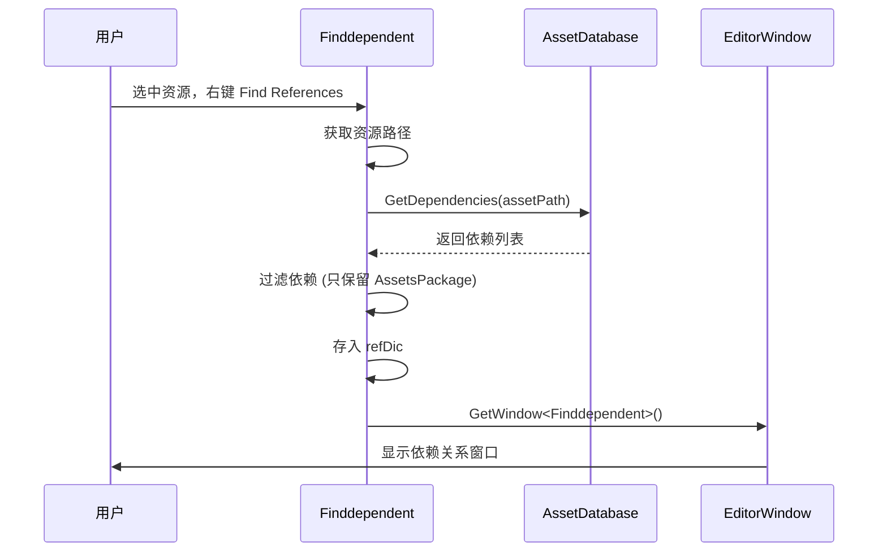
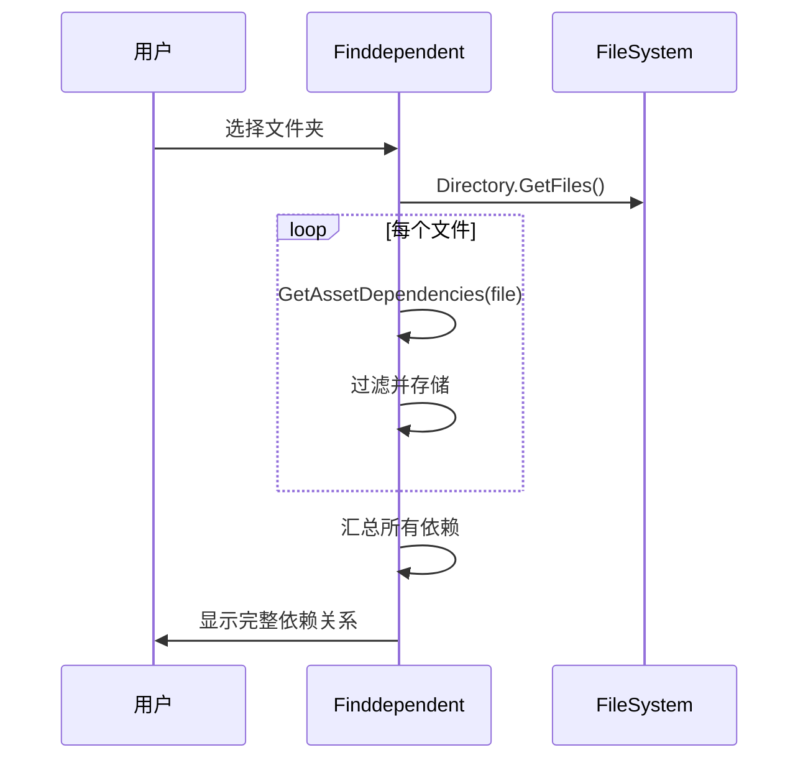

# Finddependent.cs 注解文档

## 文件基本信息

| 属性 | 值 |
|------|------|
| **文件名** | Finddependent.cs |
| **路径** | Assets/Scripts/Editor/ArtEditor/Resource/Finddependent.cs |
| **所属模块** | Editor 工具 → 美术编辑器 → 资源管理 |
| **文件职责** | 资源依赖查找工具，查找单个资源或文件夹的依赖关系 |

---

## 类/结构体说明

### Finddependent

| 属性 | 说明 |
|------|------|
| **职责** | Unity Editor 窗口工具，用于查找指定资源或文件夹被哪些其他资源依赖 (反向依赖) |
| **泛型参数** | 无 |
| **继承关系** | 继承自 `EditorWindow` |
| **实现的接口** | 无 |

**设计模式**: Editor 工具窗口模式

```csharp
// Editor 窗口
public class Finddependent : EditorWindow
```

**与 ResourceCheckTool 的区别**:
- **ResourceCheckTool**: 全量扫描所有资源的引用关系
- **Finddependent**: 针对单个资源或文件夹的依赖查找

---

## 字段与属性

| 名称 | 类型 | 访问级别 | 说明 |
|------|------|----------|------|
| `refDic` | `Dictionary<string, string[]>` | `private static` | 存储依赖关系 (资源路径 → 依赖路径数组) |
| `scrollPos` | `Vector2` | `private` | 滚动视图位置 |
| `showList` | `List<bool>` | `private` | 每个资源项的展开/折叠状态 |

---

## 方法说明

### FindAssetDependent()

**签名**:
```csharp
public static void FindAssetDependent()
```

**职责**: 查找当前选中资源的依赖关系

**核心逻辑**:
```
1. 获取当前选中的资源路径 Selection.activeObject
2. 设置序列化模式为 ForceText
3. 调用 FindAssetDependentByArtToolsWindow(path)
```

**调用者**: 右键菜单命令 `[MenuItem("Assets/Find References")]`

**使用场景**: 在 Project 窗口选中资源，右键查找哪些资源引用了它

---

### FindAssetDependentByArtToolsWindow(path)

**签名**:
```csharp
public static void FindAssetDependentByArtToolsWindow(string path)
```

**职责**: 可视化查找资源依赖

**核心逻辑**:
```
1. 检查路径是否为空 → 弹出提示
2. 调用 GetAssetDependencies(path) 获取依赖数组
3. 检查依赖是否为空 → 弹出提示
4. 清空 refDic
5. 添加依赖关系到 refDic
6. 打开 Finddependent 窗口显示结果
```

**调用者**: `FindAssetDependent()`, ArtToolsWindow

---

### FindFolderDependent()

**签名**:
```csharp
public static void FindFolderDependent()
```

**职责**: 查找整个文件夹的依赖关系

**核心逻辑**:
```
1. 打开文件夹选择对话框，默认路径 "Assets/AssetsPackage"
2. 调用 FindFolderDependentByArtToolsWindow(path)
```

**调用者**: 菜单命令

---

### FindFolderDependentByArtToolsWindow(path)

**签名**:
```csharp
public static void FindFolderDependentByArtToolsWindow(string path)
```

**职责**: 可视化查找文件夹依赖

**核心逻辑**:
```
1. 转换路径为相对路径
2. 调用 FindAllFolderDependent(path, dstAssetPath)
3. 将结果存入 refDic
4. 打开 Finddependent 窗口显示结果
```

**调用者**: `FindFolderDependent()`

---

### FindAllFolderDependent(path, dstAssetPath)

**签名**:
```csharp
public static Dictionary<string, string[]> FindAllFolderDependent(string path, string dstAssetPath)
```

**职责**: 扫描文件夹内所有资源的依赖关系

**核心逻辑**:
```
1. 获取文件夹下所有文件
2. 遍历每个文件 (跳过 .meta)
3. 调用 GetAssetDependencies() 获取依赖
4. 存入临时字典 tempRefDic
5. 返回完整依赖字典
```

**调用者**: `FindFolderDependentByArtToolsWindow()`

**返回**: `Dictionary<资源路径，依赖路径数组>`

---

### GetAssetDependencies(assetPath)

**签名**:
```csharp
public static string[] GetAssetDependencies(string assetPath)
```

**职责**: 获取单个资源的依赖列表

**核心逻辑**:
```
1. 检查文件是否存在 → 不存在返回 null
2. 转换路径为相对路径
3. 调用 AssetDatabase.GetDependencies(assetPath)
4. 过滤依赖:
   - 只保留 Assets/AssetsPackage 目录下的依赖
   - 排除资源自身所在目录
5. 返回过滤后的依赖数组
```

**调用者**: `FindAssetDependentByArtToolsWindow()`, `FindAllFolderDependent()`

**被调用者**: `UnityEditor.AssetDatabase.GetDependencies()`

---

### OnGUI()

**签名**:
```csharp
void OnGUI()
```

**职责**: 绘制 Editor 窗口界面，展示依赖关系

**核心逻辑**:
```
1. 绘制滚动视图
2. 遍历 refDic 中的每个资源:
   - 显示资源路径
   - 显示资源对象预览
   - 显示展开/折叠开关
3. 如果展开:
   - 绘制垂直分组
   - 遍历依赖文件列表
   - 显示每个依赖的路径和预览
   - 统计依赖的文件夹
4. 显示"引用的文件夹"汇总
   - 列出所有依赖文件夹及引用次数
```

**调用者**: Unity Editor 自动调用

---

## 核心流程

### 依赖查找流程



### 文件夹依赖分析流程



---

## 使用示例

### 查找单个资源的依赖

```csharp
// 1. 在 Project 窗口选中资源 (如 Player.prefab)
// 2. 右键 → Find References
// 或执行菜单命令

Finddependent.FindAssetDependent();

// 结果窗口显示:
// Assets/AssetsPackage/Prefabs/Player.prefab [展开▼]
// ├── Assets/AssetsPackage/Scenes/Home.unity
// ├── Assets/AssetsPackage/Prefabs/GameManager.prefab
// └── Assets/Scripts/Game/Player/PlayerController.cs
```

### 查找文件夹的依赖

```csharp
// 1. 执行菜单命令
// 2. 选择要分析的文件夹

Finddependent.FindFolderDependent();

// 结果窗口显示所有资源及其依赖
```

### 代码调用

```csharp
// 查找指定资源的依赖
Finddependent.FindAssetDependentByArtToolsWindow("Assets/AssetsPackage/Prefabs/Player.prefab");

// 查找文件夹依赖
Finddependent.FindFolderDependentByArtToolsWindow("Assets/AssetsPackage/Characters");

// 获取依赖数据
string[] deps = Finddependent.GetAssetDependencies("Assets/AssetsPackage/Textures/player.png");
foreach (var dep in deps)
{
    Debug.Log($"被 {dep} 引用");
}
```

---

## 依赖过滤规则

### GetAssetDependencies 过滤逻辑

```csharp
// 只保留 Assets/AssetsPackage 目录下的依赖
if (dependecies[j].Contains("Assets/AssetsPackage"))
{
    // 排除资源自身所在目录
    if (!dependecies[j].Contains(dstAssetPath))
    {
        filterPath.Add(dependecies[j]);
    }
}
```

**过滤目的**:
- 排除外部依赖 (如 Unity 内置资源、第三方插件)
- 排除资源自身目录内的循环依赖
- 聚焦项目核心资源的依赖关系

---

## 界面展示

```
┌─────────────────────────────────────────────────┐
│ Finddependent                                   │
├─────────────────────────────────────────────────┤
│ ☑ Assets/AssetsPackage/Prefabs/Player.prefab ▼ │
│   [Player.prefab 预览]                          │
│   ├─ Assets/AssetsPackage/Scenes/Home.unity    │
│   ├─ Assets/AssetsPackage/Materials/Player.mat │
│   └─ Assets/AssetsPackage/Textures/player.png  │
│                                                 │
│ ☐ Assets/AssetsPackage/Textures/player.png     │
│   [player.png 预览]                             │
│                                                 │
│ ─────────────────────────────────────────────── │
│ 引用的文件夹：                                  │
│ ├─ Assets/AssetsPackage/Scenes (1)             │
│ ├─ Assets/AssetsPackage/Materials (1)          │
│ └─ Assets/AssetsPackage/Textures (1)           │
└─────────────────────────────────────────────────┘
```

---

## 注意事项

| 问题 | 说明 | 解决方案 |
|------|------|----------|
| **依赖不完整** | 代码中动态加载的资源无法检测 | 配合 ResourceCheckTool 的代码扫描功能 |
| **循环依赖** | A 依赖 B，B 依赖 A | 工具会正常显示，需人工优化 |
| **性能问题** | 大文件夹扫描较慢 | 使用 ResourceCheckTool 多线程版本 |
| **路径格式** | 支持 Assets/ 和 Packages/ 路径 | GetRelativeAssetsPath() 自动转换 |

---

## 相关文档

- [ResourceCheckTool.cs.md](./ResourceCheckTool.cs.md) - 资源分析工具 (全量扫描)
- [FindReferences.cs.md](./FindReferences.cs.md) - 引用查找工具
- [ArtToolsWindow.cs.md](./ArtToolsWindow.cs.md) - 美术工具主窗口

---

*最后更新：2026-03-02*
