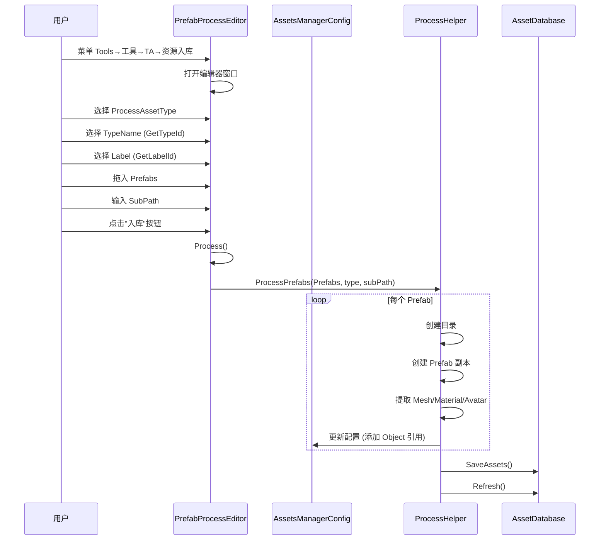

# PrefabProcessEditor.cs 注解文档

## 文件基本信息

| 属性 | 值 |
|------|-----|
| **文件名** | PrefabProcessEditor.cs |
| **路径** | Assets/Scripts/Editor/ArtEditor/Resource/Process/PrefabProcessEditor.cs |
| **所属模块** | Editor → ArtEditor → Resource → Process |
| **文件职责** | 资源入库编辑器窗口，提供可视化界面将 Prefab 资源按类型和标签分类入库 |
| **依赖条件** | `ODIN_INSPECTOR` (需要 Odin Inspector 插件) |

---

## 类/结构体说明

### PrefabProcessEditor

| 属性 | 说明 |
|------|------|
| **职责** | 提供资源入库的可视化编辑器窗口，支持按资源类型和标签分类管理 |
| **继承关系** | `OdinEditorWindow` (Odin Inspector 编辑器窗口基类) |
| **使用场景** | 美术人员将 Prefab 资源批量入库到 AssetsPackage 目录 |

**菜单路径**: `Tools → 工具 → TA → 资源入库`

---

## 字段与属性

| 名称 | 类型 | 访问级别 | 说明 |
|------|------|----------|------|
| `TypeName` | `string` | `public` | 资源类型名称 (从配置中读取的可选项) |
| `Label` | `string` | `public` | 资源标签 (根据 TypeName 过滤后的子分类) |
| `SubPath` | `string` | `public` | 子路径 (资源在库中的相对路径) |
| `Prefabs` | `GameObject[]` | `public` | 待处理的 Prefab 数组 |
| `ProcessAssetType` | `AssetType` | `public` | 资源类型枚举 (Unit/SceneObject/Effect/AnimatorClip) |

---

## 方法说明

### GeneratingAtlas()

**签名**:
```csharp
[MenuItem("Tools/工具/TA/资源入库", false, 160)]
public static void GeneratingAtlas()
```

**职责**: 打开资源入库编辑器窗口

**核心逻辑**:
```
1. 调用 GetWindow(typeof(PrefabProcessEditor)) 打开窗口
```

**调用者**: Unity 菜单系统

---

### GetTypeId()

**签名**:
```csharp
public IEnumerable GetTypeId()
```

**职责**: 获取可用的资源类型列表 (用于下拉选择)

**核心逻辑**:
```
1. 加载 AssetsManagerConfig 配置
2. 遍历 config.Labels 列表
3. 返回所有 Label 名称的 ValueDropdownList
```

**返回值**: `IEnumerable` - 资源类型名称列表

---

### GetLabelId()

**签名**:
```csharp
public IEnumerable GetLabelId()
```

**职责**: 根据选中的 TypeName 获取对应的子标签列表

**核心逻辑**:
```
1. 加载 AssetsManagerConfig 配置
2. 根据 TypeName 匹配 LabelConfig
3. 遍历该 LabelConfig 的所有 Collects
4. 返回所有子标签名称 (去重)
```

**返回值**: `IEnumerable` - 子标签名称列表

---

### Process()

**签名**:
```csharp
[Button("入库")]
public void Process()
```

**职责**: 执行资源入库操作

**核心逻辑**:
```
1. 检查 Prefabs 是否为空
2. 调用 ProcessHelper.ProcessPrefabs() 处理所有 Prefab
3. 保存资源 AssetDatabase.SaveAssets()
4. 刷新数据库 AssetDatabase.Refresh()
```

**调用者**: 用户点击"入库"按钮

**被调用者**: `ProcessHelper.ProcessPrefabs()`

---

## 使用流程

### 资源入库流程



---

## 使用示例

### 示例 1: 入库场景对象

```csharp
// 1. 打开菜单 Tools → 工具 → TA → 资源入库
// 2. 设置参数:
//    - ProcessAssetType: SceneObject
//    - TypeName: "场景内资源"
//    - Label: "道具"
//    - SubPath: "Props"
//    - Prefabs: 拖入需要入库的 Prefab
// 3. 点击"入库"按钮
```

### 示例 2: 入库角色 Unit

```csharp
// 1. 打开菜单 Tools → 工具 → TA → 资源入库
// 2. 设置参数:
//    - ProcessAssetType: Unit
//    - TypeName: "角色"
//    - Label: "主角"
//    - SubPath: "Player"
//    - Prefabs: 拖入角色 Prefab
// 3. 点击"入库"按钮
```

---

## 配置结构

### AssetsManagerConfig 结构

```csharp
// 配置路径: Assets/AssetsPackage/Config/AssetsManagerConfig.asset
public class AssetsManagerConfig : ScriptableObject
{
    public List<LabelConfig> Labels;  // 标签配置列表
}

public class LabelConfig
{
    public string Label;              // 标签名称 (如"场景内资源")
    public List<CollectConfig> Collects;  // 子分类列表
}

public class CollectConfig
{
    public string Label;              // 子分类名称 (如"道具")
    public List<Object> Objects;      // 资源对象列表
}
```

---

## 相关文档

- [ProcessHelper.cs.md](./ProcessHelper.cs.md) - 资源处理核心逻辑
- [AssetsManagerConfig.cs.md](../../AssetsManager/Config/AssetsManagerConfig.cs.md) - 资产管理器配置
- [LabelConfig.cs.md](../../AssetsManager/Config/LabelConfig.cs.md) - 标签配置结构
- [CollectConfig.cs.md](../../AssetsManager/Config/CollectConfig.cs.md) - 收集配置结构

---

*文档生成时间：2026-03-02 | OpenClaw AI 助手*
