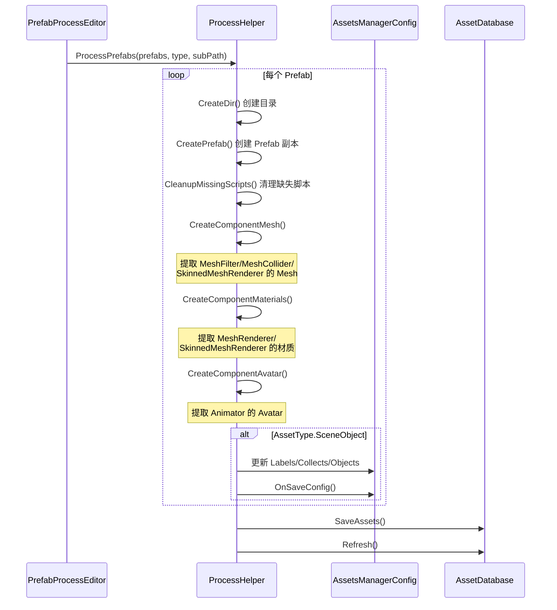

# ProcessHelper.cs 注解文档

## 文件基本信息

| 属性 | 值 |
|------|-----|
| **文件名** | ProcessHelper.cs |
| **路径** | Assets/Scripts/Editor/ArtEditor/Resource/Process/ProcessHelper.cs |
| **所属模块** | Editor → ArtEditor → Resource → Process |
| **文件职责** | 资源处理核心工具类，提供 Prefab 入库、资源提取、配置更新等功能 |

---

## 类/结构体说明

### AssetType (枚举)

| 值 | 说明 |
|----|------|
| `Unit` | 角色单位资源 |
| `SceneObject` | 场景对象资源 |
| `Effect` | 特效资源 |
| `AnimatorClip` | 动画片段资源 |

### ProcessHelper

| 属性 | 说明 |
|------|------|
| **职责** | 静态工具类，提供资源入库的核心处理逻辑 |
| **类型** | `static class` |
| **使用场景** | PrefabProcessEditor、SceneProcessEditor 等编辑器工具调用 |

---

## 字段与属性

| 名称 | 类型 | 访问级别 | 说明 |
|------|------|----------|------|
| `md5` | `MD5` | `public static` | MD5 哈希计算器，用于生成资源唯一标识 |
| `BasePath` | `string` | `public const` | 资源库基础路径 `"Assets/AssetsPackage/"` |
| `BuildInPath` | `string` | `public const` | Unity 内置资源路径 `"Library/unity default resources"` |

---

## 方法说明

### ProcessPrefab()

**签名**:
```csharp
public static GameObject ProcessPrefab(GameObject instance, GameObject prefab, AssetType assetType, 
    string subPath, string typeName = null, string label = null)
```

**职责**: 处理单个 Prefab 资源入库

**核心逻辑**:
```
1. 检查 prefab 是否为空
2. 创建目标目录 CreateDir()
3. 如果是 AnimatorClip 类型 → CreateAnimatorClip()
4. 否则:
   - 创建 Prefab 副本 CreatePrefab()
   - 提取 Mesh 资源 CreateComponentMesh()
   - 提取材质资源 CreateComponentMaterials()
   - 提取 Avatar 资源 CreateComponentAvatar()
   - 如果是 SceneObject 类型，更新 AssetsManagerConfig 配置
5. 返回处理后的 Prefab
```

**调用者**: `PrefabProcessEditor.Process()`

---

### ProcessPrefabs()

**签名**:
```csharp
public static GameObject[] ProcessPrefabs(GameObject[] prefabs, AssetType assetType, string subPath,
    string typeName = null, string label = null)
```

**职责**: 批量处理多个 Prefab 资源入库

**核心逻辑**:
```
1. 遍历 prefabs 数组
2. 对每个 Prefab 调用 ProcessPrefab 的核心逻辑
3. 收集所有处理后的 GameObject
4. 如果是 SceneObject 类型，批量更新 AssetsManagerConfig 配置
5. 返回处理后的 GameObject 数组
```

**调用者**: `PrefabProcessEditor.Process()`

---

### OnSaveConfig()

**签名**:
```csharp
public static void OnSaveConfig(AssetsManagerConfig config)
```

**职责**: 保存配置并刷新数据库

**核心逻辑**:
```
1. EditorUtility.SetDirty(config) 标记配置已修改
2. AssetDatabase.SaveAssetIfDirty(config) 保存配置
3. AssetDatabase.Refresh() 刷新数据库
```

**调用者**: `ProcessPrefab()`, `ProcessPrefabs()`

---

### CreateDir()

**签名**:
```csharp
public static void CreateDir(AssetType assetType, string subPath)
```

**职责**: 创建资源存储目录

**核心逻辑**:
```
1. 构建路径：BasePath + assetType + "/" + subPath
2. 如果目录不存在则创建
3. 调用 FileHelper.CreateArtSubFolder() 创建美术子文件夹结构
4. 保存并刷新数据库
```

**调用者**: `ProcessPrefab()`, `ProcessPrefabs()`

---

### CreatePrefab()

**签名**:
```csharp
public static GameObject CreatePrefab(GameObject prefab, AssetType assetType, string subPath)
```

**职责**: 创建 Prefab 副本到资源库

**核心逻辑**:
```
1. 检查 Prefab 是否已在目标路径 (避免重复)
2. 构建目标路径：BasePath + assetType + "/" + subPath + "/Prefabs/" + prefab.name + ".prefab"
3. 实例化 Prefab: GameObject.Instantiate(prefab)
4. 清理缺失的脚本 CleanupMissingScripts()
5. 保存为 Prefab 资源 PrefabUtility.SaveAsPrefabAsset()
6. 销毁临时实例
7. 返回保存的 Prefab
```

**调用者**: `ProcessPrefab()`, `ProcessPrefabs()`

---

### CleanupMissingScripts()

**签名**:
```csharp
public static void CleanupMissingScripts(GameObject gameObject)
```

**职责**: 清理 GameObject 上缺失的 MonoBehaviour 脚本

**核心逻辑**:
```
1. 调用 GameObjectUtility.RemoveMonoBehavioursWithMissingScript() 清理根对象
2. 遍历所有子对象 Transform[]
3. 对每个子对象调用 RemoveMonoBehavioursWithMissingScript()
```

**调用者**: `CreatePrefab()`

---

### CreateComponentMesh()

**签名**:
```csharp
public static void CreateComponentMesh(GameObject gameObject, AssetType assetType, string subPath)
```

**职责**: 提取并复制 Mesh 资源到资源库

**核心逻辑**:
```
1. 获取所有 MeshFilter 组件
2. 对每个 MeshFilter:
   - 跳过 null 或内置资源
   - 调用 FindAssets() 查找或复制 Mesh
   - 更新 sharedMesh 引用
3. 获取所有 MeshCollider 组件，同样处理
4. 获取所有 SkinnedMeshRenderer 组件，同样处理
5. 如果有修改，标记 EditorUtility.SetDirty()
```

**调用者**: `ProcessPrefab()`, `ProcessPrefabs()`

---

### CreateComponentMaterials()

**签名**:
```csharp
public static void CreateComponentMaterials(GameObject instance, GameObject gameObject, 
    AssetType assetType, string subPath)
```

**职责**: 提取并复制材质资源到资源库

**核心逻辑**:
```
1. 获取所有 MeshRenderer 组件
2. 对每个 MeshRenderer 的每个材质:
   - 从 instance 获取原始材质引用
   - 调用 FindAssets() 查找或复制材质
   - 更新 sharedMaterials 数组
3. 获取所有 SkinnedMeshRenderer 组件，同样处理
4. 如果有修改，标记 EditorUtility.SetDirty()
```

**调用者**: `ProcessPrefab()`, `ProcessPrefabs()`

---

### CreateComponentAvatar()

**签名**:
```csharp
public static void CreateComponentAvatar(GameObject gameObject, AssetType assetType, string subPath)
```

**职责**: 提取并复制 Avatar 资源到资源库

**核心逻辑**:
```
1. 获取所有 Animator 组件
2. 对每个 Animator:
   - 如果 avatar 不为空
   - 调用 FindAssets() 查找或复制 Avatar
   - 更新 avatar 引用
3. 如果有修改，标记 EditorUtility.SetDirty()
```

**调用者**: `ProcessPrefab()`, `ProcessPrefabs()`

---

### CreateAnimatorClip()

**签名**:
```csharp
private static void CreateAnimatorClip(GameObject prefab, string subPath)
```

**职责**: 处理 AnimatorClip 类型的 FBX 动画资源

**核心逻辑**:
```
1. 构建目标路径：BasePath + AssetType.Unit + "/" + subPath + "/Animations/"
2. 调用 FbxHelperWindow.HandleFBX() 处理 FBX 文件
```

**调用者**: `ProcessPrefab()`, `ProcessPrefabs()`

---

### FindAssets<T>()

**签名**:
```csharp
public static T FindAssets<T>(T oldObj, AssetType assetType, string subPath, 
    string assetsType, string ext = null) where T : Object
```

**职责**: 查找或复制资源到资源库 (支持 Mesh/Material/Texture/Avatar 等)

**核心逻辑**:
```
1. 检查 oldObj 是否为空或为内置资源 → 直接返回
2. 检查是否已在资源库中 → 直接返回
3. 获取文件扩展名
4. 计算资源 MD5 哈希 GetExportName()
5. 遍历资源库各子目录查找同名资源
6. 如果找到且不在当前 subPath:
   - 移动到 Common 目录 (公共资源)
   - 如果是材质，同时处理其 Texture 依赖
7. 如果未找到:
   - Texture: 直接复制 AssetDatabase.CopyAsset()
   - Material: 实例化并处理 Texture 依赖，然后创建资源
   - 其他: 实例化后创建资源
8. 返回新资源引用
```

**调用者**: `CreateComponentMesh()`, `CreateComponentMaterials()`, `CreateComponentAvatar()`

---

### GetExportName()

**签名**:
```csharp
public static string GetExportName(Object obj)
```

**职责**: 根据资源路径和名称生成 MD5 哈希文件名

**核心逻辑**:
```
1. 拼接路径和名称：AssetDatabase.GetAssetPath(obj) + obj.name
2. 计算 MD5 哈希
3. 转换为十六进制字符串 (去除短横线)
4. 返回 MD5 字符串
```

**调用者**: `FindAssets<T>()`

---

## 资源入库流程



---

## 资源目录结构

```
Assets/AssetsPackage/
├── Unit/                    # 角色单位
│   ├── {subPath}/
│   │   ├── Prefabs/        # Prefab 文件
│   │   ├── Models/         # Mesh 资源
│   │   ├── Materials/      # 材质资源
│   │   ├── Textures/       # 纹理资源
│   │   └── Animations/     # 动画资源
│   └── Common/             # 公共资源 (跨 subPath 共享)
│       ├── Models/
│       ├── Materials/
│       └── Textures/
├── SceneObject/             # 场景对象 (同上结构)
├── Effect/                  # 特效资源
└── AnimatorClip/            # 动画片段
```

---

## 使用示例

### 示例 1: 入库角色 Prefab

```csharp
// 调用示例 (从 PrefabProcessEditor 触发)
GameObject[] prefabs = { playerPrefab, enemyPrefab };
ProcessHelper.ProcessPrefabs(prefabs, AssetType.Unit, "Player", "角色", "主角");

// 结果:
// Assets/AssetsPackage/Unit/Player/Prefabs/playerPrefab.prefab
// Assets/AssetsPackage/Unit/Player/Models/{md5}.asset
// Assets/AssetsPackage/Unit/Player/Materials/{md5}.mat
// Assets/AssetsPackage/Unit/Player/Animations/{md5}.asset
```

### 示例 2: 入库场景对象

```csharp
// 调用示例
GameObject[] props = { chairPrefab, tablePrefab, lampPrefab };
ProcessHelper.ProcessPrefabs(props, AssetType.SceneObject, "Furniture", "场景内资源", "家具");

// 结果:
// 资源保存到 Assets/AssetsPackage/SceneObject/Furniture/
// 同时更新 AssetsManagerConfig:
//   Labels["场景内资源"].Collects["家具"].Objects = [chair, table, lamp]
```

---

## 相关文档

- [PrefabProcessEditor.cs.md](./PrefabProcessEditor.cs.md) - 资源入库编辑器窗口
- [SceneProcessEditor.cs.md](./SceneProcessEditor.cs.md) - 场景入库编辑器窗口
- [AssetsManagerConfig.cs.md](../../AssetsManager/Config/AssetsManagerConfig.cs.md) - 资产管理器配置
- [FileHelper.cs.md](../../../Common/Helper/FileHelper.cs.md) - 文件辅助工具

---

*文档生成时间：2026-03-02 | OpenClaw AI 助手*
