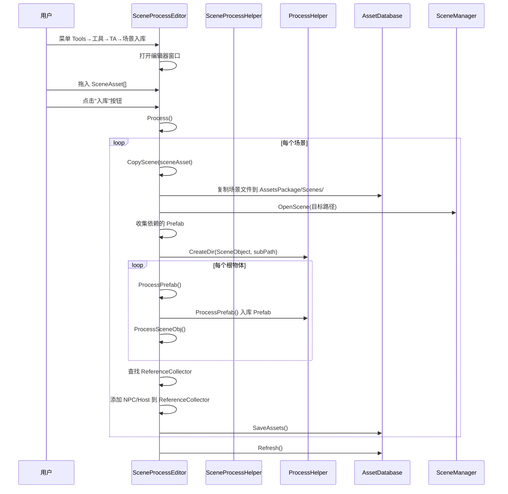

# SceneProcessEditor.cs 注解文档

## 文件基本信息

| 属性 | 值 |
|------|-----|
| **文件名** | SceneProcessEditor.cs |
| **路径** | Assets/Scripts/Editor/ArtEditor/Resource/Process/SceneProcessEditor.cs |
| **所属模块** | Editor → ArtEditor → Resource → Process |
| **文件职责** | 场景入库编辑器窗口，将 Unity 场景文件及其依赖资源批量入库到资源库 |
| **依赖条件** | `ODIN_INSPECTOR` (需要 Odin Inspector 插件) |

---

## 类/结构体说明

### SceneProcessEditor

| 属性 | 说明 |
|------|------|
| **职责** | 提供场景入库的可视化编辑器窗口，自动处理场景中的 Prefab 依赖 |
| **继承关系** | `OdinEditorWindow` (Odin Inspector 编辑器窗口基类) |
| **使用场景** | 美术人员将 Unity 场景文件批量入库到 AssetsPackage/Scenes 目录 |

**菜单路径**: `Tools → 工具 → TA → 场景入库`

---

## 字段与属性

| 名称 | 类型 | 访问级别 | 说明 |
|------|------|----------|------|
| `AssetsPackage` | `string` | `private const` | 资源包根路径 `"Assets/AssetsPackage/"` |
| `BasePath` | `string` | `private const` | 场景资源基础路径 `AssetsPackage + "Scenes/"` |
| `Scenes` | `SceneAsset[]` | `public` | 待处理的场景文件数组 |

---

## 方法说明

### GeneratingAtlas()

**签名**:
```csharp
[MenuItem("Tools/工具/TA/场景入库", false, 161)]
public static void GeneratingAtlas()
```

**职责**: 打开场景入库编辑器窗口

**核心逻辑**:
```
1. 调用 GetWindow(typeof(SceneProcessEditor)) 打开窗口
```

**调用者**: Unity 菜单系统

---

### Process()

**签名**:
```csharp
[Button("入库")]
public void Process()
```

**职责**: 执行场景入库操作

**核心逻辑**:
```
1. 遍历 Scenes 数组
2. 对每个非空场景调用 CopyScene()
```

**调用者**: 用户点击"入库"按钮

**被调用者**: `CopyScene()`

---

### CopyScene()

**签名**:
```csharp
static void CopyScene(SceneAsset sceneAsset)
```

**职责**: 复制场景文件并处理依赖资源

**核心逻辑**:
```
1. 获取场景文件路径 AssetDatabase.GetAssetPath()
2. 构建目标目录：BasePath + sceneAsset.name + "Scene"
3. 创建目标目录 (如果不存在)
4. 复制场景文件到目标路径
5. 刷新数据库并打开场景 EditorSceneManager.OpenScene()
6. 收集场景依赖的 Prefab 资源
7. 调用 ProcessHelper.CreateDir() 创建场景对象目录
8. 获取场景根物体 EditorSceneManager.GetActiveScene().GetRootGameObjects()
9. 遍历根物体:
   - ProcessPrefab() 处理 Prefab 实例
   - ProcessSceneObj() 处理场景对象
10. 查找 ReferenceCollector 组件
11. 将 NPC/Host 物体添加到 ReferenceCollector
12. 保存场景
```

**调用者**: `Process()`

**被调用者**: `ProcessHelper.CreateDir()`, `ProcessPrefab()`, `ProcessSceneObj()`

---

### ProcessPrefab()

**签名**:
```csharp
void ProcessPrefab(Transform root, Dictionary<GameObject, GameObject> scenePrefabs, string subPath)
```

**职责**: 递归处理场景中的 Prefab 实例

**核心逻辑**:
```
1. 检查当前 Transform 是否是 Prefab 实例
2. 如果是 Prefab:
   - 检查是否已处理过 (scenePrefabs 字典)
   - 调用 ProcessHelper.ProcessPrefab() 入库
   - 记录已处理的 Prefab 映射
3. 递归处理所有子物体
```

**调用者**: `CopyScene()`

---

### ProcessSceneObj()

**签名**:
```csharp
void ProcessSceneObj(Transform root, Dictionary<GameObject, GameObject> scenePrefabs, 
    string subPath, List<Transform> npcs)
```

**职责**: 处理场景中的非 Prefab 对象 (NPC、Host 等)

**核心逻辑**:
```
1. 检查物体类型 (NPC/Host/其他)
2. 如果是 NPC 或 Host:
   - 添加到 npcs 列表 (后续添加到 ReferenceCollector)
3. 递归处理所有子物体
```

**调用者**: `CopyScene()`

---

## 场景入库流程



---

## 使用示例

### 示例 1: 入库单个场景

```csharp
// 1. 打开菜单 Tools → 工具 → TA → 场景入库
// 2. 拖入场景文件 (如 Home.unity)
// 3. 点击"入库"按钮

// 结果:
// Assets/AssetsPackage/Scenes/HomeScene/Home.unity
// Assets/AssetsPackage/SceneObject/HomeScene/Prefabs/...
// Assets/AssetsPackage/SceneObject/HomeScene/Models/...
// Assets/AssetsPackage/SceneObject/HomeScene/Materials/...
```

### 示例 2: 批量入库多个场景

```csharp
// 1. 打开菜单 Tools → 工具 → TA → 场景入库
// 2. 拖入多个场景文件 (如 Level1.unity, Level2.unity, Level3.unity)
// 3. 点击"入库"按钮

// 结果:
// Assets/AssetsPackage/Scenes/Level1Scene/Level1.unity
// Assets/AssetsPackage/Scenes/Level2Scene/Level2.unity
// Assets/AssetsPackage/Scenes/Level3Scene/Level3.unity
```

---

## ReferenceCollector 集成

### 作用

`ReferenceCollector` 组件用于收集场景中的关键引用点 (NPC、Host 等)，方便运行时动态查找和访问。

### NPC/Host 识别规则

```csharp
// 通过旋转角度判断是否为 Host
var euler = transform.rotation.eulerAngles;
bool ishoster = euler.y > 145 && euler.y < 225;  // 面向 -Z 方向

if (ishoster)
{
    rc.Add("Host", transform);  // 主持人/老板
}
else
{
    rc.Add("Npc_" + index, transform);  // NPC
}
```

### 使用示例

```csharp
// 运行时获取场景中的 NPC
var rc = FindObjectOfType<ReferenceCollector>();
var host = rc.Get("Host");
var npc1 = rc.Get("Npc_0");
var npc2 = rc.Get("Npc_1");
```

---

## 注意事项

### ⚠️ 场景依赖处理

- 场景入库会自动处理依赖的 Prefab 资源
- Prefab 会被提取到 `Assets/AssetsPackage/SceneObject/{sceneName}/` 目录
- 公共资源会被移动到 `Common` 目录共享

### ⚠️ ReferenceCollector 要求

- 场景中必须存在 `ReferenceCollector` 组件
- 否则 NPC/Host 引用不会自动添加
- 可以在场景创建时手动添加该组件

### ⚠️ 场景命名规范

- 场景文件命名建议：`Home.unity`, `Level1.unity`, `Map_01.unity`
- 入库后目录命名：`HomeScene`, `Level1Scene`, `Map_01Scene`

---

## 相关文档

- [PrefabProcessEditor.cs.md](./PrefabProcessEditor.cs.md) - Prefab 资源入库编辑器
- [ProcessHelper.cs.md](./ProcessHelper.cs.md) - 资源处理核心工具
- [ReferenceCollector.cs.md](../../../../Mono/Module/UI/ReferenceCollector.cs.md) - 引用收集器组件

---

*文档生成时间：2026-03-02 | OpenClaw AI 助手*
