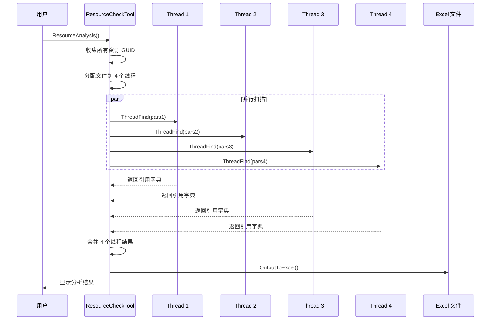

# ResourceCheckTool.cs 注解文档

## 文件基本信息

| 属性 | 值 |
|------|------|
| **文件名** | ResourceCheckTool.cs |
| **路径** | Assets/Scripts/Editor/ArtEditor/Resource/ResourceCheckTool.cs |
| **所属模块** | Editor 工具 → 美术编辑器 → 资源管理 |
| **文件职责** | 资源分析工具，多线程扫描资源依赖关系，输出 Excel 报告或可视化界面 |

---

## 类/结构体说明

### ResourceCheckTool

| 属性 | 说明 |
|------|------|
| **职责** | Unity Editor 窗口工具，用于分析资源引用关系，识别未使用资源，支持多线程扫描和 Excel 导出 |
| **泛型参数** | 无 |
| **继承关系** | 继承自 `EditorWindow` |
| **实现的接口** | 无 |

**设计模式**: Editor 工具窗口模式 + 多线程处理模式

```csharp
// Editor 窗口
public class ResourceCheckTool : EditorWindow
```

**依赖**: EPPlus (Excel 导出), Unity Profiler (内存分析)

---

## 字段与属性

| 名称 | 类型 | 访问级别 | 说明 |
|------|------|----------|------|
| `refDic` | `Dictionary<string, List<string>>` | `private static` | 存储资源引用关系 (GUID → 引用文件列表) |
| `_updateDelegate` | `EditorApplication.CallbackFunction` | `private static` | 编辑器更新回调，用于进度显示 |
| `ThreadCount` | `const int` | `private const` | 多线程数量，固定为 4 |
| `showNoUser` | `bool` | `private` | 是否显示无引用资源 |
| `showUser` | `bool` | `private` | 是否显示有引用资源 |
| `showList` | `List<bool>` | `private` | 每个资源项的展开/折叠状态 |
| `scrollPos` | `Vector2` | `private` | 滚动视图位置 |

### ThreadPars (内部类)

| 属性 | 说明 |
|------|------|
| **职责** | 多线程处理参数封装 |
| **字段** | `CheckAssetList`, `CheckCSList`, `AssetGuidList`, `AssetNameList`, `CheckWihteList` |

---

## 方法说明

### ResourceAnalysis()

**签名**:
```csharp
static public void ResourceAnalysis()
```

**职责**: 启动资源分析，扫描 AssetsPackage 目录

**核心逻辑**:
```
1. 调用 FindThread("Assets/AssetsPackage", true)
2. 自动导出 Excel 结果
```

**调用者**: 菜单命令或其他工具

---

### FindThread(path, outExcel)

**签名**:
```csharp
public static void FindThread(string path, bool outExcel = false)
```

**职责**: 多线程扫描资源依赖关系

**核心逻辑**:
```
1. 清空引用字典 refDic
2. 设置序列化模式为 ForceText
3. 收集目标路径下所有资源的 GUID 和名称
4. 创建 4 个线程参数对象 ThreadPars
5. 收集要扫描的文件:
   - Prefab, Unity, Mat, Asset, Playable 文件
   - C# 脚本文件 (非 Editor 目录)
6. 将文件均匀分配到 4 个线程
7. 启动 4 个异步线程执行 ThreadFind
8. 通过 EditorApplication.update 轮询进度
9. 完成后合并结果，导出 Excel 或显示窗口
```

**调用者**: `ResourceAnalysis()`, 菜单命令

**被调用者**: `ThreadFind()`, `OutputToExcel()`, `GetRelativeAssetsPath()`

---

### ThreadFind(pars)

**签名**:
```csharp
private static Dictionary<string, List<string>> ThreadFind(ThreadPars par)
```

**职责**: 单线程执行资源引用扫描

**核心逻辑**:
```
1. 遍历 CheckAssetList (资源文件)
   - 读取文件内容
   - 用正则匹配 AssetGuidList 中的 GUID
   - 记录引用关系
2. 遍历 CheckCSList (C# 脚本)
   - 读取文件内容
   - 匹配资源名称
   - 记录引用关系
3. 遍历 CheckWihteList (白名单)
   - 用正则匹配资源名称
   - 记录白名单引用
4. 返回引用字典
```

**调用者**: 通过 `ThreadRun.BeginInvoke()` 异步调用

---

### OnGUI()

**签名**:
```csharp
void OnGUI()
```

**职责**: 绘制 Editor 窗口界面，展示资源引用分析结果

**核心逻辑**:
```
1. 绘制滚动视图
2. 显示"无引用的资源"开关和删除按钮
3. 遍历 refDic，显示引用数为 0 的资源:
   - 资源路径
   - 资源对象预览
   - 内存占用
   - 大图标记 (超过 256*256)
4. 显示"有引用的资源"开关
5. 遍历 refDic，显示引用数 > 0 的资源:
   - 可折叠的引用列表
   - 每个引用文件的详细信息
```

**调用者**: Unity Editor 自动调用

---

### OutputToExcel()

**签名**:
```csharp
static private void OutputToExcel()
```

**职责**: 将资源分析结果导出为 Excel 文件

**核心逻辑**:
```
1. 生成带时间戳的文件名
2. 打开保存文件对话框
3. 创建 ExcelPackage 和 Worksheet
4. 写入表头：资源名字、被引用数量、内存占用、Atlas 超过 256*256
5. 遍历 refDic，写入每行数据
6. 保存 Excel 文件
```

**调用者**: `FindThread()` (当 outExcel=true 时)

---

### GetRelativeAssetsPath(path)

**签名**:
```csharp
private static string GetRelativeAssetsPath(string path)
```

**职责**: 将绝对路径转换为 Unity 资源相对路径

**核心逻辑**:
```
1. 如果包含 "Modules" → 替换为 "Packages"
2. 如果包含 "Packages" → 直接返回
3. 否则 → 转换为 "Assets/..." 格式
```

**调用者**: `FindThread()`, `Finddependent.GetAssetDependencies()`

---

## 核心流程

### 资源分析流程



---

## 使用示例

### 通过菜单使用

```csharp
// 菜单路径 (需添加 MenuItem 特性):
// Tools → 工具 → TA → Resource Analysis

// 分析 AssetsPackage 目录并导出 Excel
ResourceCheckTool.ResourceAnalysis();
```

### 代码调用

```csharp
// 分析指定目录
ResourceCheckTool.FindThread("Assets/AssetsPackage/Characters", false);

// 获取窗口实例
var window = EditorWindow.GetWindow<ResourceCheckTool>();
window.Show();
```

### 查看分析结果

```
分析完成后，窗口显示:

□ 无引用的资源：[删除所有无引用的资源]
├── Assets/AssetsPackage/Textures/unused_texture.png
│   ├── 内存占用：2.5 MB
│   └── bigImage (如果超过 256*256)
└── ...

□ 有引用的资源：
├── Assets/AssetsPackage/Prefabs/Player.prefab [展开▼]
│   ├── Assets/AssetsPackage/Scenes/Home.unity
│   └── Assets/Scripts/Game/Player/PlayerController.cs
└── ...
```

---

## 性能优化

### 多线程设计

- **线程数**: 固定 4 线程，平衡性能与资源占用
- **文件分配**: 按文件索引 % 4 均匀分配
- **进度显示**: 通过 `EditorApplication.update` 轮询，避免阻塞 UI

### 内存优化

- **流式读取**: 使用 `File.ReadAllText()` 逐文件读取
- **字典复用**: 线程返回独立字典，主线程合并
- **延迟加载**: 资源对象仅在显示时加载

---

## 注意事项

| 问题 | 说明 | 解决方案 |
|------|------|----------|
| **扫描时间长** | 大项目可能需要数分钟 | 使用多线程，显示进度条 |
| **内存占用** | 大量资源可能占用较多内存 | 分批扫描，及时清理 |
| **误删风险** | 删除无引用资源前需确认 | 先导出 Excel 人工审核 |
| **代码引用** | C# 中字符串拼接的资源名可能漏检 | 配合白名单机制 |

---

## 相关文档

- [Finddependent.cs.md](./Finddependent.cs.md) - 依赖查找工具
- [FindReferences.cs.md](./FindReferences.cs.md) - 引用查找工具
- [ArtToolsWindow.cs.md](./ArtToolsWindow.cs.md) - 美术工具主窗口

---

*最后更新：2026-03-02*
