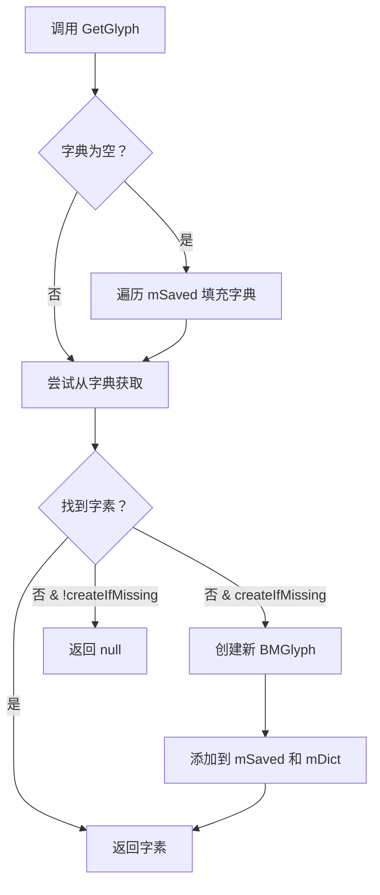
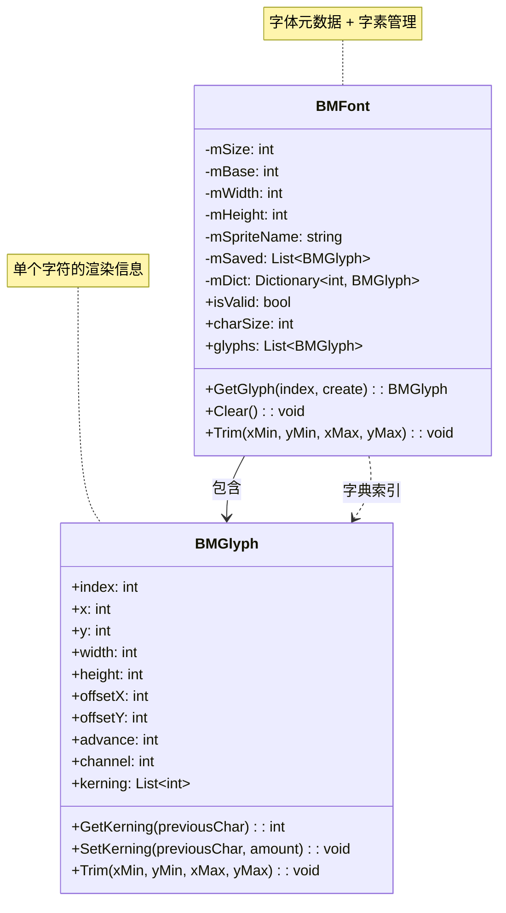

# BMFont.cs 文档

> **文件路径**: `Assets/Scripts/Editor/ArtEditor/UGUIFont/BMFont.cs`  
> **命名空间**: `TaoTie`  
> **版权**: NGUI: Next-Gen UI kit © 2011-2014 Tasharen Entertainment

---

## 📑 文件信息表

| 属性 | 值 |
|------|-----|
| **类名** | `BMFont` |
| **类型** | `Serializable` 数据类 |
| **依赖** | `UnityEngine`, `System.Collections.Generic` |
| **用途** | BMFont 字体数据读取与存储 |

---

## 🎯 类说明

`BMFont` 是 BMFont 字体格式的 C# 实现，用于读取和存储 AngelCode BMFont 工具生成的字体数据。

**核心职责**:
- 存储字体的大小、基线、纹理尺寸等元数据
- 管理字素 (glyph) 集合
- 提供字素的快速查找功能

**设计来源**: 基于 NGUI 框架的 BMFont 实现，参考 http://www.angelcode.com/products/bmfont/

---

## 📊 字段表

### 序列化字段

| 字段名 | 类型 | 说明 |
|--------|------|------|
| `mSize` | `int` | 字体大小 (像素),默认 16 |
| `mBase` | `int` | 基线偏移量，从行顶到字符基座的距离 |
| `mWidth` | `int` | 原始纹理宽度 |
| `mHeight` | `int` | 原始纹理高度 |
| `mSpriteName` | `string` | 精灵名称 (通常是纹理文件名) |
| `mSaved` | `List<BMGlyph>` | 序列化的字素列表 |
| `mDict` | `Dictionary<int, BMGlyph>` | 字素字典，用于快速查找 |

---

## 🔧 属性说明

| 属性名 | 类型 | 说明 |
|--------|------|------|
| `isValid` | `bool` | 字体是否可用 (有字素数据) |
| `charSize` | `int` | 字体大小 (如 32 表示 32 像素) |
| `baseOffset` | `int` | 应用到字符的基线偏移 |
| `texWidth` | `int` | 纹理原始宽度 |
| `texHeight` | `int` | 纹理原始高度 |
| `glyphCount` | `int` | 有效字素数量 |
| `spriteName` | `string` | 精灵原始名称 |
| `glyphs` | `List<BMGlyph>` | 字素列表访问器 |

---

## ⚙️ 方法说明

### GetGlyph(int index, bool createIfMissing)

```csharp
public BMGlyph GetGlyph(int index, bool createIfMissing)
```

**功能**: 获取指定索引的字素，可选择在缺失时创建

| 参数 | 类型 | 说明 |
|------|------|------|
| `index` | `int` | 字素索引 (字符编码) |
| `createIfMissing` | `bool` | 缺失时是否创建新字素 |

**返回值**: `BMGlyph` - 字素实例

**流程**:


---

### GetGlyph(int index)

```csharp
public BMGlyph GetGlyph(int index)
```

**功能**: 获取指定索引的字素 (不创建)

**等价于**: `GetGlyph(index, false)`

---

### Clear()

```csharp
public void Clear()
```

**功能**: 清空所有字素数据

**操作**:
- 清空 `mDict` 字典
- 清空 `mSaved` 列表

---

### Trim()

```csharp
public void Trim(int xMin, int yMin, int xMax, int yMax)
```

**功能**: 裁剪字素，确保不超出指定边界

| 参数 | 类型 | 说明 |
|------|------|------|
| `xMin` | `int` | 最小 X 坐标 |
| `yMin` | `int` | 最小 Y 坐标 |
| `xMax` | `int` | 最大 X 坐标 |
| `yMax` | `int` | 最大 Y 坐标 |

**实现**: 遍历所有字素，调用 `BMGlyph.Trim()` 进行裁剪

---

## 📈 Mermaid 流程图

### 数据结构关系



---

## 💡 使用示例

### 加载 BMFont 数据

```csharp
// 通过 BMFontReader 加载
BMFont mbFont = new BMFont();
byte[] fontBytes = File.ReadAllBytes("path/to/font.fnt");
BMFontReader.Load(mbFont, "font", fontBytes);

// 访问字体属性
Debug.Log($"字体大小：{mbFont.charSize}");
Debug.Log($"纹理尺寸：{mbFont.texWidth}x{mbFont.texHeight}");
Debug.Log($"字素数量：{mbFont.glyphCount}");
```

### 获取字素

```csharp
// 获取字符 'A' (ASCII 65) 的字素
BMGlyph glyphA = mbFont.GetGlyph(65);
if (glyphA != null)
{
    Debug.Log($"'A' 的位置：({glyphA.x}, {glyphA.y})");
    Debug.Log($"'A' 的尺寸：{glyphA.width}x{glyphA.height}");
    Debug.Log($"'A' 的偏移：({glyphA.offsetX}, {glyphA.offsetY})");
}

// 获取字素间距 (kerning)
int kerning = glyphA.GetKerning(86); // 'V' 后跟 'A' 的间距
```

### 在 ArtistFont 中的应用

```csharp
// 参见 ArtistFont.cs 中的使用
TextAsset BMFontText = AssetDatabase.LoadAssetAtPath(fntFilePath, typeof(TextAsset)) as TextAsset;
BMFont mbFont = new BMFont();
BMFontReader.Load(mbFont, BMFontText.name, BMFontText.bytes);

// 遍历所有字素生成 CharacterInfo
CharacterInfo[] characterInfo = new CharacterInfo[mbFont.glyphs.Count];
for (int i = 0; i < mbFont.glyphs.Count; i++)
{
    BMGlyph bmInfo = mbFont.glyphs[i];
    CharacterInfo info = new CharacterInfo();
    info.index = bmInfo.index;
    info.uv.x = (float)bmInfo.x / (float)mbFont.texWidth;
    info.uv.y = 1 - (float)bmInfo.y / (float)mbFont.texHeight;
    // ... 设置其他属性
    characterInfo[i] = info;
}
```

---

## 🔗 相关文档链接

| 文档 | 说明 |
|------|------|
| [BMFontReader.cs.md](./BMFontReader.cs.md) | BMFont 数据读取器 |
| [BMGlyph.cs.md](./BMGlyph.cs.md) | 字素数据结构 |
| [ByteReader.cs.md](./ByteReader.cs.md) | 字节读取工具 |
| [ArtistFont.cs.md](./ArtistFont.cs.md) | 字体导入工具 |

---

## ⚠️ 注意事项

1. **单纹理限制**: BMFont 导出时只能使用 1 张纹理，多纹理不被支持
2. **字典优化**: 首次访问字素时会填充字典，后续查找为 O(1)
3. **序列化**: 使用 `[SerializeField]` 和 `[HideInInspector]` 支持 Unity 序列化

---

*文档由 OpenClaw AI 助手自动生成 | 基于静态代码分析*
