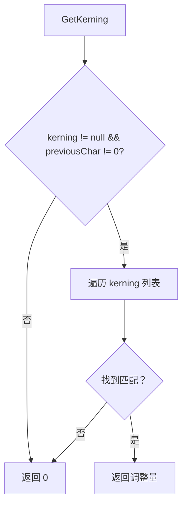
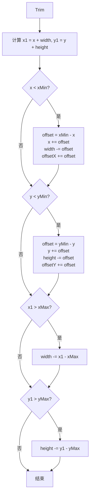
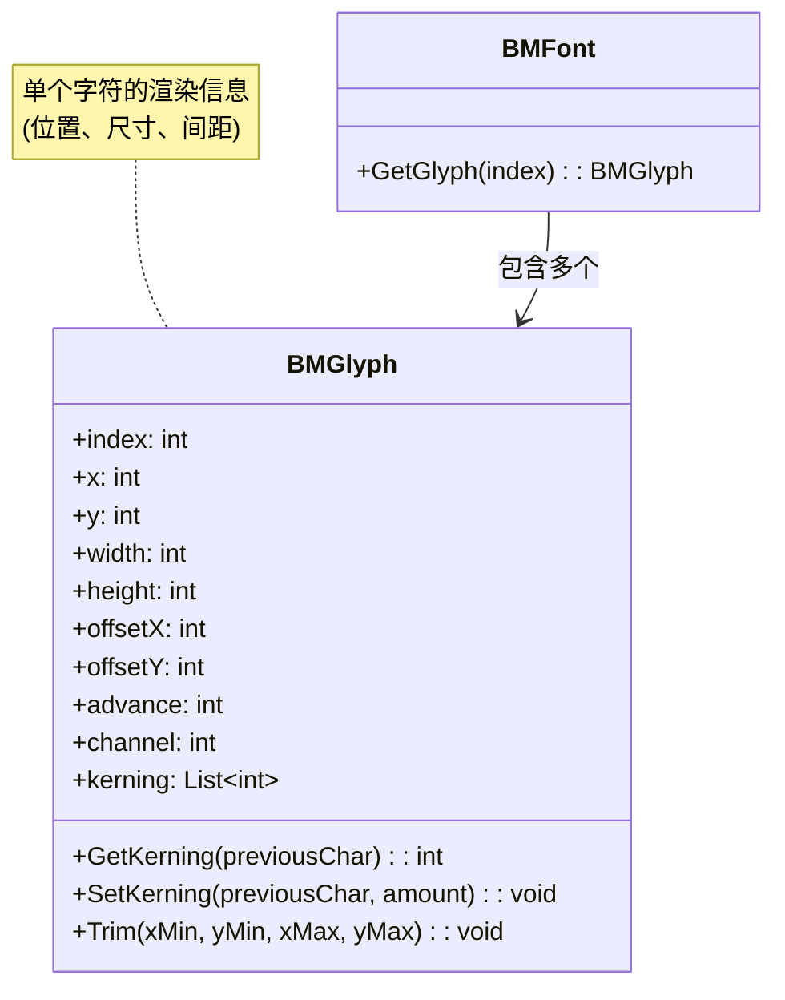

# BMGlyph.cs 文档

> **文件路径**: `Assets/Scripts/Editor/ArtEditor/UGUIFont/BMGlyph.cs`  
> **命名空间**: `TaoTie`  
> **版权**: NGUI: Next-Gen UI kit © 2011-2014 Tasharen Entertainment

---

## 📑 文件信息表

| 属性 | 值 |
|------|-----|
| **类名** | `BMGlyph` |
| **类型** | `Serializable` 数据类 |
| **依赖** | `UnityEngine`, `System.Collections.Generic` |
| **用途** | BMFont 字素 (glyph) 数据结构 |

---

## 🎯 类说明

`BMGlyph` 表示 BMFont 字体中的单个字符 (字素) 信息。

**核心职责**:
- 存储字符在纹理中的位置和尺寸
- 存储字符的偏移量和间距信息
- 支持字距调整 (kerning)

**设计来源**: 基于 AngelCode BMFont 规范，参考 http://www.angelcode.com/products/bmfont/

---

## 📊 字段表

| 字段名 | 类型 | 说明 |
|--------|------|------|
| `index` | `int` | 字素索引 (字符编码/Unicode) |
| `x` | `int` | 纹理中从左边缘到字素左边缘的偏移 |
| `y` | `int` | 纹理中从顶部到字素顶部的偏移 |
| `width` | `int` | 字素宽度 (像素) |
| `height` | `int` | 字素高度 (像素) |
| `offsetX` | `int` | 绘制前应用到光标左位置的偏移 |
| `offsetY` | `int` | 绘制前应用到光标顶位置的偏移 |
| `advance` | `int` | 打印此字符后光标移动距离 |
| `channel` | `int` | 通道掩码 (通常 15=RGBA, 1+2+4+8) |
| `kerning` | `List<int>` | 字距调整数据 (成对存储：字符编码 + 调整量) |

---

## 🔧 方法说明

### GetKerning(int previousChar)

```csharp
public int GetKerning(int previousChar)
```

**功能**: 获取给定前一个字符的字距调整量

| 参数 | 类型 | 说明 |
|------|------|------|
| `previousChar` | `int` | 前一个字符的编码 |

**返回值**: `int` - 字距调整量 (像素)，无调整返回 0

**实现逻辑**:
```csharp
public int GetKerning(int previousChar)
{
    if (kerning != null && previousChar != 0)
    {
        for (int i = 0, imax = kerning.Count; i < imax; i += 2)
            if (kerning[i] == previousChar)
                return kerning[i + 1];
    }
    return 0;
}
```

**流程图**:


---

### SetKerning(int previousChar, int amount)

```csharp
public void SetKerning(int previousChar, int amount)
```

**功能**: 添加或更新字距调整条目

| 参数 | 类型 | 说明 |
|------|------|------|
| `previousChar` | `int` | 前一个字符的编码 |
| `amount` | `int` | 调整量 (像素，可为负) |

**实现逻辑**:
- 如果 `kerning` 为 null，创建新列表
- 遍历现有条目，如果找到匹配的 `previousChar`，更新调整量
- 如果未找到，添加新的 (字符编码，调整量) 对

**存储格式**: `kerning` 列表成对存储：`[char1, amount1, char2, amount2, ...]`

---

### Trim(int xMin, int yMin, int xMax, int yMax)

```csharp
public void Trim(int xMin, int yMin, int xMax, int yMax)
```

**功能**: 裁剪字素，确保不超出指定边界

| 参数 | 类型 | 说明 |
|------|------|------|
| `xMin` | `int` | 最小 X 坐标 |
| `yMin` | `int` | 最小 Y 坐标 |
| `xMax` | `int` | 最大 X 坐标 |
| `yMax` | `int` | 最大 Y 坐标 |

**实现逻辑**:


---

## 📈 Mermaid 类图



---

## 💡 使用示例

### 访问字素属性

```csharp
BMFont font = ...; // 已加载的字体
BMGlyph glyph = font.GetGlyph(65); // 字符 'A'

if (glyph != null)
{
    // 纹理坐标
    Debug.Log($"纹理位置：({glyph.x}, {glyph.y})");
    Debug.Log($"尺寸：{glyph.width}x{glyph.height}");
    
    // 渲染偏移
    Debug.Log($"渲染偏移：({glyph.offsetX}, {glyph.offsetY})");
    Debug.Log($"光标前进：{glyph.advance}");
}
```

### 计算 UV 坐标 (用于 ArtistFont)

```csharp
// 从 BMGlyph 计算 Unity CharacterInfo 的 UV
CharacterInfo info = new CharacterInfo();
info.uv.x = (float)glyph.x / (float)font.texWidth;
info.uv.y = 1 - (float)glyph.y / (float)font.texHeight;
info.uv.width = (float)glyph.width / (float)font.texWidth;
info.uv.height = -1f * (float)glyph.height / (float)font.texHeight;

// 设置顶点偏移
info.vert.x = (float)glyph.offsetX;
info.vert.y = (float)glyph.offsetY - (float)glyph.height / 2;
info.vert.width = (float)glyph.width;
info.vert.height = (float)glyph.height;

// 设置字符宽度
info.width = (float)glyph.advance;
```

### 字距调整

```csharp
// 设置字距调整：'V' (86) 后跟 'A' (65) 时，向左调整 2 像素
glyphA.SetKerning(86, -2);

// 获取字距调整
int kerning = glyphA.GetKerning(86); // 返回 -2
int noKerning = glyphA.GetKerning(66); // 返回 0 (无调整)
```

### 裁剪字素

```csharp
// 裁剪字素到 100x100 的边界内
glyph.Trim(0, 0, 100, 100);
```

---

## 🔗 相关文档链接

| 文档 | 说明 |
|------|------|
| [BMFont.cs.md](./BMFont.cs.md) | BMFont 字体数据类 |
| [BMFontReader.cs.md](./BMFontReader.cs.md) | BMFont 数据读取器 |
| [ArtistFont.cs.md](./ArtistFont.cs.md) | 字体导入工具 |

---

## ⚠️ 注意事项

1. **Kerning 存储格式**: `kerning` 列表成对存储，索引为偶数的是字符编码，奇数的是调整量
2. **Channel 掩码**: 通常为 15 (RGBA 全部)，表示字素使用所有颜色通道
3. **Advance**: 打印字符后光标的移动距离，可能不等于字素宽度 (用于字符间距)

---

*文档由 OpenClaw AI 助手自动生成 | 基于静态代码分析*
