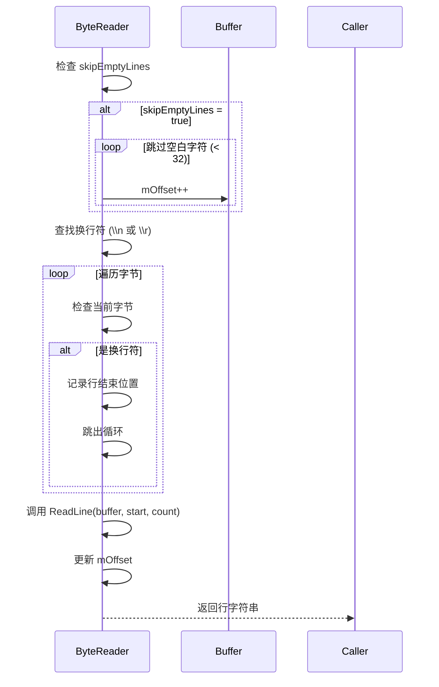
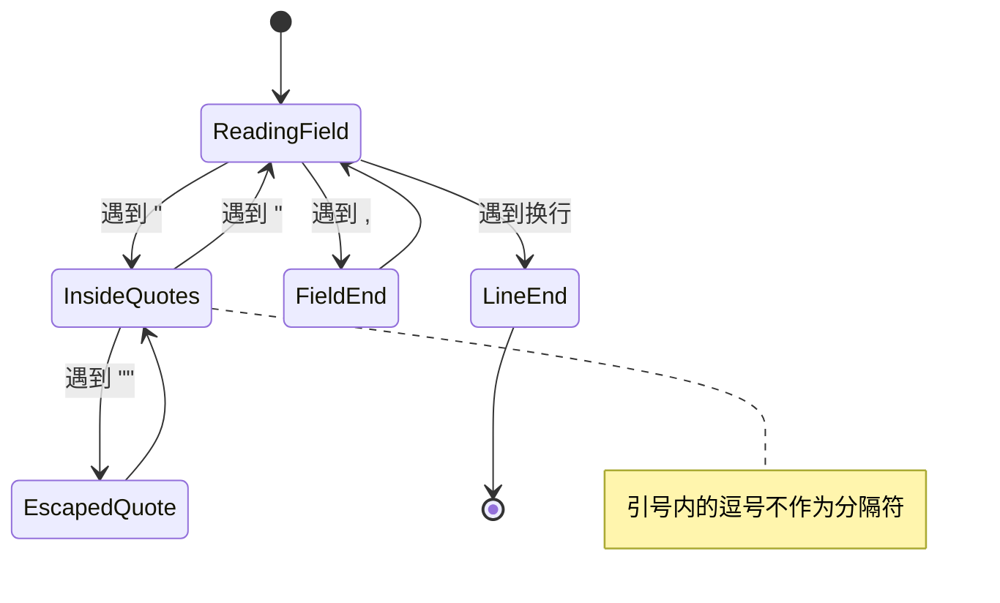
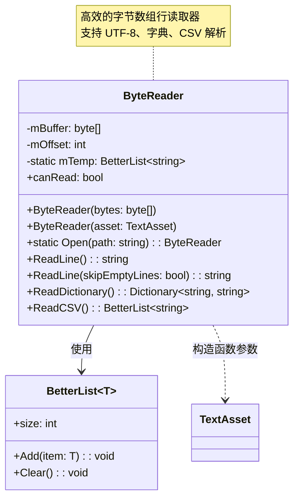

# ByteReader.cs 文档

> **文件路径**: `Assets/Scripts/Editor/ArtEditor/UGUIFont/ByteReader.cs`  
> **命名空间**: `TaoTie`  
> **版权**: NGUI: Next-Gen UI kit © 2011-2014 Tasharen Entertainment

---

## 📑 文件信息表

| 属性 | 值 |
|------|-----|
| **类名** | `ByteReader` |
| **类型** | 工具类 |
| **依赖** | `UnityEngine`, `System.Text`, `System.Collections.Generic`, `System.IO` |
| **用途** | 高效的字节数组行读取器 |

---

## 🎯 类说明

`ByteReader` 是一个自定义的字节数组行读取器，用于替代 `MemoryStream.ReadLine()`。

**解决的核心问题**:
- `MemoryStream.ReadLine()` 在某些平台上不会正确推进流的位置
- 避免使用流 (Stream) 带来的性能开销
- 提供 UTF-8 编码的文本行读取功能

**设计来源**: 基于 NGUI 框架的 ByteReader 实现

---

## 📊 字段表

| 字段名 | 类型 | 说明 |
|--------|------|------|
| `mBuffer` | `byte[]` | 内部字节缓冲区 |
| `mOffset` | `int` | 当前读取位置偏移量 |
| `mTemp` | `BetterList<string>` | CSV 解析临时缓存 (静态) |

---

## 🔧 构造方法

### ByteReader(byte[] bytes)

```csharp
public ByteReader(byte[] bytes)
```

**功能**: 从字节数组创建读取器

| 参数 | 类型 | 说明 |
|------|------|------|
| `bytes` | `byte[]` | 要读取的字节数据 |

---

### ByteReader(TextAsset asset)

```csharp
public ByteReader(TextAsset asset)
```

**功能**: 从 Unity TextAsset 创建读取器

| 参数 | 类型 | 说明 |
|------|------|------|
| `asset` | `TextAsset` | Unity 文本资源 |

**实现**: `mBuffer = asset.bytes`

---

## ⚙️ 方法说明

### Open(string path)

```csharp
static public ByteReader Open(string path)
```

**功能**: 从文件路径创建 ByteReader

| 参数 | 类型 | 说明 |
|------|------|------|
| `path` | `string` | 文件路径 |

**返回值**: `ByteReader` - 读取器实例，失败返回 null

**实现逻辑**:
```mermaid
graph TD
    A[Open] --> B[File.OpenRead(path)]
    B --> C{文件打开成功？}
    C -->|否 | D[返回 null]
    C -->|是 | E[seek 到文件末尾获取大小]
    E --> F[创建 buffer 数组]
    F --> G[seek 回文件开头]
    G --> H[读取全部字节]
    H --> I[关闭文件流]
    I --> J[返回 new ByteReader(buffer)]
```

**注意**: 仅在 `UNITY_EDITOR` 或非 Flash/NETFX_CORE/WP8 平台可用

---

### canRead

```csharp
public bool canRead { get; }
```

**功能**: 检查是否还有可读数据

**实现**: `return (mBuffer != null && mOffset < mBuffer.Length)`

---

### ReadLine()

```csharp
public string ReadLine()
```

**功能**: 从缓冲区读取一行

**返回值**: `string` - 读取的行内容，到达末尾返回 null

**等价于**: `ReadLine(true)` (跳过空行)

---

### ReadLine(bool skipEmptyLines)

```csharp
public string ReadLine(bool skipEmptyLines)
```

**功能**: 从缓冲区读取一行，可选择跳过空行

| 参数 | 类型 | 说明 |
|------|------|------|
| `skipEmptyLines` | `bool` | 是否跳过空行 |

**实现逻辑**:


**内部静态方法**:

```csharp
static string ReadLine(byte[] buffer, int start, int count)
```

**UTF-8 解码逻辑**:
- 7 位 UCS: `0xxxxxxx` → ASCII 字符
- 11 位 UCS: `110xxxxx 10xxxxxx` → 2 字节 UTF-8
- 16 位 UCS: `1110xxxx 10xxxxxx 10xxxxxx` → 3 字节 UTF-8
- 21 位 UCS: `11110xxx 10xxxxxx 10xxxxxx 10xxxxxx` → 4 字节 UTF-8
- 特殊处理 BOM (`0xEF 0xBB 0xBF`)

---

### ReadDictionary()

```csharp
public Dictionary<string, string> ReadDictionary()
```

**功能**: 读取键值对字典 (key=value 格式)

**返回值**: `Dictionary<string, string>` - 解析后的字典

**格式要求**:
- 每行一个键值对：`key=value`
- 以 `//` 开头的行为注释，被忽略
- 值中的 `\n` 会被转换为实际换行符

**流程图**:
```mermaid
graph TD
    A[ReadDictionary] --> B[创建 Dictionary]
    B --> C{canRead?}
    C -->|否 | D[返回字典]
    C -->|是 | E[ReadLine()]
    E --> F{行以 // 开头？}
    F -->|是 | C
    F -->|否 | G[按 = 分割]
    G --> H{分割结果 == 2?}
    H -->|是 | I[dict[key.Trim()] = val.Trim().Replace("\\n", "\n")]
    H -->|否 | C
    I --> C
```

---

### ReadCSV()

```csharp
public BetterList<string> ReadCSV()
```

**功能**: 读取 CSV (逗号分隔值) 行

**返回值**: `BetterList<string>` - 解析后的字段列表，到达末尾返回 null

**特性**:
- 支持引号内的逗号 (`"field,with,commas"`)
- 支持转义引号 (`""` 表示单个 `"`)
- 支持跨行字段 (引号内的换行)

**实现逻辑**:


---

## 📈 Mermaid 类图



---

## 💡 使用示例

### 读取文件行

```csharp
// 从文件读取
ByteReader reader = ByteReader.Open("Assets/Config/items.txt");
while (reader.canRead)
{
    string line = reader.ReadLine();
    if (line != null)
    {
        Debug.Log(line);
    }
}
```

### 读取键值对配置

```csharp
// 配置格式:
// name=Item001
// price=100
// description=这是一个物品

ByteReader reader = new ByteReader(textAsset.bytes);
Dictionary<string, string> config = reader.ReadDictionary();

string itemName = config["name"];
int price = int.Parse(config["price"]);
```

### 读取 CSV 数据

```csharp
// CSV 格式:
// id,name,description
// 1," Sword, Sharp","A very sharp sword"
// 2,Shield,"A ""strong"" shield"

ByteReader reader = new ByteReader(csvBytes);
while (reader.canRead)
{
    BetterList<string> fields = reader.ReadCSV();
    if (fields != null)
    {
        string id = fields[0];
        string name = fields[1];
        string desc = fields[2];
    }
}
```

### 在 BMFontReader 中的应用

```csharp
// BMFontReader.Load() 中使用 ByteReader 解析 .fnt 文件
ByteReader reader = new ByteReader(bytes);
char[] separator = new char[] {' '};

while (reader.canRead)
{
    string line = reader.ReadLine();
    if (string.IsNullOrEmpty(line)) break;
    string[] split = line.Split(separator, StringSplitOptions.RemoveEmptyEntries);
    
    if (split[0] == "char")
    {
        // 解析 char id=13 x=506 y=62 ...
        int id = GetInt(split[1]);
        int x = GetInt(split[2]);
        // ...
    }
}
```

---

## 🔗 相关文档链接

| 文档 | 说明 |
|------|------|
| [BMFontReader.cs.md](./BMFontReader.cs.md) | BMFont 数据读取器 (使用 ByteReader) |
| [BMFont.cs.md](./BMFont.cs.md) | BMFont 字体数据类 |
| [BetterList.cs.md](./BetterList.cs.md) | 高性能列表实现 |

---

## ⚠️ 注意事项

1. **平台兼容性**: `Open(string path)` 在 Flash/NETFX_CORE/WP8 平台不可用
2. **UTF-8 编码**: 内部使用 UTF-8 解码，支持多字节字符
3. **BOM 处理**: 自动跳过 UTF-8 BOM (`0xEF 0xBB 0xBF`)
4. **性能优化**: 直接使用字节数组，避免 Stream 开销
5. **CSV 引号**: 正确处理引号内的逗号和转义引号

---

## 🔍 实现细节

### UTF-8 解码 (非 Flash 平台)

```csharp
// 简单模式：直接使用 .NET 的 Encoding.UTF8
return Encoding.UTF8.GetString(buffer, start, count);
```

### UTF-8 解码 (Flash 平台)

```csharp
// 手动解析 UTF-8 字节
for (int i = start; i < max; ++i)
{
    byte byte0 = buffer[i];
    
    if ((byte0 & 128) == 0)
    {
        // 7 位 ASCII: 0xxxxxxx
        sb.Append((char)byte0);
    }
    else if ((byte0 & 224) == 192)
    {
        // 11 位 UCS: 110xxxxx 10xxxxxx
        byte byte1 = buffer[++i];
        int ch = (byte0 & 31) << 6 | (byte1 & 63);
        sb.Append((char)ch);
    }
    // ... 更多 UTF-8 编码处理
}
```

---

*文档由 OpenClaw AI 助手自动生成 | 基于静态代码分析*
