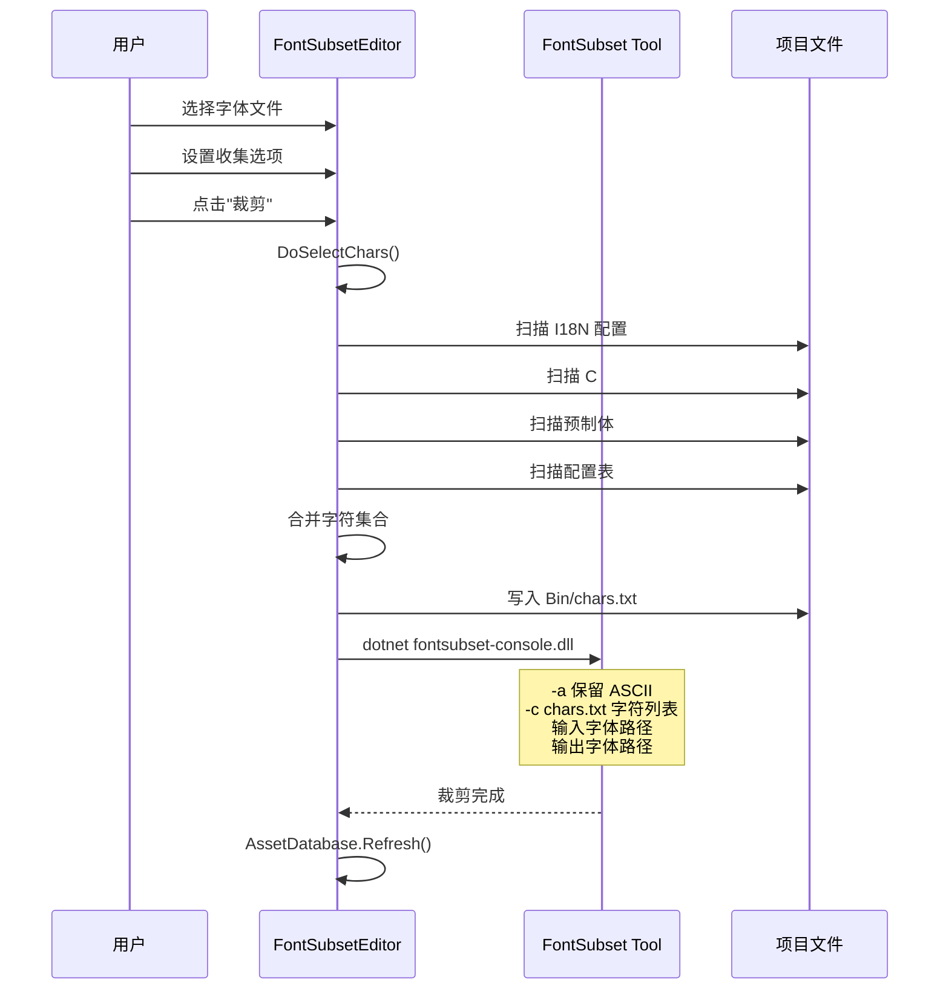

# FontSubsetEditor.cs 注解文档

## 文件基本信息

| 属性 | 值 |
|------|-----|
| **文件名** | FontSubsetEditor.cs |
| **路径** | Assets/Scripts/Editor/ArtEditor/UGUIFont/FontSubsetEditor.cs |
| **所属模块** | Editor → 美术编辑器 → UGUI 字体工具 |
| **文件职责** | 字体裁剪工具编辑器窗口，分析项目中使用的字符并裁剪字体文件 |

---

## 类/结构体说明

### FontSubsetEditor

| 属性 | 说明 |
|------|------|
| **职责** | Unity Editor 窗口，提供字体裁剪功能，收集项目中使用的字符并调用外部工具裁剪字体 |
| **泛型参数** | 无 |
| **继承关系** | 继承 `EditorWindow` |
| **实现的接口** | 无 |

**设计模式**: 编辑器工具窗口模式

```csharp
// 编辑器窗口入口
[MenuItem("Tools/Font Subset")]  // 假设菜单路径
public static void ShowWindow()
{
    GetWindow<FontSubsetEditor>();
}
```

---

## 字段与属性（按重要程度排序）

| 名称 | 类型 | 访问级别 | 说明 |
|------|------|----------|------|
| `exeName` | `const string` | `private const` | 字体裁剪工具可执行文件路径："Bin/fontsubset-console.dll" |
| `font` | `Object` | `private` | 待裁剪的字体对象 |
| `collectAscii` | `bool` | `private` | 是否保留 ASCII 字符 |
| `collectI18nConfig` | `bool` | `private` | 是否收集多语言配置表中的字符 |
| `collectCS` | `bool` | `private` | 是否收集 C# 代码中的硬编码文本 |
| `collectPrefab` | `bool` | `private` | 是否收集预制体中的 UI 文本 |
| `collectConfig` | `bool` | `private` | 是否收集所有配置表中的硬编码文本 |

---

## 方法说明（按重要程度排序）

### OnGUI()

**签名**:
```csharp
private void OnGUI()
```

**职责**: 绘制编辑器窗口界面

**核心逻辑**:
```
1. 绘制 5 个收集选项的 Toggle
2. 绘制字体对象选择框
3. 绘制"裁剪"按钮：
   - 检查裁剪工具是否存在
   - 收集字符并写入 Bin/chars.txt
   - 调用 dotnet 运行裁剪工具
4. 绘制"输出引用字符"按钮：仅输出字符列表
```

**调用者**: Unity Editor (自动调用)

---

### DoSelectChars()

**签名**:
```csharp
private string DoSelectChars()
```

**职责**: 收集项目中所有使用的字符

**核心逻辑**:
```
1. 创建 HashSet<char> 字符集合
2. 调用 SelectI18NChars() 收集多语言字符
3. 调用 SelectCsChars() 收集代码字符
4. 调用 SelectPrefabChars() 收集预制体字符
5. 调用 SelectConfigChars() 收集配置表字符
6. 拼接所有字符返回
```

**返回值**: 所有收集到的字符组成的字符串

---

### SelectI18NChars()

**签名**:
```csharp
private void SelectI18NChars(HashSet<char> chars)
```

**职责**: 从多语言配置表中收集字符

**核心逻辑**:
```
1. 检查 collectI18nConfig 开关
2. 遍历所有语言类型 (LangType 枚举)
3. 加载对应语言配置文件 (Config/{lang}.bytes)
4. 反序列化为 I18NConfigCategory
5. 遍历所有配置项，提取 Value 字段中的字符
6. 过滤空格、回车、换行符
7. 加入字符集合
```

**调用者**: `DoSelectChars()`

---

### SelectCsChars()

**签名**:
```csharp
private void SelectCsChars(HashSet<char> chars)
```

**职责**: 从 C# 代码文件中收集硬编码字符串字符

**核心逻辑**:
```
1. 检查 collectCS 开关
2. 扫描 Assets/Scripts/Code 目录下所有 .cs 文件
3. 读取每行代码
4. 过滤不包含引号的行
5. 按注释分割，只处理代码部分
6. 将所有字符加入集合
```

**调用者**: `DoSelectChars()`

---

### SelectPrefabChars()

**签名**:
```csharp
private void SelectPrefabChars(HashSet<char> chars)
```

**职责**: 从预制体中收集 UI 文本字符

**核心逻辑**:
```
1. 检查 collectPrefab 开关
2. 搜索 Assets/AssetsPackage 下所有 Prefab
3. 加载每个预制体
4. 获取所有 Text 组件，收集 text 字段字符
5. 获取所有 TMPro.TMP_Text 组件，收集 text 字段字符
6. 加入字符集合
```

**调用者**: `DoSelectChars()`

---

### SelectConfigChars()

**签名**:
```csharp
private void SelectConfigChars(HashSet<char> chars)
```

**职责**: 从配置表中收集硬编码文本字符

**核心逻辑**:
```
1. 检查 collectConfig 开关
2. 通过反射获取 Entry 程序集
3. 遍历所有类型，查找有 ConfigAttribute 标记的类型
4. 加载对应配置表 (Config/{TypeName}.bytes)
5. 反序列化为配置类别
6. 通过反射调用 GetAllList() 获取所有配置项
7. 遍历所有字符串类型字段，收集字符
```

**调用者**: `DoSelectChars()`

---

## 使用流程

### 字体裁剪工作流程



---

## 使用示例

### 示例 1: 裁剪字体文件

```csharp
// 1. 打开窗口：Tools → Font Subset (假设菜单路径)
// 2. 选择待裁剪的字体文件
// 3. 勾选收集选项：
//    ☑ 保留 Ascii 字符
//    ☑ 保留多语言表
//    ☐ 保留代码硬编码文本
//    ☑ 保留预制体硬编码文本
//    ☐ 保留所有配置表硬编码文本
// 4. 点击"裁剪"按钮
// 5. 等待工具执行完成
```

### 示例 2: 仅输出字符列表

```csharp
// 1. 打开窗口
// 2. 选择字体文件
// 3. 点击"输出引用字符"按钮
// 4. 查看 Bin/chars.txt 文件
// 5. 分析项目中使用的字符
```

---

## 依赖工具

### fontsubset-console.dll

**位置**: `Bin/fontsubset-console.dll`

**编译方式**:
```bash
# 编译 Tools/fontsubset.sln 到 Bin/fontsubset-console.dll
dotnet build Tools/fontsubset.sln -o Bin/
```

**命令行参数**:
| 参数 | 说明 |
|------|------|
| `-a` | 保留 ASCII 字符 |
| `-c "chars.txt"` | 指定字符列表文件 |
| `输入路径` | 原始字体文件路径 |
| `输出路径` | 裁剪后字体文件路径 |

---

## 注意事项

1. **工具依赖**: 需要先编译 fontsubset 工具到 `Bin/fontsubset-console.dll`
2. **字符去重**: 使用 HashSet 自动去重
3. **文件刷新**: 裁剪完成后调用 `AssetDatabase.Refresh()` 刷新资源
4. **FontsAddon 处理**: 特殊处理 FontsAddon 目录的字体输出路径

---

## 相关文档

- [ArtistFont.cs.md](./ArtistFont.cs.md) - 艺术字体批量创建工具
- [BMFontReader.cs.md](./BMFontReader.cs.md) - BMFont 格式读取器
- [BMFont.cs.md](./BMFont.cs.md) - BMFont 数据结构
- [BMGlyph.cs.md](./BMGlyph.cs.md) - 字体字形数据

---

*文档生成时间：2026-03-02 | OpenClaw AI 助手*
