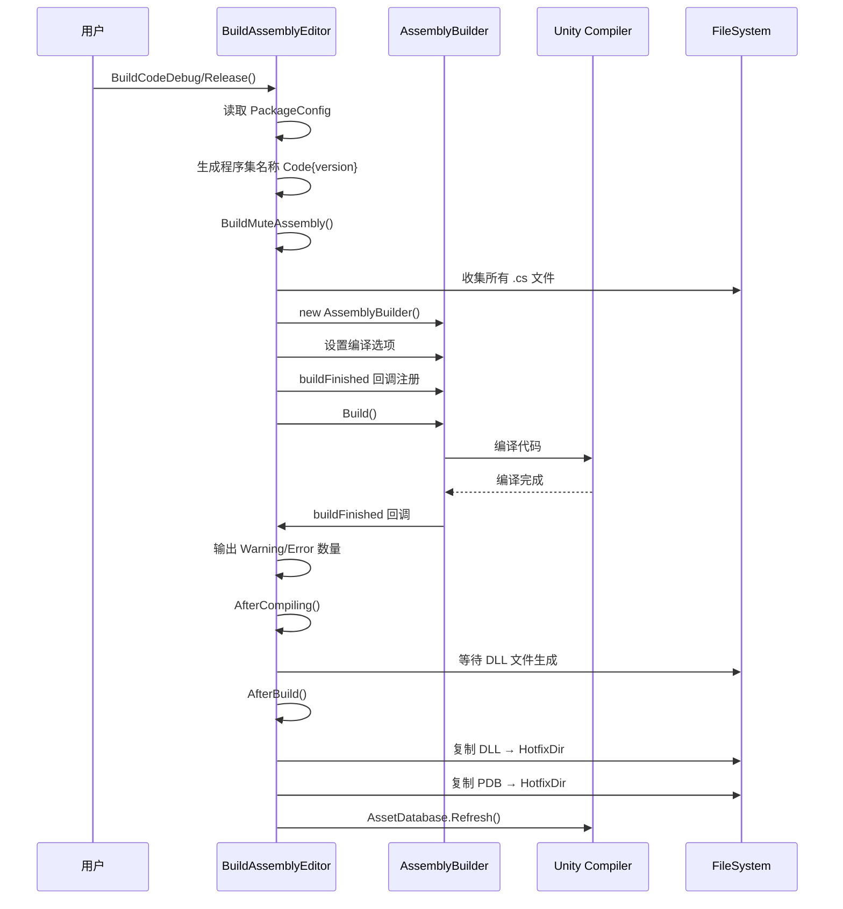
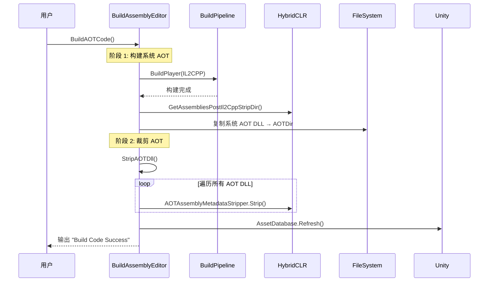

# BuildAssemblyEditor.cs 注解文档

## 文件基本信息

| 属性 | 值 |
|------|------|
| **文件名** | BuildAssemblyEditor.cs |
| **路径** | Assets/Scripts/Editor/BuildEditor/BuildAssemblyEditor.cs |
| **所属模块** | Editor 工具 → 构建编辑器 |
| **文件职责** | 程序集构建工具，支持热更 DLL 编译、AOT 元数据生成 |
| **命名空间** | `TaoTie` |

---

## 类/结构体说明

### BuildAssemblyEditor

| 属性 | 说明 |
|------|------|
| **职责** | 提供代码程序集的构建功能，支持 Debug/Release 模式，AOT 元数据生成与裁剪 |
| **泛型参数** | 无 |
| **继承关系** | 静态工具类 |
| **实现的接口** | 无 |

**设计模式**: 工具类模式 + 工厂模式

```csharp
// 静态工具类，提供程序集构建功能
public static class BuildAssemblyEditor
```

---

## 字段与属性

| 名称 | 类型 | 访问级别 | 说明 |
|------|------|----------|------|
| `IsBuildCodeAuto` | `bool` | `private static` | 是否启用自动构建标志 |
| `CodeLoader.SystemAotDllList` | `string[]` | `external` | 系统 AOT DLL 列表 |
| `CodeLoader.UserAotDllList` | `string[]` | `external` | 用户 AOT DLL 列表 |
| `CodeLoader.AllAotDllList` | `string[]` | `external` | 完整 AOT DLL 列表 |

---

## 方法说明

### SetAutoBuildCode

**签名**:
```csharp
[MenuItem("Tools/Build/EnableAutoBuildCodeDebug _F1")]
public static void SetAutoBuildCode()
```

**职责**: 启用代码自动构建功能

**核心逻辑**:
```
1. 设置 EditorPrefs "AutoBuild" = 1
2. 显示通知 "AutoBuildCode Enabled"
```

**调用者**: Unity Editor 菜单点击 (快捷键 F1)

---

### CancelAutoBuildCode

**签名**:
```csharp
[MenuItem("Tools/Build/DisableAutoBuildCodeDebug _F2")]
public static void CancelAutoBuildCode()
```

**职责**: 禁用代码自动构建功能

**核心逻辑**:
```
1. 删除 EditorPrefs "AutoBuild" 键
2. 显示通知 "AutoBuildCode Disabled"
```

**调用者**: Unity Editor 菜单点击 (快捷键 F2)

---

### BuildCodeDebug

**签名**:
```csharp
[MenuItem("Tools/Build/BuildCodeDebug _F5")]
public static void BuildCodeDebug()
```

**职责**: 构建 Debug 版本的代码程序集

**核心逻辑**:
```
1. 读取 PackageConfig 获取版本号
2. 生成程序集名称 "Code{version}"
3. 调用 BuildMuteAssembly 构建 Debug 版本
4. 调用 AfterCompiling 处理构建结果
```

**调用者**: Unity Editor 菜单点击 (快捷键 F5)

**被调用者**: `BuildMuteAssembly()`, `AfterCompiling()`

---

### BuildCodeRelease

**签名**:
```csharp
[MenuItem("Tools/Build/BuildCodeRelease _F6")]
public static void BuildCodeRelease()
```

**职责**: 构建 Release 版本的代码程序集

**核心逻辑**:
```
1. 读取 PackageConfig 获取版本号
2. 生成程序集名称 "Code{version}"
3. 调用 BuildMuteAssembly 构建 Release 版本
4. 调用 AfterCompiling 处理构建结果
```

**调用者**: Unity Editor 菜单点击 (快捷键 F6)

**被调用者**: `BuildMuteAssembly()`, `AfterCompiling()`

---

### BuildSystemAOT

**签名**:
```csharp
public static void BuildSystemAOT()
```

**职责**: 构建裁剪后的系统 AOT 元数据 DLL

**核心逻辑**:
```
1. 检测当前 Unity 平台
2. 设置 Scripting Backend 为 IL2CPP
3. 执行一次完整的 BuildPlayer 构建
4. 从 Il2Cpp 输出目录复制系统 AOT DLL
5. 保存为 .bytes 文件到 AOT 目录
```

**调用者**: `BuildAOTCode()`

**依赖**: HybridCLR 插件

---

### BuildUserAOT

**签名**:
```csharp
[MenuItem("Tools/Build/BuildUserAOT _F9")]
public static void BuildUserAOT()
```

**职责**: 构建未裁剪的用户 AOT 元数据 DLL

**核心逻辑**:
```
1. 获取当前构建目标平台
2. 使用 PlayerBuildInterface.CompilePlayerScripts 编译脚本
3. 复制用户 AOT DLL 到 AOT 目录
4. 调用 StripAOTDll 进行裁剪
```

**调用者**: Unity Editor 菜单点击 (快捷键 F9)

**被调用者**: `StripAOTDll()`

---

### BuildAOTCode

**签名**:
```csharp
[MenuItem("Tools/Build/BuildSystemAOT _F10")]
public static void BuildAOTCode()
```

**职责**: 构建完整的 AOT 元数据 (系统 + 用户)

**核心逻辑**:
```
1. 调用 BuildSystemAOT 构建系统 AOT
2. 调用 StripAOTDll 裁剪所有 AOT DLL
```

**调用者**: Unity Editor 菜单点击 (快捷键 F10)

**被调用者**: `BuildSystemAOT()`, `StripAOTDll()`

---

### StripAOTDll

**签名**:
```csharp
[MenuItem("Tools/Build/StripAOTDll")]
public static void StripAOTDll()
```

**职责**: 裁剪 AOT DLL 元数据，减小文件大小

**核心逻辑**:
```
1. 遍历所有 AOT DLL 列表
2. 使用 HybridCLR.AOTAssemblyMetadataStripper.Strip 裁剪
3. 刷新资源数据库
```

**调用者**: `BuildAOTCode()`, `BuildUserAOT()`

---

### BuildMuteAssembly

**签名**:
```csharp
private static void BuildMuteAssembly(string assemblyName, string[] CodeDirectorys, 
    string[] additionalReferences, CodeOptimization codeOptimization, bool isAuto = false)
```

**职责**: 静默构建程序集

**核心逻辑**:
```
1. 收集 CodeDirectorys 下所有 .cs 文件
2. 创建 AssemblyBuilder
3. 设置编译选项 (CodeOptimization, ApiCompatibilityLevel)
4. 注册 buildStarted/buildFinished 回调
5. 调用 Build() 开始构建
6. 如果是自动构建，注册 EditorApplication.update 回调
```

**参数说明**:
| 参数 | 类型 | 说明 |
|------|------|------|
| `assemblyName` | `string` | 程序集名称 |
| `CodeDirectorys` | `string[]` | 代码目录列表 |
| `additionalReferences` | `string[]` | 额外引用 |
| `codeOptimization` | `CodeOptimization` | 代码优化模式 (Debug/Release) |
| `isAuto` | `bool` | 是否自动构建 |

**被调用者**: `BuildCodeDebug()`, `BuildCodeRelease()`

---

### AfterCompiling

**签名**:
```csharp
private static void AfterCompiling(string assemblyName)
```

**职责**: 编译完成后的处理

**核心逻辑**:
```
1. 等待 DLL 文件生成 (轮询检查)
2. 调用 AfterBuild 复制文件
```

**调用者**: `BuildCodeDebug()`, `BuildCodeRelease()`

---

### AfterBuild

**签名**:
```csharp
public static void AfterBuild(string assemblyName)
```

**职责**: 构建完成后复制 DLL 到热更目录

**核心逻辑**:
```
1. 创建 Define.HotfixDir 目录
2. 清理热更目录
3. 复制 .dll 为 .dll.bytes
4. 复制 .pdb 为 .pdb.bytes
5. 刷新资源数据库
```

**调用者**: `AfterCompiling()`

---

## 核心流程

### 代码构建流程



### AOT 元数据构建流程



---

## 使用示例

### 构建 Debug 代码

1. 按 `F5` 或点击菜单 `Tools` → `Build` → `BuildCodeDebug`
2. 等待编译完成
3. 查看 Console 输出的 Warning/Error

### 构建 Release 代码

1. 按 `F6` 或点击菜单 `Tools` → `Build` → `BuildCodeRelease`
2. 等待编译完成
3. 查看 Console 输出的 Warning/Error

### 构建 AOT 元数据

**首次打包前必须执行**:

1. 按 `F10` 或点击菜单 `Tools` → `Build` → `BuildSystemAOT`
2. 等待 IL2CPP 构建完成 (可能需要几分钟)
3. 等待 AOT 裁剪完成
4. 查看 `Assets/Hotfix/AOT/` 目录下的 .bytes 文件

### 启用自动构建

1. 按 `F1` 或点击菜单 `Tools` → `Build` → `EnableAutoBuildCodeDebug`
2. 代码修改后自动重新编译

---

## 技术要点

### AssemblyBuilder API

使用 Unity 的 `AssemblyBuilder` 进行程序集构建：

```csharp
AssemblyBuilder assemblyBuilder = new AssemblyBuilder(dllPath, scripts.ToArray());
assemblyBuilder.compilerOptions.CodeOptimization = codeOptimization;
assemblyBuilder.compilerOptions.ApiCompatibilityLevel = PlayerSettings.GetApiCompatibilityLevel(buildTargetGroup);
assemblyBuilder.buildTarget = EditorUserBuildSettings.activeBuildTarget;
assemblyBuilder.buildTargetGroup = buildTargetGroup;

if (!assemblyBuilder.Build())
{
    Debug.LogErrorFormat("build fail：" + assemblyBuilder.assemblyPath);
}
```

### HybridCLR AOT 元数据

HybridCLR 需要 AOT 元数据支持热更：

```csharp
// 获取 Il2Cpp 裁剪后的 AOT DLL
string aotDir = HybridCLR.Editor.SettingsUtil.GetAssembliesPostIl2CppStripDir(buildTarget);

// 裁剪 AOT 元数据
HybridCLR.Editor.AOT.AOTAssemblyMetadataStripper.Strip(srcFile, dstFile);
```

### 代码优化模式

| 模式 | 说明 | 适用场景 |
|------|------|---------|
| `CodeOptimization.Debug` | 调试模式，保留调试信息 | 开发环境 |
| `CodeOptimization.Release` | 发布模式，优化代码 | 正式环境 |

---

## 注意事项

### ⚠️ 使用限制

| 问题 | 说明 | 解决方案 |
|------|------|----------|
| **IL2CPP 依赖** | AOT 构建需要 IL2CPP 支持 | 确保 PlayerSettings 已设置 Scripting Backend = IL2CPP |
| **HybridCLR 依赖** | 需要 HybridCLR 插件 | 确保 HybridCLR 已安装并启用 |
| **构建时间** | AOT 构建耗时较长 | 首次构建后复用 AOT DLL |
| **CS0436 警告** | 类型引用警告可忽略 | 过滤该警告不输出 |

### 💡 最佳实践

```csharp
// ✅ 推荐：构建前检查 IL2CPP
var group = BuildPipeline.GetBuildTargetGroup(target);
if (PlayerSettings.GetScriptingBackend(group) != ScriptingImplementation.IL2CPP)
{
    Debug.LogError("需要启用 IL2CPP 后端");
    return;
}

// ✅ 推荐：过滤无关警告
int warningCount = compilerMessages.Count(m => 
    m.type == CompilerMessageType.Warning && !m.message.Contains("CS0436"));

// ✅ 推荐：构建前清理热更目录
FileHelper.CleanDirectory(Define.HotfixDir);

// ✅ 推荐：使用快捷键提高效率
// F1: 启用自动构建
// F2: 禁用自动构建
// F5: 构建 Debug 代码
// F6: 构建 Release 代码
// F9: 构建用户 AOT
// F10: 构建系统 AOT
```

---

## 相关文档

- [BuildEditor.cs.md](./BuildEditor.cs.md) - 打包工具 UI
- [BuildHelper.cs.md](./BuildHelper.cs.md) - 构建辅助工具
- [CodeLoader.cs.md](../../Mono/CodeLoader.cs.md) - 代码加载器
- [HybridCLR 官方文档](https://hybridclr.doc.code-philosophy.com/)

---

*文档生成时间：2026-03-02 | OpenClaw AI 助手*
