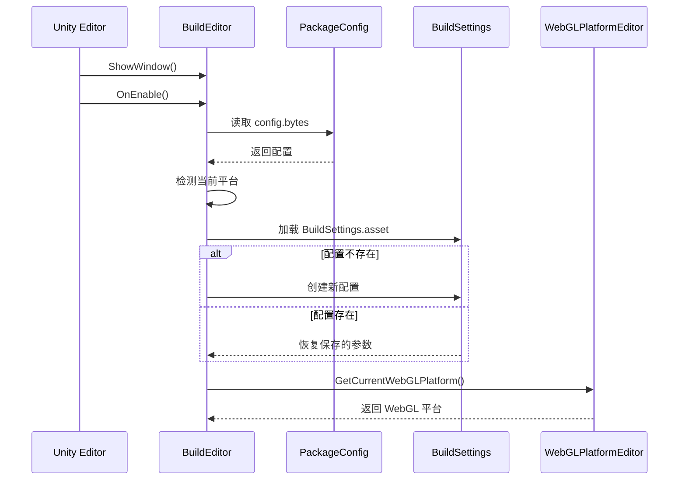
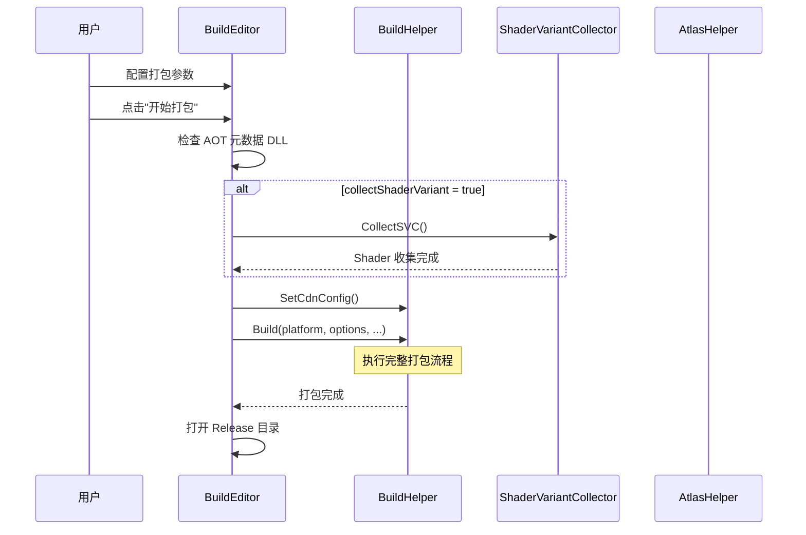

# BuildEditor.cs 注解文档

## 文件基本信息

| 属性 | 值 |
|------|-----|
| **文件名** | BuildEditor.cs |
| **路径** | Assets/Scripts/Editor/BuildEditor/BuildEditor.cs |
| **所属模块** | Editor 工具 → 构建编辑器 |
| **文件职责** | Unity Editor 打包工具 UI 界面，提供可视化打包配置与操作 |
| **命名空间** | `TaoTie` |

---

## 类/结构体说明

### BuildEditor

| 属性 | 说明 |
|------|------|
| **职责** | 提供 Unity Editor 中的打包工具窗口，集成平台选择、配置管理、打包参数设置等功能 |
| **泛型参数** | 无 |
| **继承关系** | 继承自 `EditorWindow` |
| **实现的接口** | 无 |

**设计模式**: Editor 窗口模式 + 配置持久化模式

```csharp
// Editor 窗口，菜单入口：Tools/打包工具
public class BuildEditor : EditorWindow
```

### PlatformType 枚举

| 平台 | 值 | 说明 |
|------|-----|------|
| `None` | 0 | 无平台 |
| `Android` | 1 | Android |
| `IOS` | 2 | iOS |
| `Windows` | 3 | Windows |
| `MacOS` | 4 | macOS |
| `Linux` | 5 | Linux |
| `WebGL` | 6 | WebGL |

### BuildType 枚举

| 类型 | 值 | 说明 |
|------|-----|------|
| `Development` | 0 | 开发版本 |
| `Release` | 1 | 发布版本 |

### Mode 枚举

| 模式 | 值 | 说明 |
|------|-----|------|
| `本机开发` | 0 | 本地开发服务器 |
| `内网测试` | 1 | 内网测试 CDN |
| `外网测试` | 2 | 外网测试 CDN |
| `自定义服务器` | 3 | 自定义 CDN 地址 |

### PlatformTypeComparer

| 属性 | 说明 |
|------|------|
| **职责** | 为 `PlatformType` 提供哈希表比较器，避免装箱操作 |
| **实现接口** | `IEqualityComparer<PlatformType>` |

---

## 字段与属性

| 名称 | 类型 | 访问级别 | 说明 |
|------|------|----------|------|
| `settingAsset` | `const string` | `private` | 配置保存路径 "Assets/Scripts/Editor/BuildEditor/BuildSettings.asset" |
| `channel` | `string` | `private` | 渠道名称 |
| `cdn` | `string` | `private` | 自定义 CDN 地址 |
| `buildMode` | `Mode` | `private` | 服务器模式 |
| `activePlatform` | `PlatformType` | `private` | 当前 Unity 编辑器平台 |
| `platformType` | `PlatformType` | `private` | 用户选择的目标平台 |
| `webGLPlatform` | `WebGLPlatform` | `private` | WebGL 子平台 (抖音/微信等) |
| `buildSettings` | `BuildSettings` | `private` | 持久化配置对象 |
| `config` | `PackageConfig` | `private` | 资源包配置 |
| `isBuildExe` | `bool` | `private` | 是否打包可执行文件 |
| `buildHotfixAssembliesAOT` | `bool` | `private` | 热更代码是否打 AOT |
| `isBuildAll` | `bool` | `private` | 是否全量资源打包 |
| `isPackAtlas` | `bool` | `private` | 是否重新打图集 |
| `collectShaderVariant` | `bool` | `private` | 是否重新收集 Shader 变体 |
| `clearBuildCache` | `bool` | `private` | 是否清理构建缓存 |
| `clearReleaseFolder` | `bool` | `private` | 是否清理 Release 目录 |
| `clearABFolder` | `bool` | `private` | 是否清理 AB 缓存 |

---

## 方法说明

### ShowWindow

**签名**:
```csharp
[MenuItem("Tools/打包工具")]
public static void ShowWindow()
```

**职责**: 创建并显示打包工具窗口

**核心逻辑**:
```
1. 调用 GetWindow 获取或创建 BuildEditor 实例
2. 显示窗口
```

**调用者**: Unity Editor 菜单点击

---

### OnEnable

**签名**:
```csharp
private void OnEnable()
```

**职责**: 窗口启用时初始化配置

**核心逻辑**:
```
1. 读取 PackageConfig (config.bytes)
2. 更新默认资源版本号
3. 根据当前 Unity 平台设置 activePlatform
4. 加载或创建 BuildSettings 配置
5. 恢复保存的打包参数
6. 获取当前 WebGL 平台配置
```

**调用者**: Unity Editor 自动调用

---

### OnDisable

**签名**:
```csharp
private void OnDisable()
```

**职责**: 窗口禁用时保存配置

**核心逻辑**:
```
1. 调用 SaveSettings() 保存所有参数
```

**调用者**: Unity Editor 自动调用

---

### OnGUI

**签名**:
```csharp
private void OnGUI()
```

**职责**: 绘制窗口界面，处理用户交互

**核心逻辑**:
```
1. 显示渠道配置 (WebGL 平台显示子平台名称)
2. 显示资源版本信息
3. 提供"修改配置"和"刷新配置"按钮
4. 平台选择下拉框
5. WebGL 平台专用工具按钮
6. 打包参数复选框组
7. 构建类型选择 (Development/Release)
8. "开始打包"按钮
```

**调用者**: Unity Editor 自动调用 (每帧)

**被调用者**: `BuildHelper.Build()`, `SaveSettings()`

---

### SaveSettings

**签名**:
```csharp
private void SaveSettings()
```

**职责**: 保存打包配置到 ScriptableObject

**核心逻辑**:
```
1. 将所有 UI 参数复制到 buildSettings
2. 标记 EditorUtility.SetDirty
3. 保存资源 AssetDatabase.SaveAssets
```

**调用者**: `OnDisable()`, "开始打包"按钮点击

---

## 核心流程

### 窗口初始化流程



### 打包操作流程



---

## 使用示例

### 打开打包工具

1. 在 Unity Editor 中，点击菜单 `Tools` → `打包工具`
2. 打包工具窗口打开

### 配置打包参数

```
渠道：official
打包平台：Windows
☑ 清理构建缓存
☑ 清理打包输出文件夹
☐ 清理 AB 缓存文件夹
☐ 是否重新收集 shader 变体
☐ 是否需要重新打图集
☑ 全量资源是否打进包
☑ 热更代码是否打 AOT
☑ 是否打包 EXE(整包)
服务器：内网测试
BuildType: Release
```

### 开始打包

点击"开始打包"按钮，等待打包完成，自动打开 Release 目录。

---

## 技术要点

### ScriptableObject 配置持久化

使用 ScriptableObject 保存打包配置，避免每次重新输入：

```csharp
private const string settingAsset = "Assets/Scripts/Editor/BuildEditor/BuildSettings.asset";

// 加载配置
buildSettings = AssetDatabase.LoadAssetAtPath<BuildSettings>(settingAsset);

// 保存配置
EditorUtility.SetDirty(buildSettings);
AssetDatabase.SaveAssets();
```

### 平台自动检测

根据当前 Unity 编辑器平台自动设置目标平台：

```csharp
#if UNITY_ANDROID
    activePlatform = PlatformType.Android;
#elif UNITY_IOS
    activePlatform = PlatformType.IOS;
#elif UNITY_STANDALONE_WIN
    activePlatform = PlatformType.Windows;
#elif UNITY_WEBGL
    activePlatform = PlatformType.WebGL;
#endif
```

### WebGL 多平台支持

WebGL 平台支持多个小游戏平台子类型：

```csharp
if (platformType == PlatformType.WebGL)
{
    webGLPlatform = WebGLPlatformEditor.Renderer(webGLPlatform);
    
    if (webGLPlatform != WebGLPlatform.WebGL)
    {
        // 显示对应平台的转换工具按钮
        #if UNITY_WEBGL_TT
            // 抖音小游戏工具
        #elif UNITY_WEBGL_WeChat
            // 微信小游戏工具
        #endif
    }
}
```

---

## 注意事项

### ⚠️ 使用限制

| 问题 | 说明 | 解决方案 |
|------|------|----------|
| **AOT 元数据** | 打包前需生成补充元数据 DLL | 检查 `Define.AOTDir` 下的 .bytes 文件 |
| **平台切换** | 切换平台需要重新加载 Unity | 提前选择好目标平台 |
| **HybridCLR** | 未启用 HybridCLR 时强制 AOT | 检查 `HybridCLR.Editor.SettingsUtil.Enable` |
| **CDN 配置** | 依赖 CDNConfig 资源 | 确保 `Resources/CDNConfig.asset` 存在 |

### 💡 最佳实践

```csharp
// ✅ 推荐：打包前检查 AOT 元数据
if (isBuildExe)
{
    foreach (var aotDllName in CodeLoader.AllAotDllList)
    {
        if (!File.Exists($"{Define.AOTDir}{aotDllName}.bytes"))
        {
            Debug.LogError("没有生成补充元数据 dll");
            return;
        }
    }
}

// ✅ 推荐：保存配置到 ScriptableObject
private void SaveSettings()
{
    if (buildSettings == null) return;
    buildSettings.clearBuildCache = clearBuildCache;
    // ... 复制所有参数
    EditorUtility.SetDirty(buildSettings);
    AssetDatabase.SaveAssets();
}

// ✅ 推荐：根据构建类型设置 BuildOptions
switch (buildType)
{
    case BuildType.Development:
        buildOptions = BuildOptions.Development | BuildOptions.AllowDebugging;
        break;
    case BuildType.Release:
        buildOptions = BuildOptions.None;
        break;
}
```

---

## 相关文档

- [BuildHelper.cs.md](./BuildHelper.cs.md) - 构建辅助工具
- [BuildAssemblyEditor.cs.md](./BuildAssemblyEditor.cs.md) - 程序集构建
- [WebGLPlatformEditor.cs.md](./WebGLPlatformEditor.cs.md) - WebGL 平台编辑器
- [PackageConfig.cs.md](../../Mono/Module/YooAssets/PackageConfig.cs.md) - 资源包配置
- [CDNConfig.cs.md](../../Mono/Module/YooAssets/CDNConfig.cs.md) - CDN 配置

---

*文档生成时间：2026-03-02 | OpenClaw AI 助手*
