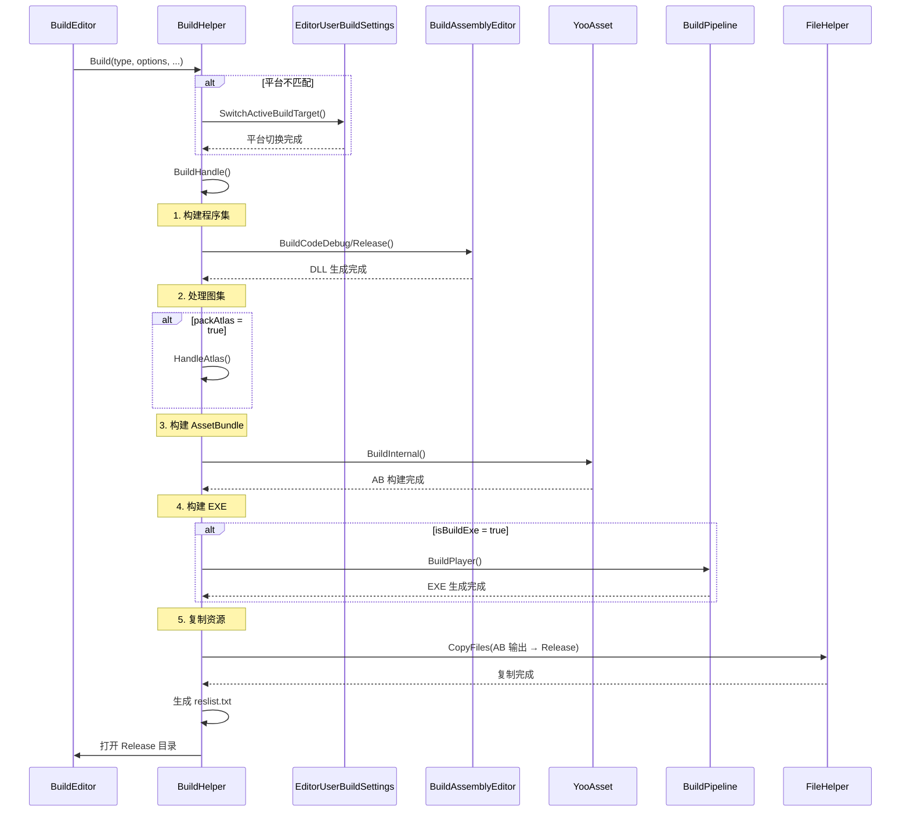
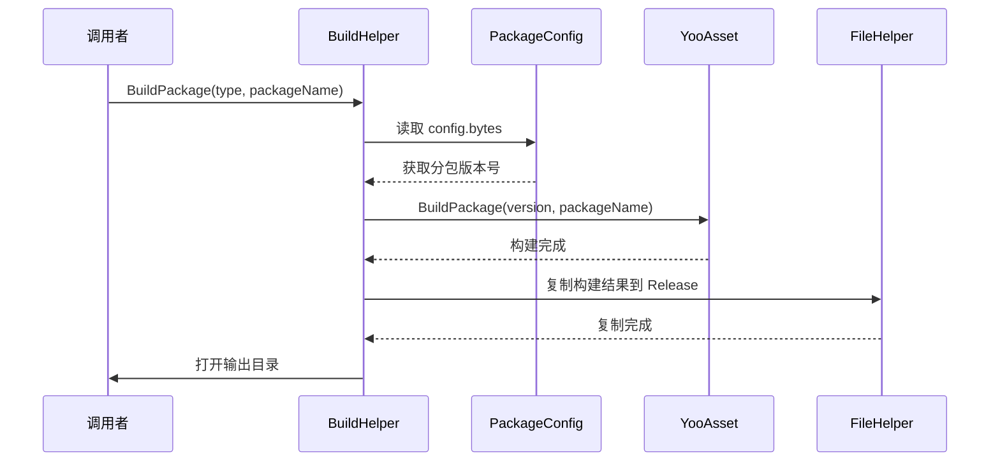

# BuildHelper.cs 注解文档

## 文件基本信息

| 属性 | 值 |
|------|-----|
| **文件名** | BuildHelper.cs |
| **路径** | Assets/Scripts/Editor/BuildEditor/BuildHelper.cs |
| **所属模块** | Editor 工具 → 构建编辑器 |
| **文件职责** | 游戏打包核心辅助工具，支持多平台构建、资源打包、分包管理 |
| **命名空间** | `TaoTie` |

---

## 类/结构体说明

### BuildHelper

| 属性 | 说明 |
|------|------|
| **职责** | 提供游戏打包的全流程辅助功能，包括平台切换、资源构建、EXE 打包、分包管理等 |
| **泛型参数** | 无 |
| **继承关系** | 静态工具类 |
| **实现的接口** | 无 |

**设计模式**: 工具类模式 + 外观模式 (Facade)

```csharp
// 静态工具类，封装复杂的构建流程
public static class BuildHelper
```

### PlatformType 枚举

| 平台 | 值 | BuildTarget |
|------|-----|-------------|
| `None` | 0 | - |
| `Android` | 1 | BuildTarget.Android |
| `IOS` | 2 | BuildTarget.iOS |
| `Windows` | 3 | BuildTarget.StandaloneWindows64 |
| `MacOS` | 4 | BuildTarget.StandaloneOSX |
| `Linux` | 5 | BuildTarget.StandaloneLinux64 |
| `WebGL` | 6 | BuildTarget.WebGL |

### BuildType 枚举

| 类型 | 值 | 说明 |
|------|-----|------|
| `Development` | 0 | 开发版本 (带调试信息) |
| `Release` | 1 | 发布版本 (优化后) |

### Mode 枚举

| 模式 | 值 | 说明 |
|------|-----|------|
| `本机开发` | 0 | 本地开发服务器 |
| `内网测试` | 1 | 内网测试 CDN |
| `外网测试` | 2 | 外网测试 CDN |
| `自定义服务器` | 3 | 自定义 CDN 地址 |

---

## 字段与属性

| 名称 | 类型 | 访问级别 | 说明 |
|------|------|----------|------|
| `programName` | `const string` | `private` | 程序名称 "jzxmh" |
| `buildAllChannel` | `HashSet<string>` | `private static` | 需要打全量首包的渠道列表 |
| `relativeDirPrefix` | `const string` | `private` | 输出目录前缀 "Release" |
| `ignoreFile` | `string[]` | `private static` | 打包时忽略的文件后缀 |
| `buildmap` | `Dictionary<PlatformType, BuildTarget>` | `public static` | 平台类型到 BuildTarget 的映射 |
| `buildGroupmap` | `Dictionary<PlatformType, BuildTargetGroup>` | `public static` | 平台类型到 BuildTargetGroup 的映射 |
| `cdnList` | `string[]` | `private static` | 正式 CDN 地址列表 |
| `cdnTestList` | `string[]` | `private static` | 测试 CDN 地址列表 |

---

## 方法说明

### Build (主构建方法)

**签名**:
```csharp
public static void Build(PlatformType type, BuildOptions buildOptions, bool isBuildExe, 
    bool clearReleaseFolder, bool clearABFolder, bool buildHotfixAssembliesAOT, 
    bool isBuildAll, bool packAtlas, bool isContainsAb, string channel, bool buildDll = true)
```

**职责**: 执行完整的游戏打包流程

**核心逻辑**:
```
1. 检查当前平台是否匹配目标平台
2. 如果不匹配，切换 BuildTarget
3. 调用 BuildHandle 执行构建
```

**参数说明**:
| 参数 | 类型 | 说明 |
|------|------|------|
| `type` | `PlatformType` | 目标平台 |
| `buildOptions` | `BuildOptions` | 构建选项 (Development/Release) |
| `isBuildExe` | `bool` | 是否打包可执行文件 |
| `clearReleaseFolder` | `bool` | 是否清理 Release 目录 |
| `clearABFolder` | `bool` | 是否清理 AssetBundle 缓存 |
| `buildHotfixAssembliesAOT` | `bool` | 热更代码是否打 AOT |
| `isBuildAll` | `bool` | 是否全量资源打包 |
| `packAtlas` | `bool` | 是否重新打图集 |
| `isContainsAb` | `bool` | 是否同时打分包资源 |
| `channel` | `string` | 渠道名称 |
| `buildDll` | `bool` | 是否构建 DLL |

---

### BuildPackage (分包构建)

**签名**:
```csharp
public static void BuildPackage(PlatformType type, string packageName)
```

**职责**: 构建指定分包的资源

**核心逻辑**:
```
1. 读取 PackageConfig 获取分包版本号
2. 调用 BuildPackage 执行 YooAsset 构建
3. 复制构建结果到 Release 目录
4. 打开输出目录
```

---

### SetCdnConfig

**签名**:
```csharp
public static void SetCdnConfig(string channel, bool buildHotfixAssembliesAOT, 
    int mode = 1, string cdnPath = "")
```

**职责**: 配置 CDN 地址和打包模式

**核心逻辑**:
```
1. 加载 CDNConfig 配置
2. 设置渠道名称和 AOT 选项
3. 根据 mode 选择预置 CDN 地址或使用自定义地址
4. 保存配置
```

---

### HandleAtlas

**签名**:
```csharp
public static void HandleAtlas()
```

**职责**: 处理图集资源

**核心逻辑**:
```
1. 清除旧图集 (AtlasHelper.ClearAllAtlas)
2. 设置图片导入配置 (AtlasHelper.SettingPNG)
3. 生成新图集 (AtlasHelper.GeneratingAtlas)
```

---

### CollectSVC

**签名**:
```csharp
public static void CollectSVC(Action<bool> callBack)
```

**职责**: 收集 Shader 变体

**核心逻辑**:
```
1. 运行 ShaderVariantCollector
2. 保存 Shader 变体集合到 .shadervariants 文件
3. 输出 Shader 数量和变体数量
4. 回调通知结果
```

---

## 核心流程

### 完整打包流程



### 分包构建流程



---

## 使用示例

### 基础打包

```csharp
// 打包 Windows 发布版本
BuildHelper.Build(
    PlatformType.Windows,
    BuildOptions.None,
    isBuildExe: true,
    clearReleaseFolder: true,
    clearABFolder: false,
    buildHotfixAssembliesAOT: true,
    isBuildAll: true,
    packAtlas: false,
    isContainsAb: false,
    channel: "official"
);
```

### 分包打包

```csharp
// 打包名为 "LevelPackage" 的分包
BuildHelper.BuildPackage(PlatformType.Android, "LevelPackage");
```

### 配置 CDN

```csharp
// 设置内网测试 CDN
BuildHelper.SetCdnConfig(
    channel: "test",
    buildHotfixAssembliesAOT: false,
    mode: (int)Mode.内网测试
);
```

---

## 技术要点

### YooAsset 资源构建

使用 YooAsset 进行 AssetBundle 构建：

```csharp
var buildParameters = new ScriptableBuildParameters();
buildParameters.BuildOutputRoot = buildoutputRoot;
buildParameters.BuildinFileRoot = streamingAssetsRoot;
buildParameters.BuildTarget = buildTarget;
buildParameters.PackageName = packageName;
buildParameters.PackageVersion = buildVersion.ToString();
// ... 更多配置

ScriptableBuildPipeline builder = new ScriptableBuildPipeline();
var buildResult = builder.Run(buildParameters, true);
```

### 平台切换

Unity 平台切换需要等待回调：

```csharp
if (buildmap[type] == EditorUserBuildSettings.activeBuildTarget)
{
    BuildHandle(...); // 当前平台直接构建
}
else
{
    EditorUserBuildSettings.activeBuildTargetChanged = delegate()
    {
        if (EditorUserBuildSettings.activeBuildTarget == buildmap[type])
        {
            BuildHandle(...); // 切换完成后构建
        }
    };
    EditorUserBuildSettings.SwitchActiveBuildTarget(group, buildmap[type]);
}
```

### 多渠道支持

通过 Scripting Define 符号区分不同小游戏平台：

```csharp
#if UNITY_WEBGL_TT
    // 抖音小游戏打包逻辑
    TTSDK.Tool.API.BuildManager.Build(TTSDK.Tool.Framework.Wasm);
#elif UNITY_WEBGL_WeChat
    // 微信小游戏打包逻辑
    WeChatWASM.WXConvertCore.DoExport();
#elif UNITY_WEBGL_KS
    // 快手小游戏打包逻辑
    KSWASM.editor.KSConvertCore.DoExport(configks);
#endif
```

---

## 注意事项

### ⚠️ 使用限制

| 问题 | 说明 | 解决方案 |
|------|------|----------|
| **平台切换时间** | 切换平台需要重新加载 Unity | 提前选择好目标平台 |
| **CDN 配置** | 依赖 CDNConfig 资源 | 确保配置存在且正确 |
| **分包版本** | 分包版本号来自 PackageConfig | 先更新 config.bytes |
| **WebGL 平台** | 各小游戏平台 SDK 不同 | 确保对应 Package 已安装 |

### 💡 最佳实践

```csharp
// ✅ 推荐：打包前清理缓存
if (clearBuildCache)
{
    FileHelper.CleanDirectory("Library/Bee");
    FileHelper.CleanDirectory("Library/BuildCache");
}

// ✅ 推荐：打包前收集 Shader 变体
BuildHelper.CollectSVC((res) =>
{
    if (res)
    {
        BuildHelper.Build(...);
    }
});

// ✅ 推荐：打包后生成资源列表
StringBuilder sb = new StringBuilder();
foreach (var file in Directory.GetFiles(targetPath))
{
    sb.AppendLine(Path.GetFileName(file));
}
File.WriteAllText(relativeDirPrefix + "/reslist.txt", sb.ToString());
```

---

## 相关文档

- [BuildEditor.cs.md](./BuildEditor.cs.md) - 打包工具 UI
- [BuildAssemblyEditor.cs.md](./BuildAssemblyEditor.cs.md) - 程序集构建
- [CDNConfig.cs.md](../../Mono/Module/YooAssets/CDNConfig.cs.md) - CDN 配置
- [PackageConfig.cs.md](../../Mono/Module/YooAssets/PackageConfig.cs.md) - 资源包配置
- [AtlasHelper.cs.md](../ArtEditor/Atlas/AtlasHelper.cs.md) - 图集工具

---

*文档生成时间：2026-03-02 | OpenClaw AI 助手*
