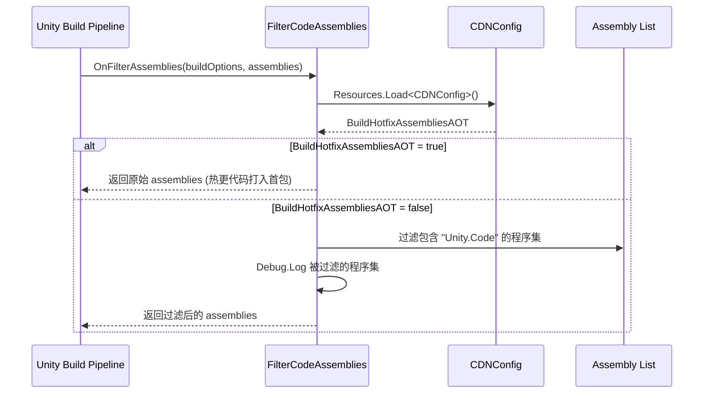

# FilterCodeAssemblies.cs 注解文档

## 文件基本信息

| 属性 | 值 |
|------|-----|
| **文件名** | FilterCodeAssemblies.cs |
| **路径** | Assets/Scripts/Editor/BuildEditor/FilterCodeAssemblies.cs |
| **所属模块** | Editor 工具 → 构建编辑器 |
| **文件职责** | 构建时程序集过滤器，控制热更 DLL 是否打入首包 |
| **命名空间** | `TaoTie` |

---

## 类/结构体说明

### FilterCodeAssemblies

| 属性 | 说明 |
|------|------|
| **职责** | 实现 Unity 的 `IFilterBuildAssemblies` 接口，在构建时过滤掉热更程序集 |
| **泛型参数** | 无 |
| **继承关系** | 实现 `IFilterBuildAssemblies` 接口 |
| **实现的接口** | `IFilterBuildAssemblies` |

**设计模式**: 构建过滤器模式

```csharp
// Unity 构建回调接口
internal class FilterCodeAssemblies : IFilterBuildAssemblies
```

---

## 字段与属性

| 名称 | 类型 | 访问级别 | 说明 |
|------|------|----------|------|
| `callbackOrder` | `int` | `public` | 回调顺序，值为 1，表示在构建流程中的执行优先级 |
| `buildHotfixAssembliesAOT` | `bool` | `local` | 是否将热更代码打入 AOT 首包（从 CDNConfig 读取） |

---

## 方法说明

### OnFilterAssemblies

**签名**:
```csharp
public string[] OnFilterBuildAssemblies(BuildOptions buildOptions, string[] assemblies)
```

**职责**: 在构建时过滤程序集列表，决定是否保留热更 DLL

**核心逻辑**:
```
1. 从 Resources 加载 CDNConfig 配置
2. 读取 BuildHotfixAssembliesAOT 配置项
3. 如果 BuildHotfixAssembliesAOT = true，返回原始程序集列表（不过滤）
4. 如果 BuildHotfixAssembliesAOT = false，过滤掉包含 "Unity.Code" 的程序集
5. 输出被过滤的程序集日志
```

**调用者**: Unity 构建管线自动调用

**参数说明**:
| 参数 | 类型 | 说明 |
|------|------|------|
| `buildOptions` | `BuildOptions` | 构建选项 |
| `assemblies` | `string[]` | 待构建的程序集路径列表 |

**返回值**: `string[]` - 过滤后的程序集路径列表

---

## 核心流程

### 程序集过滤流程



---

## 使用示例

### 配置场景

#### 场景 1: 首包优化模式 (推荐)

**配置**: `BuildHotfixAssembliesAOT = false`

**效果**: 热更 DLL 不打入首包，通过资源更新下发

**优点**: 
- 首包体积更小
- 支持热更新修复 bug

**适用**: 正式环境、需要热更的场景

#### 场景 2: AOT 全量模式

**配置**: `BuildHotfixAssembliesAOT = true`

**效果**: 热更 DLL 打入首包，首包运行速度最快

**优点**: 
- 首包运行性能最佳
- 无需等待热更下载

**缺点**: 
- 首包体积增大
- 无法热更修复代码

**适用**: WebGL 平台、测试环境、无需热更的场景

---

## 技术要点

### IFilterBuildAssemblies 接口

Unity 提供的构建时程序集过滤接口，允许在构建前修改程序集列表。

**接口定义**:
```csharp
public interface IFilterBuildAssemblies
{
    int callbackOrder { get; }
    string[] OnFilterBuildAssemblies(BuildOptions buildOptions, string[] assemblies);
}
```

**执行时机**: Unity 构建管线在编译程序集之前调用

### 热更程序集识别

通过程序集路径是否包含 `"Unity.Code"` 来识别热更程序集：

```csharp
string assName = Path.GetFileNameWithoutExtension(ass);
bool reserved = !ass.Contains("Unity.Code");
```

**注意**: 这里的 `"Unity.Code"` 是项目约定的热更程序集命名前缀，实际项目中可能不同。

---

## 注意事项

### ⚠️ 使用限制

| 问题 | 说明 | 解决方案 |
|------|------|----------|
| **配置依赖** | 依赖 CDNConfig 资源存在 | 确保 `Resources/CDNConfig.asset` 存在 |
| **过滤规则** | 硬编码 `"Unity.Code"` 前缀 | 根据项目实际命名调整 |
| **日志输出** | 过滤时会输出大量日志 | 正式打包前可注释 Debug.Log |

### 💡 最佳实践

```csharp
// ✅ 推荐：在 CDNConfig 中配置
public class CDNConfig : ScriptableObject
{
    [Tooltip("是否将热更代码打入首包")]
    public bool BuildHotfixAssembliesAOT = false;
}

// ✅ 根据平台自动选择
#if UNITY_WEBGL
    // WebGL 建议打入首包，避免热更加载问题
    buildHotfixAssembliesAOT = true;
#else
    // 移动端使用热更
    buildHotfixAssembliesAOT = false;
#endif

// ✅ 过滤前检查配置
var config = Resources.Load<CDNConfig>("CDNConfig");
if (config != null && config.BuildHotfixAssembliesAOT)
{
    return assemblies; // 不过滤
}
```

---

## 相关文档

- [CDNConfig.cs.md](../../Mono/Module/YooAssets/CDNConfig.cs.md) - CDN 配置类
- [BuildHelper.cs.md](./BuildHelper.cs.md) - 构建辅助工具
- [BuildAssemblyEditor.cs.md](./BuildAssemblyEditor.cs.md) - 程序集构建编辑器
- [BuildEditor.cs.md](./BuildEditor.cs.md) - 打包工具 UI

---

*文档生成时间：2026-03-02 | OpenClaw AI 助手*
