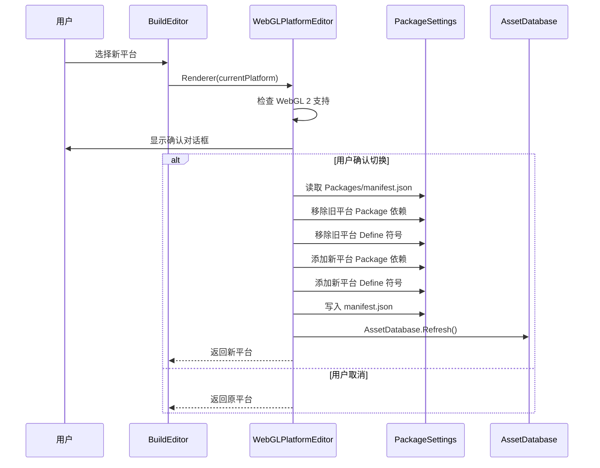
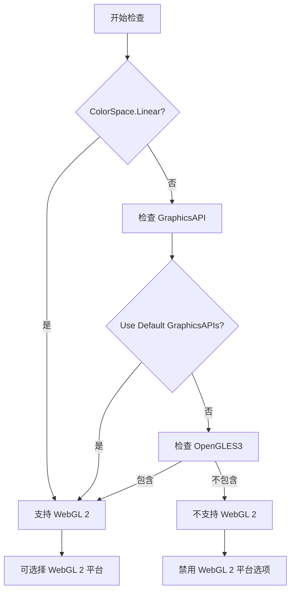

# WebGLPlatformEditor.cs 注解文档

## 文件基本信息

| 属性 | 值 |
|------|-----|
| **文件名** | WebGLPlatformEditor.cs |
| **路径** | Assets/Scripts/Editor/BuildEditor/WebGLPlatformEditor.cs |
| **所属模块** | Editor 工具 → 构建编辑器 |
| **文件职责** | WebGL 多平台适配工具，支持抖音/微信/快手等小游戏平台切换 |
| **命名空间** | `TaoTie` |

---

## 类/结构体说明

### WebGLPlatformEditor

| 属性 | 说明 |
|------|------|
| **职责** | 提供 WebGL 多平台配置管理，包括 Scripting Define、Package 依赖、WebGL 版本设置 |
| **泛型参数** | 无 |
| **继承关系** | 静态工具类 |
| **实现的接口** | 无 |

**设计模式**: 工具类模式 + 配置映射模式

```csharp
// 静态工具类，提供 WebGL 平台配置管理
public static class WebGLPlatformEditor
```

### WebGLPlatform 枚举

| 平台 | Define 符号 | Package 依赖 | WebGL 版本 |
|------|------------|-------------|-----------|
| `WebGL` | - | - | 2 |
| `TikTok` | UNITY_WEBGL_TT | com.bytedance.starksdk | 2 |
| `WeChat` | UNITY_WEBGL_WeChat | com.qq.weixin.minigame | 2 |
| `KuaiShou` | UNITY_WEBGL_KS | com.kuaishou.minigame | 1 |
| `Bilibili` | UNITY_WEBGL_BILIGAME | com.bilibili.minigame | 2 |
| `TapTap` | UNITY_WEBGL_TAPTAP | com.taptap.minigame | 2 |
| `AliPay` | UNITY_WEBGL_ALIPAY | com.alipay.alipaysdk | 1 |
| `QuickGame` | UNITY_WEBGL_QG | com.quickapp.qg | 2 |
| `MeiTuan` | UNITY_WEBGL_MEITUAN | - | 1 |
| `FaceBook` | UNITY_WEBGL_FACEBOOK | com.unity.meta-instant-games-sdk | 2 |
| `_4399` | UNITY_WEBGL_4399 | com.4399.h5game | 2 |
| `MiniHost` | UNITY_WEBGL_MINIHOST | cn.tuanjie.minihost | 2 |

---

## 字段与属性

| 名称 | 类型 | 访问级别 | 说明 |
|------|------|----------|------|
| `defineSetting` | `Dictionary<WebGLPlatform, string>` | `private static` | 平台与 Scripting Define 符号的映射 |
| `packageSetting` | `Dictionary<WebGLPlatform, string>` | `private static` | 平台与 Package 依赖的映射 |
| `webglVersionSetting` | `Dictionary<WebGLPlatform, int>` | `private static` | 平台与 WebGL 版本 (1/2) 的映射 |

---

## 方法说明

### GetCurrentWebGLPlatform

**签名**:
```csharp
public static WebGLPlatform GetCurrentWebGLPlatform()
```

**职责**: 根据当前项目的 Scripting Define 符号判断目标 WebGL 平台

**核心逻辑**:
```
1. 获取 BuildTargetGroup.WebGL 的 Scripting Define 符号
2. 遍历 defineSetting 字典
3. 如果 Define 符号包含某个平台的标记，返回该平台
4. 如果都没有匹配，返回 WebGLPlatform.WebGL (默认)
```

**调用者**: BuildEditor.OnEnable()

**返回值**: `WebGLPlatform` - 当前配置的平台

---

### Renderer

**签名**:
```csharp
public static WebGLPlatform Renderer(WebGLPlatform webGLPlatform)
```

**职责**: 在 Editor 中渲染平台选择下拉框，处理平台切换逻辑

**核心逻辑**:
```
1. 解析当前 Define 符号，确定当前平台
2. 绘制 EnumPopup 下拉框，显示平台选择
3. 根据平台配置禁用不支持 WebGL 2 的选项
4. 如果用户选择新平台:
   - 弹出确认对话框
   - 修改 Packages/manifest.json 添加对应 Package 依赖
   - 修改 Scripting Define 符号
   - 刷新资源数据库
```

**调用者**: BuildEditor.OnGUI()

**参数说明**:
| 参数 | 类型 | 说明 |
|------|------|------|
| `webGLPlatform` | `WebGLPlatform` | 当前选中的平台 |

**返回值**: `WebGLPlatform` - 用户最终选择的平台

---

## 核心流程

### 平台切换流程



### WebGL 2 支持检查



---

## 使用示例

### 在 BuildEditor 中使用

```csharp
// 在 OnEnable 中获取当前平台
webGLPlatform = WebGLPlatformEditor.GetCurrentWebGLPlatform();

// 在 OnGUI 中渲染平台选择
webGLPlatform = WebGLPlatformEditor.Renderer(webGLPlatform);
```

### 平台切换效果

**切换前** (WeChat):
```json
// Packages/manifest.json
{
  "dependencies": {
    "com.qq.weixin.minigame": "file:../Modules/com.qq.weixin.minigame"
  }
}
```
```
// Scripting Define Symbols
UNITY_WEBGL_WeChat;
```

**切换后** (TikTok):
```json
// Packages/manifest.json
{
  "dependencies": {
    "com.bytedance.starksdk": "file:../Modules/com.bytedance.starksdk"
  }
}
```
```
// Scripting Define Symbols
UNITY_WEBGL_TT;
```

---

## 技术要点

### Scripting Define Symbols

Unity 的预处理器宏定义，用于条件编译：

```csharp
#if UNITY_WEBGL_TT
    // 抖音小游戏专属代码
#elif UNITY_WEBGL_WeChat
    // 微信小游戏专属代码
#endif
```

### Package 依赖管理

各小游戏平台的 SDK 以 Unity Package 形式提供，通过修改 `Packages/manifest.json` 切换：

```json
{
  "dependencies": {
    "com.bytedance.starksdk": "file:../Modules/com.bytedance.starksdk"
  }
}
```

### WebGL 版本兼容性

不同平台对 WebGL 2 的支持不同：

| WebGL 版本 | 优势 | 支持平台 |
|-----------|------|---------|
| WebGL 1 | 兼容性最好 | 所有平台 |
| WebGL 2 | 性能更好，支持 Compute Shader | TikTok/WeChat/Bilibili/TapTap 等 |

---

## 注意事项

### ⚠️ 使用限制

| 问题 | 说明 | 解决方案 |
|------|------|----------|
| **Unity 重启** | 切换平台后需要重新聚焦 Unity | 对话框提示用户 |
| **Package 路径** | SDK Package 必须存在于 `../Modules/` 目录 | 确保 SDK 已下载 |
| **WebGL 2 支持** | 部分平台不支持 WebGL 2 | 根据 webglVersionSetting 禁用选项 |
| **ColorSpace** | Linear ColorSpace 需要 WebGL 2 | 自动检查并提示 |

### 💡 最佳实践

```csharp
// ✅ 推荐：在切换前检查依赖
if (!Directory.Exists($"../Modules/{package}"))
{
    Debug.LogError($"SDK Package 不存在：{package}");
    return;
}

// ✅ 推荐：备份 Define 符号
var backup = PlayerSettings.GetScriptingDefineSymbolsForGroup(BuildTargetGroup.WebGL);

// ✅ 推荐：清理残留 Define
definesString = definesString.Replace(";;", ";");
definesString = definesString.Trim(';');
```

---

## 相关文档

- [BuildEditor.cs.md](./BuildEditor.cs.md) - 打包工具 UI
- [BuildHelper.cs.md](./BuildHelper.cs.md) - 构建辅助工具
- [CDNConfig.cs.md](../../Mono/Module/YooAssets/CDNConfig.cs.md) - CDN 配置

---

*文档生成时间：2026-03-02 | OpenClaw AI 助手*
