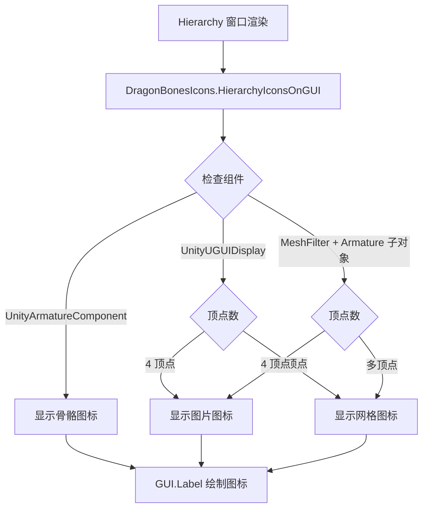

# DragonBonesIcons.cs 注解文档

## 文件基本信息

| 属性 | 值 |
|------|-----|
| **文件名** | DragonBonesIcons.cs |
| **路径** | Assets/Scripts/Editor/Common/DragonBones/DragonBonesIcons.cs |
| **所属模块** | Editor 工具 → Common → DragonBones |
| **文件职责** | 在 Hierarchy 窗口中为 DragonBones 对象显示自定义图标 |

---

## 类/结构体说明

### DragonBonesIcons

| 属性 | 说明 |
|------|------|
| **职责** | 在 Unity Hierarchy 窗口中为 DragonBones 相关组件显示自定义图标 |
| **泛型参数** | 无 |
| **继承关系** | `Editor` |
| **实现的接口** | 无 |

**设计模式**: 编辑器扩展 + 初始化加载

```csharp
// 编辑器启动时自动加载
[InitializeOnLoad]
public class DragonBonesIcons : Editor
{
    static DragonBonesIcons()
    {
        Initialize();
    }
}
```

---

## 字段与属性（按重要程度排序）

| 名称 | 类型 | 访问级别 | 说明 |
|------|------|----------|------|
| `textureArmature` | `Texture2D` | `static` | 骨骼 (Armature) 图标 |
| `textureImg` | `Texture2D` | `static` | 图片显示组件图标 |
| `textureMesh` | `Texture2D` | `static` | 网格 (Mesh) 显示组件图标 |
| `editorPath` | `string` | `static` | 编辑器脚本所在路径 |
| `editorGUIPath` | `string` | `static` | GUI 图标资源路径 |
| `isInited` | `bool` | `static` | 是否已初始化 |

---

## 方法说明（按重要程度排序）

### Initialize()

**签名**:
```csharp
static void Initialize()
```

**职责**: 初始化图标资源并注册 Hierarchy 窗口回调

**核心逻辑**:
```
1. 检查是否已初始化 (避免重复)
2. 搜索 DragonBonesIcons.cs 文件，确定编辑器路径
3. 加载图标资源:
   - icon-skeleton.png → 骨骼图标
   - icon-image.png → 图片图标
   - icon-mesh.png → 网格图标
4. 注册 HierarchyIconsOnGUI 回调
```

**调用者**: 静态构造函数 (类加载时自动调用)

**被调用者**: `AssetDatabase.LoadAssetAtPath<Texture2D>()`

---

### HierarchyIconsOnGUI()

**签名**:
```csharp
static void HierarchyIconsOnGUI(int instanceId, Rect selectionRect)
```

**职责**: 在 Hierarchy 窗口中为每个对象绘制图标

**核心逻辑**:
```
1. 根据 instanceId 获取 GameObject
2. 检查组件类型:
   - UnityArmatureComponent → 显示骨骼图标
   - UnityUGUIDisplay (4 顶点) → 显示图片图标
   - UnityUGUIDisplay (多顶点) → 显示网格图标
   - MeshFilter (在 Armature 下) → 显示图片/网格图标
3. 在对象名称右侧绘制图标
```

**参数**:
| 参数 | 类型 | 说明 |
|------|------|------|
| `instanceId` | `int` | 对象的实例 ID |
| `selectionRect` | `Rect` | 对象在 Hierarchy 中的选中区域 |

**调用者**: Unity Editor (Hierarchy 窗口渲染时自动调用)

---

## 图标显示逻辑



---

## 图标类型说明

| 图标 | 组件类型 | 说明 |
|------|---------|------|
| 🦴 骨骼图标 | `UnityArmatureComponent` | DragonBones 骨骼根节点 |
| 🖼️ 图片图标 | `UnityUGUIDisplay` (4 顶点) | 静态图片显示 |
| 🔷 网格图标 | `UnityUGUIDisplay` (多顶点) | 网格变形显示 |

---

## 使用示例

### 示例 1: 查看 Hierarchy 图标

```
// 在 Unity 中导入 DragonBones 资源后
// Hierarchy 窗口会自动显示:
//
// 🦴 Character (UnityArmatureComponent)
//   🖼️ body (UnityUGUIDisplay)
//   🔷 arm_left (UnityUGUIDisplay)
//   🔷 arm_right (UnityUGUIDisplay)
```

### 示例 2: 自定义图标

```csharp
// 替换图标资源
// 编辑 Assets/.../DragonBones/GUI/ 目录下的 PNG 文件:
// - icon-skeleton.png  → 骨骼图标
// - icon-image.png     → 图片图标
// - icon-mesh.png      → 网格图标
```

---

## 注意事项

### ⚠️ 图标路径

图标资源必须位于 `DragonBones/GUI/` 目录下，否则无法加载。

### ⚠️ 性能

HierarchyIconsOnGUI 每帧调用，避免在回调中进行耗时操作。

### ⚠️ 图标尺寸

图标绘制区域为 15x15 像素，建议使用此尺寸的图标资源。

---

## 相关文档

- [UnityArmatureEditor.cs.md](./UnityArmatureEditor.cs.md) - DragonBones 骨骼编辑器
- [UnityArmatureComponent](https://github.com/DragonBones/DragonBonesUNITY) - DragonBones Unity 运行时组件
- [InitializeOnLoad](https://docs.unity3d.com/ScriptReference/InitializeOnLoadAttribute.html) - Unity 初始化加载特性
- [EditorApplication.hierarchyWindowItemOnGUI](https://docs.unity3d.com/ScriptReference/EditorApplication-hierarchyWindowItemOnGUI.html) - Hierarchy 窗口渲染回调

---

*文档生成时间：2026-03-02 | OpenClaw AI 助手*
