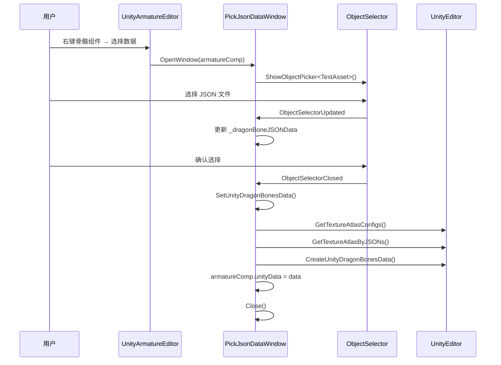

# PickJsonDataWindow.cs 注解文档

## 文件基本信息

| 属性 | 值 |
|------|-----|
| **文件名** | PickJsonDataWindow.cs |
| **路径** | Assets/Scripts/Editor/Common/DragonBones/PickJsonDataWindow.cs |
| **所属模块** | Editor 工具 → Common → DragonBones |
| **文件职责** | DragonBones 骨骼数据拾取窗口，为 UnityArmatureComponent 绑定骨骼数据 |

---

## 类/结构体说明

### PickJsonDataWindow

| 属性 | 说明 |
|------|------|
| **职责** | EditorWindow 窗口，用于选择 DragonBones 骨骼 JSON 数据并创建 UnityDragonBonesData |
| **泛型参数** | 无 |
| **继承关系** | `EditorWindow` |
| **实现的接口** | 无 |

**设计模式**: 编辑器窗口 + 对象选择器

```csharp
// 编辑器窗口
public class PickJsonDataWindow : EditorWindow
{
    // 打开窗口并选择 JSON 数据
    public static void OpenWindow(UnityArmatureComponent armatureComp) { ... }
}
```

---

## 字段与属性（按重要程度排序）

| 名称 | 类型 | 访问级别 | 说明 |
|------|------|----------|------|
| `_armatureComp` | `UnityArmatureComponent` | `private` | 目标骨骼组件 |
| `_dragonBoneJSONData` | `TextAsset` | `private` | 选中的 DragonBones JSON 数据 |
| `_isOpenPickWindow` | `bool` | `private` | 是否已打开对象选择器 |
| `_controlID` | `int` | `private` | 对象选择器控制 ID |

### 常量

| 名称 | 类型 | 值 | 说明 |
|------|------|-----|------|
| `ObjectSelectorUpdated` | `string` | `"ObjectSelectorUpdated"` | 对象选择器更新事件 |
| `ObjectSelectorClosed` | `string` | `"ObjectSelectorClosed"` | 对象选择器关闭事件 |
| `PickFileFileter` | `string` | `"t:TextAsset"` | 文件选择过滤器 (仅 TextAsset) |

---

## 方法说明（按重要程度排序）

### OpenWindow()

**签名**:
```csharp
public static void OpenWindow(UnityArmatureComponent armatureComp)
```

**职责**: 打开拾取窗口，为指定骨骼组件选择 JSON 数据

**核心逻辑**:
```
1. 检查 armatureComp 是否为 null
2. 获取 PickJsonDataWindow 窗口实例
3. 设置目标组件 _armatureComp
4. 窗口自动显示
```

**参数**:
| 参数 | 类型 | 说明 |
|------|------|------|
| `armatureComp` | `UnityArmatureComponent` | 要绑定数据的骨骼组件 |

**调用者**: `UnityArmatureEditor` (通过右键菜单)

---

### OnGUI()

**签名**:
```csharp
private void OnGUI()
```

**职责**: 窗口 GUI 渲染和事件处理

**核心逻辑**:
```
1. 调用 ShowPickJsonWindow() 显示对象选择器
2. 监听事件:
   - ObjectSelectorUpdated → 更新选中的 JSON 数据
   - ObjectSelectorClosed → 创建 UnityDragonBonesData 并绑定
3. 关闭窗口
```

**调用者**: Unity Editor (窗口渲染时自动调用)

**被调用者**: `ShowPickJsonWindow()`, `SetUnityDragonBonesData()`

---

### ShowPickJsonWindow()

**签名**:
```csharp
private void ShowPickJsonWindow()
```

**职责**: 显示 Unity 对象选择器，让用户选择 TextAsset

**核心逻辑**:
```
1. 检查是否已打开 (避免重复)
2. 获取控制 ID
3. 调用 EditorGUIUtility.ShowObjectPicker<TextAsset>()
4. 过滤器：仅显示 TextAsset 类型
```

**调用者**: `OnGUI()`

---

### SetUnityDragonBonesData()

**签名**:
```csharp
private void SetUnityDragonBonesData()
```

**职责**: 根据选中的 JSON 数据创建 UnityDragonBonesData 并绑定到骨骼组件

**核心逻辑**:
```
1. 获取纹理图集配置路径列表
2. 调用 UnityEditor.GetTextureAtlasByJSONs() 加载图集
3. 调用 UnityEditor.CreateUnityDragonBonesData() 创建数据
4. 设置 _armatureComp.unityData
```

**调用者**: `OnGUI()` (对象选择器关闭时)

**被调用者**: 
- `UnityEditor.GetTextureAtlasConfigs()`
- `UnityEditor.GetTextureAtlasByJSONs()`
- `UnityEditor.CreateUnityDragonBonesData()`

---

### OnDestroy()

**签名**:
```csharp
private void OnDestroy()
```

**职责**: 窗口销毁时清理引用

**核心逻辑**:
```
1. 清空 _armatureComp 引用
2. 清空 _dragonBoneJSONData 引用
3. 重置状态标志
```

**调用者**: Unity Editor (窗口关闭时自动调用)

---

### Awake()

**签名**:
```csharp
private void Awake()
```

**职责**: 窗口初始化

**核心逻辑**:
```
1. 重置所有字段
2. 设置窗口大小为固定尺寸 (maxSize = minSize = Vector2.one)
```

**调用者**: Unity Editor (窗口创建时自动调用)

---

## 工作流程



---

## 使用示例

### 示例 1: 为骨骼组件绑定数据

```csharp
// 1. 在 Hierarchy 中选中 DragonBones 骨骼对象
// 2. 在 Inspector 中找到 UnityArmatureComponent
// 3. 点击 "Pick JSON Data" 按钮
// 4. 在弹出的窗口中选择 _ske.json 文件
// 5. 自动创建 UnityDragonBonesData 并绑定
```

### 示例 2: 代码方式打开窗口

```csharp
// 获取骨骼组件
var armatureComp = GetComponent<UnityArmatureComponent>();

// 打开拾取窗口
PickJsonDataWindow.OpenWindow(armatureComp);
```

---

## 注意事项

### ⚠️ JSON 数据格式

选择的 JSON 文件必须是有效的 DragonBones 骨骼数据格式，包含 `armature` 字段。

### ⚠️ 纹理图集依赖

骨骼数据依赖的纹理图集 (_tex.json 和 .png) 必须与骨骼数据在同一目录下。

### ⚠️ 窗口大小

窗口大小固定为 400x200 像素，无法调整。

---

## 相关文档

- [UnityArmatureEditor.cs.md](./UnityArmatureEditor.cs.md) - DragonBones 骨骼编辑器
- [ShowSlotsWindow.cs.md](./ShowSlotsWindow.cs.md) - 插槽显示窗口
- [UnityDragonBonesData](https://github.com/DragonBones/DragonBonesUNITY) - DragonBones Unity 数据类

---

*文档生成时间：2026-03-02 | OpenClaw AI 助手*
