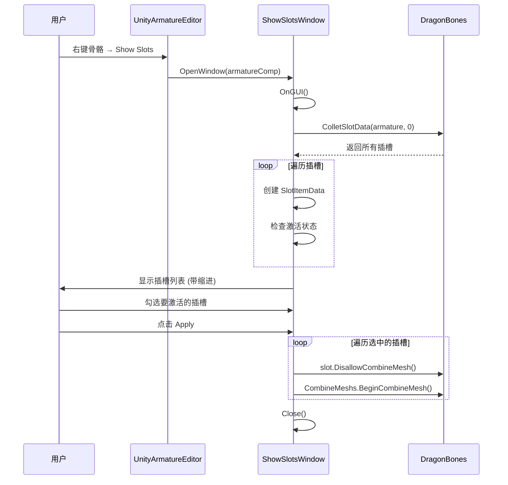

# ShowSlotsWindow.cs 注解文档

## 文件基本信息

| 属性 | 值 |
|------|-----|
| **文件名** | ShowSlotsWindow.cs |
| **路径** | Assets/Scripts/Editor/Common/DragonBones/ShowSlotsWindow.cs |
| **所属模块** | Editor 工具 → Common → DragonBones |
| **文件职责** | 显示 DragonBones 骨骼的所有插槽 (Slot) 列表，支持批量激活/禁用 |

---

## 类/结构体说明

### ShowSlotsWindow

| 属性 | 说明 |
|------|------|
| **职责** | EditorWindow 窗口，显示骨骼的所有插槽列表，支持批量管理插槽的激活状态 |
| **泛型参数** | 无 |
| **继承关系** | `EditorWindow` |
| **实现的接口** | 无 |

**设计模式**: 编辑器窗口 + 列表管理

```csharp
// 编辑器窗口
public class ShowSlotsWindow : EditorWindow
{
    // 打开窗口显示插槽列表
    public static void OpenWindow(UnityArmatureComponent armatureComp) { ... }
}
```

### SlotItemData

| 属性 | 说明 |
|------|------|
| **职责** | 插槽列表项数据 |
| **字段** | `slot` (插槽对象), `sumLevel` (层级深度), `isSelected` (是否选中) |

**结构**:
```csharp
[System.Serializable]
public class SlotItemData
{
    public UnitySlot slot;      // 插槽对象
    public int sumLevel;        // 层级深度 (用于缩进显示)
    public bool isSelected;     // 是否激活
}
```

---

## 字段与属性（按重要程度排序）

| 名称 | 类型 | 访问级别 | 说明 |
|------|------|----------|------|
| `_slotItems` | `List<SlotItemData>` | `private readonly` | 插槽列表数据 |
| `_armatureComp` | `UnityArmatureComponent` | `private` | 目标骨骼组件 |
| `_scrollPos` | `Vector2` | `private` | 滚动视图位置 |
| `WIDTH` | `float` | `private const` | 窗口宽度 (400) |
| `HEIGHT` | `float` | `private const` | 窗口高度 (200) |

---

## 方法说明（按重要程度排序）

### OpenWindow()

**签名**:
```csharp
public static void OpenWindow(UnityArmatureComponent armatureComp)
```

**职责**: 打开插槽列表窗口

**核心逻辑**:
```
1. 检查 armatureComp 是否为 null
2. 创建固定尺寸的窗口 (400x200)
3. 设置窗口标题为 "SlotList"
4. 设置目标组件
```

**参数**:
| 参数 | 类型 | 说明 |
|------|------|------|
| `armatureComp` | `UnityArmatureComponent` | 目标骨骼组件 |

**调用者**: `UnityArmatureEditor` (通过右键菜单)

---

### ColletSlotData()

**签名**:
```csharp
void ColletSlotData(Armature armature, int sumLevel)
```

**职责**: 递归收集骨骼的所有插槽数据

**核心逻辑**:
```
1. 获取当前 Armature 的所有插槽
2. 遍历每个插槽:
   - 创建 SlotItemData
   - 记录层级深度 sumLevel
   - 检查是否已激活 (isIgnoreCombineMesh 或 renderDisplay.activeSelf)
   - 加入 _slotItems 列表
3. 如果插槽有子骨骼 (childArmature)，递归收集
```

**参数**:
| 参数 | 类型 | 说明 |
|------|------|------|
| `armature` | `Armature` | 当前骨骼 |
| `sumLevel` | `int` | 当前层级深度 |

**调用者**: `OnGUI()` (首次渲染时)

---

### OnGUI()

**签名**:
```csharp
void OnGUI()
```

**职责**: 窗口 GUI 渲染

**核心逻辑**:
```
1. 如果 _slotItems 为空，调用 ColletSlotData() 收集数据
2. 调用 ShowSlots() 显示插槽列表
3. 显示 "Apply" 按钮:
   - 遍历所有选中的插槽
   - 调用 slot.DisallowCombineMesh()
   - 重新合并网格 (CombineMeshs)
4. 关闭窗口
```

**调用者**: Unity Editor (窗口渲染时自动调用)

**被调用者**: `ColletSlotData()`, `ShowSlots()`

---

### ShowSlots()

**签名**:
```csharp
void ShowSlots(Armature armature)
```

**职责**: 在窗口中显示插槽列表 (带层级缩进)

**核心逻辑**:
```
1. 创建滚动视图
2. 遍历 _slotItems:
   - 根据 sumLevel 计算缩进
   - 显示插槽名称
   - 如果未激活，显示 Toggle 开关
   - 如果已激活，显示 "Activated" 标签
3. 结束滚动视图
```

**参数**:
| 参数 | 类型 | 说明 |
|------|------|------|
| `armature` | `Armature` | 骨骼对象 (未直接使用) |

**调用者**: `OnGUI()`

---

## 插槽管理流程



---

## 使用示例

### 示例 1: 查看和管理插槽

```csharp
// 1. 在 Hierarchy 中选中 DragonBones 骨骼对象
// 2. 在 Inspector 中右键 UnityArmatureComponent
// 3. 选择 "Show Slots"
// 4. 窗口显示所有插槽列表:
//
// SlotList
// ┌────────────────────────────┐
// │ body                       │
// │   arm_left          [✓] Active │
// │   arm_right         [✓] Active │
// │   head                     │
// │     hair            [ ] Active │
// │     face            [✓] Active │
// └────────────────────────────┘
//            [ Apply ]
```

### 示例 2: 代码方式打开窗口

```csharp
// 获取骨骼组件
var armatureComp = GetComponent<UnityArmatureComponent>();

// 打开插槽列表窗口
ShowSlotsWindow.OpenWindow(armatureComp);
```

---

## 插槽层级显示

```
根骨骼 (Level 0)
├─ body (Level 0)
│  ├─ arm_left (Level 1)
│  ├─ arm_right (Level 1)
│  └─ head (Level 0)
│     ├─ hair (Level 1)
│     └─ face (Level 1)
```

在窗口中显示为 (带缩进):
```
body
  arm_left          [✓] Active
  arm_right         [✓] Active
  head
    hair            [ ] Active
    face            [✓] Active
```

---

## 注意事项

### ⚠️ 网格合并

禁用插槽的网格合并 (`DisallowCombineMesh`) 会增加 DrawCall，但允许单独控制插槽。

### ⚠️ 性能

大量插槽时，窗口渲染可能较慢，建议仅管理必要的插槽。

### ⚠️ 窗口尺寸

窗口固定为 400x200 像素，插槽较多时需要滚动查看。

---

## 相关文档

- [UnityArmatureEditor.cs.md](./UnityArmatureEditor.cs.md) - DragonBones 骨骼编辑器
- [PickJsonDataWindow.cs.md](./PickJsonDataWindow.cs.md) - 骨骼数据拾取窗口
- [UnitySlot](https://github.com/DragonBones/DragonBonesUNITY) - DragonBones 插槽类

---

*文档生成时间：2026-03-02 | OpenClaw AI 助手*
