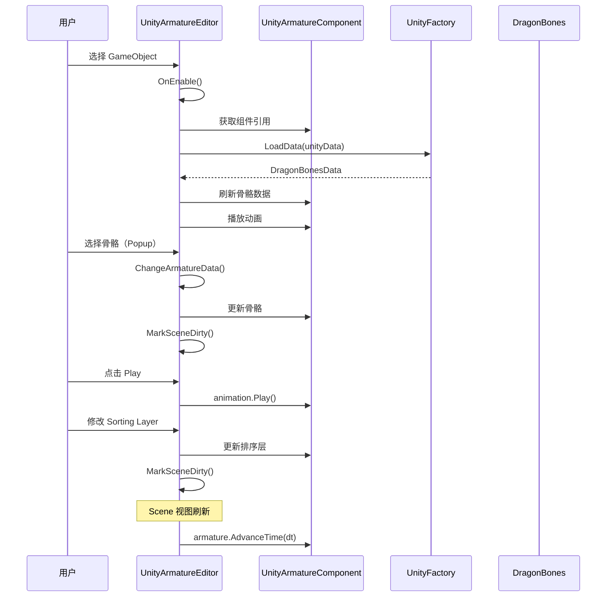
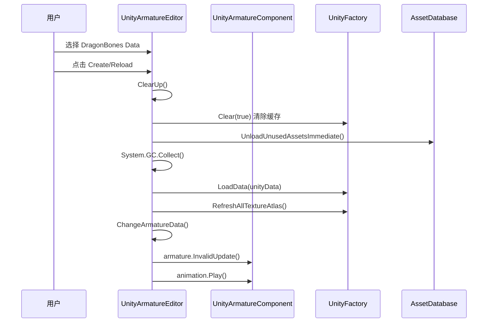

# UnityArmatureEditor.cs 注解文档

## 文件基本信息

| 属性 | 值 |
|------|-----|
| **文件名** | UnityArmatureEditor.cs |
| **路径** | Assets/Scripts/Editor/Common/DragonBones/UnityArmatureEditor.cs |
| **所属模块** | Editor 工具 → DragonBones 骨骼动画编辑器 |
| **文件职责** | UnityArmatureComponent 的自定义 Inspector 编辑器，提供 DragonBones 骨骼动画的可视化配置 |

---

## 类/结构体说明

### UnityArmatureEditor

| 属性 | 说明 |
|------|------|
| **职责** | 为 UnityArmatureComponent 提供自定义 Inspector 界面，支持骨骼数据加载、动画播放控制、排序设置等 |
| **泛型参数** | 无 |
| **继承关系** | 继承自 `UnityEditor.Editor` |
| **特性标记** | `[CustomEditor(typeof(UnityArmatureComponent))]` |

**设计模式**: 编辑器模式 + 状态缓存

```csharp
// 编辑器绑定
[CustomEditor(typeof(UnityArmatureComponent))]
public class UnityArmatureEditor : Editor
{
    // 通过 target 获取被编辑的组件
    private UnityArmatureComponent _armatureComponent = null;
}
```

---

## 字段与属性（按重要程度排序）

| 名称 | 类型 | 访问级别 | 说明 |
|------|------|----------|------|
| `_armatureComponent` | `UnityArmatureComponent` | `private` | 被编辑的骨骼动画组件引用 |
| `_armatureIndex` | `int` | `private` | 当前选择的骨骼索引（缓存） |
| `_animationIndex` | `int` | `private` | 当前选择的动画索引（缓存） |
| `_armatureNames` | `List<string>` | `private` | 可用骨骼名称列表 |
| `_animationNames` | `List<string>` | `private` | 可用动画名称列表 |
| `_sortingLayerNames` | `List<string>` | `private` | 排序层名称列表 |
| `_playTimesPro` | `SerializedProperty` | `private` | 播放次数序列化属性 |
| `_timeScalePro` | `SerializedProperty` | `private` | 时间缩放序列化属性 |
| `_flipXPro` | `SerializedProperty` | `private` | X 轴翻转序列化属性 |
| `_flipYPro` | `SerializedProperty` | `private` | Y 轴翻转序列化属性 |
| `_closeCombineMeshsPro` | `SerializedProperty` | `private` | 关闭合并网格序列化属性 |
| `_nowTime` | `long` | `private` | 场景刷新时间戳 |
| `_frameRate` | `float` | `private` | 帧率间隔（默认 1/24 秒） |

---

## 方法说明（按重要程度排序）

### OnEnable()

**签名**:
```csharp
void OnEnable()
```

**职责**: 编辑器启用时初始化，加载骨骼数据和参数

**核心逻辑**:
```
1. 获取 target 作为 UnityArmatureComponent
2. 检查是否为 Prefab（是则跳过）
3. 初始化排序层名称列表
4. 获取序列化属性引用
5. 如果非播放模式且骨骼为空：
   - 清除缓存
   - 卸载未使用资源
   - 加载 DragonBones 数据
   - 刷新纹理图集
   - 刷新骨骼数据
   - 播放动画（如果有）
6. 更新 hideFlags 设置
7. 调用 _UpdateParameters() 更新参数
```

**调用者**: Unity 编辑器（Inspector 打开时）

---

### OnInspectorGUI()

**签名**:
```csharp
public override void OnInspectorGUI()
```

**职责**: 绘制自定义 Inspector 界面

**核心逻辑**:
```
1. 检查 Prefab（是则返回）
2. 绘制 DragonBones Data 字段（ObjectField）
3. 绘制 Create/Reload/JSON 按钮
4. 如果骨骼存在：
   - 绘制骨骼选择下拉框（Popup）
   - 绘制动画选择下拉框
   - 绘制播放/停止按钮
   - 绘制播放次数字段
   - 绘制时间缩放字段
   - 绘制排序模式/层/顺序（非 UGUI 模式）
   - 绘制 Z Space 滑块
   - 绘制 X/Y 翻转开关
   - 绘制 CloseCombineMeshs 开关
   - 绘制 Show Slots 按钮
5. 应用修改的序列化属性
```

**界面布局**:
```
┌────────────────────────────────────┐
│ DragonBones Data: [ObjectField]    │
│ [Create] [Reload] [JSON]           │
├────────────────────────────────────┤
│ Armature: [Dropdown▼]              │
│ Animation: [Dropdown▼] [Play/Stop] │
│ Play Times: [IntField]             │
│ Time Scale: [FloatField]           │
├────────────────────────────────────┤
│ Sorting Mode: [Dropdown▼]          │
│ Sorting Layer: [Dropdown▼]         │
│ Order in Layer: [IntField]         │
│ Z Space: [Slider 0.0 ───●─── 0.5]  │
├────────────────────────────────────┤
│ Flip: [X☐] [Y☐]                    │
├────────────────────────────────────┤
│ ☐ CloseCombineMeshs                │
│ [Show Slots]                       │
└────────────────────────────────────┘
```

**调用者**: Unity 编辑器（Inspector 每帧刷新）

---

### OnSceneGUI()

**签名**:
```csharp
void OnSceneGUI()
```

**职责**: 场景视图刷新，驱动骨骼动画时间推进

**核心逻辑**:
```
1. 检查非播放模式且骨骼存在
2. 计算时间增量 dt = (当前时间 - _nowTime) * 0.0000001
3. 如果 dt >= _frameRate:
   - 调用 armature.AdvanceTime(dt) 推进时间
   - 遍历所有插槽，推进子骨骼时间
   - 更新 _nowTime
```

**调用者**: Unity 编辑器（Scene 视图每帧）

---

### _UpdateParameters()

**签名**:
```csharp
private void _UpdateParameters()
```

**职责**: 更新骨骼和动画参数缓存

**核心逻辑**:
```
1. 如果骨骼存在：
   - 设置 _frameRate = 1.0f / armatureData.frameRate
   - 获取所有骨骼名称列表
   - 获取所有动画名称列表
   - 查找当前骨骼索引
   - 查找当前动画索引
2. 否则：清空所有列表和索引
```

**调用者**: OnEnable(), OnInspectorGUI()（创建/重载数据后）

---

### ClearUp()

**签名**:
```csharp
void ClearUp()
```

**职责**: 清除缓存的索引和列表

**核心逻辑**:
```
1. 重置 _armatureIndex = -1
2. 重置 _animationIndex = -1
3. 清空 _armatureNames
4. 清空 _animationNames
```

**调用者**: 创建/重载 DragonBones 数据后

---

### _IsPrefab()

**签名**:
```csharp
private bool _IsPrefab()
```

**职责**: 检查当前对象是否为 Prefab

**核心逻辑**:
```
1. 检查 PrefabUtility.GetPrefabParent() == null
2. 检查 PrefabUtility.GetPrefabObject() != null
3. 两者同时满足则为 Prefab
```

**调用者**: OnEnable(), OnInspectorGUI()

---

### _GetSortingLayerNames()

**签名**:
```csharp
private List<string> _GetSortingLayerNames()
```

**职责**: 通过反射获取 Unity 的排序层名称列表

**核心逻辑**:
```
1. 获取 InternalEditorUtility 类型
2. 通过反射获取 sortingLayerNames 属性（非公开静态）
3. 转换为 List<string> 返回
```

**调用者**: OnEnable()

---

### MarkSceneDirty()

**签名**:
```csharp
private void MarkSceneDirty()
```

**职责**: 标记场景和对象为脏，触发保存

**核心逻辑**:
```
1. 调用 EditorUtility.SetDirty(_armatureComponent)
2. 如果非播放模式且非 Prefab：
   - 调用 EditorSceneManager.MarkSceneDirty()
```

**调用者**: 任何修改骨骼参数的操作后

---

## 核心流程

### Inspector 界面操作流程



### 数据加载流程



---

## 使用示例

### 示例 1: 在 Inspector 中配置骨骼

```csharp
// 在 Unity 编辑器中：
// 1. 选择带有 UnityArmatureComponent 的 GameObject
// 2. Inspector 显示自定义编辑器界面
// 3. 拖拽 DragonBones Data 到字段
// 4. 点击 Create 按钮创建骨骼
// 5. 从下拉框选择骨骼和动画
// 6. 点击 Play 预览动画
```

### 示例 2: 通过 JSON 创建骨骼

```csharp
// 在 Inspector 中：
// 1. 不拖拽 Data，直接点击 JSON 按钮
// 2. 弹出 PickJsonDataWindow 窗口
// 3. 选择 DragonBones JSON 文件
// 4. 自动创建 UnityDragonBonesData 并加载
```

### 示例 3: 调整排序和渲染

```csharp
// 在 Inspector 中：
// 1. Sorting Mode: 选择 SortByZ 或 SortByOrder
// 2. Sorting Layer: 选择渲染层级（如 Default, UI, Effect）
// 3. Order in Layer: 设置同层内的渲染顺序
// 4. Z Space: 调整 Z 轴间距（0.0-0.5）
```

---

## 相关文档

- [UnityEditor.cs.md](./UnityEditor.cs.md) - DragonBones 菜单和工具函数
- [PickJsonDataWindow.cs.md](../DragonBones/PickJsonDataWindow.cs.md) - JSON 数据选择窗口
- [ShowSlotsWindow.cs.md](../DragonBones/ShowSlotsWindow.cs.md) - 插槽显示窗口
- [UnityArmatureComponent](../../../ThirdParty/DragonBones/) - DragonBones Unity 运行时组件（第三方库）

---

*文档生成时间：2026-03-03 | OpenClaw AI 助手*
