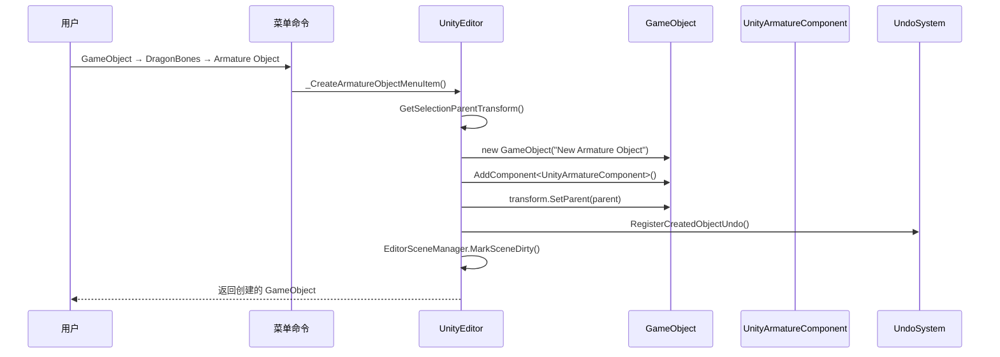
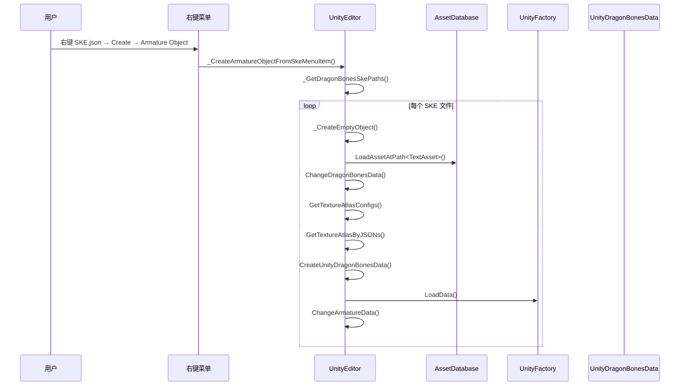
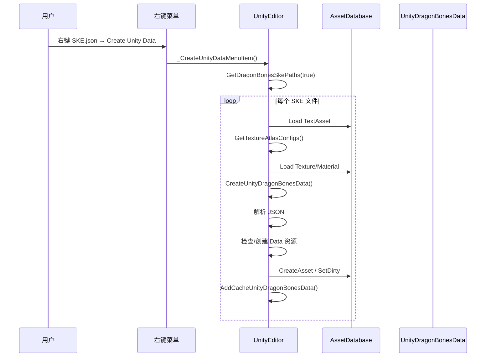

# UnityEditor.cs 注解文档

## 文件基本信息

| 属性 | 值 |
|------|-----|
| **文件名** | UnityEditor.cs |
| **路径** | Assets/Scripts/Editor/Common/DragonBones/UnityEditor.cs |
| **所属模块** | Editor 工具 → DragonBones 骨骼动画编辑器 |
| **文件职责** | DragonBones 骨骼动画的菜单命令和资源管理工具类 |

---

## 类/结构体说明

### UnityEditor

| 属性 | 说明 |
|------|------|
| **职责** | 提供 DragonBones 骨骼动画的创建、数据加载、资源管理等静态工具方法 |
| **泛型参数** | 无 |
| **继承关系** | 无继承（静态工具类） |
| **命名空间** | `DragonBones` |

**设计模式**: 工具类模式 + 菜单命令

```csharp
// 静态工具类，所有方法都是静态的
public class UnityEditor
{
    // 通过菜单命令创建骨骼对象
    [MenuItem("GameObject/DragonBones/Armature Object", false, 10)]
    private static void _CreateArmatureObjectMenuItem() { ... }
}
```

---

## 字段与属性

该类为静态工具类，无私有字段。

---

## 方法说明（按重要程度排序）

### _CreateArmatureObjectMenuItem()

**签名**:
```csharp
[MenuItem("GameObject/DragonBones/Armature Object", false, 10)]
private static void _CreateArmatureObjectMenuItem()
```

**职责**: 创建空的骨骼动画 GameObject

**核心逻辑**:
```
1. 获取当前选中对象的 Transform 作为父节点
2. 调用 _CreateEmptyObject(parentTransform)
3. 创建名为 "New Armature Object" 的 GameObject
4. 添加 UnityArmatureComponent 组件
5. 设置为选中对象
```

**调用者**: Unity 菜单（GameObject → DragonBones → Armature Object）

---

### _CreateArmatureObjectFromSkeMenuItem()

**签名**:
```csharp
[MenuItem("Assets/Create/DragonBones/Armature Object", false, 10)]
private static void _CreateArmatureObjectFromSkeMenuItem()
```

**职责**: 从选中的 DragonBones JSON/SKE 文件创建骨骼对象

**核心逻辑**:
```
1. 获取所有选中的 DragonBones SKE 路径
2. 遍历每个路径：
   - 创建空骨骼对象
   - 加载 JSON 文件为 TextAsset
   - 调用 ChangeDragonBonesData() 绑定数据
```

**调用者**: Unity 菜单（右键 JSON 文件 → Create → DragonBones → Armature Object）

---

### _CreateUGUIArmatureObjectMenuItem()

**签名**:
```csharp
[MenuItem("GameObject/DragonBones/Armature Object(UGUI)", false, 11)]
private static void _CreateUGUIArmatureObjectMenuItem()
```

**职责**: 创建 UGUI 模式的骨骼动画对象

**核心逻辑**:
```
1. 创建空骨骼对象
2. 设置 isUGUI = true
3. 查找 Canvas 父节点（如果存在则挂载到 Canvas 下）
4. 设置缩放为 (100, 100, 100)
5. 设置位置为 (0, 0, 0)
```

**调用者**: Unity 菜单（GameObject → DragonBones → Armature Object(UGUI)）

---

### _CreateUnityDataMenuItem()

**签名**:
```csharp
[MenuItem("Assets/Create/DragonBones/Create Unity Data", false, 32)]
private static void _CreateUnityDataMenuItem()
```

**职责**: 从选中的 DragonBones JSON 文件创建 UnityDragonBonesData 资源

**核心逻辑**:
```
1. 获取所有选中的 SKE 路径
2. 遍历每个路径：
   - 加载 JSON 文件
   - 查找关联的纹理图集 JSON 文件
   - 加载纹理、材质等资源
   - 调用 CreateUnityDragonBonesData() 创建资源
```

**调用者**: Unity 菜单（右键 JSON 文件 → Create → DragonBones → Create Unity Data）

**资源结构**:
```
MyCharacter_ske.json      ← 骨骼数据
MyCharacter_tex.json      ← 纹理图集数据
MyCharacter_tex.png       ← 纹理图片
MyCharacter_tex_Mat.mat   ← 材质（Renderer）
MyCharacter_tex_UI_Mat.mat ← 材质（UGUI）
MyCharacter_Data.asset    ← 生成的 Unity 资源
```

---

### ChangeDragonBonesData()

**签名**:
```csharp
public static bool ChangeDragonBonesData(
    UnityArmatureComponent _armatureComponent, 
    TextAsset dragonBoneJSON)
```

**职责**: 更改骨骼组件的 DragonBones 数据

**参数**:
| 参数 | 类型 | 说明 |
|------|------|------|
| `_armatureComponent` | `UnityArmatureComponent` | 目标骨骼组件 |
| `dragonBoneJSON` | `TextAsset` | DragonBones JSON 文件 |

**返回值**: `bool` - 是否成功

**核心逻辑**:
```
1. 如果 JSON 不为空：
   - 查找关联的纹理图集配置
   - 加载纹理图集资源
   - 创建/获取 UnityDragonBonesData
   - 调用 Factory.LoadData() 加载数据
   - 如果成功：
     * 设置 _armatureComponent.unityData
     * 调用 ChangeArmatureData() 切换骨骼
     * 标记为脏
     * 返回 true
   - 如果失败：显示错误对话框，返回 false
2. 如果 JSON 为空但已有数据：
   - 清空 unityData
   - 销毁现有骨骼
   - 返回 true
3. 否则返回 false
```

**调用者**: UnityArmatureEditor, _CreateArmatureObjectFromSkeMenuItem()

---

### ChangeArmatureData()

**签名**:
```csharp
public static void ChangeArmatureData(
    UnityArmatureComponent _armatureComponent, 
    string armatureName, 
    string dragonBonesName)
```

**职责**: 切换骨骼组件使用的骨骼数据

**参数**:
| 参数 | 类型 | 说明 |
|------|------|------|
| `_armatureComponent` | `UnityArmatureComponent` | 目标骨骼组件 |
| `armatureName` | `string` | 骨骼名称 |
| `dragonBonesName` | `string` | DragonBones 数据名称 |

**核心逻辑**:
```
1. 保存当前 isUGUI 和 unityData 引用
2. 如果已有骨骼：
   - 保存 slot 引用（用于子骨骼）
   - 销毁现有骨骼
   - 推进工厂时间（清理）
3. 设置 armatureName 和 isUGUI
4. 调用 Factory.BuildArmatureComponent() 构建新骨骼
5. 如果有 slot，设置为子骨骼
6. 更新排序层和顺序
```

**调用者**: ChangeDragonBonesData(), UnityArmatureEditor

---

### GetTextureAtlasConfigs()

**签名**:
```csharp
public static void GetTextureAtlasConfigs(
    List<string> textureAtlasFiles, 
    string filePath, 
    string rawName = null, 
    string suffix = "tex")
```

**职责**: 根据骨骼 JSON 文件路径查找关联的纹理图集配置文件

**参数**:
| 参数 | 类型 | 说明 |
|------|------|------|
| `textureAtlasFiles` | `List<string>` | 输出：纹理图集文件路径列表 |
| `filePath` | `string` | 骨骼 JSON 文件路径 |
| `rawName` | `string` | 可选：自定义名称 |
| `suffix` | `string` | 可选：后缀（默认"tex"） |

**核心逻辑**:
```
1. 获取文件所在目录
2. 提取文件名（去除_ske 后缀）
3. 尝试查找以下模式的文件：
   - {name}_tex.json
   - {name}_tex_0.json, {name}_tex_1.json, ...
   - {name}_texture.json
   - {name}.json（无后缀）
4. 将找到的文件路径添加到列表
```

**调用者**: ChangeDragonBonesData(), _CreateUnityDataMenuItem()

---

### CreateUnityDragonBonesData()

**签名**:
```csharp
public static UnityDragonBonesData CreateUnityDragonBonesData(
    TextAsset dragonBonesAsset, 
    UnityDragonBonesData.TextureAtlas[] textureAtlas)
```

**职责**: 创建或更新 UnityDragonBonesData 资源

**核心逻辑**:
```
1. 生成资源路径：{path}_Data.asset
2. 解析 JSON 内容（支持普通 JSON 和二进制 DBDT 格式）
3. 获取数据名称
4. 尝试从缓存获取
5. 如果缓存没有，尝试从 AssetDatabase 加载
6. 如果都没有，创建新资源：
   - CreateInstance<UnityDragonBonesData>()
   - 设置 dataName
   - AssetDatabase.CreateAsset()
7. 检查并更新字段（dataName, dragonBonesJSON, textureAtlas）
8. 如果有改动，标记为脏并保存
9. 添加到缓存
10. 返回资源
```

**调用者**: _CreateUnityDataMenuItem()

---

### GetSelectionParentTransform()

**签名**:
```csharp
public static Transform GetSelectionParentTransform()
```

**职责**: 获取当前选中对象的 Transform 作为父节点

**返回值**: `Transform` - 父节点 Transform（无选中则返回 null）

**调用者**: 所有创建骨骼的菜单命令

---

### _GetDragonBonesSkePaths()

**签名**:
```csharp
private static List<string> _GetDragonBonesSkePaths(bool isCreateUnityData = false)
```

**职责**: 获取当前选中资源中的 DragonBones SKE 文件路径

**核心逻辑**:
```
1. 遍历 Selection.assetGUIDs
2. 对每个 GUID：
   - 转换为资产路径
   - 如果是.json 文件：
     * 检查是否包含"armature":字段
     * 是则添加到列表
   - 如果是.bytes 文件：
     * 检查是否为 DBDT 二进制格式
     * 是则添加到列表
   - 如果是_Data.asset 文件：
     * 获取关联的 dragonBonesJSON 路径
     * 添加到列表
3. 返回路径列表
```

**调用者**: _CreateArmatureObjectFromSkeMenuItem(), _CreateUnityDataMenuItem()

---

### _CreateEmptyObject()

**签名**:
```csharp
private static UnityArmatureComponent _CreateEmptyObject(Transform parentTransform)
```

**职责**: 创建空的骨骼动画 GameObject

**核心逻辑**:
```
1. 创建 GameObject("New Armature Object", typeof(UnityArmatureComponent))
2. 设置父节点
3. 聚焦项目窗口
4. 设置为选中对象
5. 注册 Undo（支持撤销）
6. 标记场景为脏
7. 返回组件
```

**调用者**: 所有创建骨骼的菜单命令

---

## 核心流程

### 创建骨骼对象流程



### 从 JSON 创建骨骼流程



### 创建 Unity Data 流程



---

## 使用示例

### 示例 1: 创建空骨骼对象

```csharp
// 在 Unity 编辑器中：
// 1. 选中一个 GameObject（作为父节点）
// 2. 菜单：GameObject → DragonBones → Armature Object
// 3. 创建名为 "New Armature Object" 的 GameObject
// 4. 自动添加 UnityArmatureComponent 组件
```

### 示例 2: 从 JSON 文件创建骨骼

```csharp
// 在 Project 窗口中：
// 1. 选中 DragonBones 导出的 SKE.json 文件
// 2. 右键 → Create → DragonBones → Armature Object
// 3. 自动创建骨骼对象并加载数据
```

### 示例 3: 创建 UGUI 骨骼

```csharp
// 在 Unity 编辑器中：
// 1. 菜单：GameObject → DragonBones → Armature Object(UGUI)
// 2. 创建 UGUI 模式的骨骼
// 3. 自动挂载到 Canvas 下（如果存在）
// 4. 缩放设置为 100（UGUI 需要）
```

### 示例 4: 生成 Unity Data 资源

```csharp
// 在 Project 窗口中：
// 1. 选中 SKE.json 文件
// 2. 右键 → Create → DragonBones → Create Unity Data
// 3. 自动生成：
//    - {name}_Data.asset（Unity 资源）
//    - 关联纹理和材质
```

---

## 相关文档

- [UnityArmatureEditor.cs.md](./UnityArmatureEditor.cs.md) - 骨骼 Inspector 编辑器
- [PickJsonDataWindow.cs.md](./PickJsonDataWindow.cs.md) - JSON 数据选择窗口
- [ShowSlotsWindow.cs.md](./ShowSlotsWindow.cs.md) - 插槽显示窗口
- [DragonBonesIcons.cs.md](./DragonBonesIcons.cs.md) - DragonBones 图标工具
- [UnityDragonBonesData](../../../ThirdParty/DragonBones/) - DragonBones 数据资源类（第三方库）

---

*文档生成时间：2026-03-03 | OpenClaw AI 助手*
