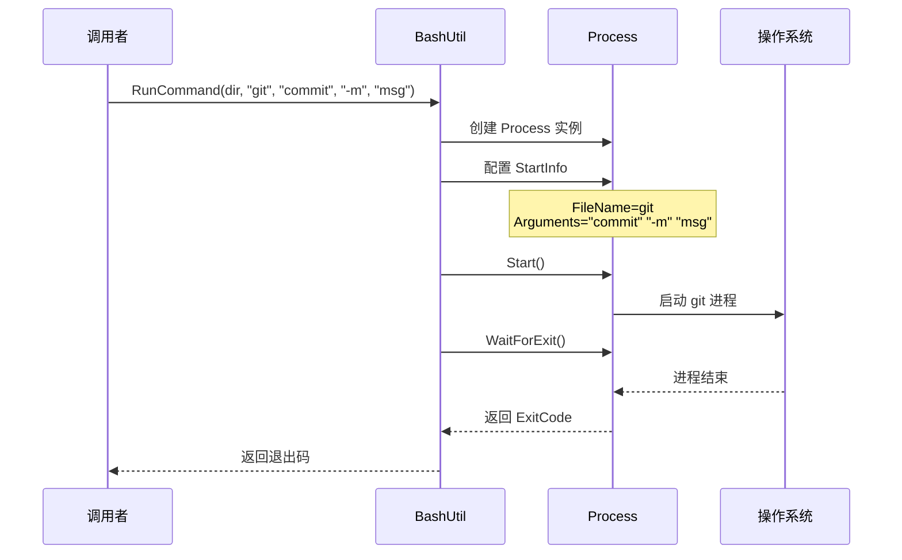
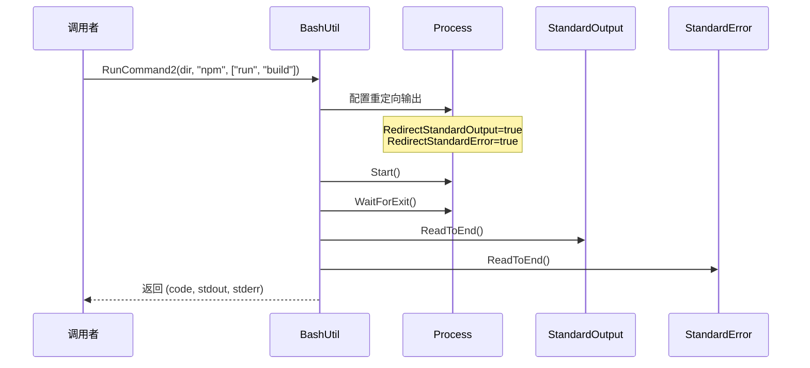

# BashUtil.cs 注解文档

## 文件基本信息

| 属性 | 值 |
|------|-----|
| **文件名** | BashUtil.cs |
| **路径** | Assets/Scripts/Editor/Common/Helper/BashUtil.cs |
| **所属模块** | Editor 层 → 通用工具 → Bash 命令执行工具 |
| **文件职责** | 提供外部进程/命令行工具的调用封装，支持同步执行、输出捕获 |

---

## 类/结构体说明

### BashUtil

| 属性 | 说明 |
|------|------|
| **职责** | 静态工具类，封装 System.Diagnostics.Process 用于执行外部命令 |
| **泛型参数** | 无 |
| **继承关系** | 无继承 |
| **实现的接口** | 无 |

**设计模式**: 静态工具类

```csharp
// 使用方式
int exitCode = BashUtil.RunCommand(workingDir, "git", "commit", "-m", "message");
var (code, stdout, stderr) = BashUtil.RunCommand2(workingDir, "npm", new[] { "run", "build" });
```

---

## 方法说明（按重要程度排序）

### RunCommand

```csharp
public static int RunCommand(string workingDir, string program, params string[] args)
```

| 属性 | 说明 |
|------|------|
| **功能** | 执行外部命令，返回退出码，不捕获输出 |
| **参数** | `workingDir`: 工作目录<br>`program`: 程序路径/名称<br>`args`: 命令行参数（可变参数） |
| **返回值** | `int` - 进程退出码（0 表示成功） |
| **特点** | 自动为每个参数添加双引号包裹 |

**实现细节**:
- 使用 `Process` 类启动外部进程
- `UseShellExecute = false` 允许重定向
- `CreateNoWindow = true` 不显示窗口
- 参数自动用双引号包裹：`"arg1" "arg2"`
- 同步等待进程完成 (`WaitForExit()`)
- 使用 `using` 确保进程资源释放

---

### RunCommand2

```csharp
public static (int ExitCode, string StdOut, string StdErr) RunCommand2(string workingDir, string program, string[] args)
```

| 属性 | 说明 |
|------|------|
| **功能** | 执行外部命令，捕获标准输出和标准错误 |
| **参数** | `workingDir`: 工作目录<br>`program`: 程序路径/名称<br>`args`: 命令行参数数组 |
| **返回值** | 元组 `(ExitCode, StdOut, StdErr)` |
| **特点** | 参数不加引号，直接拼接 |

**实现细节**:
- 启用 `RedirectStandardOutput` 和 `RedirectStandardError`
- 参数直接空格拼接：`arg1 arg2`
- 同步读取输出 (`ReadToEnd()`)
- 返回完整输出内容供调用者处理

---

### RunCommand3

```csharp
public static (int ExitCode, string StdOut, string StdErr) RunCommand3(string workingDir, string program, string[] args)
```

| 属性 | 说明 |
|------|------|
| **功能** | 通过标准输入写入命令执行（适用于 npm 等场景） |
| **参数** | `workingDir`: 工作目录<br>`program`: 程序路径/名称<br>`args`: 命令行参数数组 |
| **返回值** | 元组 `(ExitCode, StdOut, StdErr)` |
| **特点** | 通过 `StandardInput.WriteLine` 写入命令 |

**实现细节**:
- 使用 `ProcessStartInfo` 配置进程
- 启用 `RedirectStandardInput`
- 通过 `StandardInput.WriteLine()` 写入命令 + `& exit`
- 适用于需要交互式输入的场景

---

## 核心流程

### RunCommand 执行流程



### RunCommand2 输出捕获流程



---

## 使用示例

### 示例 1: 执行 Git 命令

```csharp
// 简单执行，只关心退出码
int code = BashUtil.RunCommand(
    "/path/to/repo",
    "git",
    "commit", "-m", "docs: update readme"
);

if (code == 0)
{
    UnityEngine.Debug.Log("Git commit successful");
}
```

### 示例 2: 执行 NPM 构建并捕获输出

```csharp
// 捕获构建输出
var (exitCode, stdOut, stdErr) = BashUtil.RunCommand2(
    "/path/to/project",
    "npm",
    new[] { "run", "build" }
);

if (exitCode != 0)
{
    UnityEngine.Debug.LogError($"Build failed: {stdErr}");
}
else
{
    UnityEngine.Debug.Log($"Build output: {stdOut}");
}
```

### 示例 3: 使用 RunCommand3 执行交互式命令

```csharp
// 适用于需要通过 stdin 输入的场景
var (code, output, error) = BashUtil.RunCommand3(
    "/path/to/project",
    "node",
    new[] { "script.js", "--option" }
);
```

### 示例 4: 批量执行命令

```csharp
// 在 Editor 脚本中批量处理
public void ProcessAssets()
{
    string projectRoot = Application.dataPath;
    
    // 执行资源检查
    int checkCode = BashUtil.RunCommand(
        projectRoot,
        "python",
        "tools/check_assets.py"
    );
    
    if (checkCode != 0)
    {
        EditorUtility.DisplayDialog("错误", "资源检查失败", "确定");
        return;
    }
    
    // 执行资源导出
    var (exportCode, output, error) = BashUtil.RunCommand2(
        projectRoot,
        "python",
        new[] { "tools/export_assets.py", "--format", "png" }
    );
    
    UnityEngine.Debug.Log($"Export output: {output}");
}
```

---

## 注意事项

### ⚠️ 安全提示

| 问题 | 说明 | 建议 |
|------|------|------|
| **命令注入** | 用户输入直接拼接到命令可能不安全 | 验证输入，避免直接拼接 |
| **路径空格** | 工作目录或程序路径含空格需处理 | 使用引号包裹路径 |
| **超时控制** | `WaitForExit()` 可能无限等待 | 考虑添加超时机制 |
| **编码问题** | 输出可能有编码问题 | 设置 `StandardOutputEncoding` |

### 💡 最佳实践

```csharp
// ✅ 推荐：添加超时控制
public static int RunCommandWithTimeout(string workingDir, string program, int timeoutMs, params string[] args)
{
    using (Process p = new Process())
    {
        p.StartInfo.WorkingDirectory = workingDir;
        p.StartInfo.FileName = program;
        p.StartInfo.UseShellExecute = false;
        p.StartInfo.CreateNoWindow = true;
        p.StartInfo.Arguments = string.Join(" ", args.Select(arg => "\"" + arg + "\""));
        
        p.Start();
        if (!p.WaitForExit(timeoutMs))
        {
            p.Kill();
            throw new TimeoutException($"Command timed out after {timeoutMs}ms");
        }
        return p.ExitCode;
    }
}
```

---

## 相关文档

- [FileHelper.cs.md](./FileHelper.cs.md) - 文件操作工具
- [ImportUtil.cs.md](./ImportUtil.cs.md) - 资源导入工具
- [PackagesManagerEditor.cs.md](../PackagesManager/PackagesManagerEditor.cs.md) - 包管理器编辑器（使用 BashUtil）

---

*文档生成时间：2026-03-02 | OpenClaw AI 助手*
