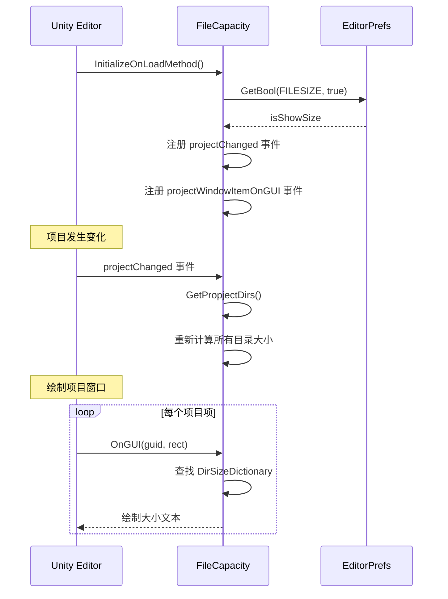
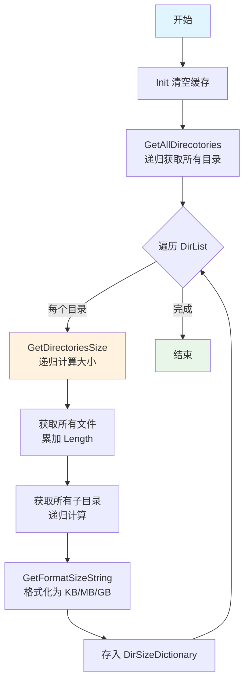

# FileCapacity.cs 注解文档

## 文件基本信息

| 属性 | 值 |
|------|-----|
| **文件名** | FileCapacity.cs |
| **路径** | Assets/Scripts/Editor/Common/Helper/FileCapacity.cs |
| **所属模块** | Editor 工具 → Common/Helper |
| **文件职责** | 在 Unity 编辑器项目窗口中显示文件和文件夹的大小 |

---

## 类/结构体说明

### FileCapacity

| 属性 | 说明 |
|------|------|
| **职责** | Unity 编辑器扩展工具，在项目窗口中显示每个文件和文件夹的占用空间大小 |
| **泛型参数** | 无 |
| **继承关系** | 无继承 |
| **实现的接口** | 无 |

**设计模式**: 静态工具类 + 事件驱动

```csharp
// 静态类，无需实例化
public static class FileCapacity
{
    // 通过菜单项控制开关
    [MenuItem("Tools/工具/TA/打开文件大小显示")]
    public static void OpenPlaySize() { ... }
}
```

---

## 字段与属性（按重要程度排序）

| 名称 | 类型 | 访问级别 | 说明 |
|------|------|----------|------|
| `REMOVE_STR` | `const string` | `private const` | 需要移除的路径前缀 "Assets" |
| `FILESIZE` | `const string` | `private const` | EditorPrefs 存储键名 |
| `mRemoveCount` | `readonly int` | `private static readonly` | REMOVE_STR 的长度 |
| `mColor` | `readonly Color` | `private static readonly` | 显示文本的颜色 (灰色) |
| `DirSizeDictionary` | `Dictionary<string, string>` | `private static` | 缓存目录路径→大小字符串 |
| `DirList` | `List<string>` | `private static` | 所有目录路径列表 |
| `isShowSize` | `bool` | `private static` | 是否显示大小的开关状态 |

---

## 方法说明（按重要程度排序）

### OpenPlaySize()

**签名**:
```csharp
[MenuItem("Tools/工具/TA/打开文件大小显示", false, 300)]
public static void OpenPlaySize()
```

**职责**: 打开文件大小显示功能

**核心逻辑**:
```
1. 设置 EditorPrefs.SetBool(FILESIZE, true)
2. 设置 isShowSize = true
3. 调用 GetPropjectDirs() 重新计算所有目录大小
```

**调用者**: Unity 编辑器菜单

**使用示例**:
```csharp
// 通过菜单操作：Tools → 工具 → TA → 打开文件大小显示
```

---

### ClosePlaySize()

**签名**:
```csharp
[MenuItem("Tools/工具/TA/关闭文件大小显示", false, 301)]
public static void ClosePlaySize()
```

**职责**: 关闭文件大小显示功能

**核心逻辑**:
```
1. 设置 EditorPrefs.SetBool(FILESIZE, false)
2. 设置 isShowSize = false
3. 调用 Init() 清空缓存
```

**调用者**: Unity 编辑器菜单

---

### GetPropjectDirs()

**签名**:
```csharp
private static void GetPropjectDirs()
```

**职责**: 遍历项目所有目录并计算大小

**核心逻辑**:
```
1. 检查 isShowSize 开关，关闭则返回
2. 调用 Init() 清空缓存
3. 调用 GetAllDirecotories(Application.dataPath) 获取所有目录
4. 遍历 DirList，对每个目录调用 GetDirectoriesSize() 计算大小
5. 将结果存入 DirSizeDictionary (路径 → 格式化大小字符串)
```

**调用者**: InitializeOnLoadMethod(), OnScriptsReloaded(), OpenPlaySize()

**被调用者**: `GetAllDirecotories()`, `GetDirectoriesSize()`, `GetFormatSizeString()`

---

### OnGUI(string guid, Rect selectionRect)

**签名**:
```csharp
private static void OnGUI(string guid, Rect selectionRect)
```

**职责**: 在项目窗口中绘制文件大小文本

**核心逻辑**:
```
1. 检查 isShowSize 开关
2. 通过 guid 构建完整文件/目录路径
3. 从 DirSizeDictionary 查找缓存的大小
4. 如果是文件且不在缓存中，实时计算文件大小
5. 在 selectionRect 右侧绘制灰色背景 + 大小文本
```

**调用者**: EditorApplication.projectWindowItemOnGUI 事件

**被调用者**: `GetFormatSizeString()`

---

### GetFormatSizeString(int size)

**签名**:
```csharp
private static string GetFormatSizeString(int size)
```

**职责**: 将字节大小格式化为人类可读的字符串

**核心逻辑**:
```
1. 定义单位后缀数组：["", "K", "M", "G", "T", "P", "E", "Z", "Y"]
2. 循环除以 1024，直到 size < 1024
3. 返回格式化字符串，如 "1.5MB", "256KB", "3GB"
```

**调用者**: GetPropjectDirs(), OnGUI()

**使用示例**:
```csharp
GetFormatSizeString(1536)      // 返回 "1.5KB"
GetFormatSizeString(1048576)   // 返回 "1MB"
GetFormatSizeString(1073741824) // 返回 "1GB"
```

---

### GetDirectoriesSize(string dirPath)

**签名**:
```csharp
private static long GetDirectoriesSize(string dirPath)
```

**职责**: 递归计算目录及其子目录的总大小

**核心逻辑**:
```
1. 检查目录是否存在，不存在返回 0
2. 遍历目录下所有文件，累加 FileInfo.Length
3. 递归遍历所有子目录，累加子目录大小
4. 返回总大小 (字节)
```

**调用者**: GetPropjectDirs()

---

### GetAllDirecotories(string dirPath)

**签名**:
```csharp
private static void GetAllDirecotories(string dirPath)
```

**职责**: 递归获取目录及其所有子目录路径

**核心逻辑**:
```
1. 检查目录是否存在
2. 将当前目录加入 DirList
3. 递归遍历所有子目录
```

**调用者**: GetPropjectDirs()

---

### InitializeOnLoadMethod()

**签名**:
```csharp
[InitializeOnLoadMethod]
private static void InitializeOnLoadMethod()
```

**职责**: Unity 编辑器启动时初始化

**核心逻辑**:
```
1. 调用 Init() 读取 EditorPrefs 设置
2. 注册 EditorApplication.projectChanged 事件 → GetPropjectDirs()
3. 注册 EditorApplication.projectWindowItemOnGUI 事件 → OnGUI()
```

**调用者**: Unity 编辑器启动时自动调用

---

## Mermaid 流程图

### 初始化与事件注册流程



### 目录大小计算流程



---

## 使用示例

### 启用/禁用文件大小显示

```csharp
// 通过 Unity 编辑器菜单操作
// Tools → 工具 → TA → 打开文件大小显示
// Tools → 工具 → TA → 关闭文件大小显示

// 状态会持久化到 EditorPrefs，下次打开 Unity 时自动恢复
```

### 显示效果

```
项目窗口显示示例:
├─ AssetsPackage/
│  ├─ UI/                    [256MB]
│  │  ├─ Prefabs/            [128MB]
│  │  │  └─ UILobby.prefab   [2.5MB]
│  │  └─ Atlas/              [64MB]
│  └─ Unit/                  [512MB]
│     └─ Character/          [256MB]
```

---

## 相关文档链接

- **同类工具**:
  - [FileHelper.cs.md](./FileHelper.cs.md) - 文件操作工具类
  - [ImportUtil.cs.md](./ImportUtil.cs.md) - 资源导入工具

- **Editor 扩展**:
  - [ReferenceCollectorEditor.cs.md](../ReferenceCollectorEditor/ReferenceCollectorEditor.cs.md) - 引用收集器编辑器
  - [PackagesManagerEditor.cs.md](../PackagesManager/PackagesManagerEditor.cs.md) - 包管理器编辑器

- **框架文档**:
  - [FRAMEWORK_ARCHITECTURE.md](../../../../FRAMEWORK_ARCHITECTURE.md) - 框架架构总览

---

## 注意事项与最佳实践

### ⚠️ 注意事项

| 问题 | 说明 | 解决方案 |
|------|------|----------|
| **性能开销** | 大项目计算所有目录大小可能耗时 | 首次加载或项目变化时计算，之后使用缓存 |
| **内存占用** | DirSizeDictionary 存储所有路径 | 关闭功能时调用 Init() 清空缓存 |
| **路径格式** | Windows 使用 `\`，其他平台使用 `/` | 统一使用 `Replace("\\", "/")` 标准化 |

### 💡 最佳实践

```csharp
// ✅ 推荐：通过菜单控制开关，避免常驻计算
[MenuItem("Tools/工具/TA/打开文件大小显示")]
public static void OpenPlaySize()
{
    EditorPrefs.SetBool(FILESIZE, true);
    isShowSize = true;
    GetPropjectDirs();
}

// ✅ 推荐：使用 EditorPrefs 持久化用户偏好
isShowSize = EditorPrefs.GetBool(FILESIZE, true);

// ✅ 推荐：事件驱动，仅在项目变化时重新计算
EditorApplication.projectChanged += GetPropjectDirs;
```

---

*文档由 OpenClaw AI 助手自动生成 | 基于静态代码分析*
