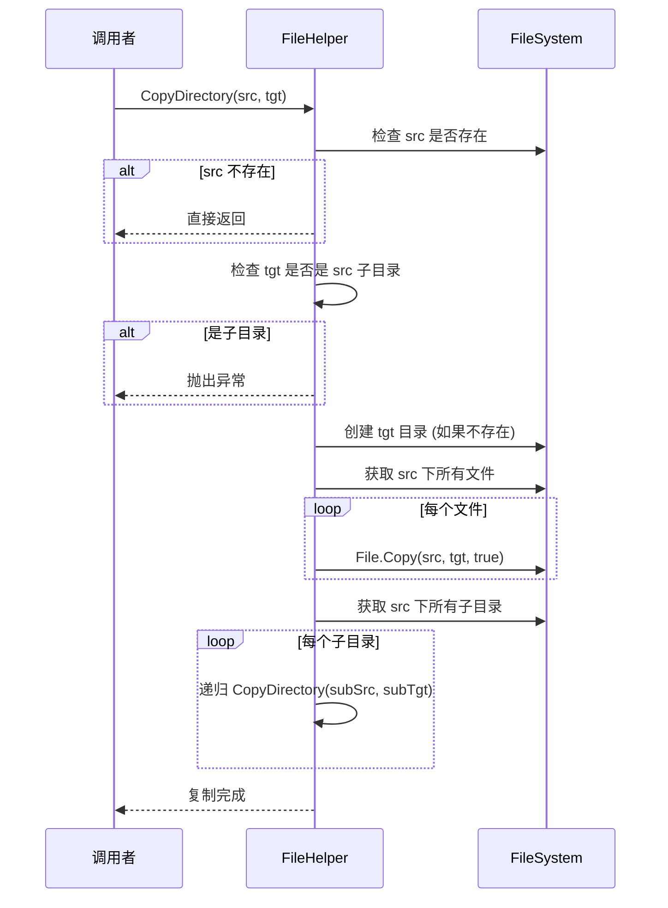
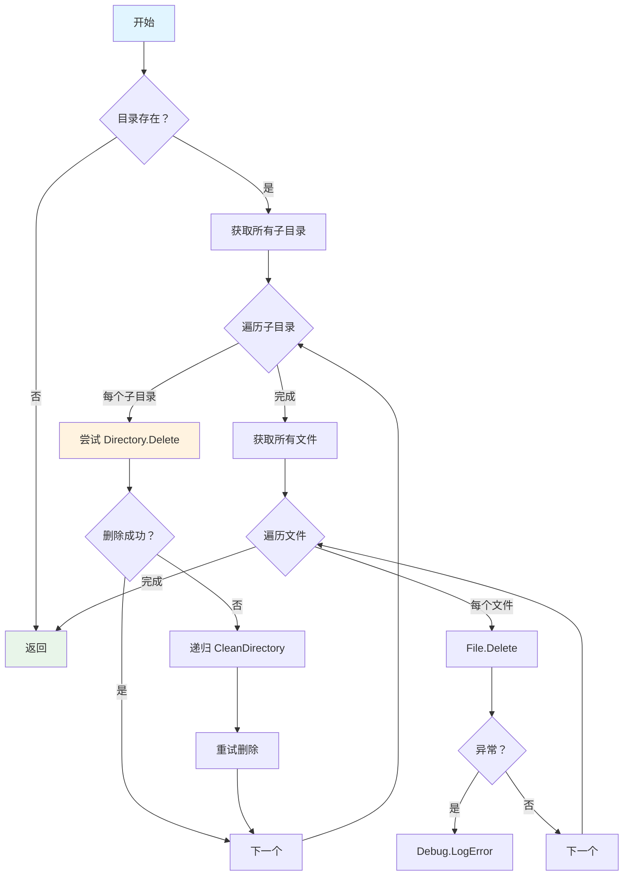

# FileHelper.cs 注解文档

## 文件基本信息

| 属性 | 值 |
|------|-----|
| **文件名** | FileHelper.cs |
| **路径** | Assets/Scripts/Editor/Common/Helper/FileHelper.cs |
| **所属模块** | Editor 工具 → Common/Helper |
| **文件职责** | 文件和目录操作的通用工具类，提供递归遍历、复制、清理等功能 |

---

## 类/结构体说明

### FileHelper

| 属性 | 说明 |
|------|------|
| **职责** | 提供文件和目录的常用操作工具方法，包括遍历、复制、清理、扩展名替换等 |
| **泛型参数** | 无 |
| **继承关系** | 无继承 |
| **实现的接口** | 无 |

**设计模式**: 静态工具类

```csharp
// 静态类，无需实例化
public static class FileHelper
{
    // 获取目录下所有文件
    public static void GetAllFiles(List<string> files, string dir) { ... }
    
    // 清理目录
    public static void CleanDirectory(string dir) { ... }
    
    // 复制目录
    public static void CopyDirectory(string srcDir, string tgtDir) { ... }
}
```

---

## 方法说明（按重要程度排序）

### GetAllFiles(List<string> files, string dir)

**签名**:
```csharp
public static void GetAllFiles(List<string> files, string dir)
```

**职责**: 递归获取指定目录及其子目录中的所有文件路径

**核心逻辑**:
```
1. 使用 Directory.GetFiles(dir) 获取当前目录所有文件
2. 将所有文件路径添加到 files 列表
3. 使用 Directory.GetDirectories(dir) 获取所有子目录
4. 对每个子目录递归调用 GetAllFiles()
```

**调用者**: 任何需要遍历目录文件的代码

**被调用者**: 无

**使用示例**:
```csharp
List<string> allFiles = new List<string>();
FileHelper.GetAllFiles(allFiles, "Assets/AssetsPackage");
// allFiles 现在包含所有文件的完整路径
```

---

### CleanDirectory(string dir)

**签名**:
```csharp
public static void CleanDirectory(string dir)
```

**职责**: 清空指定目录下的所有文件和子目录（保留目录本身）

**核心逻辑**:
```
1. 检查目录是否存在，不存在则返回
2. 遍历所有子目录，尝试 Directory.Delete(subdir, true)
3. 如果删除失败（文件被占用），递归调用 CleanDirectory() 后重试
4. 遍历所有文件，调用 File.Delete() 删除
5. 所有异常使用 Debug.LogError 记录
```

**调用者**: 构建脚本、资源清理工具

**被调用者**: 无

**使用示例**:
```csharp
// 清空临时目录
FileHelper.CleanDirectory("Temp/BuildCache");

// 清空后目录本身仍然存在，但内容为空
```

---

### CopyDirectory(string srcDir, string tgtDir)

**签名**:
```csharp
public static void CopyDirectory(string srcDir, string tgtDir)
```

**职责**: 递归复制整个目录结构（包括所有子目录和文件）

**核心逻辑**:
```
1. 检查源目录是否存在，不存在则返回
2. 检查目标目录是否是源目录的子目录 → 是则抛出异常
3. 如果目标目录不存在，创建它
4. 复制所有文件 (File.Copy with overwrite)
5. 递归复制所有子目录
```

**调用者**: 资源打包工具、项目备份工具

**被调用者**: `CopyFile()`

**使用示例**:
```csharp
// 复制整个资源目录
FileHelper.CopyDirectory("Assets/AssetsPackage/UI", "Assets/Backup/UI");

// ⚠️ 会抛出异常：父目录不能拷贝到子目录！
FileHelper.CopyDirectory("Assets", "Assets/Backup");
```

---

### CopyFiles(string srcDir, string tgtDir, string[] ignore)

**签名**:
```csharp
public static void CopyFiles(string srcDir, string tgtDir, string[] ignore = null)
```

**职责**: 复制目录下的所有文件到目标目录（扁平化结构），支持忽略特定文件

**核心逻辑**:
```
1. 检查源目录是否存在
2. 检查目标目录是否是源目录的子目录
3. 递归遍历所有子目录，将文件复制到同一目标目录
4. 如果提供了 ignore 数组，跳过包含忽略关键词的文件
5. 调用 CopyFile() 复制每个文件（仅当内容不同时）
```

**调用者**: 资源导出工具、批量文件处理

**被调用者**: `CopyFile()`

**使用示例**:
```csharp
// 复制所有 PNG 文件，忽略.meta 文件
FileHelper.CopyFiles("Assets/Textures", "Export/Textures", new[] { ".meta" });

// 结果：所有纹理文件扁平化复制到 Export/Textures，不包含子目录结构
```

---

### CopyFile(string sourcePath, string targetPath, bool overwrite)

**签名**:
```csharp
public static bool CopyFile(string sourcePath, string targetPath, bool overwrite)
```

**职责**: 智能复制文件，仅当内容不同时才复制

**核心逻辑**:
```
1. 读取源文件内容
2. 读取目标文件内容（如果存在）
3. 比较内容是否相同
4. 仅当内容不同时执行 File.Copy()
5. 返回是否实际执行了复制
```

**调用者**: CopyDirectory(), CopyFiles()

**被调用者**: 无

**使用示例**:
```csharp
// 仅当内容不同时复制，避免不必要的文件操作
bool copied = FileHelper.CopyFile("src.txt", "dst.txt", true);
if (copied)
{
    Debug.Log("文件已更新");
}
```

---

### ReplaceExtensionName(string srcDir, string extensionName, string newExtensionName)

**签名**:
```csharp
public static void ReplaceExtensionName(string srcDir, string extensionName, string newExtensionName)
```

**职责**: 批量替换目录及其子目录中文件的扩展名

**核心逻辑**:
```
1. 获取目录下所有文件
2. 对每个以 extensionName 结尾的文件：
   - 使用 File.Move() 重命名
   - 使用 File.Delete() 删除旧文件
3. 递归处理所有子目录
```

**调用者**: 资源格式转换工具

**被调用者**: 无

**使用示例**:
```csharp
// 将所有 .txt 文件改为 .md
FileHelper.ReplaceExtensionName("Assets/Docs", ".txt", ".md");

// 结果：readme.txt → readme.md
```

---

### GetFileNames(string directoryPath, string searchPattern, bool isSearchChild)

**签名**:
```csharp
public static string[] GetFileNames(string directoryPath, string searchPattern, bool isSearchChild)
```

**职责**: 获取指定目录的文件列表，支持通配符和子目录搜索

**核心逻辑**:
```
1. 检查目录是否存在
2. 将 searchPattern 按 '|' 分割为多个扩展名模式
3. 对每个模式调用 Directory.GetFiles()
4. 根据 isSearchChild 选择 SearchOption.AllDirectories 或 TopDirectoryOnly
5. 返回所有匹配的文件路径数组
```

**调用者**: 资源搜索工具、批量处理工具

**被调用者**: 无

**使用示例**:
```csharp
// 获取所有 PNG 和 JPG 文件（包括子目录）
string[] images = FileHelper.GetFileNames("Assets/Textures", "*.png|*.jpg", true);

// 仅获取根目录的 XML 文件
string[] configs = FileHelper.GetFileNames("Assets/Config", "*.xml", false);
```

---

### SafeDeleteFile(string filePath)

**签名**:
```csharp
public static bool SafeDeleteFile(string filePath)
```

**职责**: 安全删除文件，处理各种异常情况

**核心逻辑**:
```
1. 检查 filePath 是否为空或 null
2. 检查文件是否存在
3. 使用 File.SetAttributes() 重置文件属性为 Normal
4. 调用 File.Delete() 删除
5. 捕获所有异常并记录日志
6. 返回是否成功删除
```

**调用者**: 资源清理工具、临时文件清理

**被调用者**: 无

**使用示例**:
```csharp
// 安全删除临时文件
bool success = FileHelper.SafeDeleteFile("Temp/cache.tmp");
if (!success)
{
    Debug.LogError("删除文件失败");
}
```

---

### CreateArtSubFolder(string selectPath)

**签名**:
```csharp
public static void CreateArtSubFolder(string selectPath)
```

**职责**: 根据目录类型自动创建标准子目录结构

**核心逻辑**:
```
1. 定义三种标准目录结构：
   - ArtFolderNames: Animations, Materials, Models, Textures, Prefabs, Others
   - UnitFolderNames: Animations, Edit, Materials, Models,Textures, Prefabs
   - UIFolderNames: Animations, Atlas, DiscreteImages, Prefabs
2. 根据路径判断目录类型：
   - 包含 "UI/" → 使用 UIFolderNames
   - 包含 "Unit/" → 使用 UnitFolderNames
   - 其他 → 使用 ArtFolderNames
3. 为每个标准名称创建子目录
```

**调用者**: 美术资源管理工具

**被调用者**: `Directory.CreateDirectory()`

**使用示例**:
```csharp
// 为 UI 目录创建标准结构
FileHelper.CreateArtSubFolder("Assets/AssetsPackage/UI/UILobby");
// 创建：Animations/, Atlas/, DiscreteImages/, Prefabs/

// 为 Unit 目录创建标准结构
FileHelper.CreateArtSubFolder("Assets/AssetsPackage/Unit/Hero");
// 创建：Animations/, Edit/, Materials/, Models/, Textures/, Prefabs/
```

---

## Mermaid 流程图

### CopyDirectory 复制流程



### CleanDirectory 清理流程



---

## 使用示例

### 完整工作流程示例

```csharp
// 1. 获取所有资源文件
List<string> allAssets = new List<string>();
FileHelper.GetAllFiles(allAssets, "Assets/AssetsPackage");
Debug.Log($"总文件数：{allAssets.Count}");

// 2. 备份资源目录
FileHelper.CopyDirectory("Assets/AssetsPackage", "Backup/AssetsPackage_20260303");

// 3. 清理临时构建目录
FileHelper.CleanDirectory("Temp/BuildCache");

// 4. 导出所有纹理（扁平化结构）
FileHelper.CopyFiles("Assets/AssetsPackage/UI", "Export/Textures", new[] { ".meta", ".psd" });

// 5. 为新建资源目录创建标准结构
FileHelper.CreateArtSubFolder("Assets/AssetsPackage/Unit/NewHero");

// 6. 安全删除临时文件
FileHelper.SafeDeleteFile("Temp/import.tmp");
```

---

## 相关文档链接

- **同类工具**:
  - [FileCapacity.cs.md](./FileCapacity.cs.md) - 文件大小显示工具
  - [ImportUtil.cs.md](./ImportUtil.cs.md) - 资源导入工具
  - [UIAssetUtils.cs.md](./UIAssetUtils.cs.md) - UI 资源工具

- **Editor 扩展**:
  - [ReferenceCollectorEditor.cs.md](../ReferenceCollectorEditor/ReferenceCollectorEditor.cs.md) - 引用收集器编辑器

- **框架文档**:
  - [FRAMEWORK_ARCHITECTURE.md](../../../../FRAMEWORK_ARCHITECTURE.md) - 框架架构总览

---

## 注意事项与最佳实践

### ⚠️ 注意事项

| 问题 | 说明 | 解决方案 |
|------|------|----------|
| **子目录复制** | 不能将父目录复制到其子目录 | CopyDirectory/CopyFiles 已内置检查 |
| **文件占用** | 文件被占用时删除失败 | CleanDirectory 会递归重试，SafeDeleteFile 记录日志 |
| **性能** | 大目录递归遍历可能耗时 | 避免在 Update 中调用，使用异步或后台处理 |
| **路径格式** | Windows 使用 `\`，其他平台使用 `/` | 工具内部已处理路径分隔符 |

### 💡 最佳实践

```csharp
// ✅ 推荐：先检查再操作
if (FileHelper.IsExistDirectory("Assets/AssetsPackage"))
{
    FileHelper.CleanDirectory("Temp/Cache");
}

// ✅ 推荐：使用 SafeDeleteFile 而非 File.Delete
FileHelper.SafeDeleteFile("Temp/temp.tmp");

// ✅ 推荐：CopyFile 智能复制，避免不必要的文件操作
FileHelper.CopyFile("src.txt", "dst.txt", true);

// ❌ 避免：直接复制到子目录，会抛出异常
// FileHelper.CopyDirectory("Assets", "Assets/Backup"); // 异常！
```

---

*文档由 OpenClaw AI 助手自动生成 | 基于静态代码分析*
