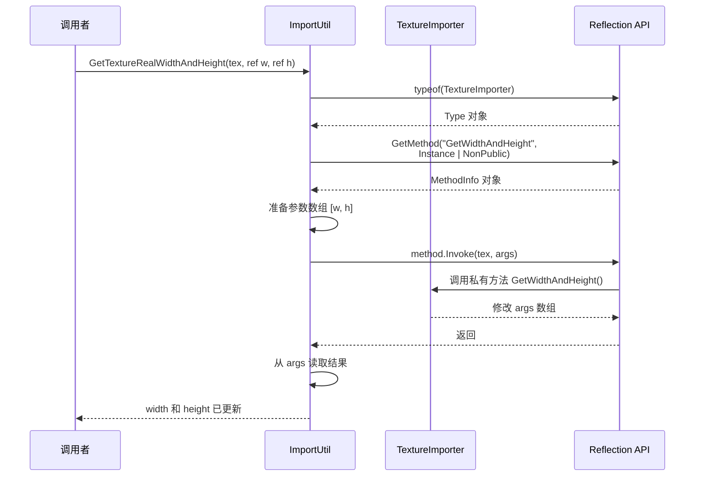

# ImportUtil.cs 注解文档

## 文件基本信息

| 属性 | 值 |
|------|-----|
| **文件名** | ImportUtil.cs |
| **路径** | Assets/Scripts/Editor/Common/Helper/ImportUtil.cs |
| **所属模块** | Editor 工具 → Common/Helper |
| **文件职责** | 资源导入工具类，提供 TextureImporter 的反射访问和 2 的幂次检测功能 |

---

## 类/结构体说明

### ImportUtil

| 属性 | 说明 |
|------|------|
| **职责** | 提供资源导入相关的工具方法，主要通过反射访问 Unity 编辑器内部 API，以及提供 2 的幂次检测 |
| **泛型参数** | 无 |
| **继承关系** | 无继承 |
| **实现的接口** | 无 |

**设计模式**: 静态工具类 + 反射

```csharp
// 静态工具类，通过反射访问 Unity 内部 API
public class ImportUtil
{
    // 通过反射获取纹理真实宽高
    public static void GetTextureRealWidthAndHeight(TextureImporter texImpoter, ref int width, ref int height)
    {
        System.Type type = typeof(TextureImporter);
        System.Reflection.MethodInfo method = type.GetMethod("GetWidthAndHeight", BindingFlags.Instance | BindingFlags.NonPublic);
        // ...
    }
}
```

---

## 方法说明（按重要程度排序）

### GetTextureRealWidthAndHeight(TextureImporter, ref int, ref int)

**签名**:
```csharp
public static void GetTextureRealWidthAndHeight(TextureImporter texImpoter, ref int width, ref int height)
```

**职责**: 通过反射获取 TextureImporter 中纹理的真实宽度和高度

**核心逻辑**:
```
1. 获取 TextureImporter 类型
2. 使用反射获取私有方法 "GetWidthAndHeight"
   - BindingFlags.Instance | BindingFlags.NonPublic
3. 准备参数数组 [width, height]
4. 调用 method.Invoke(texImpoter, args)
5. 从 args 数组中读取结果并赋值给 ref 参数
```

**调用者**: 纹理导入工具、资源检查工具

**被调用者**: 无

**使用示例**:
```csharp
TextureImporter importer = AssetImporter.GetAtPath("Assets/Texture.png") as TextureImporter;
if (importer != null)
{
    int width = 0, height = 0;
    ImportUtil.GetTextureRealWidthAndHeight(importer, ref width, ref height);
    Debug.Log($"纹理尺寸：{width}x{height}");
}
```

**⚠️ 注意事项**:
- 使用反射访问 Unity 内部私有 API，可能在 Unity 版本升级后失效
- GetWidthAndHeight 方法签名可能变化，需要适配

---

### WidthAndHeightIsPowerOfTwo(int width, int height)

**签名**:
```csharp
public static bool WidthAndHeightIsPowerOfTwo(int width, int height)
```

**职责**: 判断纹理的宽度和高度是否都是 2 的幂次

**核心逻辑**:
```
1. 调用 IsPowerOfTwo(width) 检查宽度
2. 调用 IsPowerOfTwo(height) 检查高度
3. 两者都满足才返回 true
```

**调用者**: 纹理压缩工具、资源规范检查工具

**被调用者**: `IsPowerOfTwo()`

**使用示例**:
```csharp
// 检查纹理是否符合 2 的幂次规范
if (ImportUtil.WidthAndHeightIsPowerOfTwo(1024, 512))
{
    Debug.Log("纹理尺寸符合规范"); // 1024=2^10, 512=2^9
}

if (!ImportUtil.WidthAndHeightIsPowerOfTwo(100, 100))
{
    Debug.Log("纹理尺寸不符合规范，可能导致压缩问题"); // 100 不是 2 的幂次
}
```

---

### IsPowerOfTwo(int number)

**签名**:
```csharp
public static bool IsPowerOfTwo(int number)
```

**职责**: 判断一个数是否是 2 的幂次

**核心逻辑**:
```
1. 检查 number <= 0，是则返回 false
2. 使用位运算：(number & (number - 1)) == 0
   - 2 的幂次的二进制表示只有一个 1
   - n & (n-1) 会清除最低位的 1
   - 如果结果为 0，说明原数只有一个 1，即 2 的幂次
```

**调用者**: WidthAndHeightIsPowerOfTwo()

**被调用者**: 无

**算法原理**:
```
数字    二进制      n-1       n & (n-1)   结果
1       0001       0000      0000        true (2^0)
2       0010       0001      0000        true (2^1)
4       0100       0011      0000        true (2^2)
8       1000       0111      0000        true (2^3)
3       0011       0010      0010        false
5       0101       0100      0100        false
```

**使用示例**:
```csharp
ImportUtil.IsPowerOfTwo(1);    // true  (2^0)
ImportUtil.IsPowerOfTwo(2);    // true  (2^1)
ImportUtil.IsPowerOfTwo(4);    // true  (2^2)
ImportUtil.IsPowerOfTwo(8);    // true  (2^3)
ImportUtil.IsPowerOfTwo(16);   // true  (2^4)
ImportUtil.IsPowerOfTwo(32);   // true  (2^5)
ImportUtil.IsPowerOfTwo(64);   // true  (2^6)
ImportUtil.IsPowerOfTwo(128);  // true  (2^7)
ImportUtil.IsPowerOfTwo(256);  // true  (2^8)
ImportUtil.IsPowerOfTwo(512);  // true  (2^9)
ImportUtil.IsPowerOfTwo(1024); // true  (2^10)
ImportUtil.IsPowerOfTwo(2048); // true  (2^11)
ImportUtil.IsPowerOfTwo(4096); // true  (2^12)

ImportUtil.IsPowerOfTwo(3);    // false
ImportUtil.IsPowerOfTwo(5);    // false
ImportUtil.IsPowerOfTwo(100);  // false
ImportUtil.IsPowerOfTwo(0);    // false
ImportUtil.IsPowerOfTwo(-2);   // false
```

---

## Mermaid 流程图

### IsPowerOfTwo 位运算原理

```mermaid
graph TD
    Start[开始] --> CheckNeg{number <= 0?}
    CheckNeg -->|是 | ReturnFalse[返回 false]
    CheckNeg -->|否 | Bitwise[计算 n & (n-1)]
    
    Bitwise --> CheckZero{结果 == 0?}
    CheckZero -->|是 | ReturnTrue[返回 true<br/>是 2 的幂次]
    CheckZero -->|否 | ReturnFalse
    
    style Start fill:#e1f5ff
    style ReturnTrue fill:#e8f5e9
    style ReturnFalse fill:#ffebee
    style Bitwise fill:#fff3e0
```

### GetTextureRealWidthAndHeight 反射调用流程



---

## 使用示例

### 纹理导入检查工具

```csharp
using UnityEditor;
using UnityEngine;

public class TextureImportChecker
{
    [MenuItem("Tools/检查纹理规范")]
    public static void CheckTextureSpecs()
    {
        string[] guids = AssetDatabase.FindAssets("t:Texture", new[] { "Assets/AssetsPackage" });
        
        foreach (string guid in guids)
        {
            string path = AssetDatabase.GUIDToAssetPath(guid);
            TextureImporter importer = AssetImporter.GetAtPath(path) as TextureImporter;
            
            if (importer != null)
            {
                int width = 0, height = 0;
                ImportUtil.GetTextureRealWidthAndHeight(importer, ref width, ref height);
                
                if (!ImportUtil.WidthAndHeightIsPowerOfTwo(width, height))
                {
                    Debug.LogWarning($"纹理 {path} 尺寸 {width}x{height} 不是 2 的幂次，可能导致压缩问题");
                }
            }
        }
    }
}
```

### 批量纹理修复工具

```csharp
public class TextureFixer
{
    public static void FixNonPowerOfTwoTextures(string directory)
    {
        string[] files = Directory.GetFiles(directory, "*.png", SearchOption.AllDirectories);
        
        foreach (string file in files)
        {
            string relativePath = file.Replace(Application.dataPath, "Assets");
            TextureImporter importer = AssetImporter.GetAtPath(relativePath) as TextureImporter;
            
            if (importer != null)
            {
                int width = 0, height = 0;
                ImportUtil.GetTextureRealWidthAndHeight(importer, ref width, ref height);
                
                if (!ImportUtil.WidthAndHeightIsPowerOfTwo(width, height))
                {
                    // 设置为非 2 的幂次纹理格式
                    importer.textureFormat = TextureImporterFormat.RGBA32;
                    importer.npotScale = TextureImporterNPOTScale.ToNearest;
                    Debug.Log($"修复纹理：{relativePath}");
                }
            }
        }
        
        AssetDatabase.SaveAssets();
    }
}
```

---

## 相关文档链接

- **同类工具**:
  - [FileCapacity.cs.md](./FileCapacity.cs.md) - 文件大小显示工具
  - [FileHelper.cs.md](./FileHelper.cs.md) - 文件操作工具类
  - [UIAssetUtils.cs.md](./UIAssetUtils.cs.md) - UI 资源工具

- **资源管理**:
  - [AtlasHelper.cs.md](../../ArtEditor/Atlas/AtlasHelper.cs.md) - 图集工具
  - [AssetsManagerWindow.cs.md](../../AssetsManager/AssetsManagerWindow.cs.md) - 资源管理窗口

- **框架文档**:
  - [FRAMEWORK_ARCHITECTURE.md](../../../../FRAMEWORK_ARCHITECTURE.md) - 框架架构总览

---

## 注意事项与最佳实践

### ⚠️ 注意事项

| 问题 | 说明 | 解决方案 |
|------|------|----------|
| **反射风险** | GetWidthAndHeight 是 Unity 内部私有 API | 可能在 Unity 版本升级后失效，需要测试适配 |
| **性能** | 反射调用比直接调用慢 | 避免在循环中频繁调用，可缓存结果 |
| **2 的幂次限制** | 某些平台/格式要求纹理尺寸是 2 的幂次 | 使用 WidthAndHeightIsPowerOfTwo 检查，必要时调整导入设置 |

### 💡 最佳实践

```csharp
// ✅ 推荐：检查纹理尺寸后再设置导入格式
TextureImporter importer = AssetImporter.GetAtPath(path) as TextureImporter;
if (importer != null)
{
    int width = 0, height = 0;
    ImportUtil.GetTextureRealWidthAndHeight(importer, ref width, ref height);
    
    if (ImportUtil.WidthAndHeightIsPowerOfTwo(width, height))
    {
        // 可以使用压缩格式
        importer.textureFormat = TextureImporterFormat.DXT5;
    }
    else
    {
        // 使用非压缩格式
        importer.textureFormat = TextureImporterFormat.RGBA32;
    }
}

// ✅ 推荐：缓存反射结果，避免重复查找
private static MethodInfo getWidthAndHeightMethod;
public static MethodInfo GetWidthAndHeightMethod
{
    get
    {
        if (getWidthAndHeightMethod == null)
        {
            getType = typeof(TextureImporter);
            getWidthAndHeightMethod = type.GetMethod("GetWidthAndHeight", 
                BindingFlags.Instance | BindingFlags.NonPublic);
        }
        return getWidthAndHeightMethod;
    }
}
```

### 🔧 扩展建议

```csharp
// 扩展：获取纹理导入设置的完整信息
public static class ImportUtilExtension
{
    public struct TextureInfo
    {
        public int width;
        public int height;
        public bool isPowerOfTwo;
        public TextureImporterFormat format;
        public bool hasAlpha;
    }
    
    public static TextureInfo GetTextureInfo(string assetPath)
    {
        TextureImporter importer = AssetImporter.GetAtPath(assetPath) as TextureImporter;
        TextureInfo info = new TextureInfo();
        
        if (importer != null)
        {
            ImportUtil.GetTextureRealWidthAndHeight(importer, ref info.width, ref info.height);
            info.isPowerOfTwo = ImportUtil.WidthAndHeightIsPowerOfTwo(info.width, info.height);
            info.format = importer.textureFormat;
            info.hasAlpha = importer.alphaIsTransparency;
        }
        
        return info;
    }
}
```

---

*文档由 OpenClaw AI 助手自动生成 | 基于静态代码分析*
