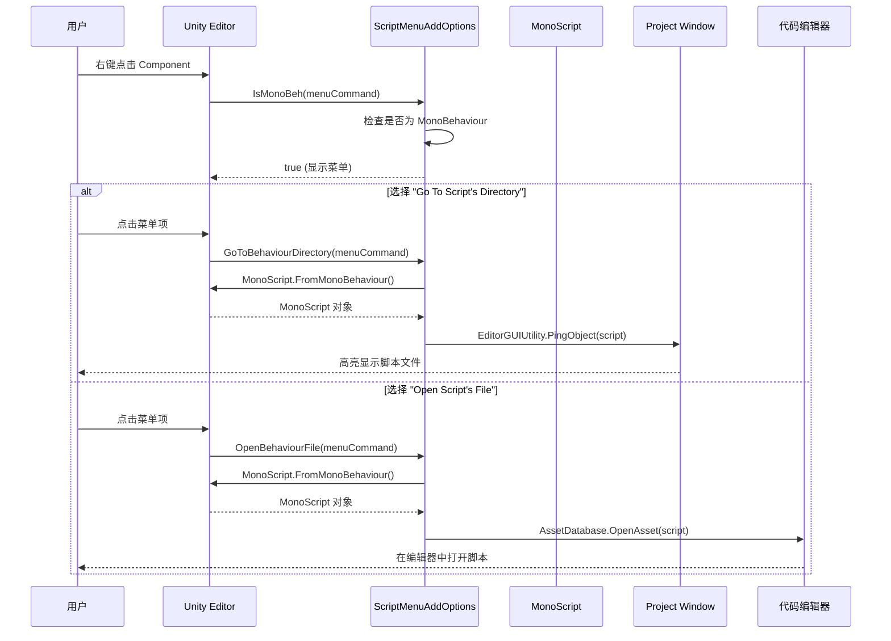
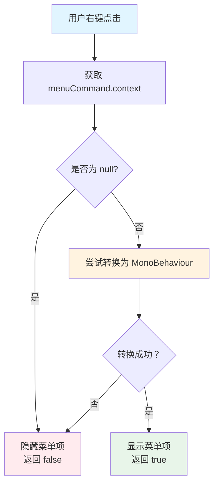

# ScriptMenuAddOptions.cs 注解文档

## 文件基本信息

| 属性 | 值 |
|------|-----|
| **文件名** | ScriptMenuAddOptions.cs |
| **路径** | Assets/Scripts/Editor/Common/Helper/ScriptMenuAddOptions.cs |
| **所属模块** | Editor 工具 → Common/Helper |
| **文件职责** | 为 Unity 编辑器 Inspector 中的 Component 添加右键菜单选项，快速定位和打开脚本文件 |

---

## 类/结构体说明

### ScriptMenuAddOptions

| 属性 | 说明 |
|------|------|
| **职责** | 扩展 Unity 编辑器 Inspector 中 Component 的右键上下文菜单，提供快速定位脚本所在目录和打开脚本文件的功能 |
| **泛型参数** | 无 |
| **继承关系** | 无继承 |
| **实现的接口** | 无 |

**设计模式**: 静态工具类 + Unity 编辑器上下文菜单扩展

```csharp
// 通过 CONTEXT 菜单扩展 Inspector 右键菜单
public static class ScriptMenuAddOptions
{
    // 右键菜单：定位脚本所在目录
    [MenuItem("CONTEXT/Component/Go To Script's Directory")]
    private static void GoToBehaviourDirectory(MenuCommand menuCommand) { ... }
    
    // 右键菜单：打开脚本文件
    [MenuItem("CONTEXT/Component/Open Script's File")]
    private static void OpenBehaviourFile(MenuCommand menuCommand) { ... }
}
```

---

## 方法说明（按重要程度排序）

### GoToBehaviourDirectory(MenuCommand menuCommand)

**签名**:
```csharp
[MenuItem("CONTEXT/Component/Go To Script's Directory")]
private static void GoToBehaviourDirectory(MenuCommand menuCommand)
```

**职责**: 在 Inspector 中右键点击 Component 时，定位到该 Component 关联的脚本文件所在目录

**核心逻辑**:
```
1. 从 menuCommand.context 获取目标 Component
2. 转换为 MonoBehaviour 类型
3. 使用 MonoScript.FromMonoBehaviour() 获取关联的脚本对象
4. 使用 EditorGUIUtility.PingObject() 在项目窗口中高亮显示脚本文件
```

**调用者**: Unity 编辑器右键菜单

**被调用者**: 无

**使用示例**:
```
1. 在 Inspector 中选择任意 MonoBehaviour 组件
2. 右键点击组件标题栏的 "Component" 文字
3. 选择 "Go To Script's Directory"
4. 项目窗口会自动滚动并高亮显示该组件的脚本文件
```

---

### OpenBehaviourFile(MenuCommand menuCommand)

**签名**:
```csharp
[MenuItem("CONTEXT/Component/Open Script's File")]
private static void OpenBehaviourFile(MenuCommand menuCommand)
```

**职责**: 在 Inspector 中右键点击 Component 时，直接在代码编辑器中打开该 Component 关联的脚本文件

**核心逻辑**:
```
1. 从 menuCommand.context 获取目标 Component
2. 转换为 MonoBehaviour 类型
3. 使用 MonoScript.FromMonoBehaviour() 获取关联的脚本对象
4. 使用 AssetDatabase.OpenAsset() 在代码编辑器中打开脚本
```

**调用者**: Unity 编辑器右键菜单

**被调用者**: 无

**使用示例**:
```
1. 在 Inspector 中选择任意 MonoBehaviour 组件
2. 右键点击组件标题栏的 "Component" 文字
3. 选择 "Open Script's File"
4. 脚本文件会在 Visual Studio / Rider 等代码编辑器中打开
```

---

### IsMonoBeh(MenuCommand menuCommand)

**签名**:
```csharp
[MenuItem("CONTEXT/Component/Go To Script's Directory", true)]
private static bool IsMonoBeh(MenuCommand menuCommand)
```

**职责**: 验证菜单项是否应该显示（仅当右键目标是 MonoBehaviour 时显示）

**核心逻辑**:
```
1. 从 menuCommand.context 获取目标对象
2. 检查是否为 null
3. 尝试转换为 MonoBehaviour
4. 转换成功返回 true，菜单项显示；失败返回 false，菜单项隐藏
```

**调用者**: Unity 编辑器菜单系统（自动调用）

**被调用者**: 无

**说明**: 
- 第二个参数为 `true` 的 MenuItem 是验证函数
- 验证函数返回 true 时，对应的菜单项才会显示
- 这样可以确保菜单只在 MonoBehaviour 组件上显示

---

### IsMonoBehOpen(MenuCommand menuCommand)

**签名**:
```csharp
[MenuItem("CONTEXT/Component/Open Script's File", true)]
private static bool IsMonoBehOpen(MenuCommand menuCommand)
```

**职责**: 验证 "Open Script's File" 菜单项是否应该显示

**核心逻辑**:
```
1. 直接调用 IsMonoBeh(menuCommand) 复用验证逻辑
2. 返回相同的验证结果
```

**调用者**: Unity 编辑器菜单系统（自动调用）

**被调用者**: `IsMonoBeh()`

---

## Mermaid 流程图

### 右键菜单操作流程



### 菜单验证流程



---

## 使用示例

### 实际使用场景

```
场景 1: 快速定位脚本
━━━━━━━━━━━━━━━━━━━━━━━━━━━━━━━━━━━━━━━
1. 在 Inspector 中看到某个 GameObject 上有 "PlayerController" 组件
2. 想知道这个脚本在哪里
3. 右键点击组件标题 → "Go To Script's Directory"
4. 项目窗口自动滚动到 Assets/Scripts/Game/Player/PlayerController.cs

场景 2: 快速编辑脚本
━━━━━━━━━━━━━━━━━━━━━━━━━━━━━━━━━━━━━━━
1. 运行游戏时发现某个组件行为异常
2. 想快速打开脚本查看代码
3. 右键点击组件标题 → "Open Script's File"
4. Visual Studio 自动打开对应的脚本文件
```

### 与其他工具的配合

```csharp
// 配合 ReferenceCollector 使用
// ReferenceCollector 可以收集 GameObject 上的所有脚本引用
// ScriptMenuAddOptions 可以快速打开这些脚本

// 工作流程:
// 1. 使用 ReferenceCollector 收集场景中所有使用的脚本
// 2. 在 Inspector 中查看某个组件
// 3. 右键 → Open Script's File 快速编辑
```

---

## 相关文档链接

- **同类工具**:
  - [FileCapacity.cs.md](./FileCapacity.cs.md) - 文件大小显示工具
  - [FileHelper.cs.md](./FileHelper.cs.md) - 文件操作工具类
  - [ImportUtil.cs.md](./ImportUtil.cs.md) - 资源导入工具

- **Editor 扩展**:
  - [ReferenceCollectorEditor.cs.md](../ReferenceCollectorEditor/ReferenceCollectorEditor.cs.md) - 引用收集器编辑器
  - [ReferenceCollector.cs.md](../../../Mono/Module/UI/ReferenceCollector.cs.md) - 引用收集器运行时

- **框架文档**:
  - [FRAMEWORK_ARCHITECTURE.md](../../../../FRAMEWORK_ARCHITECTURE.md) - 框架架构总览

---

## 注意事项与最佳实践

### ⚠️ 注意事项

| 问题 | 说明 | 解决方案 |
|------|------|----------|
| **非 MonoBehaviour** | 非 MonoBehaviour 的 Component 没有关联脚本 | 验证函数 IsMonoBeh 已处理，菜单不会显示 |
| **内置组件** | Unity 内置组件（如 Transform）没有脚本文件 | FromMonoBehaviour 返回 null，菜单项不执行 |
| **程序集定义** | 使用 Assembly Definition 的脚本可能不在预期位置 | PingObject 会正确定位，不受程序集影响 |

### 💡 最佳实践

```csharp
// ✅ 推荐：使用验证函数确保菜单只在合适的上下文显示
[MenuItem("CONTEXT/Component/Go To Script's Directory", true)]
private static bool IsMonoBeh(MenuCommand menuCommand)
{
    object comp = menuCommand.context;
    if (comp == null) return false;
    try
    {
        return (MonoBehaviour)comp != null;
    }
    catch
    {
        return false;
    }
}

// ✅ 推荐：使用 try-catch 处理类型转换异常
// 某些特殊 Component 可能无法安全转换

// ✅ 推荐：菜单项命名清晰
// "Go To Script's Directory" 比 "Find Script" 更明确
// "Open Script's File" 比 "Edit Script" 更准确
```

### 🔧 扩展建议

```csharp
// 扩展：添加更多实用的右键菜单选项
public static class ScriptMenuAddOptionsExtended
{
    // 在资源管理器中打开脚本所在文件夹
    [MenuItem("CONTEXT/Component/Show in Explorer")]
    private static void ShowInExplorer(MenuCommand menuCommand)
    {
        MonoBehaviour targetComponent = (MonoBehaviour)menuCommand.context;
        if (targetComponent)
        {
            MonoScript script = MonoScript.FromMonoBehaviour(targetComponent);
            if (script)
            {
                string path = AssetDatabase.GetAssetPath(script);
                EditorUtility.RevealInFinder(path);
            }
        }
    }
    
    // 复制脚本的完整路径
    [MenuItem("CONTEXT/Component/Copy Script Path")]
    private static void CopyScriptPath(MenuCommand menuCommand)
    {
        MonoBehaviour targetComponent = (MonoBehaviour)menuCommand.context;
        if (targetComponent)
        {
            MonoScript script = MonoScript.FromMonoBehaviour(targetComponent);
            if (script)
            {
                string path = AssetDatabase.GetAssetPath(script);
                EditorGUIUtility.systemCopyBuffer = path;
                Debug.Log($"已复制路径：{path}");
            }
        }
    }
    
    // 验证函数（复用）
    [MenuItem("CONTEXT/Component/Show in Explorer", true)]
    [MenuItem("CONTEXT/Component/Copy Script Path", true)]
    private static bool IsMonoBehExtended(MenuCommand menuCommand)
    {
        object comp = menuCommand.context;
        if (comp == null) return false;
        try
        {
            MonoBehaviour mb = (MonoBehaviour)comp;
            return mb != null && MonoScript.FromMonoBehaviour(mb) != null;
        }
        catch
        {
            return false;
        }
    }
}
```

---

## 菜单层级结构

```
Inspector 右键菜单
└─ Component (仅在 MonoBehaviour 上显示)
   ├─ Go To Script's Directory    ← 定位脚本文件
   └─ Open Script's File          ← 打开脚本编辑
```

---

*文档由 OpenClaw AI 助手自动生成 | 基于静态代码分析*
