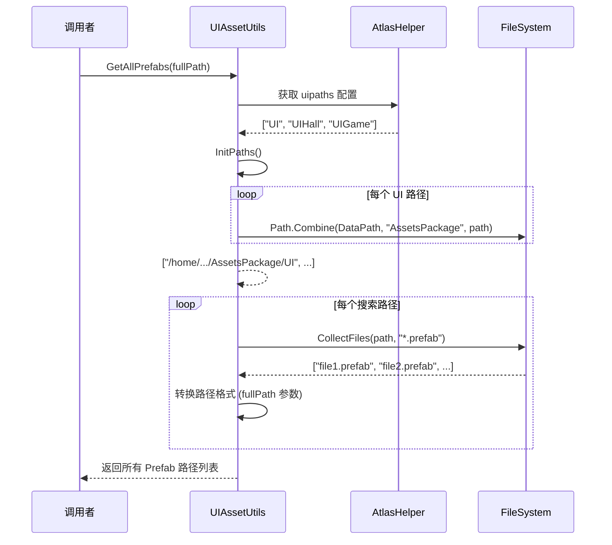
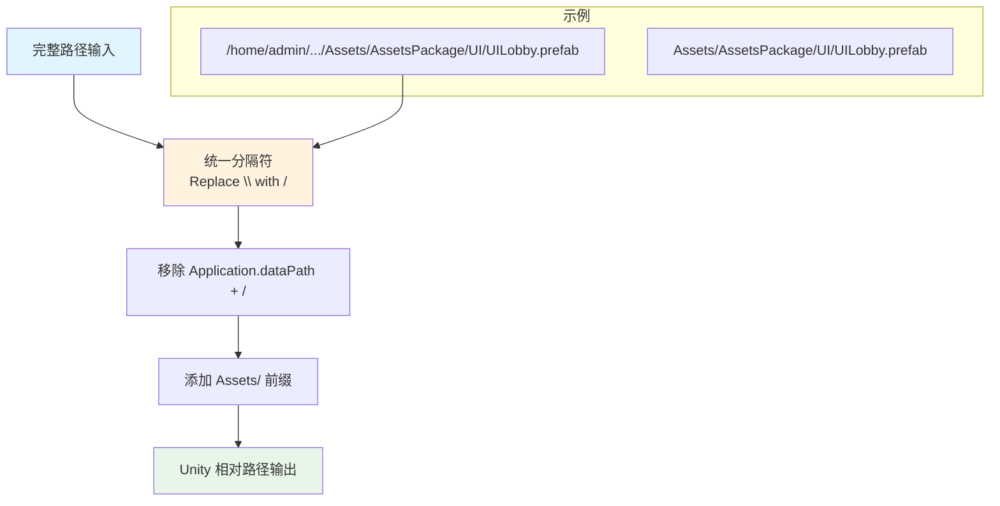
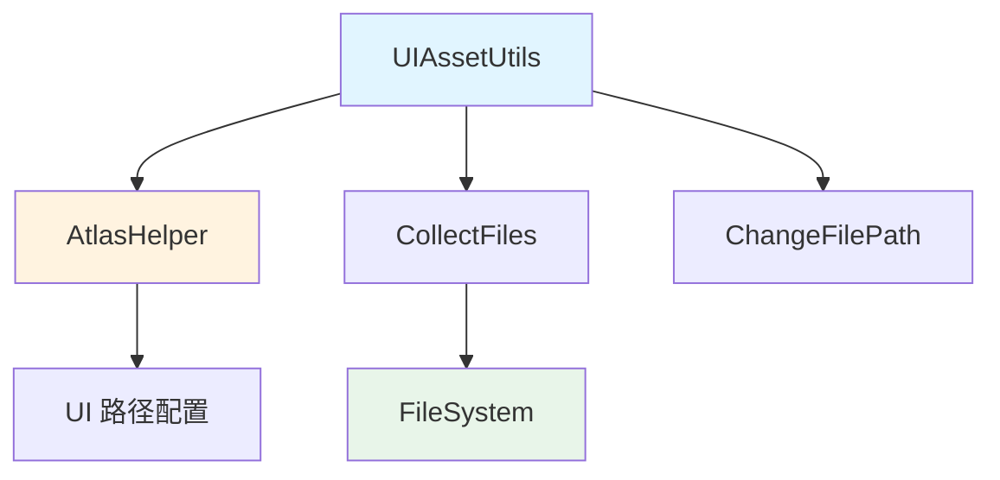

# UIAssetUtils.cs 注解文档

## 文件基本信息

| 属性 | 值 |
|------|-----|
| **文件名** | UIAssetUtils.cs |
| **路径** | Assets/Scripts/Editor/Common/Helper/UIAssetUtils.cs |
| **所属模块** | Editor 工具 → Common/Helper |
| **文件职责** | UI 资源工具类，提供 Prefab 和图片资源的批量收集功能 |

---

## 类/结构体说明

### UIAssetUtils

| 属性 | 说明 |
|------|------|
| **职责** | 收集和管理 UI 相关的资源文件（Prefab 和 Image），支持全路径和相对路径输出 |
| **泛型参数** | 无 |
| **继承关系** | 无继承 |
| **实现的接口** | 无 |

**设计模式**: 静态工具类

```csharp
// 依赖 AtlasHelper 中定义的 UI 路径配置
public class UIAssetUtils
{
    private static string[] paths => AtlasHelper.uipaths;
    
    // 获取所有 Prefab 路径
    public static List<string> GetAllPrefabs(bool fullPath = true) { ... }
    
    // 获取所有图片路径
    public static List<string> GetAllImages(bool fullPath = true) { ... }
}
```

---

## 字段与属性（按重要程度排序）

| 名称 | 类型 | 访问级别 | 说明 |
|------|------|----------|------|
| `paths` | `string[]` | `private static` | 从 AtlasHelper.uipaths 获取的 UI 目录路径数组 |

---

## 方法说明（按重要程度排序）

### GetAllPrefabs(bool fullPath)

**签名**:
```csharp
public static List<string> GetAllPrefabs(bool fullPath = true)
```

**职责**: 收集所有 UI 目录下的 Prefab 文件路径

**核心逻辑**:
```
1. 调用 InitPaths() 初始化搜索路径数组
   - 将相对路径转换为完整路径 (Application.dataPath + "AssetsPackage" + 路径)
2. 遍历每个搜索路径
3. 调用 CollectFiles(searchPath, "*.prefab") 收集 Prefab 文件
4. 根据 fullPath 参数决定返回全路径还是相对路径
   - fullPath=true: 返回完整文件系统路径
   - fullPath=false: 返回 Unity 相对路径 (Assets/...)
5. 返回所有 Prefab 路径列表
```

**调用者**: UI 资源管理工具、构建脚本、资源检查工具

**被调用者**: `InitPaths()`, `CollectFiles()`, `ChangeFilePath()`

**使用示例**:
```csharp
// 获取所有 UI Prefab 的相对路径（用于 AssetDatabase 操作）
List<string> prefabPaths = UIAssetUtils.GetAllPrefabs(fullPath: false);
foreach (string path in prefabPaths)
{
    // path 格式："Assets/AssetsPackage/UI/UILobby.prefab"
    GameObject prefab = AssetDatabase.LoadAssetAtPath<GameObject>(path);
}

// 获取所有 UI Prefab 的完整路径（用于文件系统操作）
List<string> fullPaths = UIAssetUtils.GetAllPrefabs(fullPath: true);
foreach (string path in fullPaths)
{
    // path 格式："/home/admin/.../Assets/AssetsPackage/UI/UILobby.prefab"
    FileInfo info = new FileInfo(path);
    Debug.Log($"文件大小：{info.Length} bytes");
}
```

---

### GetAllImages(bool fullPath)

**签名**:
```csharp
public static List<string> GetAllImages(bool fullPath = true)
```

**职责**: 收集所有 UI 目录下的图片文件（PNG 和 JPG）

**核心逻辑**:
```
1. 调用 InitPaths() 初始化搜索路径数组
2. 遍历每个搜索路径
3. 分别收集 "*.png" 和 "*.jpg" 文件
4. 合并到同一个列表
5. 根据 fullPath 参数转换路径格式
6. 返回所有图片路径列表
```

**调用者**: 图集打包工具、资源检查工具、图片优化脚本

**被调用者**: `InitPaths()`, `CollectFiles()`, `ChangeFilePath()`

**使用示例**:
```csharp
// 获取所有 UI 图片的相对路径
List<string> imagePaths = UIAssetUtils.GetAllImages(fullPath: false);
Debug.Log($"UI 图片总数：{imagePaths.Count}");

// 检查非 2 的幂次图片
foreach (string path in imagePaths)
{
    TextureImporter importer = AssetImporter.GetAtPath(path) as TextureImporter;
    if (importer != null)
    {
        // 检查尺寸...
    }
}
```

---

### CollectFiles(string directory, string format)

**签名**:
```csharp
public static string[] CollectFiles(string directory, string format)
```

**职责**: 收集指定目录下符合格式的所有文件

**核心逻辑**:
```
1. 检查目录是否存在，不存在返回 null
2. 使用 Directory.GetFiles(directory, format, SearchOption.AllDirectories)
   - 递归搜索所有子目录
   - 匹配指定格式（如 "*.prefab", "*.png"）
3. 返回文件路径数组
```

**调用者**: GetAllPrefabs(), GetAllImages()

**被调用者**: 无

**使用示例**:
```csharp
// 收集指定目录下的所有 PNG 文件
string[] pngFiles = UIAssetUtils.CollectFiles("Assets/AssetsPackage/UI", "*.png");

// 收集所有 Prefab
string[] prefabs = UIAssetUtils.CollectFiles("Assets/AssetsPackage", "*.prefab");
```

---

### ChangeFilePath(string path)

**签名**:
```csharp
public static string ChangeFilePath(string path)
```

**职责**: 将文件系统完整路径转换为 Unity 相对路径

**核心逻辑**:
```
1. 将路径分隔符统一为 "/" (Replace "\\\" with "/")
2. 移除 Application.dataPath + "/" 前缀
3. 添加 "Assets/" 前缀
4. 返回 Unity 相对路径
```

**调用者**: GetAllPrefabs(), GetAllImages()

**被调用者**: 无

**转换示例**:
```
输入：  "/home/admin/project/Assets/AssetsPackage/UI/UILobby.prefab"
步骤 1: "/home/admin/project/Assets/AssetsPackage/UI/UILobby.prefab" (无变化)
步骤 2: "AssetsPackage/UI/UILobby.prefab"
步骤 3: "Assets/AssetsPackage/UI/UILobby.prefab"
输出：  "Assets/AssetsPackage/UI/UILobby.prefab"
```

---

### InitPaths()

**签名**:
```csharp
private static string[] InitPaths()
```

**职责**: 初始化 UI 资源搜索路径数组

**核心逻辑**:
```
1. 从 AtlasHelper.uipaths 获取 UI 目录相对路径数组
2. 遍历每个相对路径
3. 使用 Path.Combine(Application.dataPath, "AssetsPackage", path) 构建完整路径
4. 返回完整路径数组
```

**调用者**: GetAllPrefabs(), GetAllImages()

**被调用者**: 无

**说明**:
- 依赖 AtlasHelper.uipaths 配置
- 典型配置可能包括："UI", "UIHall", "UIGame" 等目录

---

## Mermaid 流程图

### GetAllPrefabs 收集流程



### 路径转换流程



---

## 使用示例

### UI 资源统计工具

```csharp
using UnityEditor;
using UnityEngine;
using System.IO;

public class UIResourceStats
{
    [MenuItem("Tools/UI 资源统计")]
    public static void ShowStats()
    {
        // 获取所有 Prefab
        List<string> prefabs = UIAssetUtils.GetAllPrefabs(fullPath: false);
        
        // 获取所有图片
        List<string> images = UIAssetUtils.GetAllImages(fullPath: false);
        
        // 统计信息
        long totalPrefabSize = 0;
        long totalImageSize = 0;
        
        foreach (string path in prefabs)
        {
            string fullPath = Path.Combine(Application.dataPath, path.Replace("Assets/", ""));
            if (File.Exists(fullPath))
            {
                totalPrefabSize += new FileInfo(fullPath).Length;
            }
        }
        
        foreach (string path in images)
        {
            string fullPath = Path.Combine(Application.dataPath, path.Replace("Assets/", ""));
            if (File.Exists(fullPath))
            {
                totalImageSize += new FileInfo(fullPath).Length;
            }
        }
        
        // 显示统计
        Debug.Log($"=== UI 资源统计 ===");
        Debug.Log($"Prefab 数量：{prefabs.Count}");
        Debug.Log($"Prefab 总大小：{totalPrefabSize / 1024 / 1024.0:F2} MB");
        Debug.Log($"图片数量：{images.Count}");
        Debug.Log($"图片总大小：{totalImageSize / 1024 / 1024.0:F2} MB");
    }
}
```

### UI 资源检查工具

```csharp
public class UIResourceChecker
{
    [MenuItem("Tools/检查 UI 资源规范")]
    public static void CheckUIResources()
    {
        List<string> images = UIAssetUtils.GetAllImages(fullPath: false);
        
        foreach (string path in images)
        {
            TextureImporter importer = AssetImporter.GetAtPath(path) as TextureImporter;
            if (importer != null)
            {
                // 检查是否为 2 的幂次
                int width = importer.maxTextureSize;
                int height = importer.maxTextureSize;
                
                if (!ImportUtil.WidthAndHeightIsPowerOfTwo(width, height))
                {
                    Debug.LogWarning($"非 2 的幂次：{path} ({width}x{height})");
                }
                
                // 检查导入格式
                if (importer.textureFormat != TextureImporterFormat.ASTC_4x4 &&
                    importer.textureFormat != TextureImporterFormat.DXT5)
                {
                    Debug.LogWarning($"未使用压缩格式：{path}");
                }
            }
        }
        
        // 检查 Prefab
        List<string> prefabs = UIAssetUtils.GetAllPrefabs(fullPath: false);
        foreach (string path in prefabs)
        {
            GameObject prefab = AssetDatabase.LoadAssetAtPath<GameObject>(path);
            if (prefab != null)
            {
                // 检查是否有缺失的引用
                Component[] components = prefab.GetComponentsInChildren<Component>();
                foreach (Component comp in components)
                {
                    if (comp == null)
                    {
                        Debug.LogError($"Prefab 缺失组件引用：{path}");
                    }
                }
            }
        }
    }
}
```

---

## 相关文档链接

- **同类工具**:
  - [FileCapacity.cs.md](./FileCapacity.cs.md) - 文件大小显示工具
  - [FileHelper.cs.md](./FileHelper.cs.md) - 文件操作工具类
  - [ImportUtil.cs.md](./ImportUtil.cs.md) - 资源导入工具

- **Atlas 工具**:
  - [AtlasHelper.cs.md](../../ArtEditor/Atlas/AtlasHelper.cs.md) - 图集工具（UIAssetUtils 依赖此文件）

- **UI 系统**:
  - [UIManager.cs.md](../../../../Mono/Module/UI/UIManager.cs.md) - UI 管理器
  - [UILoadingView.cs.md](../../../../Code/Game/UI/UILoading/UILoadingView.cs.md) - 加载界面

- **框架文档**:
  - [FRAMEWORK_ARCHITECTURE.md](../../../../FRAMEWORK_ARCHITECTURE.md) - 框架架构总览

---

## 注意事项与最佳实践

### ⚠️ 注意事项

| 问题 | 说明 | 解决方案 |
|------|------|----------|
| **依赖 AtlasHelper** | UIAssetUtils 依赖 AtlasHelper.uipaths 配置 | 确保 AtlasHelper 正确配置 UI 目录路径 |
| **路径格式** | Windows 和 macOS/Linux 路径分隔符不同 | ChangeFilePath 已统一处理为 "/" |
| **性能** | 递归搜索大目录可能耗时 | 避免在 Update 中调用，使用缓存结果 |
| **文件扩展名** | 仅支持 .png 和 .jpg | 如需其他格式（.psd, .tga）需修改 GetAllImages |

### 💡 最佳实践

```csharp
// ✅ 推荐：缓存结果避免重复搜索
private static List<string> cachedPrefabs;
private static List<string> cachedImages;

public static List<string> GetAllPrefabsCached(bool forceRefresh = false)
{
    if (cachedPrefabs == null || forceRefresh)
    {
        cachedPrefabs = GetAllPrefabs(fullPath: false);
    }
    return cachedPrefabs;
}

// ✅ 推荐：使用相对路径进行 AssetDatabase 操作
List<string> prefabs = UIAssetUtils.GetAllPrefabs(fullPath: false);
foreach (string path in prefabs)
{
    // 直接使用相对路径加载
    GameObject prefab = AssetDatabase.LoadAssetAtPath<GameObject>(path);
}

// ✅ 推荐：批量操作前检查目录存在性
string[] paths = UIAssetUtils.CollectFiles("Assets/AssetsPackage/UI", "*.prefab");
if (paths != null && paths.Length > 0)
{
    // 执行批量操作
}
```

### 🔧 扩展建议

```csharp
// 扩展：支持更多文件类型
public static class UIAssetUtilsExtended
{
    // 获取所有 UI 相关的资源（Prefab + 图片 + 材质 + 动画）
    public static Dictionary<string, List<string>> GetAllUIAssets()
    {
        var result = new Dictionary<string, List<string>>();
        
        result["prefabs"] = UIAssetUtils.GetAllPrefabs(fullPath: false);
        result["images"] = UIAssetUtils.GetAllImages(fullPath: false);
        result["materials"] = CollectAllFiles("*.mat");
        result["animations"] = CollectAllFiles("*.anim");
        result["controllers"] = CollectAllFiles("*.controller");
        
        return result;
    }
    
    private static List<string> CollectAllFiles(string pattern)
    {
        List<string> result = new List<string>();
        string[] paths = /* 从 AtlasHelper 获取 */;
        
        foreach (string path in paths)
        {
            string fullPath = Path.Combine(Application.dataPath, "AssetsPackage", path);
            string[] files = Directory.GetFiles(fullPath, pattern, SearchOption.AllDirectories);
            
            foreach (string file in files)
            {
                result.Add(UIAssetUtils.ChangeFilePath(file));
            }
        }
        
        return result;
    }
    
    // 获取 UI 资源总大小
    public static long GetTotalSize()
    {
        long totalSize = 0;
        
        foreach (string path in GetAllPrefabs(fullPath: false))
        {
            string fullPath = Path.Combine(Application.dataPath, path.Replace("Assets/", ""));
            if (File.Exists(fullPath))
            {
                totalSize += new FileInfo(fullPath).Length;
            }
        }
        
        foreach (string path in GetAllImages(fullPath: false))
        {
            string fullPath = Path.Combine(Application.dataPath, path.Replace("Assets/", ""));
            if (File.Exists(fullPath))
            {
                totalSize += new FileInfo(fullPath).Length;
            }
        }
        
        return totalSize;
    }
}
```

---

## 依赖关系



---

*文档由 OpenClaw AI 助手自动生成 | 基于静态代码分析*
