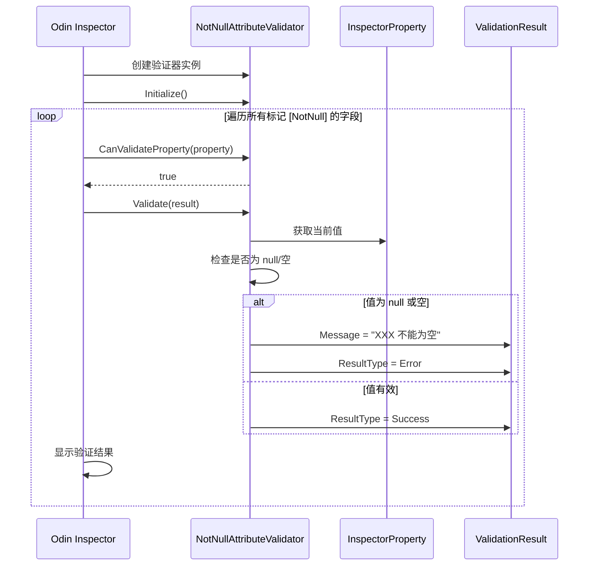

# NotNullAttributeValidator.cs 注解文档

## 文件基本信息

| 属性 | 值 |
|------|-----|
| **文件名** | NotNullAttributeValidator.cs |
| **路径** | Assets/Scripts/Editor/Common/Odin/NotNullAttributeValidator.cs |
| **所属模块** | Editor 工具 → Common/Odin |
| **文件职责** | Odin Inspector 自定义属性验证器，验证字段不能为空 |

---

## 类/结构体说明

### NotNullAttributeValidator

| 属性 | 说明 |
|------|------|
| **职责** | 验证标记了 `[NotNull]` 特性的字段，确保其值不为 null 或空字符串 |
| **泛型参数** | 无 |
| **继承关系** | 继承自 `Sirenix.OdinInspector.Editor.Validation.AttributeValidator<NotNullAttribute>` |
| **编译条件** | `#if ODIN_INSPECTOR` |
| **命名空间** | `TaoTie` |

**设计模式**: 验证器模式

```csharp
[assembly: RegisterValidator(typeof(NotNullAttributeValidator))]

namespace TaoTie
{
    public class NotNullAttributeValidator : AttributeValidator<NotNullAttribute>
    {
        // 验证逻辑
    }
}
```

---

## 程序集特性

### RegisterValidator

```csharp
[assembly: RegisterValidator(typeof(NotNullAttributeValidator))]
```

**说明**:
- 程序集级别的特性标记
- 注册自定义验证器到 Odin Inspector
- 使 Odin 在验证时自动发现并使用该验证器

**位置**: 必须在 `namespace` 外部，文件顶部

---

## 字段与属性（继承自基类）

| 名称 | 类型 | 访问级别 | 说明 |
|------|------|----------|------|
| `Property` | `InspectorProperty` | `protected` | 当前正在验证的属性 (继承自基类) |
| `Attribute` | `NotNullAttribute` | `protected` | 当前的属性特性 (继承自基类) |

---

## 方法说明（按重要程度排序）

### CanValidateProperty()

**签名**:
```csharp
public override bool CanValidateProperty(InspectorProperty property)
```

**职责**: 判断是否可以验证指定属性

**返回值**:
- `true` - 验证所有属性
- `false` - 跳过该属性

**核心逻辑**:
```
1. 始终返回 true
2. 验证所有标记了 [NotNull] 的属性
```

**调用者**: Odin Inspector 验证系统

---

### Initialize()

**签名**:
```csharp
protected override void Initialize()
```

**职责**: 验证器初始化

**核心逻辑**:
```
1. 调用基类 Initialize()
2. 可在此处添加自定义初始化逻辑
```

**调用者**: Odin Inspector 验证系统 (验证器创建时)

---

### Validate()

**签名**:
```csharp
protected override void Validate(ValidationResult result)
```

**职责**: 执行实际验证逻辑

**参数**:
- `result`: 验证结果对象，用于设置验证状态和错误消息

**核心逻辑**:
```
1. 获取属性的当前值 (Property.BaseValueEntry.WeakSmartValue)
2. 检查值是否为 null
3. 检查值是否为空字符串 (仅 string 类型)
4. 如果验证失败:
   - 设置错误消息
   - 设置验证结果为 Error
```

**调用者**: Odin Inspector 验证系统

**验证规则**:
```csharp
if (Property.BaseValueEntry.WeakSmartValue == null ||
    (Property.BaseValueEntry.WeakSmartValue is string strVal && 
     string.IsNullOrWhiteSpace(strVal)))
{
    result.Message = Property.NiceName + "不能为空";
    result.ResultType = ValidationResultType.Error;
}
```

---

## 验证结果类型

### ValidationResultType

| 类型 | 说明 | 显示效果 |
|------|------|----------|
| `Error` | 错误，必须修复 | 🔴 红色错误图标 |
| `Warning` | 警告，建议修复 | 🟡 黄色警告图标 |
| `Info` | 信息提示 | 🔵 蓝色信息图标 |

---

## 使用示例

### 1. 定义 NotNull 特性

```csharp
// 首先定义 NotNull 特性
public class NotNullAttribute : Attribute
{
    // 可以是空特性，仅作为标记
}
```

### 2. 在字段上使用

```csharp
public class PlayerConfig : MonoBehaviour
{
    [NotNull]
    public string playerName;
    
    [NotNull]
    public GameObject playerPrefab;
    
    [NotNull]
    public AudioClip jumpSound;
}
```

### 3. Inspector 显示效果

**验证通过**:
```
┌─────────────────────────────────┐
│ Player Config                   │
├─────────────────────────────────┤
│ Player Name: [Player1_______]   │
│ Player Prefab: [Player.prefab]  │
│ Jump Sound: [jump.wav_______]   │
└─────────────────────────────────┘
```

**验证失败**:
```
┌─────────────────────────────────┐
│ Player Config                   │
├─────────────────────────────────┤
│ 🔴 Player Name 不能为空         │
│ Player Name: [_______________]  │
│                                 │
│ 🔴 Player Prefab 不能为空       │
│ Player Prefab: [None________]   │
└─────────────────────────────────┘
```

---

## 验证流程



---

## 技术要点

### 1. 属性值获取

```csharp
Property.BaseValueEntry.WeakSmartValue
```

**说明**:
- `BaseValueEntry` - 属性值入口
- `WeakSmartValue` - 智能值 (支持各种类型)
- 返回 `object` 类型，需要类型检查

### 2. 类型检查

```csharp
if (Property.BaseValueEntry.WeakSmartValue == null ||
    (Property.BaseValueEntry.WeakSmartValue is string strVal && 
     string.IsNullOrWhiteSpace(strVal)))
```

**说明**:
- 首先检查是否为 `null`
- 如果是 `string` 类型，额外检查是否为空字符串或空白字符

### 3. 属性名称获取

```csharp
Property.NiceName
```

**说明**:
- 获取属性的友好名称
- 自动将 `playerName` 转换为 "Player Name"
- 支持 `[LabelText]` 等特性自定义名称

### 4. 编译条件

```csharp
#if ODIN_INSPECTOR
// Odin 相关代码
#endif
```

**说明**:
- 只在定义了 `ODIN_INSPECTOR` 符号时编译
- 避免在没有 Odin 的项目中产生编译错误

---

## 扩展建议

### 1. 添加警告级别

```csharp
protected override void Validate(ValidationResult result)
{
    if (Property.BaseValueEntry.WeakSmartValue == null)
    {
        result.Message = Property.NiceName + "不能为空";
        result.ResultType = ValidationResultType.Error;
    }
    else if (Property.BaseValueEntry.WeakSmartValue is string strVal && 
             string.IsNullOrWhiteSpace(strVal))
    {
        result.Message = Property.NiceName + "不应为空字符串";
        result.ResultType = ValidationResultType.Warning;  // 警告而非错误
    }
}
```

### 2. 支持更多类型

```csharp
protected override void Validate(ValidationResult result)
{
    var value = Property.BaseValueEntry.WeakSmartValue;
    
    if (value == null)
    {
        result.Message = Property.NiceName + "不能为空";
        result.ResultType = ValidationResultType.Error;
    }
    else if (value is string str && string.IsNullOrWhiteSpace(str))
    {
        result.Message = Property.NiceName + "不能为空字符串";
        result.ResultType = ValidationResultType.Error;
    }
    else if (value is ICollection collection && collection.Count == 0)
    {
        result.Message = Property.NiceName + "集合不能为空";
        result.ResultType = ValidationResultType.Warning;
    }
}
```

### 3. 自定义错误消息

```csharp
public class NotNullAttribute : Attribute
{
    public string Message { get; set; }
}

// 使用
[NotNull(Message = "玩家名称是必填项")]
public string playerName;
```

---

## 相关文档

- [OdinGenerate.cs.md](./OdinGenerate.cs.md) - Odin 初始化工具
- [Odin Inspector 验证文档](https://odininspector.com/documentation/validator-attributes) - 官方验证器文档
- [AttributeValidator 文档](https://odininspector.com/documentation/api/Sirenix.OdinInspector.Editor.Validation.AttributeValidator)

---

*文档生成时间：2026-03-03 | OpenClaw AI 助手*
