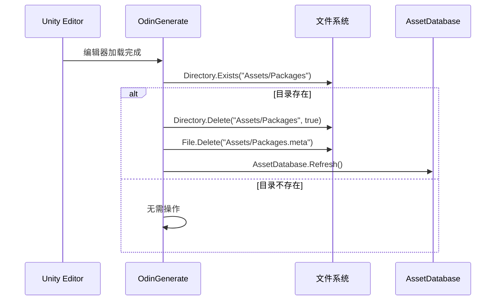

# OdinGenerate.cs 注解文档

## 文件基本信息

| 属性 | 值 |
|------|-----|
| **文件名** | OdinGenerate.cs |
| **路径** | Assets/Scripts/Editor/Common/Odin/OdinGenerate.cs |
| **所属模块** | Editor 工具 → Common/Odin |
| **文件职责** | Odin Inspector 初始化清理脚本，防止 Packages 目录重复生成 |

---

## 类/结构体说明

### OdinGenerate

| 属性 | 说明 |
|------|------|
| **职责** | 在 Unity 编辑器加载时自动清理 Assets/Packages 目录，避免 Odin 重复生成代码 |
| **泛型参数** | 无 |
| **继承关系** | 静态类 |
| **编译条件** | `#if ODIN_INSPECTOR` |
| **命名空间** | `TaoTie` |

**设计模式**: 初始化钩子模式

```csharp
namespace TaoTie
{
    public static class OdinGenerate
    {
        [InitializeOnLoadMethod]
        private static void InitializeOnLoadMethod()
        {
            // 清理逻辑
        }
    }
}
```

---

## 方法说明

### InitializeOnLoadMethod()

**签名**:
```csharp
[InitializeOnLoadMethod]
private static void InitializeOnLoadMethod()
```

**职责**: Unity 编辑器加载时自动执行，清理 Odin 生成的 Packages 目录

**核心逻辑**:
```
1. 检查 Assets/Packages 目录是否存在
2. 如果存在，删除整个目录及其内容
3. 删除 Assets/Packages.meta 文件
4. 刷新资源数据库
```

**调用者**: Unity 编辑器生命周期 (编辑器启动/编译完成后)

**特性说明**:
```csharp
[InitializeOnLoadMethod]
```
- Unity 编辑器特性
- 标记的方法在编辑器加载完成后自动执行
- 无需手动调用

---

## 问题背景

### Odin Inspector 代码生成

**问题**: Odin Inspector 会在 `Assets/Packages` 目录自动生成序列化代码

**影响**:
1. 与项目自身的 Packages 管理冲突
2. 生成大量不必要的文件
3. 增加版本控制负担
4. 可能导致编译错误

**解决方案**: 在编辑器加载时自动清理该目录

---

## 清理流程



---

## 技术要点

### 1. InitializeOnLoadMethod 特性

```csharp
[InitializeOnLoadMethod]
private static void InitializeOnLoadMethod()
```

**说明**:
- Unity 编辑器专用特性
- 标记的方法在编辑器启动或编译完成后自动执行
- 必须是 `static` 方法
- 常用于编辑器初始化、资源预处理等场景

**类似特性**:
- `[InitializeOnLoad]` - 类级别，静态构造函数执行
- `[RuntimeInitializeOnLoadMethod]` - 运行时执行

### 2. 目录删除

```csharp
if (Directory.Exists("Assets/Packages"))
{
    Directory.Delete("Assets/Packages", true);
    File.Delete("Assets/Packages.meta");
    AssetDatabase.Refresh();
}
```

**参数说明**:
- `true` - 递归删除子目录和文件
- 删除 `.meta` 文件避免 Unity 残留引用

### 3. 编译条件

```csharp
#if ODIN_INSPECTOR
// Odin 相关代码
#endif
```

**说明**:
- 只在定义了 `ODIN_INSPECTOR` 符号时编译
- 避免在没有 Odin 的项目中产生编译错误
- 符号通常在 Unity Player Settings 或 asmdef 中定义

---

## Odin Inspector 简介

### 什么是 Odin Inspector?

Odin Inspector 是一个 Unity 编辑器扩展插件，提供:
- 强大的属性特性系统
- 自定义 Inspector 界面
- 序列化增强
- 代码生成器

### 官方网站

- [Odin Inspector](https://odininspector.com/)
- [Asset Store](https://assetstore.unity.com/packages/tools/utilities/odin-inspector-and-serializer-89041)

---

## 注意事项

### 1. 删除风险

```csharp
Directory.Delete("Assets/Packages", true);
```

**注意**: 会删除整个 `Assets/Packages` 目录及其所有内容

**前提**: 确认该目录确实是 Odin 生成的，而非项目自身的 Packages 目录

**项目自身的 Packages 目录**: 通常在项目根目录 `Packages/manifest.json`

### 2. 刷新资源数据库

```csharp
AssetDatabase.Refresh();
```

**说明**: 删除文件后必须刷新，否则 Unity 仍会显示已删除的文件

### 3. 编译条件检查

确保项目已安装 Odin Inspector 并定义了 `ODIN_INSPECTOR` 符号:

```csharp
#if ODIN_INSPECTOR
// 只在有 Odin 时编译
#endif
```

---

## 扩展建议

### 添加日志输出

```csharp
[InitializeOnLoadMethod]
private static void InitializeOnLoadMethod()
{
    if (Directory.Exists("Assets/Packages"))
    {
        Debug.Log("[OdinGenerate] 清理 Odin 生成的 Packages 目录...");
        Directory.Delete("Assets/Packages", true);
        File.Delete("Assets/Packages.meta");
        AssetDatabase.Refresh();
        Debug.Log("[OdinGenerate] 清理完成");
    }
}
```

### 添加安全确认

```csharp
[InitializeOnLoadMethod]
private static void InitializeOnLoadMethod()
{
    // 只删除 Odin 生成的特定文件
    var odinGeneratedPath = "Assets/Packages/OdinGenerated";
    if (Directory.Exists(odinGeneratedPath))
    {
        Directory.Delete(odinGeneratedPath, true);
        AssetDatabase.Refresh();
    }
}
```

---

## 相关文档

- [NotNullAttributeValidator.cs.md](./NotNullAttributeValidator.cs.md) - Odin 属性验证器
- [Odin Inspector 文档](https://odininspector.com/documentation) - 官方文档
- [InitializeOnLoadMethod 文档](https://docs.unity3d.com/ScriptReference/InitializeOnLoadMethodAttribute.html) - Unity API

---

*文档生成时间：2026-03-03 | OpenClaw AI 助手*
