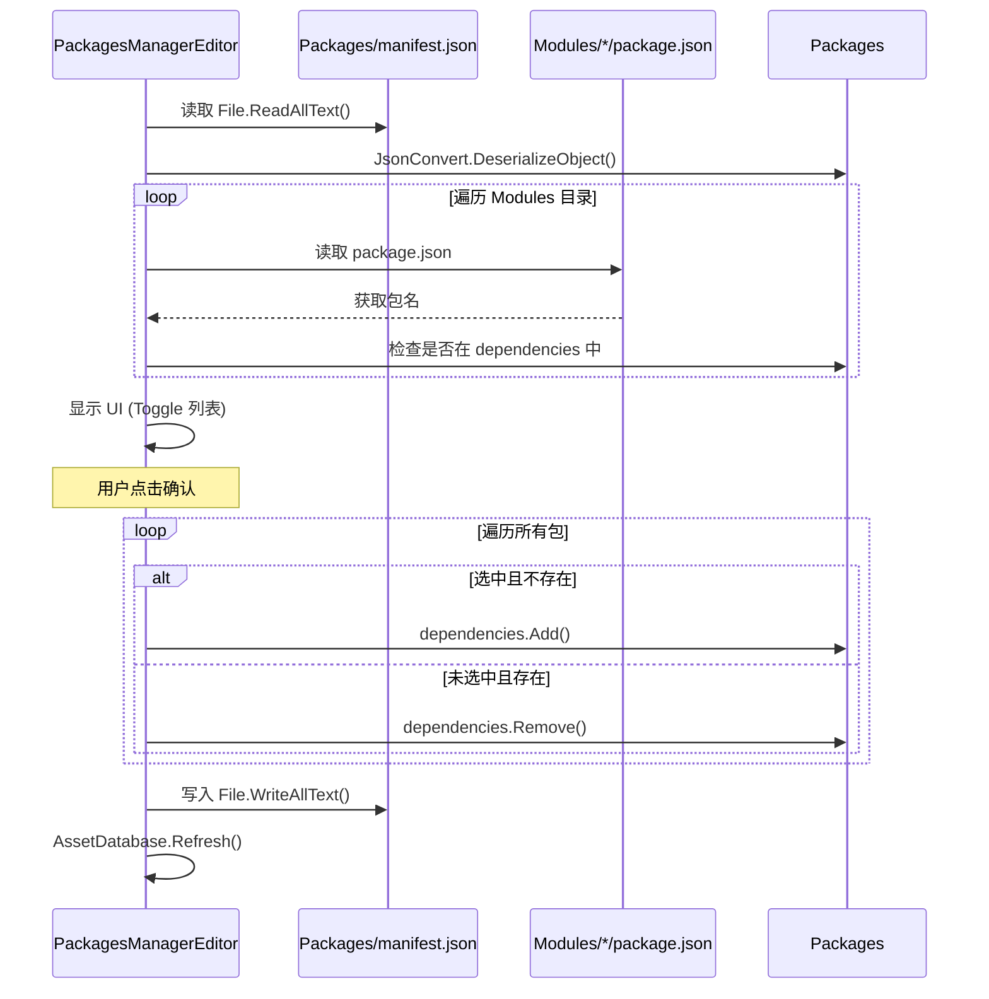

# Packages.cs 注解文档

## 文件基本信息

| 属性 | 值 |
|------|-----|
| **文件名** | Packages.cs |
| **路径** | Assets/Scripts/Editor/Common/PackagesManager/Packages.cs |
| **所属模块** | Editor 工具 → Common/PackagesManager |
| **文件职责** | Unity Packages manifest.json 的数据模型，表示依赖关系 |

---

## 类/结构体说明

### Packages

| 属性 | 说明 |
|------|------|
| **职责** | 表示 Unity Packages/manifest.json 文件的数据结构 |
| **泛型参数** | 无 |
| **继承关系** | 无 |
| **命名空间** | `TaoTie` |

**设计模式**: 数据模型 (DTO)

```csharp
namespace TaoTie
{
    public class Packages
    {
        public Dictionary<string, string> dependencies;
    }
}
```

---

## 字段与属性

| 名称 | 类型 | 访问级别 | 说明 |
|------|------|----------|------|
| `dependencies` | `Dictionary<string, string>` | `public` | 包依赖关系字典，key=包名，value=包版本/路径 |

---

## JSON 结构示例

### manifest.json 格式

```json
{
  "dependencies": {
    "com.unity.modules.ai": "1.0.0",
    "com.unity.modules.animation": "1.0.0",
    "com.unity.modules.assetbundle": "1.0.0",
    "com.unity.modules.audio": "1.0.0",
    "com.taotie.framework": "file:../Framework",
    "com.taotie.game": "file:../Game"
  }
}
```

### 反序列化后

```csharp
var packages = JsonConvert.DeserializeObject<Packages>(jsonString);

// packages.dependencies 内容:
// {
//     "com.unity.modules.ai": "1.0.0",
//     "com.unity.modules.animation": "1.0.0",
//     "com.taotie.framework": "file:../Framework",
//     "com.taotie.game": "file:../Game"
// }
```

---

## 依赖类型

### 1. 官方包 (版本字符串)

```json
"com.unity.modules.ai": "1.0.0"
```

**说明**: Unity 官方包，使用语义化版本号

### 2. 本地包 (文件路径)

```json
"com.taotie.framework": "file:../Framework"
```

**说明**: 本地开发包，使用相对路径引用

**路径规则**:
- 相对于 `Packages` 目录
- `file:../Framework` 指向项目根目录的 Framework 文件夹
- `file:../../Shared` 指向项目外部的 Shared 文件夹

### 3. Git 包 (URL)

```json
"com.example.package": "https://github.com/user/repo.git#v1.0.0"
```

**说明**: Git 仓库包，可指定分支/标签/提交哈希

---

## 使用场景

### 1. PackagesManagerEditor 读取

```csharp
// PackagesManagerEditor.cs
private const string packages = "Packages/manifest.json";

private void OnEnable()
{
    // 读取 manifest.json
    info = JsonConvert.DeserializeObject<Packages>(
        File.ReadAllText(packages)
    );
    
    // 访问依赖关系
    var deps = info.dependencies;
}
```

### 2. 添加依赖

```csharp
// 添加新依赖
if (!info.dependencies.ContainsKey(packageName))
{
    info.dependencies.Add(
        packageName, 
        "file:../" + sourcePath
    );
}
```

### 3. 移除依赖

```csharp
// 移除依赖
if (info.dependencies.ContainsKey(packageName))
{
    info.dependencies.Remove(packageName);
}
```

### 4. 保存修改

```csharp
// 序列化并保存
File.WriteAllText(
    packages, 
    JsonConvert.SerializeObject(info, new JsonSerializerSettings
    {
        Formatting = Formatting.Indented,
    })
);
AssetDatabase.Refresh();
```

---

## 与 Package.cs 的关系

### Packages.cs (本文件)

```csharp
public class Packages
{
    public Dictionary<string, string> dependencies;
}
```

**职责**: 表示整个 manifest.json 文件

### Package.cs

```csharp
public class Package
{
    public string name;
}
```

**职责**: 表示单个本地包的 package.json 文件

**关系图**:
```
Packages (manifest.json)
    └─ dependencies: Dictionary<包名，版本/路径>
           │
           └─ 每个包名对应一个 Package (package.json)
                  └─ name: 包名
```

---

## 完整使用流程

### PackagesManagerEditor 工作流程



---

## 技术要点

### 1. JSON 序列化/反序列化

```csharp
// 反序列化 (JSON → 对象)
var packages = JsonConvert.DeserializeObject<Packages>(jsonString);

// 序列化 (对象 → JSON)
var json = JsonConvert.SerializeObject(packages, new JsonSerializerSettings
{
    Formatting = Formatting.Indented,  // 美化输出
});
```

### 2. Dictionary 操作

```csharp
// 检查是否存在
if (dependencies.ContainsKey(key)) { }

// 添加
dependencies.Add(key, value);

// 移除
dependencies.Remove(key);

// 获取值
if (dependencies.TryGetValue(key, out var value)) { }
```

### 3. 文件路径

```csharp
// manifest.json 路径 (相对于项目根目录)
private const string packages = "Packages/manifest.json";

// 完整路径 (Unity 自动解析)
var fullPath = Path.Combine(Application.dataPath, "../Packages/manifest.json");
```

---

## 相关文档

- [Package.cs.md](./Package.cs.md) - 单个包的数据模型
- [PackagesManagerEditor.cs.md](./PackagesManagerEditor.cs.md) - 包管理编辑器工具
- [Unity Package Manager 文档](https://docs.unity3d.com/Manual/upm-manifestPrj.html) - manifest.json 官方文档

---

*文档生成时间：2026-03-03 | OpenClaw AI 助手*
