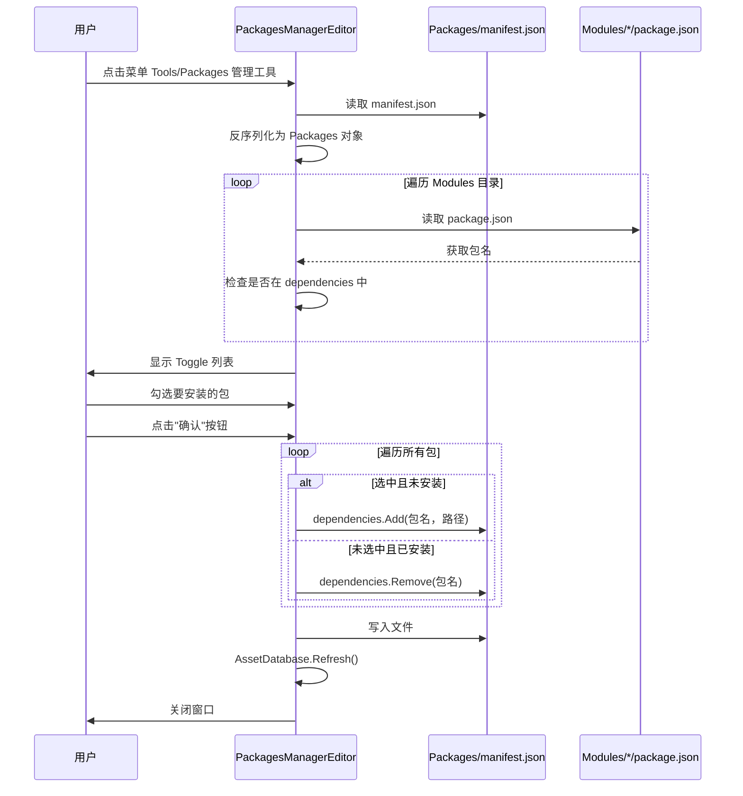

# PackagesManagerEditor.cs 注解文档

## 文件基本信息

| 属性 | 值 |
|------|-----|
| **文件名** | PackagesManagerEditor.cs |
| **路径** | Assets/Scripts/Editor/Common/PackagesManager/PackagesManagerEditor.cs |
| **所属模块** | Editor 工具 → Common/PackagesManager |
| **文件职责** | Unity 包管理编辑器工具，提供可视化界面管理 Packages/manifest.json 依赖 |

---

## 类/结构体说明

### PackagesManagerEditor

| 属性 | 说明 |
|------|------|
| **职责** | 提供 Unity 编辑器窗口，可视化管理 Unity 包依赖关系 |
| **泛型参数** | 无 |
| **继承关系** | 继承自 `UnityEditor.EditorWindow` |
| **命名空间** | `TaoTie` |

**设计模式**: 编辑器窗口模式

```csharp
namespace TaoTie
{
    public class PackagesManagerEditor : EditorWindow
```

---

## 字段与属性（按重要程度排序）

| 名称 | 类型 | 访问级别 | 说明 |
|------|------|----------|------|
| `packages` | `const string` | `private const` | manifest.json 文件路径："Packages/manifest.json" |
| `Source` | `string` | `private` | 本地包仓库路径，默认"Modules" |
| `scrollPos` | `Vector2` | `private` | 滚动视图位置 |
| `temp` | `Dictionary<string, bool>` | `private` | 临时存储包的选中状态 (包名→是否安装) |
| `tempPath` | `Dictionary<string, string>` | `private` | 临时存储包名到目录名的映射 |
| `info` | `Packages` | `private` | manifest.json 反序列化后的数据对象 |

---

## 方法说明（按重要程度排序）

### ShowWindow()

**签名**:
```csharp
[MenuItem("Tools/Packages 管理工具")]
public static void ShowWindow()
```

**职责**: 显示编辑器窗口

**核心逻辑**:
```
1. 调用 GetWindow() 创建/显示窗口
```

**调用者**: Unity 编辑器菜单 "Tools/Packages 管理工具"

**菜单路径**:
```
Unity 顶部菜单 → Tools → Packages 管理工具
```

---

### OnEnable()

**签名**:
```csharp
private void OnEnable()
```

**职责**: 窗口启用时初始化，加载 manifest.json 和本地包信息

**核心逻辑**:
```
1. 读取 Packages/manifest.json 文件
2. 反序列化为 Packages 对象
3. 清空临时字典 temp 和 tempPath
4. 遍历 Source 目录 (默认"Modules") 下的所有子目录
5. 读取每个子目录的 package.json
6. 检查该包是否已在 manifest.json 的 dependencies 中
7. 将包名和选中状态存入 temp 字典
```

**调用者**: Unity 编辑器生命周期 (窗口打开时)

---

### OnGUI()

**签名**:
```csharp
private void OnGUI()
```

**职责**: 绘制编辑器窗口界面

**核心逻辑**:
```
1. 绘制 Source 路径输入框
2. 检查 Source 目录是否存在
3. 获取所有子目录 (本地包)
4. 绘制滚动视图
5. 遍历所有包，绘制 Toggle 复选框
6. 绘制"确认"按钮
7. 点击确认时：
   - 遍历 temp 字典
   - 选中的包：添加到 dependencies
   - 未选中的包：从 dependencies 移除
   - 刷新资源数据库
   - 关闭窗口
```

**调用者**: Unity 编辑器生命周期 (窗口重绘时)

**界面布局**:
```
┌─────────────────────────────────────────────────────┐
│ 仓库路径：[Modules________________]                 │
│                                                     │
│ ┌─────────────────────────────────────────────────┐ │
│ │ ☐ com.taotie.framework                          │ │
│ │ ☑ com.taotie.game                               │ │
│ │ ☐ com.unity.modules.ai                          │ │
│ │ ☑ com.unity.textmeshpro                         │ │
│ │ ...                                             │ │
│ └─────────────────────────────────────────────────┘ │
│                                                     │
│              [        确        认        ]         │
└─────────────────────────────────────────────────────┘
```

---

### OnDisable()

**签名**:
```csharp
private void OnDisable()
```

**职责**: 窗口禁用时保存设置

**核心逻辑**:
```
1. 调用 SaveSettings() 保存修改
```

**调用者**: Unity 编辑器生命周期 (窗口关闭时)

---

### SaveSettings()

**签名**:
```csharp
private void SaveSettings()
```

**职责**: 保存 manifest.json 文件

**核心逻辑**:
```
1. 将 info 对象序列化为 JSON (美化格式)
2. 写入 Packages/manifest.json 文件
3. 刷新资源数据库 AssetDatabase.Refresh()
```

**调用者**: OnDisable()

---

### Clear()

**签名**:
```csharp
public static void Clear(string name)
```

**职责**: 从 manifest.json 中移除指定包

**参数**:
- `name`: 要移除的包名

**核心逻辑**:
```
1. 读取 manifest.json
2. 反序列化为 Packages 对象
3. 如果 dependencies 包含该包名，移除
4. 序列化并保存
5. 刷新资源数据库
```

**调用者**: 其他编辑器工具代码

**使用示例**:
```csharp
// 移除指定包
PackagesManagerEditor.Clear("com.taotie.game");
```

---

## 使用示例

### 在 Unity 编辑器中使用

1. **打开窗口**: 点击菜单 `Tools → Packages 管理工具`
2. **配置仓库路径**: 输入本地包仓库路径 (默认"Modules")
3. **选择要安装的包**: 勾选需要的包
4. **点击确认**: 应用修改

### 代码调用

```csharp
// 移除指定包
PackagesManagerEditor.Clear("com.unity.package");

// 或者手动操作
var info = JsonConvert.DeserializeObject<Packages>(
    File.ReadAllText("Packages/manifest.json")
);
info.dependencies.Remove("com.unity.package");
File.WriteAllText(
    "Packages/manifest.json",
    JsonConvert.SerializeObject(info, Formatting.Indented)
);
AssetDatabase.Refresh();
```

---

## 工作流程

### 添加包流程



---

## 技术要点

### 1. EditorWindow 创建

```csharp
[MenuItem("Tools/Packages 管理工具")]
public static void ShowWindow()
{
    GetWindow(typeof(PackagesManagerEditor));
}
```

**说明**: `GetWindow()` 创建或获取已存在的窗口实例

### 2. 序列化/反序列化

```csharp
// 读取 manifest.json
info = JsonConvert.DeserializeObject<Packages>(
    File.ReadAllText(packages)
);

// 保存修改
File.WriteAllText(
    packages,
    JsonConvert.SerializeObject(info, new JsonSerializerSettings
    {
        Formatting = Formatting.Indented,  // 美化输出
    })
);
```

### 3. Toggle 状态管理

```csharp
// 获取当前状态
bool old = false;
temp.TryGetValue(package.name, out old);

// 绘制 Toggle 并获取新状态
temp[package.name] = GUILayout.Toggle(old, package.name);

// 保存目录映射
tempPath[package.name] = sources[i].Name;
```

### 4. 依赖关系操作

```csharp
// 添加依赖
if (item.Value && !has)
{
    info.dependencies.Add(
        item.Key, 
        "file:../" + Source + "/" + tempPath[item.Key]
    );
    Debug.Log("添加 " + item.Key);
}

// 移除依赖
if (!item.Value && has)
{
    info.dependencies.Remove(item.Key);
    Debug.Log("移除 " + item.Key);
}
```

### 5. 滚动视图

```csharp
scrollPos = EditorGUILayout.BeginScrollView(
    scrollPos, 
    GUILayout.Width(position.width),
    GUILayout.Height(position.height - 115)
);
// ... 内容 ...
EditorGUILayout.EndScrollView();
```

**说明**: `scrollPos` 保持滚动位置，`position` 是窗口尺寸

---

## manifest.json 依赖格式

### 本地包

```json
"com.taotie.framework": "file:../Framework"
```

**说明**: `file:` 前缀表示本地路径，相对于 `Packages` 目录

### 官方包

```json
"com.unity.modules.ai": "1.0.0"
```

**说明**: 语义化版本号，从 Unity 包服务器下载

### Git 包

```json
"com.example.package": "https://github.com/user/repo.git#v1.0.0"
```

**说明**: Git 仓库 URL，可指定分支/标签/提交

---

## 注意事项

### 1. 文件路径

- `packages` 常量定义为 `"Packages/manifest.json"`
- 相对于 Unity 项目根目录
- Unity 会自动解析为绝对路径

### 2. 资源刷新

```csharp
// 修改 manifest.json 后必须刷新
AssetDatabase.Refresh();
```

**说明**: 否则 Unity 不会立即识别包的变化

### 3. 目录检查

```csharp
if (!Directory.Exists(Source))
{
    GUILayout.Label("暂无模组");
    return;
}
```

**说明**: 如果仓库目录不存在，显示提示信息

### 4. package.json 检查

```csharp
string packagePath = sources[i].FullName + "/package.json";
if (!File.Exists(packagePath)) return;
```

**说明**: 只有包含 package.json 的目录才被视为有效包

---

## 相关文档

- [Packages.cs.md](./Packages.cs.md) - manifest.json 数据模型
- [Package.cs.md](./Package.cs.md) - package.json 数据模型
- [Unity Package Manager 文档](https://docs.unity3d.com/Manual/upm-ui.html) - Unity 包管理器官方文档

---

*文档生成时间：2026-03-03 | OpenClaw AI 助手*
