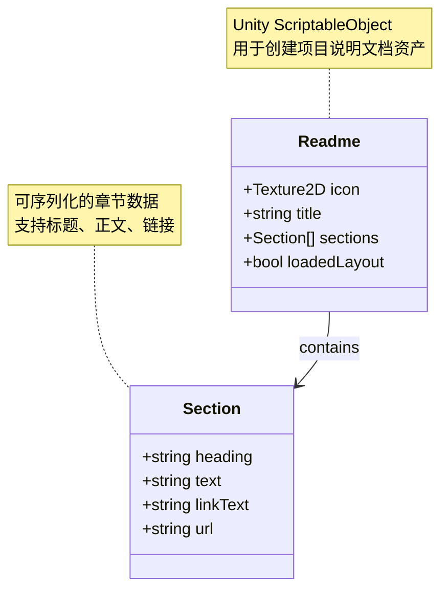
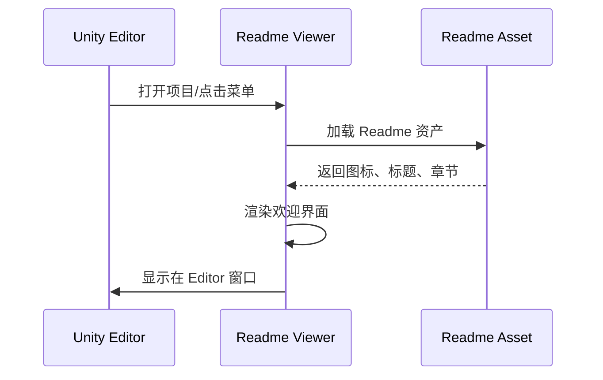

# Readme.cs 注解文档

## 文件基本信息

| 属性 | 值 |
|------|-----|
| **文件名** | Readme.cs |
| **路径** | Assets/Scripts/Editor/Common/Readme/Readme.cs |
| **所属模块** | Editor 层 → 通用工具 → 项目说明文档 |
| **文件职责** | 定义 Unity 项目说明文档的 ScriptableObject 数据结构 |

---

## 类/结构体说明

### Readme

| 属性 | 说明 |
|------|------|
| **职责** | Unity ScriptableObject，用于创建可序列化的项目说明文档资产 |
| **泛型参数** | 无 |
| **继承关系** | 继承 `ScriptableObject` |
| **实现的接口** | 无 |

**设计模式**: 数据容器 (ScriptableObject)

```csharp
// 使用方式
// 在 Project 窗口右键 → Create → Readme
// 配置图标、标题、章节内容
// 在启动场景或 Editor 窗口中显示
```

---

## 字段与属性

| 名称 | 类型 | 访问级别 | 说明 |
|------|------|----------|------|
| `icon` | `Texture2D` | `public` | 说明文档的图标纹理 |
| `title` | `string` | `public` | 说明文档标题 |
| `sections` | `Section[]` | `public` | 章节数组，包含多个说明段落 |
| `loadedLayout` | `bool` | `public` | 是否已加载布局（用于 Editor 显示控制） |

---

## 嵌套类

### Section

```csharp
[Serializable]
public class Section
```

| 属性 | 说明 |
|------|------|
| **职责** | 定义说明文档的一个章节/段落 |
| **特性** | `[Serializable]` 支持 Unity 序列化 |

#### Section 字段

| 名称 | 类型 | 说明 |
|------|------|------|
| `heading` | `string` | 章节标题 |
| `text` | `string` | 章节正文内容 |
| `linkText` | `string` | 链接显示文本 |
| `url` | `string` | 链接 URL 地址 |

---

## 数据结构



---

## 使用示例

### 示例 1: 创建 Readme 资产

```csharp
// 在 Unity 编辑器中：
// 1. Project 窗口右键
// 2. Create → Readme
// 3. 在 Inspector 中配置内容

// 配置示例：
// - Icon: 项目 Logo
// - Title: "Container 项目说明"
// - Sections:
//   - Heading: "欢迎"
//     Text: "这是一个基于 TaoTie 框架的 Unity 游戏项目"
//   - Heading: "快速开始"
//     Text: "打开 Assets/Scenes/Boot.unity 场景开始开发"
//     LinkText: "查看文档"
//     Url: "https://github.com/acsta/Container"
```

### 示例 2: 在 Editor 中读取 Readme

```csharp
using UnityEditor;
using UnityEngine;

public class ReadmeViewer : EditorWindow
{
    private Readme readme;
    
    [MenuItem("Help/Container 项目说明")]
    public static void ShowWindow()
    {
        var window = GetWindow<ReadmeViewer>("项目说明");
        
        // 加载 Readme 资产
        string[] guids = AssetDatabase.FindAssets("t:Readme");
        if (guids.Length > 0)
        {
            string path = AssetDatabase.GUIDToAssetPath(guids[0]);
            window.readme = AssetDatabase.LoadAssetAtPath<Readme>(path);
        }
    }
    
    private void OnGUI()
    {
        if (readme == null)
        {
            EditorGUILayout.LabelField("未找到 Readme 资产");
            return;
        }
        
        // 显示图标和标题
        if (readme.icon != null)
        {
            GUILayout.Label(readme.icon, GUILayout.Width(64), GUILayout.Height(64));
        }
        
        GUILayout.Label(readme.title, EditorStyles.boldLabel);
        
        // 显示章节
        foreach (var section in readme.sections)
        {
            EditorGUILayout.Space();
            GUILayout.Label(section.heading, EditorStyles.boldLabel);
            EditorGUILayout.LabelField(section.text, EditorStyles.wordWrappedLabel);
            
            // 显示链接
            if (!string.IsNullOrEmpty(section.url))
            {
                if (GUILayout.Button(section.linkText ?? "打开链接"))
                {
                    Application.OpenURL(section.url);
                }
            }
        }
    }
}
```

### 示例 3: 程序化创建 Readme

```csharp
using UnityEditor;
using UnityEngine;

public static class ReadmeCreator
{
    [MenuItem("Assets/Create/Readme")]
    public static void CreateReadme()
    {
        string path = AssetDatabase.GenerateUniqueAssetPath(
            "Assets/Editor/Readme.asset"
        );
        
        Readme readme = ScriptableObject.CreateInstance<Readme>();
        readme.title = "项目说明";
        readme.icon = null; // 可设置项目 Logo
        
        readme.sections = new[]
        {
            new Readme.Section
            {
                heading = "项目简介",
                text = "Container 是一个基于 TaoTie 框架开发的 Unity 游戏项目。",
                linkText = "",
                url = ""
            },
            new Readme.Section
            {
                heading = "开发环境",
                text = "Unity 2021.3+ / .NET Standard 2.1",
                linkText = "",
                url = ""
            },
            new Readme.Section
            {
                heading = "文档链接",
                text = "查看完整文档和 API 参考",
                linkText = "GitHub 仓库",
                url = "https://github.com/acsta/Container"
            }
        };
        
        AssetDatabase.CreateAsset(readme, path);
        AssetDatabase.SaveAssets();
        EditorGUIUtility.PingObject(readme);
        
        Debug.Log($"Readme 资产已创建：{path}");
    }
}
```

---

## 在 Unity 中的典型应用

### 项目启动欢迎界面



### 新手引导流程

1. 创建 Readme 资产，包含项目介绍、开发规范、常用链接
2. 在 Editor 启动时自动显示（通过 `InitializeOnLoad`）
3. 新成员打开项目即可看到项目说明

---

## 注意事项

### ⚠️ 使用提示

| 问题 | 说明 | 建议 |
|------|------|------|
| **资产路径** | Readme 是 ScriptableObject 资产 | 放在 Editor 目录或 Resources 目录 |
| **序列化** | Section 需要 `[Serializable]` | 确保嵌套类可序列化 |
| **图标大小** | Texture2D 图标建议统一尺寸 | 推荐 128x128 或 256x256 |
| **链接验证** | URL 不自动验证有效性 | 定期检查链接是否有效 |

### 💡 最佳实践

```csharp
// ✅ 推荐：将 Readme 放在固定路径
// Assets/Editor/Readme.asset

// ✅ 推荐：提供多语言支持
[System.Serializable]
public class Section
{
    public string heading;
    public string heading_cn;  // 中文标题
    public string text;
    public string text_cn;     // 中文正文
    public string linkText;
    public string url;
}

// ✅ 推荐：添加版本信息
public class Readme : ScriptableObject
{
    public string version;  // 文档版本
    public string lastUpdate;  // 最后更新日期
    // ... 其他字段
}
```

---

## 相关文档

- [ReadmeEditor.cs.md](../ReferenceCollectorEditor/ReferenceCollectorEditor.cs.md) - Readme 的自定义 Inspector 编辑器
- [CommonEditor.cs.md](../CommonEditor.cs.md) - 通用 Editor 工具
- [UIEditorController.cs.md](../../UIManager/UIEditorController.cs.md) - UI 编辑器控制器

---

*文档生成时间：2026-03-02 | OpenClaw AI 助手*
