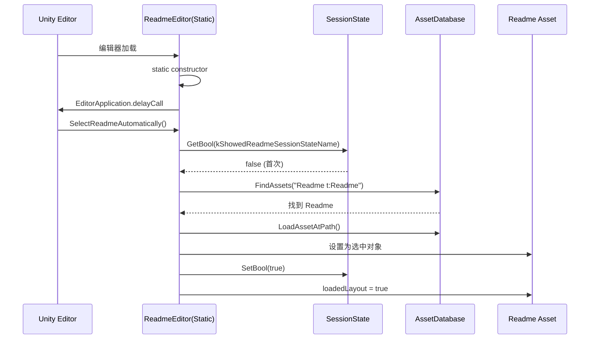
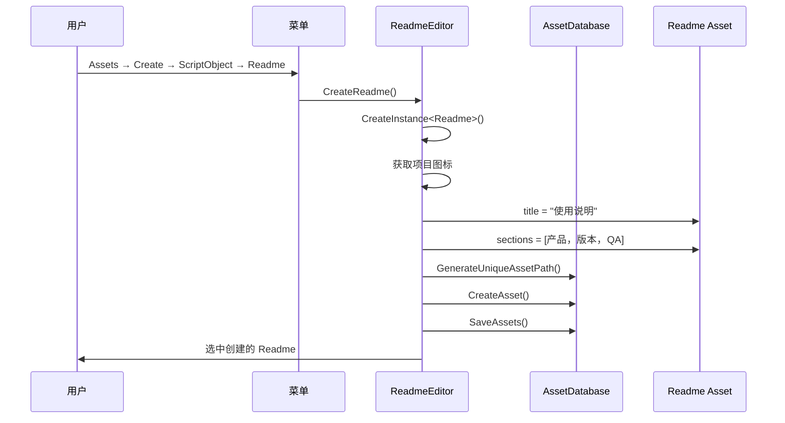

# ReadmeEditor.cs 注解文档

## 文件基本信息

| 属性 | 值 |
|------|-----|
| **文件名** | ReadmeEditor.cs |
| **路径** | Assets/Scripts/Editor/Common/Readme/ReadmeEditor.cs |
| **所属模块** | Editor 工具 → Readme 使用说明编辑器 |
| **文件职责** | Readme ScriptableObject 的自定义 Inspector 编辑器，提供项目使用说明的可视化展示 |

---

## 类/结构体说明

### ReadmeEditor

| 属性 | 说明 |
|------|------|
| **职责** | 为 Readme ScriptableObject 提供自定义 Inspector 界面，支持富文本展示、链接点击、布局加载等功能 |
| **泛型参数** | 无 |
| **继承关系** | 继承自 `UnityEditor.Editor` |
| **特性标记** | `[CustomEditor(typeof(Readme))]`, `[InitializeOnLoad]` |

**设计模式**: 编辑器模式 + 单例初始化

```csharp
// 编辑器绑定 + 自动初始化
[CustomEditor(typeof(Readme))]
[InitializeOnLoad]
public class ReadmeEditor : Editor
{
    // 静态构造函数在编辑器加载时自动执行
    static ReadmeEditor()
    {
        EditorApplication.delayCall += SelectReadmeAutomatically;
    }
}
```

---

## 字段与属性（按重要程度排序）

| 名称 | 类型 | 访问级别 | 说明 |
|------|------|----------|------|
| `kShowedReadmeSessionStateName` | `string` | `static` | SessionState 键名，记录是否已显示过 Readme |
| `kSpace` | `float` | `static` | 段落间距（16px） |
| `WorkPath` | `string` | `static` | Readme 工作路径 |
| `m_Initialized` | `bool` | `private` | GUI 样式是否已初始化 |
| `m_LinkStyle` | `GUIStyle` | `private` | 链接文本样式 |
| `m_TitleStyle` | `GUIStyle` | `private` | 标题样式 |
| `m_HeadingStyle` | `GUIStyle` | `private` | 小标题样式 |
| `m_BodyStyle` | `GUIStyle` | `private` | 正文样式 |

---

## 方法说明（按重要程度排序）

### CreateReadme()

**签名**:
```csharp
[MenuItem("Assets/Create/ScriptObject/Readme", false)]
static void CreateReadme()
```

**职责**: 创建 Readme ScriptableObject 资源

**核心逻辑**:
```
1. 创建 Readme 实例
2. 获取选中路径（默认 Assets）
3. 获取项目图标
4. 设置默认内容：
   - title = "使用说明"
   - sections[0]: 产品名称
   - sections[1]: 引擎版本（2022.3.30f1）
   - sections[2]: QA（快速启动指南）
5. 生成唯一资产路径
6. 创建资产并保存
7. 设置为选中对象
```

**调用者**: Unity 菜单（Assets → Create → ScriptObject → Readme）

**默认内容示例**:
```
┌─────────────────────────────────────┐
│ [Icon] 使用说明                     │
├─────────────────────────────────────┤
│ Container                           │
│ (产品名称)                          │
├─────────────────────────────────────┤
│ 引擎版本                            │
│ 2022.3.30f1                         │
├─────────────────────────────────────┤
│ QA                                  │
│ >如何快速启动游戏？                 │
│ Shift+B 切换到启动场景 Init         │
│ >...                                │
└─────────────────────────────────────┘
```

---

### SelectReadme()

**签名**:
```csharp
[MenuItem("Tools/帮助/简介")]
static Readme SelectReadme()
```

**职责**: 查找并选中项目中的 Readme 资源

**核心逻辑**:
```
1. 使用 FindAssets 查找所有 Readme 类型的资产
2. 如果找到 1 个：
   - 加载资产
   - 更新图标
   - 设置为选中对象
   - 返回 Readme 实例
3. 否则：输出日志，返回 null
```

**调用者**: Unity 菜单（Tools → 帮助 → 简介）

---

### SelectReadmeAutomatically()

**签名**:
```csharp
static void SelectReadmeAutomatically()
```

**职责**: 编辑器启动后自动显示 Readme（仅首次）

**核心逻辑**:
```
1. 检查 SessionState 是否已显示过
2. 如果未显示：
   - 调用 SelectReadme()
   - 设置 SessionState 为 true
   - 如果 Readme 存在且未加载布局：
     * 调用 LoadLayout()
     * 设置 loadedLayout = true
```

**调用者**: EditorApplication.delayCall（编辑器加载后延迟调用）

---

### OnHeaderGUI()

**签名**:
```csharp
protected override void OnHeaderGUI()
```

**职责**: 绘制 Inspector 头部（图标 + 标题）

**核心逻辑**:
```
1. 初始化 GUI 样式
2. 计算图标宽度（最大 128px）
3. 水平布局：
   - 绘制图标
   - 绘制标题（使用 TitleStyle）
```

**调用者**: Unity 编辑器（Inspector 头部）

---

### OnInspectorGUI()

**签名**:
```csharp
public override void OnInspectorGUI()
```

**职责**: 绘制 Inspector 主体内容

**核心逻辑**:
```
1. 初始化 GUI 样式
2. 遍历 Readme.sections：
   - 如果有 heading：绘制标题
   - 如果有 text：绘制正文
   - 如果有 linkText：绘制可点击链接
   - 绘制间距
```

**调用者**: Unity 编辑器（Inspector 每帧刷新）

---

### Init()

**签名**:
```csharp
void Init()
```

**职责**: 初始化 GUI 样式

**核心逻辑**:
```
1. 如果已初始化则返回
2. 创建 BodyStyle：
   - wordWrap = true
   - fontSize = 14
3. 创建 TitleStyle（基于 BodyStyle）：
   - fontSize = 26
4. 创建 HeadingStyle（基于 BodyStyle）：
   - fontSize = 18
5. 创建 LinkStyle（基于 BodyStyle）：
   - wordWrap = false
   - textColor = 蓝色 (#0078DA)
   - stretchWidth = false
6. 设置 m_Initialized = true
```

**调用者**: OnHeaderGUI(), OnInspectorGUI()

---

### LinkLabel()

**签名**:
```csharp
bool LinkLabel(GUIContent label, params GUILayoutOption[] options)
```

**职责**: 绘制可点击的链接按钮

**核心逻辑**:
```
1. 获取按钮矩形区域
2. 绘制下划线（Handles.DrawLine）
3. 添加鼠标指针效果（Link 光标）
4. 绘制按钮
5. 返回是否点击
```

**调用者**: OnInspectorGUI()

---

### LoadLayout()

**签名**:
```csharp
static void LoadLayout()
```

**职责**: 加载自定义编辑器布局（已注释）

**说明**: 原代码尝试加载 TutorialInfo/Layout.wlt 布局文件，但已注释掉。

---

## 核心流程

### 首次启动流程



### 创建 Readme 流程



---

## 使用示例

### 示例 1: 创建 Readme 资源

```csharp
// 在 Unity 编辑器中：
// 1. 菜单：Assets → Create → ScriptObject → Readme
// 2. 在 Project 窗口生成 Readme.asset
// 3. 默认内容：
//    - 标题：使用说明
//    - 产品名称
//    - 引擎版本
//    - QA 快速指南
```

### 示例 2: 查看 Readme

```csharp
// 在 Unity 编辑器中：
// 1. 菜单：Tools → 帮助 → 简介
// 2. 自动查找并选中 Readme 资源
// 3. Inspector 显示格式化内容
```

### 示例 3: 自定义 Readme 内容

```csharp
// 在 Inspector 中编辑 Readme 资产：
// 1. 修改 title 字段
// 2. 添加/编辑 sections：
//    - heading: 小标题
//    - text: 正文内容
//    - linkText: 链接文本
//    - url: 链接地址
// 3. 保存后自动生效
```

---

## 相关文档

- [Readme.cs](./Readme.cs) - Readme ScriptableObject 数据类
- [ScriptableObject](https://docs.unity3d.com/Manual/ScriptObjects.html) - Unity ScriptableObject 文档

---

*文档生成时间：2026-03-03 | OpenClaw AI 助手*
