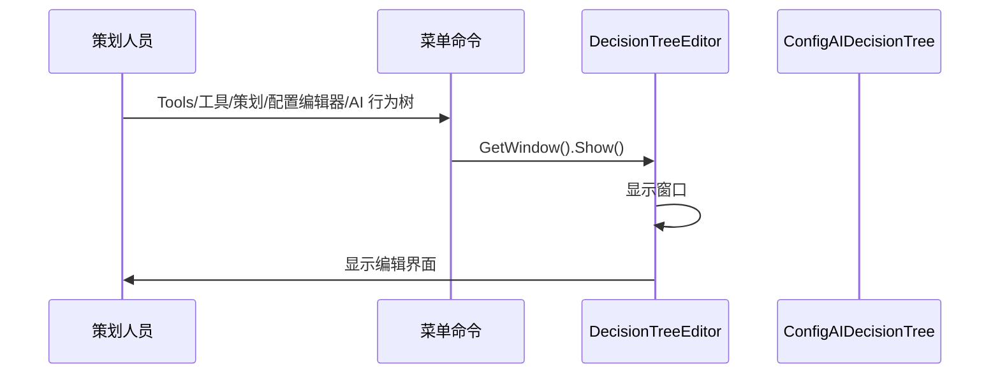
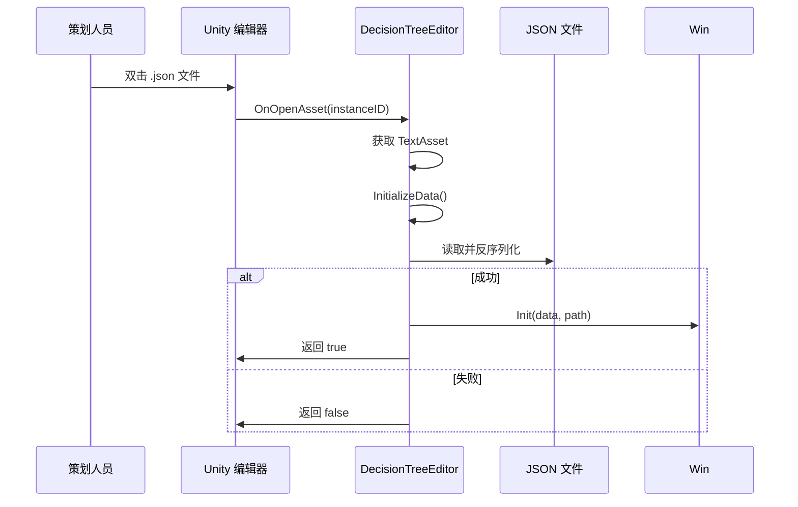

# DecisionTreeEditor.cs 注解文档

## 文件基本信息

| 属性 | 值 |
|------|-----|
| **文件名** | DecisionTreeEditor.cs |
| **路径** | Assets/Scripts/Editor/DesignEditor/ConfigEditor/View/DecisionTreeEditor.cs |
| **所属模块** | Editor → DesignEditor → ConfigEditor |
| **文件职责** | AI 行为树配置文件的可视化编辑器 |

---

## 类/结构体说明

### DecisionTreeEditor

| 属性 | 说明 |
|------|------|
| **职责** | 提供 AI 行为树配置文件 (`ConfigAIDecisionTree`) 的编辑窗口，支持打开、编辑、保存 JSON 配置 |
| **泛型参数** | 无 |
| **继承关系** | 继承自 `BaseEditorWindow<ConfigAIDecisionTree>` |
| **实现的接口** | 无 |

**设计模式**: 模板方法模式 + 单例窗口

```csharp
// 继承基类编辑器窗口
public class DecisionTreeEditor: BaseEditorWindow<ConfigAIDecisionTree>
```

---

## 字段与属性

| 名称 | 类型 | 访问级别 | 说明 |
|------|------|----------|------|
| `fileName` | `string` | `protected override` | 配置文件名 `"DecisionTree"` |
| `folderPath` | `string` | `protected override` | 配置文件路径 `"Assets/AssetsPackage/EditConfig/AITree"` |

---

## 方法说明

### CreateInstance()

**签名**:
```csharp
protected override ConfigAIDecisionTree CreateInstance()
```

**职责**: 创建新的 AI 行为树配置实例

**核心逻辑**:
```
1. 返回新的 ConfigAIDecisionTree 实例
```

**调用者**: `BaseEditorWindow.CreateJson()`

---

### OpenDecisionTree()

**签名**:
```csharp
[MenuItem("Tools/工具/策划/配置编辑器/AI 行为树")]
static void OpenDecisionTree()
```

**职责**: 打开 AI 行为树编辑器窗口

**核心逻辑**:
```
1. 获取或创建 DecisionTreeEditor 窗口
2. 显示窗口
```

**调用者**: Unity 编辑器菜单

---

### OnBaseDataOpened()

**签名**:
```csharp
[OnOpenAsset(0)]
public static bool OnBaseDataOpened(int instanceID, int line)
```

**职责**: 双击 Asset 时自动打开编辑器

**核心逻辑**:
```
1. 获取选中的 TextAsset
2. 获取文件路径
3. 调用 InitializeData() 初始化
```

**调用者**: Unity 编辑器（双击 Asset 时自动触发）

**被调用者**: `InitializeData()`

---

### InitializeData()

**签名**:
```csharp
public static bool InitializeData(TextAsset asset, string path)
```

**职责**: 初始化编辑器数据

**核心逻辑**:
```
1. 检查 asset 是否为 null
2. 检查路径是否以 .json 结尾
3. 反序列化 JSON 到 ConfigAIDecisionTree
4. 获取编辑器窗口
5. 调用 Init() 初始化窗口
```

**返回条件**:
- ✅ 成功：返回 `true`（编辑器已处理）
- ❌ 失败：返回 `false`（其他编辑器处理）

**调用者**: `OnBaseDataOpened()`

---

## 完整流程图

### 打开编辑器流程



### 双击打开流程



---

## 使用示例

### 示例 1: 打开编辑器

```
操作步骤:
1. 点击菜单：Tools → 工具 → 策划 → 配置编辑器 → AI 行为树
2. 编辑器窗口打开
3. 点击"打开"按钮选择已有配置
4. 或点击"新建"创建新配置
```

### 示例 2: 双击打开配置

```
操作步骤:
1. 在 Project 窗口找到 AITree 目录
2. 双击任意 .json 配置文件
3. 编辑器自动打开并加载配置
```

### 示例 3: 编辑和保存

```
操作步骤:
1. 在编辑器中修改 AI 行为树配置
2. 点击"保存"按钮
3. JSON 和 bytes 文件同时更新
```

---

## 注意事项

### ⚠️ 依赖 Odin Inspector

- 使用 `OdinEditorWindow` 基类
- 需要安装 Odin Inspector 插件

### ⚠️ 依赖 Nino 序列化

- 使用 `Nino.Core.JsonHelper` 进行 JSON 序列化
- 使用 `NinoSerializer` 进行二进制序列化

### ⚠️ 文件路径

- 默认路径：`Assets/AssetsPackage/EditConfig/AITree/`
- 支持自定义路径

---

## 相关文档

- [BaseEditorWindow.cs.md](./BaseEditorWindow.cs.md) - 编辑器窗口基类
- [EnvironmentEditor.cs.md](./EnvironmentEditor.cs.md) - 环境配置编辑器
- [ConfigAIDecisionTree.cs.md](../../../../Code/Module/Config/DecisionTree/ConfigAIDecisionTree.cs.md) - AI 行为树配置类

---

*文档生成时间：2026-03-03 | OpenClaw AI 助手*
