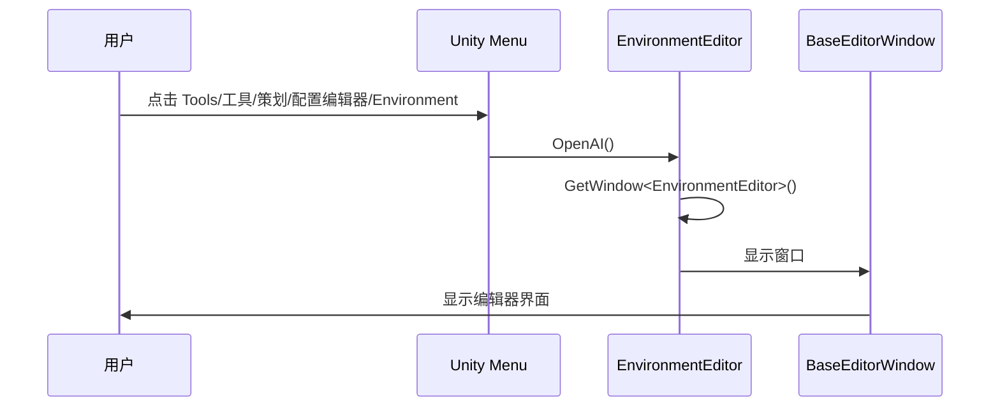
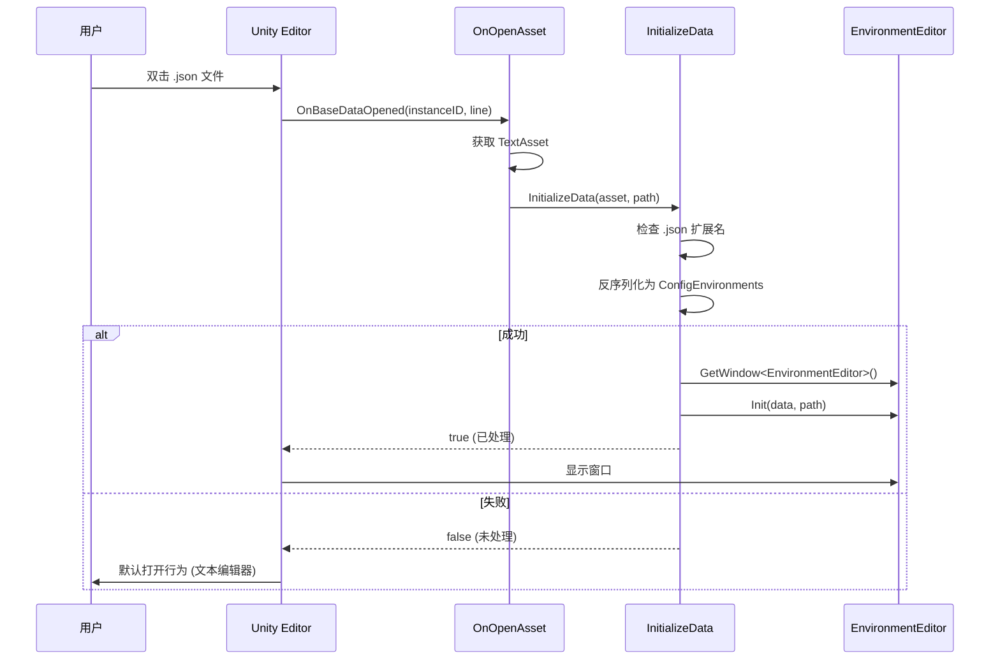

# EnvironmentEditor.cs 注解文档

## 文件基本信息

| 属性 | 值 |
|------|-----|
| **文件名** | EnvironmentEditor.cs |
| **路径** | Assets/Scripts/Editor/DesignEditor/ConfigEditor/View/EnvironmentEditor.cs |
| **所属模块** | Editor 工具 → DesignEditor/ConfigEditor/View |
| **文件职责** | 环境配置编辑器，提供可视化界面编辑游戏环境配置 (ConfigEnvironments) |

---

## 类/结构体说明

### EnvironmentEditor

| 属性 | 说明 |
|------|------|
| **职责** | 继承 BaseEditorWindow 的环境配置专用编辑器，支持菜单打开和双击资源打开 |
| **泛型参数** | 无 (继承自 BaseEditorWindow<ConfigEnvironments>) |
| **继承关系** | 继承自 `BaseEditorWindow<ConfigEnvironments>` |
| **命名空间** | `TaoTie` |

**设计模式**: 特化模式

```csharp
namespace TaoTie
{
    public class EnvironmentEditor : BaseEditorWindow<ConfigEnvironments>
    {
        // 环境配置专用编辑器
    }
}
```

---

## 字段与属性（继承自基类）

| 名称 | 类型 | 访问级别 | 说明 |
|------|------|----------|------|
| `folderPath` | `string` | `protected override` | 配置文件夹路径，重写为"Assets/AssetsPackage/EditConfig" |

---

## 方法说明（按重要程度排序）

### OpenAI()

**签名**:
```csharp
[MenuItem("Tools/工具/策划/配置编辑器/Environment")]
static void OpenAI()
```

**职责**: 显示环境配置编辑器窗口

**核心逻辑**:
```
1. 获取 EnvironmentEditor 窗口实例
2. 显示窗口
```

**调用者**: Unity 编辑器菜单

**菜单路径**:
```
Unity 顶部菜单 → Tools → 工具 → 策划 → 配置编辑器 → Environment
```

---

### OnBaseDataOpened()

**签名**:
```csharp
[OnOpenAsset(0)]
public static bool OnBaseDataOpened(int instanceID, int line)
```

**职责**: 双击资源时的回调，支持直接打开配置文件

**参数**:
- `instanceID`: Unity 资源实例 ID
- `line`: 打开的行号 (未使用)

**返回值**:
- `true` - 已处理，Unity 不再执行默认打开行为
- `false` - 未处理，Unity 执行默认打开行为

**核心逻辑**:
```
1. 通过 instanceID 获取 UnityEngine.Object
2. 转换为 TextAsset
3. 获取资源路径
4. 调用 InitializeData() 尝试打开
```

**调用者**: Unity 编辑器生命周期 (双击资源时)

**特性**:
```csharp
[OnOpenAsset(0)]
```
- Unity 特性，注册资源打开回调
- `0` 表示优先级 (数字越小优先级越高)

---

### InitializeData()

**签名**:
```csharp
public static bool InitializeData(TextAsset asset, string path)
```

**职责**: 初始化窗口数据，加载 JSON 配置

**参数**:
- `asset`: TextAsset 资源对象
- `path`: 资源路径

**返回值**:
- `true` - 成功加载并打开窗口
- `false` - 加载失败

**核心逻辑**:
```
1. 检查 asset 是否为 null
2. 检查路径是否以 .json 结尾
3. 尝试反序列化为 ConfigEnvironments
4. 如果成功:
   - 获取 EnvironmentEditor 窗口
   - 调用 Init() 初始化
   - 返回 true
5. 如果失败，返回 false
```

**调用者**: OnBaseDataOpened()

---

## 使用示例

### 1. 通过菜单打开

```
步骤:
1. 点击 Unity 顶部菜单 Tools → 工具 → 策划 → 配置编辑器 → Environment
2. 窗口打开，显示空配置
3. 点击"新建"创建新配置文件
4. 编辑环境配置
5. 点击"保存"
```

### 2. 双击资源打开

```
步骤:
1. 在 Project 窗口找到 .json 配置文件
2. 双击文件
3. 自动打开 EnvironmentEditor 窗口并加载配置
```

### 3. 配置数据结构

```csharp
[Serializable]
public class ConfigEnvironments
{
    public List<EnvironmentInfo> environments;
}

[Serializable]
public class EnvironmentInfo
{
    public string name;              // 环境名称 (如"白天"、"夜晚")
    public DayTimeType dayTimeType;  // 时间类型
    public float lightIntensity;     // 光照强度
    public string skyboxName;        // 天空盒名称
    public Color ambientColor;       // 环境光颜色
}

public enum DayTimeType
{
    Dawn,      // 黎明
    Day,       // 白天
    Dusk,      // 黄昏
    Night      // 夜晚
}
```

### 4. JSON 文件示例

```json
{
  "environments": [
    {
      "name": "白天",
      "dayTimeType": 1,
      "lightIntensity": 1.0,
      "skyboxName": "DaySkybox",
      "ambientColor": { "r": 0.8, "g": 0.8, "b": 0.8, "a": 1.0 }
    },
    {
      "name": "夜晚",
      "dayTimeType": 3,
      "lightIntensity": 0.3,
      "skyboxName": "NightSkybox",
      "ambientColor": { "r": 0.2, "g": 0.2, "b": 0.3, "a": 1.0 }
    }
  ]
}
```

---

## 工作流程

### 菜单打开流程



### 双击打开流程



---

## 技术要点

### 1. 继承基类

```csharp
public class EnvironmentEditor : BaseEditorWindow<ConfigEnvironments>
{
    // 自动继承所有 BaseEditorWindow 的功能:
    // - Open() 打开文件
    // - CreateJson() 新建配置
    // - SaveJson() 保存配置
    // - SaveNewJson() 另存为
    // - Odin 可视化编辑界面
}
```

### 2. 重写文件夹路径

```csharp
protected override string folderPath => base.folderPath + "/EditConfig";
```

**说明**:
- 基类默认路径: "Assets/AssetsPackage"
- 子类重写后: "Assets/AssetsPackage/EditConfig"
- 使环境配置文件集中存放在 EditConfig 目录

### 3. OnOpenAsset 特性

```csharp
[OnOpenAsset(0)]
public static bool OnBaseDataOpened(int instanceID, int line)
```

**说明**:
- 注册资源打开回调
- 优先级 `0` (最高优先级)
- 返回 `true` 阻止 Unity 默认打开行为

### 4. 资源路径检查

```csharp
if (path.EndsWith(".json") && 
    JsonHelper.TryFromJson<ConfigEnvironments>(asset.text, out var aiJson))
```

**说明**:
- 只处理 `.json` 文件
- 使用 `TryFromJson` 避免反序列化异常
- 类型匹配才打开窗口

---

## 界面效果

### Odin Inspector 显示

```
┌─────────────────────────────────────────────────────────┐
│ EnvironmentEditor                                       │
├─────────────────────────────────────────────────────────┤
│                                                         │
│  [打开]  [新建]  [保存]  [另存为]                       │
│                                                         │
├─────────────────────────────────────────────────────────┤
│ File Path: Assets/AssetsPackage/EditConfig/Env.json    │
├─────────────────────────────────────────────────────────┤
│ Data: ConfigEnvironments                                │
│  ┌────────────────────────────────────────────────────┐ │
│  │ Environments (Size: 2)                             │ │
│  │  ┌────────────────────────────────────────────────┐│ │
│  │  │ [0]                                            ││ │
│  │  │   Name: "白天"                                 ││ │
│  │  │   Day Time Type: Day ▼                         ││ │
│  │  │   Light Intensity: 1.00                        ││ │
│  │  │   Skybox Name: "DaySkybox"                     ││ │
│  │  │   Ambient Color: (0.8, 0.8, 0.8, 1.0)          ││ │
│  │  └────────────────────────────────────────────────┘│ │
│  │  ┌────────────────────────────────────────────────┐│ │
│  │  │ [1]                                            ││ │
│  │  │   Name: "夜晚"                                 ││ │
│  │  │   Day Time Type: Night ▼                       ││ │
│  │  │   Light Intensity: 0.30                        ││ │
│  │  │   Skybox Name: "NightSkybox"                   ││ │
│  │  │   Ambient Color: (0.2, 0.2, 0.3, 1.0)          ││ │
│  │  └────────────────────────────────────────────────┘│ │
│  └────────────────────────────────────────────────────┘ │
└─────────────────────────────────────────────────────────┘
```

---

## 相关文件

### 配置文件位置

```
Assets/AssetsPackage/EditConfig/
├─ ConfigEnvironments.json   # 环境配置 JSON
└─ ConfigEnvironments.bytes  # 环境配置二进制
```

### 相关代码

| 文件 | 说明 |
|------|------|
| `ConfigEnvironments.cs` | 环境配置数据结构 |
| `EnvironmentInfo.cs` | 单个环境信息 |
| `EnvironmentManager.cs` | 运行时环境管理器 |
| `BaseEditorWindow.cs` | 编辑器基类 |

---

## 扩展建议

### 1. 添加自定义验证

```csharp
protected override void BeforeSaveData()
{
    // 验证环境名称唯一性
    var names = data.environments.Select(e => e.name).ToList();
    if (names.Count != names.Distinct().Count())
    {
        EditorUtility.DisplayDialog("错误", "环境名称不能重复", "确定");
        throw new Exception("环境名称重复");
    }
    
    // 验证光照强度范围
    foreach (var env in data.environments)
    {
        if (env.lightIntensity < 0 || env.lightIntensity > 1)
        {
            EditorUtility.DisplayDialog("警告", 
                $"{env.name} 的光照强度应在 0-1 之间", "确定");
        }
    }
}
```

### 2. 添加预设功能

```csharp
[Button("添加白天预设")]
public void AddDayPreset()
{
    var env = new EnvironmentInfo
    {
        name = "白天",
        dayTimeType = DayTimeType.Day,
        lightIntensity = 1.0f,
        skyboxName = "DaySkybox",
        ambientColor = Color.white
    };
    data.environments.Add(env);
}

[Button("添加夜晚预设")]
public void AddNightPreset()
{
    var env = new EnvironmentInfo
    {
        name = "夜晚",
        dayTimeType = DayTimeType.Night,
        lightIntensity = 0.3f,
        skyboxName = "NightSkybox",
        ambientColor = new Color(0.2f, 0.2f, 0.3f)
    };
    data.environments.Add(env);
}
```

---

## 相关文档

- [BaseEditorWindow.cs.md](./BaseEditorWindow.cs.md) - 编辑器基类
- [ConfigEnvironments.cs.md](../../../../Code/Module/Config/Environment/ConfigEnvironments.cs.md) - 配置数据结构
- [EnvironmentManager.cs.md](../../../../Code/Game/System/Environment/EnvironmentManager.cs.md) - 运行时环境管理

---

*文档生成时间：2026-03-03 | OpenClaw AI 助手*
