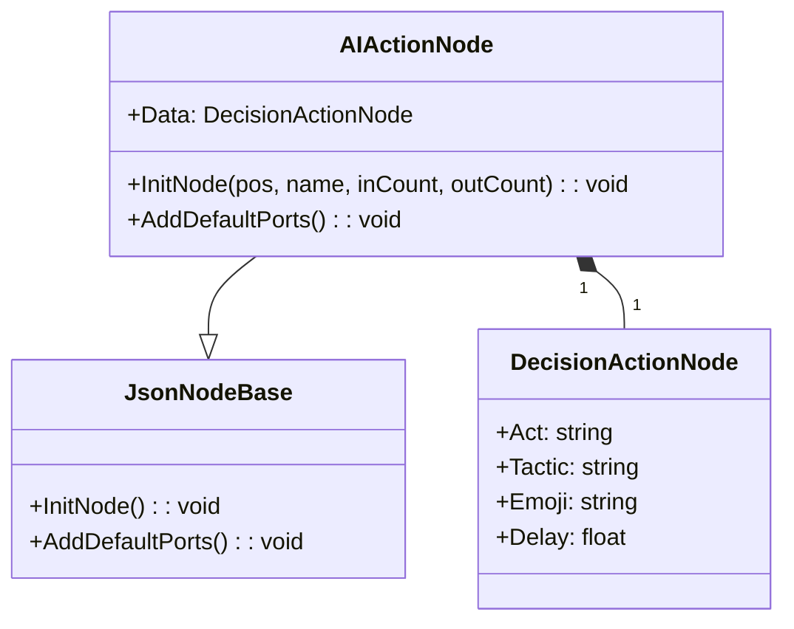
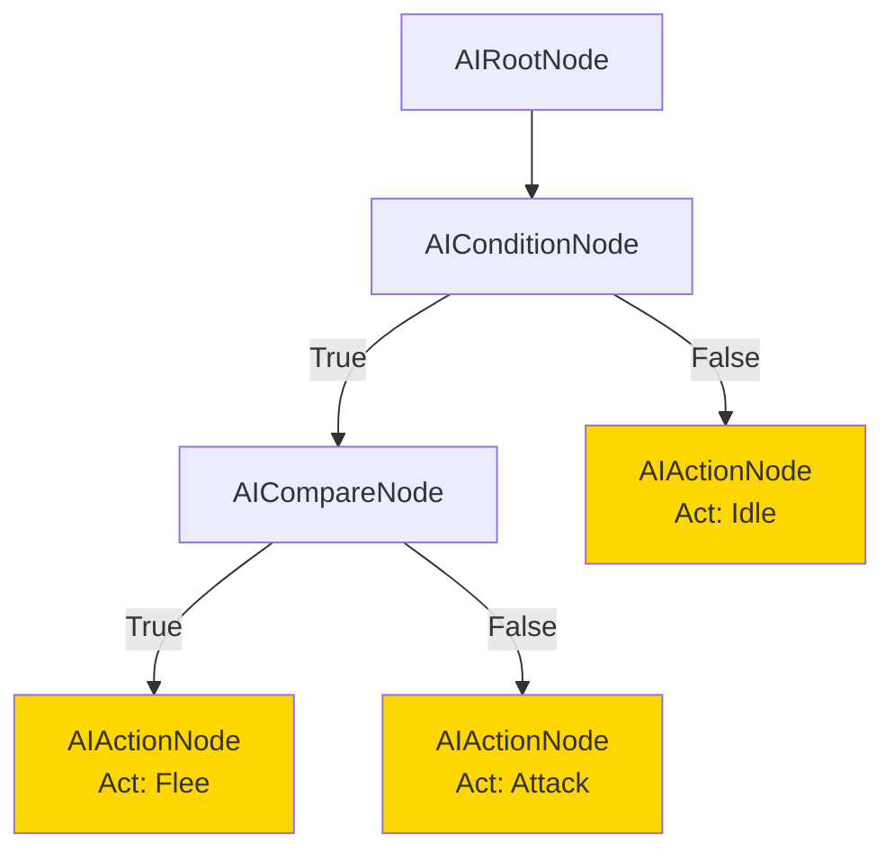
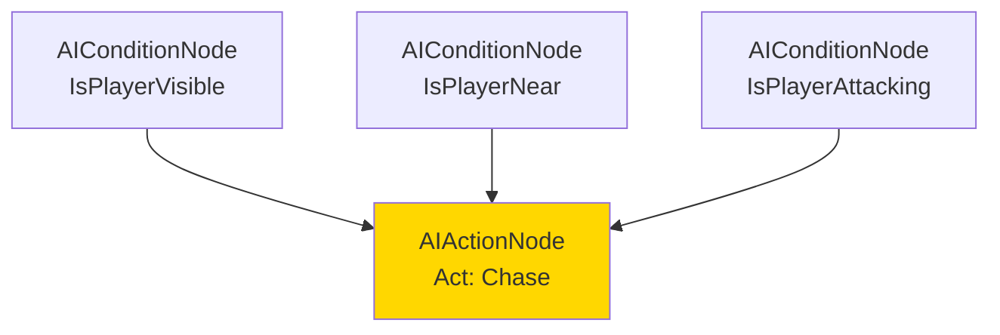

# AIActionNode.cs 注解文档

## 文件基本信息

| 属性 | 值 |
|------|-----|
| **文件名** | AIActionNode.cs |
| **路径** | Assets/Scripts/Editor/DesignEditor/GraphEditor/AIEditor/AIActionNode.cs |
| **所属模块** | Editor → DesignEditor/GraphEditor/AIEditor |
| **文件职责** | AI 决策树动作节点定义 |

---

## 类说明

### AIActionNode

| 属性 | 说明 |
|------|------|
| **职责** | AI 决策树中的动作执行节点，定义 AI 要执行的具体行为 |
| **类型** | `JsonNodeBase` |
| **命名空间** | `TaoTie` |
| **可见性** | `public` |

**继承关系**:
```
JsonNodeBase → NodeBase → ScriptableObject → Object
```

**设计模式**: 
- **命令模式**: 封装一个动作请求
- **组合模式**: 包含 DecisionActionNode 数据对象

---

## 字段说明

| 字段名 | 类型 | 默认值 | 说明 |
|--------|------|--------|------|
| `Data` | `DecisionActionNode` | `new DecisionActionNode()` | 动作数据对象，包含具体的动作配置 |

**字段详情**:

### Data

- **特性**: `[HideReferenceObjectPicker]` - Odin Inspector 特性，隐藏对象选择器，直接展开显示子字段
- **类型**: `DecisionActionNode` - 运行时动作数据类
- **用途**: 存储动作节点的配置数据

**Data 包含的子字段** (来自 DecisionActionNode):

| 字段 | 类型 | 说明 |
|------|------|------|
| `Act` | `string` | 动作名称/类型 (如 "Chase", "Attack", "Flee") |
| `Tactic` | `string` | 战术配置 (如 "Aggressive", "Defensive") |
| `Emoji` | `string` | 表情 ID (用于 UI 显示) |
| `Delay` | `float` | 动作延迟时间 (秒) |

---

## 方法说明

### InitNode

**签名**:
```csharp
public override void InitNode(Vector2 pos, string nodeName, int minInputPortsCount = 0, int minOutputPortsCount = 0)
```

**职责**: 初始化动作节点

**参数**:
| 参数 | 类型 | 默认值 | 说明 |
|------|------|--------|------|
| `pos` | `Vector2` | - | 节点在编辑器中的位置 |
| `nodeName` | `string` | - | 节点名称 |
| `minInputPortsCount` | `int` | `0` | 最小输入端口数 |
| `minOutputPortsCount` | `int` | `0` | 最小输出端口数 |

**核心逻辑**:
```
1. 调用基类 InitNode 初始化
2. 设置节点名称为 "Action"
```

---

### AddDefaultPorts

**签名**:
```csharp
public override void AddDefaultPorts()
```

**职责**: 添加默认的端口连接

**核心逻辑**:
```
添加一个输入端口:
- 端口名："输入"
- 端口模式：EdgeMode.Multiple (允许多个输入)
- 允许连接：true
- 必填：false
```

**端口说明**:

| 端口名 | 类型 | 模式 | 说明 |
|--------|------|------|------|
| `输入` | 输入 | Multiple | 允许多个上游节点连接到此动作 |

**设计要点**:
- 动作节点是终端节点，只有输入端口，没有输出端口
- 允许多个输入意味着多个条件/比较节点可以指向同一个动作

---

## Mermaid 流程图

### 动作节点结构



### 决策树中的位置



### 多输入示例



---

## 使用示例

### 创建动作节点

**在 AIGraphWindow 编辑器中**:
```
1. 右键画布或端口
2. 选择 Create/AiActionNode
3. 在 Inspector 中配置 Data 字段:
   - Act: "Chase"
   - Tactic: "Aggressive"
   - Emoji: "😠"
   - Delay: 0.5
4. 连接到上游节点 (条件/比较节点)
```

### 运行时执行

```csharp
// 运行时加载决策树配置
var config = ConfigManager.Instance.Get<ConfigAIDecisionTree>("MonsterAI");

// 执行决策树，获取最终动作
DecisionActionNode action = EvaluateDecisionTree(config.Node, entity);

// 执行动作
if (action.Act == "Chase")
{
    entity.GetComponent<MoveComponent>().MoveTo(target.position);
}
else if (action.Act == "Attack")
{
    entity.GetComponent<CombatComponent>().Attack(target);
}
else if (action.Act == "Flee")
{
    entity.GetComponent<MoveComponent>().MoveAwayFrom(target.position);
}

// 如果有延迟，使用协程或定时器
if (action.Delay > 0)
{
    TimerManager.Instance.Once(action.Delay * 1000, () => ExecuteAction(action));
}
```

### 常见动作配置

| 动作类型 | Act 值 | Tactic | 说明 |
|---------|-------|--------|------|
| 追击 | "Chase" | "Aggressive" | 追击目标 |
| 攻击 | "Attack" | "Aggressive" | 攻击目标 |
| 逃跑 | "Flee" | "Defensive" | 逃离目标 |
| 待机 | "Idle" | "Passive" | 原地待机 |
| 巡逻 | "Patrol" | "Passive" | 按路径巡逻 |
| 求救 | "CallForHelp" | "Defensive" | 呼叫支援 |

---

## 注意事项

### 终端节点

- AIActionNode 是决策树的终端节点，没有输出端口
- 执行到动作节点后，决策树评估结束
- 一个决策树可以有多个动作节点 (不同分支)

### 多输入支持

- 使用 `EdgeMode.Multiple` 允许多个上游节点连接
- 适用于多个条件都触发同一个动作的场景
- 例如：多个条件都导致"逃跑"动作

### Data 对象

- `Data` 字段使用 `[HideReferenceObjectPicker]` 特性
- 在 Inspector 中直接展开显示子字段，更方便编辑
- 导出时会序列化为运行时配置的一部分

---

## 相关类

| 类名 | 关系 | 说明 |
|------|------|------|
| `JsonNodeBase` | 父类 | 图节点基类 |
| `DecisionActionNode` | 数据 | 运行时动作数据 |
| `AIRootNode` | 兄弟节点 | 根节点 |
| `AIConditionNode` | 兄弟节点 | 条件节点 |
| `AICompareNode` | 兄弟节点 | 比较节点 |
| `AIGraphWindow` | 编辑器 | 图编辑窗口 |

---

## 相关文档链接

- [AIRootNode.cs.md](./AIRootNode.cs.md) - 根节点
- [AIGraph.cs.md](./AIGraph.cs.md) - 图数据
- [AIGraphWindow.cs.md](./AIGraphWindow.cs.md) - 编辑器窗口
- [AIConditionNode.cs.md](./AIConditionNode.cs.md) - 条件节点
- [AICompareNode.cs.md](./AICompareNode.cs.md) - 比较节点
- [DecisionActionNode.cs.md](../../../../Code/Module/Config/DecisionTree/DecisionActionNode.cs.md) - 运行时动作数据

---

*文档生成时间：2026-03-03 | OpenClaw AI 助手*
