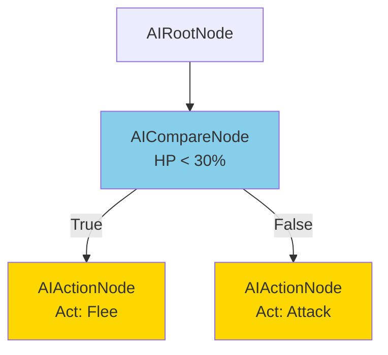
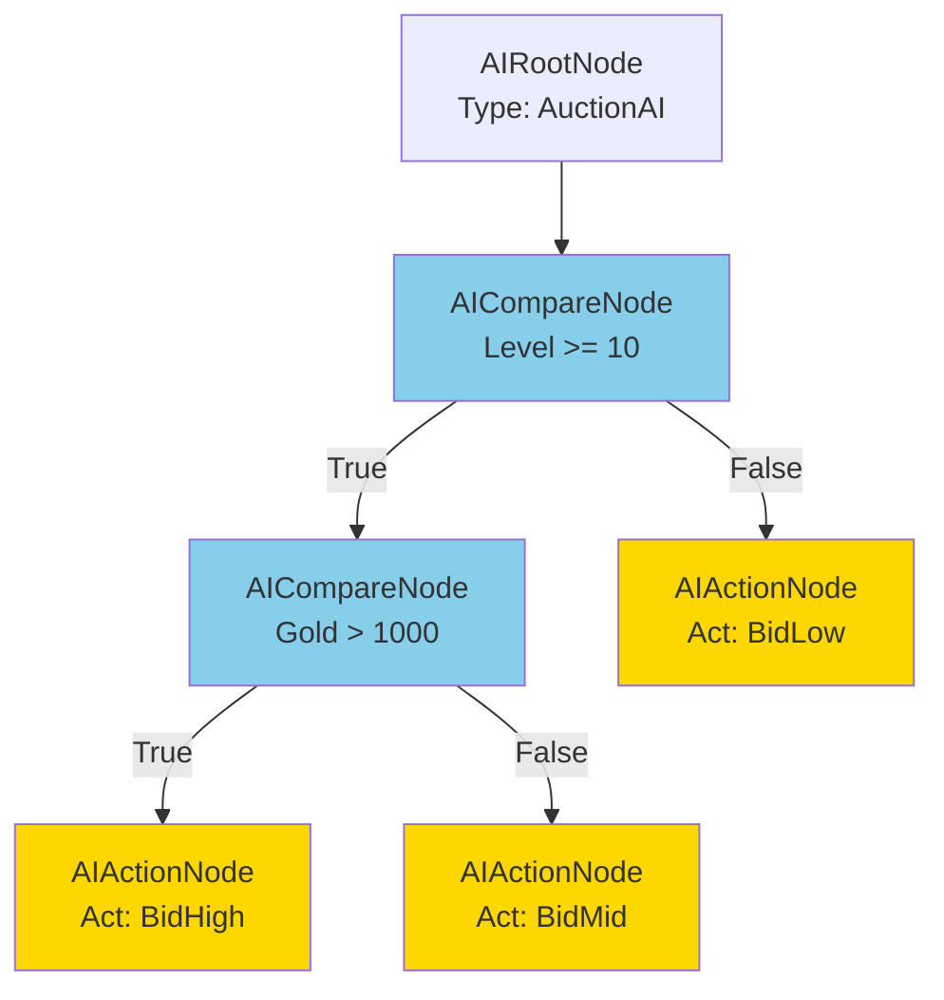

# AICompareNode.cs 注解文档

## 文件基本信息

| 属性 | 值 |
|------|-----|
| **文件名** | AICompareNode.cs |
| **路径** | Assets/Scripts/Editor/DesignEditor/GraphEditor/AIEditor/AICompareNode.cs |
| **所属模块** | Editor → DesignEditor/GraphEditor/AIEditor |
| **文件职责** | AI 决策树数值比较节点定义 |

---

## 类说明

### AICompareNode

| 属性 | 说明 |
|------|------|
| **职责** | AI 决策树中的数值比较节点，支持自定义左右值和比较运算符 |
| **类型** | `JsonNodeBase` |
| **命名空间** | `TaoTie` |
| **可见性** | `public` |

**继承关系**:
```
JsonNodeBase → NodeBase → ScriptableObject → Object
```

**设计模式**: 
- **策略模式**: 根据比较结果选择不同分支
- **解释器模式**: 使用 BaseValue 支持多种值类型 (固定值、公式、随机值等)

---

## 字段说明

| 字段名 | 类型 | 默认值 | 说明 |
|--------|------|--------|------|
| `LeftValue` | `BaseValue` | `new SingleValue()` | 左侧比较值，支持多种值类型 |
| `CompareMode` | `CompareMode` | - | 比较运算符 (>, <, ==, !=, >=, <=) |
| `RightValue` | `BaseValue` | `new SingleValue()` | 右侧比较值，支持多种值类型 |

**字段详情**:

### LeftValue

- **特性**: 
  - `[NotNull]` - 不能为空
  - `[PropertyOrder(1)]` - 显示顺序第 1
  - `[LabelText("左值")]` - 显示标签
- **类型**: `BaseValue` - 值类型基类，支持多态
- **默认值**: `SingleValue` - 单值类型

### CompareMode

- **特性**: 
  - `[PropertyOrder(2)]` - 显示顺序第 2
  - `[LabelText("判断符号")]` - 显示标签
- **类型**: `CompareMode` - 枚举类型
- **可选值**:

| 值 | 符号 | 说明 |
|----|------|------|
| `Equal` | `==` | 等于 |
| `NotEqual` | `!=` | 不等于 |
| `Greater` | `>` | 大于 |
| `Less` | `<` | 小于 |
| `GreaterOrEqual` | `>=` | 大于等于 |
| `LessOrEqual` | `<=` | 小于等于 |

### RightValue

- **特性**: 
  - `[NotNull]` - 不能为空
  - `[PropertyOrder(3)]` - 显示顺序第 3
  - `[LabelText("右值")]` - 显示标签
- **类型**: `BaseValue` - 值类型基类，支持多态
- **默认值**: `SingleValue` - 单值类型

---

## BaseValue 值类型

`BaseValue` 支持多种值类型，通过多态实现灵活配置:

| 类型 | 类名 | 说明 | 示例 |
|------|------|------|------|
| 固定值 | `SingleValue` | 单个数值 | `30`, `0.5` |
| 公式值 | `FormulaValue` | 计算公式 | `Level * 10 + 5` |
| 零值 | `ZeroValue` | 固定为 0 | `0` |
| 0-1 值 | `Range01Value` | 0 到 1 范围 | `0.5` (50%) |
| 运算值 | `OperatorValue` | 运算表达式 | `A + B`, `A * B` |
| 随机拍卖时间 | `RandomAuctionTime` | 随机时间 | 用于拍卖系统 |
| 最小拍卖时间 | `MinAuctionTime` | 最小时间 | 用于拍卖系统 |
| 上次出价时间 | `TimeSinceLastBid` | 时间差 | 用于拍卖系统 |

---

## 方法说明

### InitNode

**签名**:
```csharp
public override void InitNode(Vector2 pos, string nodeName, int minInputPortsCount = 0, int minOutputPortsCount = 0)
```

**职责**: 初始化比较节点

**参数**:
| 参数 | 类型 | 默认值 | 说明 |
|------|------|--------|------|
| `pos` | `Vector2` | - | 节点在编辑器中的位置 |
| `nodeName` | `string` | - | 节点名称 |
| `minInputPortsCount` | `int` | `0` | 最小输入端口数 |
| `minOutputPortsCount` | `int` | `0` | 最小输出端口数 |

**核心逻辑**:
```
1. 调用基类 InitNode 初始化
2. 设置节点名称为 "Compare"
```

---

### AddDefaultPorts

**签名**:
```csharp
public override void AddDefaultPorts()
```

**职责**: 添加默认的端口连接

**核心逻辑**:
```
添加三个端口:
1. 输入端口:
   - 端口名："输入"
   - 端口模式：EdgeMode.Multiple
   - 允许连接：true
   - 必填：false

2. True 输出端口:
   - 端口名："True"
   - 端口模式：EdgeMode.Override
   - 允许连接：true
   - 必填：false

3. False 输出端口:
   - 端口名："False"
   - 端口模式：EdgeMode.Override
   - 允许连接：true
   - 必填：false
```

**端口说明**:

| 端口名 | 类型 | 模式 | 说明 |
|--------|------|------|------|
| `输入` | 输入 | Multiple | 接收上游节点的输入 |
| `True` | 输出 | Override | 比较结果为真时执行此分支 |
| `False` | 输出 | Override | 比较结果为假时执行此分支 |

---

## Mermaid 流程图

### 比较节点结构

```mermaid
classDiagram
    class AICompareNode {
        +LeftValue: BaseValue
        +CompareMode: CompareMode
        +RightValue: BaseValue
        +InitNode(pos, name, inCount, outCount): void
        +AddDefaultPorts(): void
    }
    
    class BaseValue {
        <<abstract>>
        +GetValue(context): float
    }
    
    class SingleValue {
        +Value: float
        +GetValue(context): float
    }
    
    class FormulaValue {
        +Formula: string
        +GetValue(context): float
    }
    
    class CompareMode {
        <<enumeration>>
        Equal
        NotEqual
        Greater
        Less
        GreaterOrEqual
        LessOrEqual
    }
    
    AICompareNode --|> JsonNodeBase
    AICompareNode "1" *-- "1" BaseValue : LeftValue
    AICompareNode "1" *-- "1" BaseValue : RightValue
    AICompareNode "1" *-- "1" CompareMode
    BaseValue <|-- SingleValue
    BaseValue <|-- FormulaValue
```



### 决策树中的使用



### 复杂比较示例



---

## 使用示例

### 创建比较节点

**在 AIGraphWindow 编辑器中**:
```
1. 右键画布或端口
2. 选择 Create/AiCompareNode
3. 在 Inspector 中配置:
   - 左值：选择值类型 (SingleValue/FormulaValue 等)
     * SingleValue: 输入固定值 (如 30)
     * FormulaValue: 输入公式 (如 "Level * 10")
   - 判断符号：选择比较运算符 (>, <, ==, 等)
   - 右值：配置右侧值
4. 连接输入和输出端口
```

### 配置示例

**示例 1: 生命值检查**
```
左值：SingleValue(当前 HP 百分比)
判断符号：<
右值：SingleValue(30)
含义：HP < 30% 时逃跑
```

**示例 2: 等级检查**
```
左值：FormulaValue("Level")
判断符号：>=
右值：SingleValue(10)
含义：Level >= 10 时执行高级行为
```

**示例 3: 距离检查**
```
左值：SingleValue(与玩家距离)
判断符号：<=
右值：SingleValue(5)
含义：距离 <= 5 时攻击
```

### 运行时评估

```csharp
// 运行时决策树评估
public DecisionNode Evaluate(DecisionCompareNode node, Entity entity)
{
    // 计算左右值
    float leftValue = node.LeftValue.GetValue(entity);
    float rightValue = node.RightValue.GetValue(entity);
    
    // 执行比较
    bool result = Compare(leftValue, node.CompareMode, rightValue);
    
    if (result)
    {
        // 比较为真，评估 True 分支
        return node.True != null ? Evaluate(node.True, entity) : null;
    }
    else
    {
        // 比较为假，评估 False 分支
        return node.False != null ? Evaluate(node.False, entity) : null;
    }
}

// 比较实现
private bool Compare(float left, CompareMode mode, float right)
{
    switch (mode)
    {
        case CompareMode.Equal: return left == right;
        case CompareMode.NotEqual: return left != right;
        case CompareMode.Greater: return left > right;
        case CompareMode.Less: return left < right;
        case CompareMode.GreaterOrEqual: return left >= right;
        case CompareMode.LessOrEqual: return left <= right;
        default: return false;
    }
}

// BaseValue 求值
public float GetValue(Entity entity)
{
    if (this is SingleValue sv)
        return sv.Value;
    if (this is FormulaValue fv)
        return FormulaEvaluator.Evaluate(fv.Formula, entity);
    if (this is ZeroValue)
        return 0;
    // ... 其他类型
    return 0;
}
```

---

## 注意事项

### 值类型选择

| 场景 | 推荐类型 | 示例 |
|------|---------|------|
| 固定阈值 | `SingleValue` | HP < 30 |
| 动态计算 | `FormulaValue` | Level * 10 + 5 |
| 百分比 | `Range01Value` | 0.3 (30%) |
| 零值比较 | `ZeroValue` | HP == 0 |

### 与 ConditionNode 的区别

| 节点类型 | 用途 | 配置复杂度 | 灵活性 |
|---------|------|-----------|--------|
| `AIConditionNode` | 预定义条件 | 低 (下拉选择) | 中 (固定条件列表) |
| `AICompareNode` | 自定义比较 | 高 (配置左右值和运算符) | 高 (任意数值比较) |

**使用建议**:
- 常用条件用 `AIConditionNode` (快速配置)
- 复杂数值比较用 `AICompareNode` (灵活配置)
- 两者可以混合使用构建复杂决策树

### 公式值安全

- `FormulaValue` 使用公式字符串，需要安全的公式解析器
- 避免执行任意代码，只支持预定义的数学运算
- 建议实现公式白名单机制

---

## 相关类

| 类名 | 关系 | 说明 |
|------|------|------|
| `JsonNodeBase` | 父类 | 图节点基类 |
| `BaseValue` | 值类型 | 值类型基类 |
| `SingleValue` | 值类型 | 单值 |
| `FormulaValue` | 值类型 | 公式值 |
| `CompareMode` | 枚举 | 比较运算符 |
| `DecisionCompareNode` | 运行时 | 运行时比较节点 |
| `AIRootNode` | 兄弟节点 | 根节点 |
| `AIConditionNode` | 兄弟节点 | 条件节点 |
| `AIActionNode` | 兄弟节点 | 动作节点 |

---

## 相关文档链接

- [AIRootNode.cs.md](./AIRootNode.cs.md) - 根节点
- [AIGraph.cs.md](./AIGraph.cs.md) - 图数据
- [AIGraphWindow.cs.md](./AIGraphWindow.cs.md) - 编辑器窗口
- [AIActionNode.cs.md](./AIActionNode.cs.md) - 动作节点
- [AIConditionNode.cs.md](./AIConditionNode.cs.md) - 条件节点
- [BaseValue.cs.md](../../../../Code/Module/Config/Value/BaseValue.cs.md) - 值类型基类
- [SingleValue.cs.md](../../../../Code/Module/Config/Value/SingleValue.cs.md) - 单值
- [FormulaValue.cs.md](../../../../Code/Module/Config/Value/FormulaValue.cs.md) - 公式值
- [CompareMode.cs.md](../../../../Code/Module/Config/DecisionTree/CompareMode.cs.md) - 比较模式枚举
- [DecisionCompareNode.cs.md](../../../../Code/Module/Config/DecisionTree/DecisionCompareNode.cs.md) - 运行时比较节点

---

*文档生成时间：2026-03-03 | OpenClaw AI 助手*
