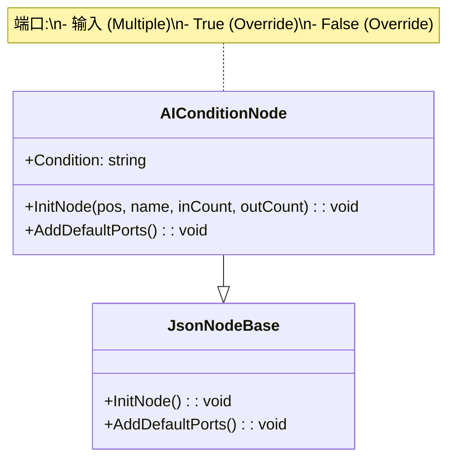
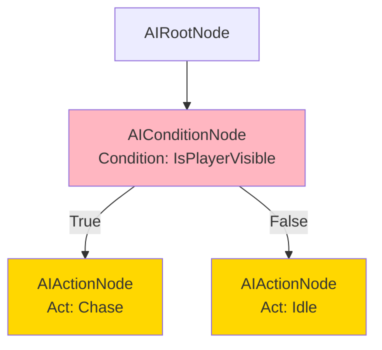
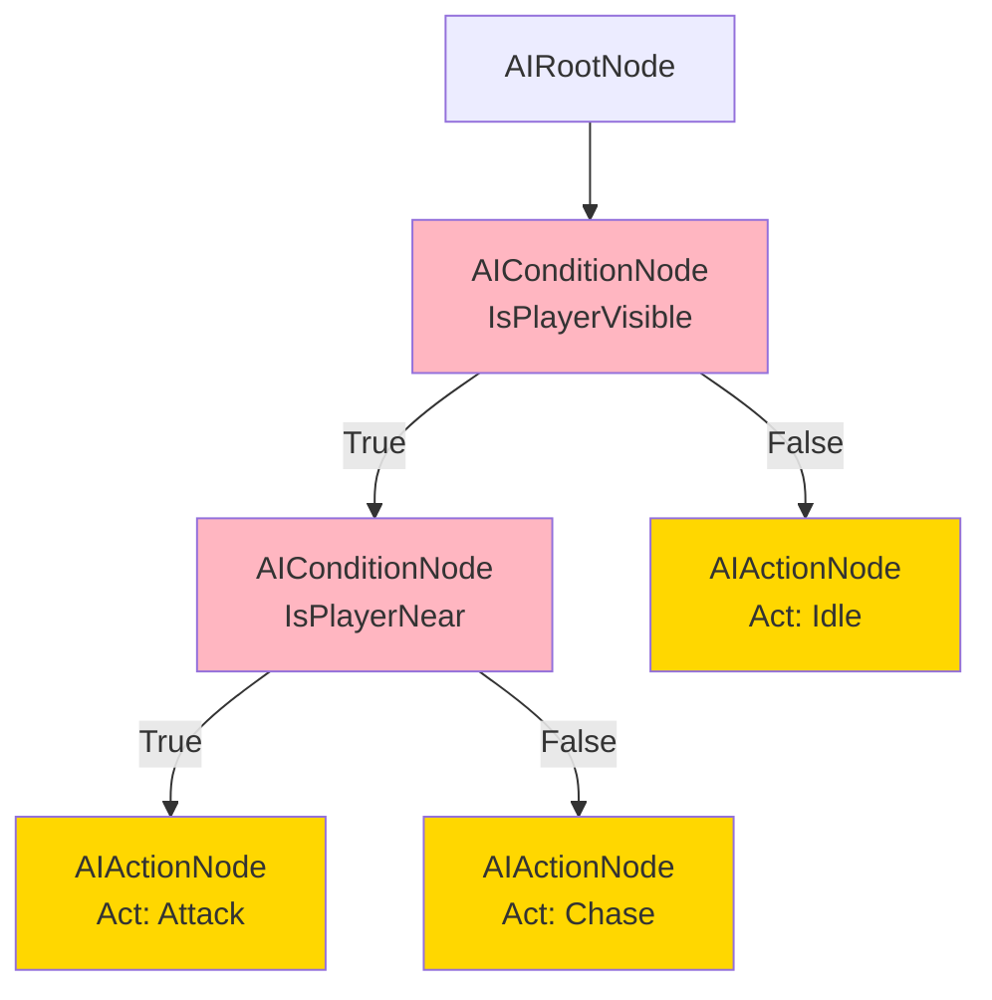
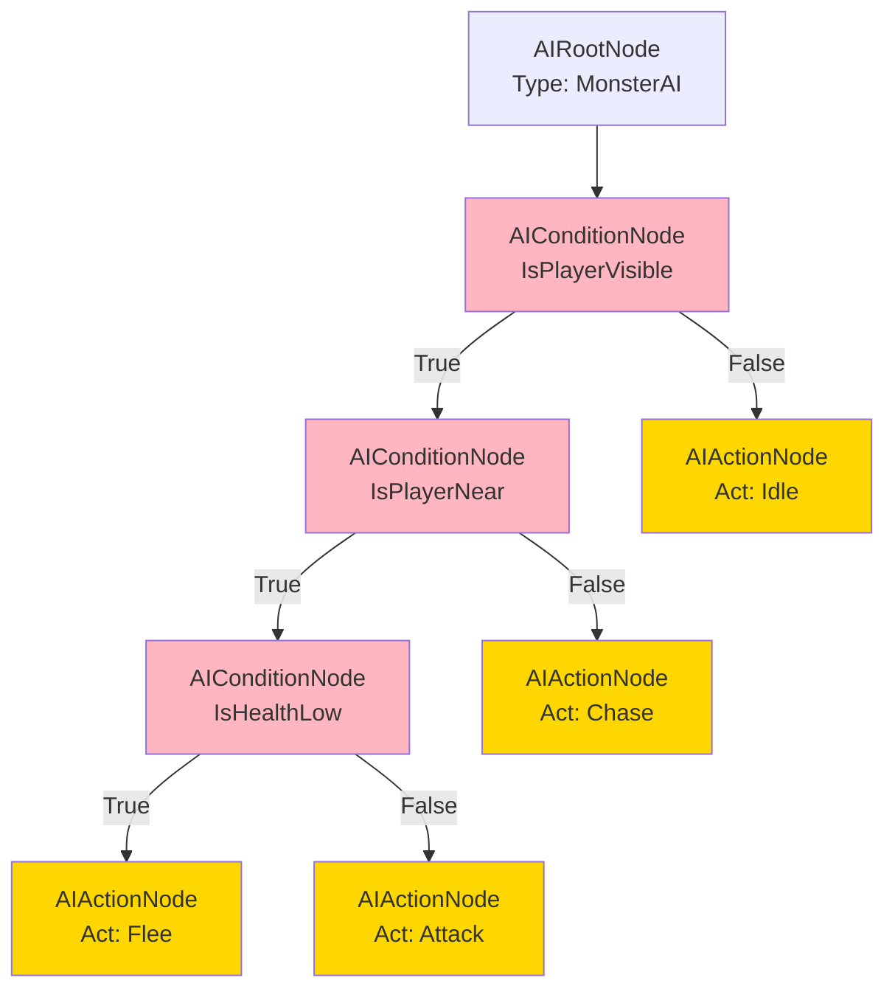

# AIConditionNode.cs 注解文档

## 文件基本信息

| 属性 | 值 |
|------|-----|
| **文件名** | AIConditionNode.cs |
| **路径** | Assets/Scripts/Editor/DesignEditor/GraphEditor/AIEditor/AIConditionNode.cs |
| **所属模块** | Editor → DesignEditor/GraphEditor/AIEditor |
| **文件职责** | AI 决策树条件判断节点定义 |

---

## 类说明

### AIConditionNode

| 属性 | 说明 |
|------|------|
| **职责** | AI 决策树中的条件判断节点，根据条件真假决定执行哪个分支 |
| **类型** | `JsonNodeBase` |
| **命名空间** | `TaoTie` |
| **可见性** | `public` |

**继承关系**:
```
JsonNodeBase → NodeBase → ScriptableObject → Object
```

**设计模式**: 
- **策略模式**: 根据条件选择不同的执行路径
- **分支模式**: True/False 两个输出分支

---

## 字段说明

| 字段名 | 类型 | 默认值 | 说明 |
|--------|------|--------|------|
| `Condition` | `string` | - | 条件标识符，从预定义的条件列表中选择 |

**字段详情**:

### Condition

- **特性**: 
  - `[ValueDropdown("@" + nameof(OdinDropdownHelper) + "." + nameof(OdinDropdownHelper.GetAIDecisionInterface) + "()")]` - Odin Inspector 下拉选择器
  - `[LabelText("判断")]` - 显示标签为"判断"
- **用途**: 选择要判断的条件类型
- **数据来源**: `OdinDropdownHelper.GetAIDecisionInterface()` 返回预定义条件列表

**常见条件值**:

| 条件值 | 说明 |
|--------|------|
| `IsPlayerVisible` | 玩家是否在视野内 |
| `IsPlayerNear` | 玩家是否在附近 |
| `IsPlayerAttacking` | 玩家是否正在攻击 |
| `HasTarget` | 是否有目标 |
| `IsHealthLow` | 生命值是否低于阈值 |
| `IsSkillReady` | 技能是否就绪 |
| `IsPatrolPointReached` | 是否到达巡逻点 |

---

## 方法说明

### InitNode

**签名**:
```csharp
public override void InitNode(Vector2 pos, string nodeName, int minInputPortsCount = 0, int minOutputPortsCount = 0)
```

**职责**: 初始化条件节点

**参数**:
| 参数 | 类型 | 默认值 | 说明 |
|------|------|--------|------|
| `pos` | `Vector2` | - | 节点在编辑器中的位置 |
| `nodeName` | `string` | - | 节点名称 |
| `minInputPortsCount` | `int` | `0` | 最小输入端口数 |
| `minOutputPortsCount` | `int` | `0` | 最小输出端口数 |

**核心逻辑**:
```
1. 调用基类 InitNode 初始化
2. 设置节点名称为 "Condition"
```

---

### AddDefaultPorts

**签名**:
```csharp
public override void AddDefaultPorts()
```

**职责**: 添加默认的端口连接

**核心逻辑**:
```
添加三个端口:
1. 输入端口:
   - 端口名："输入"
   - 端口模式：EdgeMode.Multiple
   - 允许连接：true
   - 必填：false

2. True 输出端口:
   - 端口名："True"
   - 端口模式：EdgeMode.Override
   - 允许连接：true
   - 必填：false

3. False 输出端口:
   - 端口名："False"
   - 端口模式：EdgeMode.Override
   - 允许连接：true
   - 必填：false
```

**端口说明**:

| 端口名 | 类型 | 模式 | 说明 |
|--------|------|------|------|
| `输入` | 输入 | Multiple | 接收上游节点的输入 |
| `True` | 输出 | Override | 条件为真时执行此分支 |
| `False` | 输出 | Override | 条件为假时执行此分支 |

---

## Mermaid 流程图

### 条件节点结构



### 决策树中的使用



### 嵌套条件示例



---

## 使用示例

### 创建条件节点

**在 AIGraphWindow 编辑器中**:
```
1. 右键画布或端口
2. 选择 Create/AiConditionNode
3. 在 Inspector 中选择 Condition:
   - 点击下拉框
   - 从预定义列表中选择条件 (如 "IsPlayerVisible")
4. 连接输入和输出端口
```

### 运行时评估

```csharp
// 运行时决策树评估
public DecisionNode Evaluate(DecisionConditionNode node, Entity entity)
{
    bool result = EvaluateCondition(node.Condition, entity);
    
    if (result)
    {
        // 条件为真，评估 True 分支
        return node.True != null ? Evaluate(node.True, entity) : null;
    }
    else
    {
        // 条件为假，评估 False 分支
        return node.False != null ? Evaluate(node.False, entity) : null;
    }
}

// 条件评估实现
private bool EvaluateCondition(string condition, Entity entity)
{
    switch (condition)
    {
        case "IsPlayerVisible":
            return CheckPlayerVisible(entity);
        case "IsPlayerNear":
            return CheckPlayerDistance(entity) < 5f;
        case "IsHealthLow":
            return entity.GetNumericComponent().GetValue(NumericType.HP) < 30;
        case "HasTarget":
            return entity.TargetId != 0;
        default:
            return false;
    }
}
```

### 条件组合示例



---

## 注意事项

### 条件列表

- 条件值来自 `OdinDropdownHelper.GetAIDecisionInterface()`
- 需要在 `OdinDropdownHelper` 中注册所有可用条件
- 条件名称必须与运行时评估逻辑匹配

### 分支完整性

- True 和 False 分支都可以连接其他节点
- 如果某个分支未连接，评估到该分支时返回 null
- 建议确保两个分支都有合理的后续节点

### 与 CompareNode 的区别

| 节点类型 | 用途 | 配置 |
|---------|------|------|
| `AIConditionNode` | 预定义条件判断 | 选择条件名称 |
| `AICompareNode` | 自定义数值比较 | 配置左值、运算符、右值 |

**使用场景**:
- `AIConditionNode`: 常用条件 (视野、距离、状态等)
- `AICompareNode`: 自定义数值比较 (HP < 30%, Level > 10 等)

---

## 相关类

| 类名 | 关系 | 说明 |
|------|------|------|
| `JsonNodeBase` | 父类 | 图节点基类 |
| `DecisionConditionNode` | 运行时 | 运行时条件节点 |
| `OdinDropdownHelper` | 辅助 | 提供下拉选项 |
| `AIRootNode` | 兄弟节点 | 根节点 |
| `AIActionNode` | 兄弟节点 | 动作节点 |
| `AICompareNode` | 兄弟节点 | 比较节点 |

---

## 相关文档链接

- [AIRootNode.cs.md](./AIRootNode.cs.md) - 根节点
- [AIGraph.cs.md](./AIGraph.cs.md) - 图数据
- [AIGraphWindow.cs.md](./AIGraphWindow.cs.md) - 编辑器窗口
- [AIActionNode.cs.md](./AIActionNode.cs.md) - 动作节点
- [AICompareNode.cs.md](./AICompareNode.cs.md) - 比较节点
- [DecisionConditionNode.cs.md](../../../../Code/Module/Config/DecisionTree/DecisionConditionNode.cs.md) - 运行时条件节点
- [OdinDropdownHelper.cs.md](../../../../Code/Module/Config/OdinDropdownHelper.cs.md) - 下拉选项辅助类

---

*文档生成时间：2026-03-03 | OpenClaw AI 助手*
