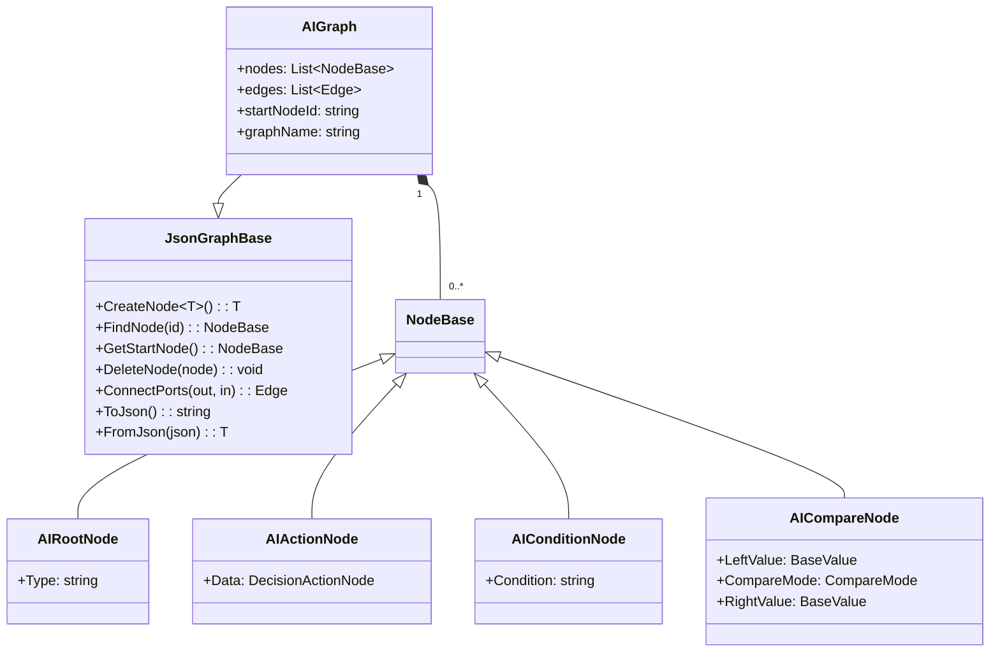
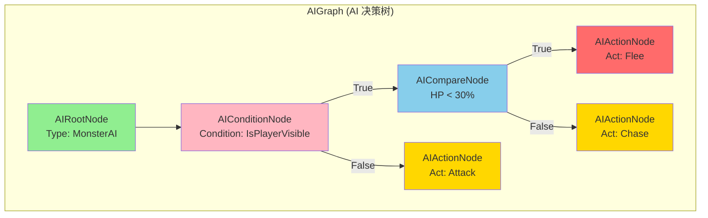

# AIGraph.cs 注解文档

## 文件基本信息

| 属性 | 值 |
|------|-----|
| **文件名** | AIGraph.cs |
| **路径** | Assets/Scripts/Editor/DesignEditor/GraphEditor/AIEditor/AIGraph.cs |
| **所属模块** | Editor → DesignEditor/GraphEditor/AIEditor |
| **文件职责** | AI 决策树图数据结构定义 |

---

## 类说明

### AIGraph

| 属性 | 说明 |
|------|------|
| **职责** | AI 决策树的图数据结构，继承自 JsonGraphBase，支持序列化为 JSON |
| **类型** | `JsonGraphBase` |
| **命名空间** | `TaoTie` |
| **可见性** | `public` |

**继承关系**:
```
JsonGraphBase → GraphBase → ScriptableObject → Object
```

**设计模式**: 
- **组合模式**: 包含多个节点 (NodeBase) 和边 (Edge)
- **序列化模式**: 支持 JSON 序列化和反序列化

---

## 字段说明

AIGraph 继承自 `JsonGraphBase`，主要包含以下核心字段:

| 字段名 | 类型 | 来源 | 说明 |
|--------|------|------|------|
| `nodes` | `List<NodeBase>` | GraphBase | 图中所有节点的列表 |
| `edges` | `List<Edge>` | GraphBase | 图中所有连接边的列表 |
| `startNodeId` | `string` | GraphBase | 起始节点 ID (通常为根节点) |
| `graphName` | `string` | GraphBase | 图的名称 |

---

## 方法说明

AIGraph 继承 `JsonGraphBase` 的所有方法，主要包括:

### 节点管理

| 方法 | 说明 |
|------|------|
| `CreateNode<T>()` | 创建指定类型的节点 |
| `FindNode(nodeId)` | 根据 ID 查找节点 |
| `GetStartNode()` | 获取起始节点 |
| `DeleteNode(node)` | 删除节点 |

### 边管理

| 方法 | 说明 |
|------|------|
| `ConnectPorts(outputPort, inputPort)` | 连接两个端口 |
| `GetEdge(edgeId)` | 根据 ID 获取边 |

### 序列化

| 方法 | 说明 |
|------|------|
| `ToJson()` | 序列化为 JSON 字符串 |
| `FromJson(json)` | 从 JSON 反序列化 |

---

## Mermaid 流程图

### AIGraph 数据结构



### 决策树图结构示例



---

## 使用示例

### 创建 AI 决策树

```csharp
// 在 AIGraphWindow 中创建新图
var graph = new AIGraph();

// 创建根节点
var rootNode = graph.CreateNode<AIRootNode>(new Vector2(100, 100), "Root", true);
rootNode.Type = "MonsterAI";

// 创建条件节点
var conditionNode = graph.CreateNode<AIConditionNode>(new Vector2(100, 250), "Condition");
conditionNode.Condition = "IsPlayerVisible";

// 创建动作节点
var actionNode = graph.CreateNode<AIActionNode>(new Vector2(100, 400), "Action");
actionNode.Data.Act = "Chase";

// 连接节点
graph.ConnectPorts(rootNode.outputPorts[0], conditionNode.inputPorts[0]);
graph.ConnectPorts(conditionNode.outputPorts[0], actionNode.inputPorts[0]);

// 设置起始节点
graph.startNodeId = rootNode.Id;
```

### 序列化与保存

```csharp
// 序列化为 JSON
string json = JsonHelper.ToJson(graph);

// 保存到文件
File.WriteAllText("Assets/AssetsPackage/GraphAssets/AITree/MonsterAI.json", json);

// 同时保存二进制格式
byte[] bytes = NinoSerializer.Serialize(graph);
File.WriteAllBytes("Assets/AssetsPackage/GraphAssets/AITree/MonsterAI.bytes", bytes);
```

### 加载 AI 决策树

```csharp
// 从 JSON 加载
string json = File.ReadAllText("Assets/AssetsPackage/GraphAssets/AITree/MonsterAI.json");
var graph = JsonHelper.FromJson<AIGraph>(json);

// 获取根节点
var rootNode = graph.GetStartNode() as AIRootNode;
Debug.Log($"AI Type: {rootNode.Type}");
```

---

## 注意事项

### 序列化兼容性

- AIGraph 使用 `JsonGraphBase` 的序列化机制
- 所有节点类型必须正确注册才能反序列化
- 导出时会转换为 `ConfigAIDecisionTree` 运行时格式

### 节点约束

- 每个图必须有且仅有一个根节点 (AIRootNode)
- 根节点不可删除
- 节点连接必须遵循类型规则 (见 AIGraphWindow 的菜单逻辑)

### 文件存储

- 编辑器保存格式：`.json` (人类可读)
- 运行时加载格式：`.bytes` (Nino 序列化，更小更快)
- 导出时同时生成两种格式

---

## 相关类

| 类名 | 关系 | 说明 |
|------|------|------|
| `JsonGraphBase` | 父类 | 图数据结构基类 |
| `AIRootNode` | 子节点 | 根节点 |
| `AIActionNode` | 子节点 | 动作节点 |
| `AIConditionNode` | 子节点 | 条件节点 |
| `AICompareNode` | 子节点 | 比较节点 |
| `AIGraphWindow` | 编辑器 | 图编辑窗口 |
| `ConfigAIDecisionTree` | 运行时 | 导出的运行时配置 |

---

## 相关文档链接

- [AIRootNode.cs.md](./AIRootNode.cs.md) - 根节点
- [AIGraphWindow.cs.md](./AIGraphWindow.cs.md) - 编辑器窗口
- [AIActionNode.cs.md](./AIActionNode.cs.md) - 动作节点
- [AIConditionNode.cs.md](./AIConditionNode.cs.md) - 条件节点
- [AICompareNode.cs.md](./AICompareNode.cs.md) - 比较节点
- [ConfigAIDecisionTree.cs.md](../../../../Code/Module/Config/DecisionTree/ConfigAIDecisionTree.cs.md) - 运行时配置

---

*文档生成时间：2026-03-03 | OpenClaw AI 助手*
