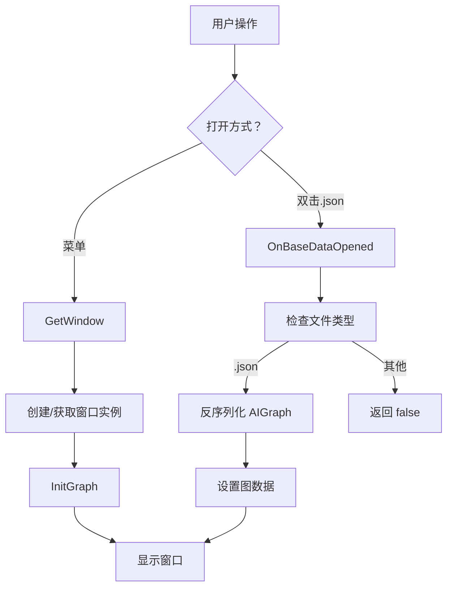
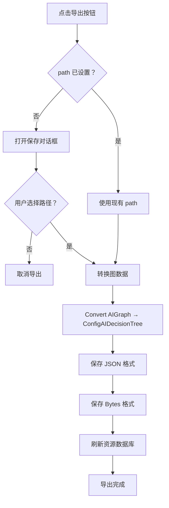
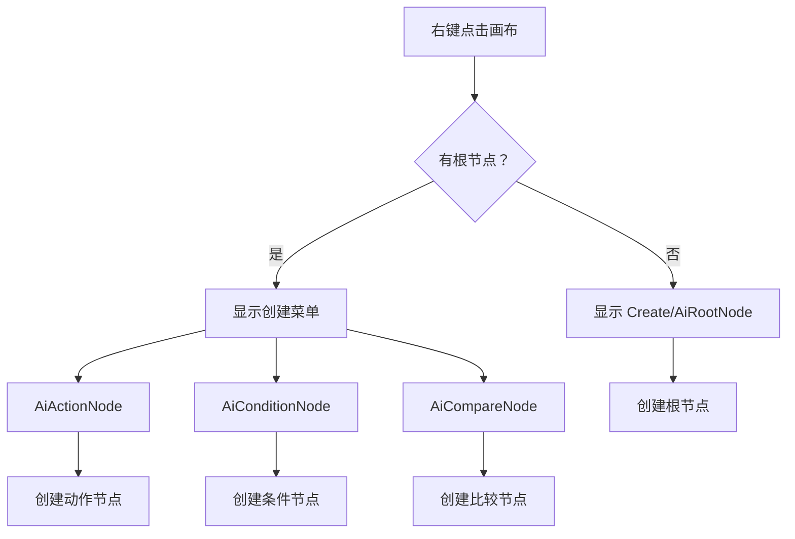
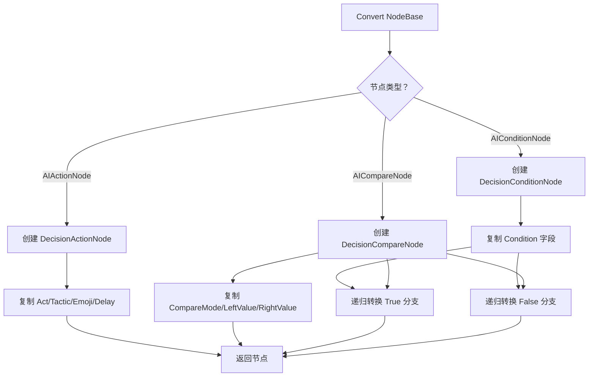

# AIGraphWindow.cs 注解文档

## 文件基本信息

| 属性 | 值 |
|------|-----|
| **文件名** | AIGraphWindow.cs |
| **路径** | Assets/Scripts/Editor/DesignEditor/GraphEditor/AIEditor/AIGraphWindow.cs |
| **所属模块** | Editor → DesignEditor/GraphEditor/AIEditor |
| **文件职责** | AI 决策树可视化编辑器窗口 |

---

## 类说明

### AIGraphWindow

| 属性 | 说明 |
|------|------|
| **职责** | AI 决策树的可视化编辑工具，支持节点创建、连接、编辑和导出 |
| **类型** | `GraphWindow<AIGraph>` |
| **命名空间** | `TaoTie` |
| **可见性** | `public` |

**继承关系**:
```
GraphWindow<AIGraph> → EditorWindow → ScriptableObject → Object
```

**设计模式**: 
- **单例模式**: 通过 `instance` 属性确保窗口唯一性
- **泛型模式**: 基于 GraphWindow 泛型类，支持多种图编辑
- **命令模式**: 通过菜单项和右键菜单执行操作

---

## 字段说明

| 字段名 | 类型 | 默认值 | 说明 |
|--------|------|--------|------|
| `path` | `string` | `null` | 当前编辑的图文件路径 |
| `s_Instance` | `AIGraphWindow` | `null` | 静态单例实例 |

---

## 属性说明

### instance

**签名**:
```csharp
internal static AIGraphWindow instance { get; }
```

**职责**: 获取或创建窗口单例实例

**获取逻辑**:
```
1. 检查 s_Instance 是否已存在
2. 查找场景中已有的 AIGraphWindow 实例
3. 如果都没有，创建新窗口
4. 返回实例
```

---

## 方法说明

### GetWindow

**签名**:
```csharp
[MenuItem("Tools/工具/策划/Graph 编辑器/AI 编辑器")]
public static void GetWindow()
```

**职责**: 打开 AI 编辑器窗口

**触发方式**: Unity 菜单 `Tools → 工具 → 策划 → Graph 编辑器 → AI 编辑器`

**核心逻辑**:
```
1. 设置窗口标题为"AI 编辑器"
2. 显示窗口
3. 初始化新图
```

---

### OnBaseDataOpened

**签名**:
```csharp
[OnOpenAsset(0)]
public static bool OnBaseDataOpened(int instanceID, int line)
```

**职责**: 双击 .json 文件时自动打开编辑器

**特性**: `[OnOpenAsset(0)]` - Unity 资源打开回调

**参数**:
| 参数 | 类型 | 说明 |
|------|------|------|
| `instanceID` | `int` | 资源实例 ID |
| `line` | `int` | 打开的行号 (未使用) |

**核心逻辑**:
```
1. 根据 instanceID 获取 TextAsset 对象
2. 获取资源路径
3. 调用 InitializeData 初始化
4. 返回是否成功打开
```

---

### InitializeData

**签名**:
```csharp
private static bool InitializeData(TextAsset asset, string path)
```

**职责**: 初始化图数据

**参数**:
| 参数 | 类型 | 说明 |
|------|------|------|
| `asset` | `TextAsset` | JSON 文本资源 |
| `path` | `string` | 资源路径 |

**核心逻辑**:
```
1. 检查 asset 是否为 null
2. 检查路径是否以 .json 结尾
3. 反序列化为 AIGraph
4. 设置窗口并显示
5. 设置图数据和路径
```

**返回**: 成功返回 `true`，失败返回 `false`

---

### OnEnable

**签名**:
```csharp
protected override void OnEnable()
```

**职责**: 窗口启用时的初始化

**核心逻辑**:
```
1. 调用基类 OnEnable
2. 添加"导出"按钮到工具栏
```

---

### InitGraph

**签名**:
```csharp
protected override void InitGraph()
```

**职责**: 初始化新图

**核心逻辑**:
```
1. 清空 path
2. 调用基类 InitGraph
3. 创建默认的根节点
```

---

### CreateGraph

**签名**:
```csharp
protected override AIGraph CreateGraph()
```

**职责**: 创建新的空图

**返回**: 包含根节点的新 AIGraph

**核心逻辑**:
```
1. 创建新的 AIGraph 实例
2. 在窗口中心位置创建 AIRootNode
3. 返回图实例
```

---

### LoadGraph

**签名**:
```csharp
protected override AIGraph LoadGraph()
```

**职责**: 从文件加载图

**返回**: 加载的 AIGraph 或 null

**核心逻辑**:
```
1. 打开文件选择对话框 (限定在 AITree 目录)
2. 读取 JSON 文件内容
3. 反序列化为 AIGraph
4. 保存路径
5. 返回图实例
```

---

### SaveGraph

**签名**:
```csharp
protected override void SaveGraph()
```

**职责**: 保存图到文件

**核心逻辑**:
```
1. 如果 path 为空，打开保存对话框
2. 将图序列化为 JSON
3. 写入文件
4. 刷新资源数据库
```

---

### AddGraphMenuItems

**签名**:
```csharp
protected override void AddGraphMenuItems(GenericMenu menu)
```

**职责**: 添加右键菜单项 (空白处右键)

**参数**:
| 参数 | 类型 | 说明 |
|------|------|------|
| `menu` | `GenericMenu` | 右键菜单对象 |

**核心逻辑**:
```
1. 如果图未初始化，先初始化
2. 如果没有根节点，显示"Create/AiRootNode"
3. 如果有根节点，显示:
   - Create/AiActionNode
   - Create/AiConditionNode
   - Create/AiCompareNode
```

**菜单项**:

| 条件 | 可用菜单项 |
|------|-----------|
| 无根节点 | Create/AiRootNode |
| 有根节点 | Create/AiActionNode, Create/AiConditionNode, Create/AiCompareNode |

---

### AddPortMenuItems

**签名**:
```csharp
protected override void AddPortMenuItems(GenericMenu menu, Port port, bool isLine = false)
```

**职责**: 添加端口右键菜单项 (端口右键)

**参数**:
| 参数 | 类型 | 说明 |
|------|------|------|
| `menu` | `GenericMenu` | 右键菜单对象 |
| `port` | `Port` | 端口对象 |
| `isLine` | `bool` | 是否是连线 |

**核心逻辑**:
```
1. 调用基类添加默认菜单
2. 如果是输出端口:
   - 根据节点类型显示可连接的节点类型
   - AIRootNode/AIConditionNode/AICompareNode 可连接:
     * AiActionNode
     * AiConditionNode
     * AiCompareNode
3. 点击菜单项自动创建节点并连接
```

---

### AddNodeMenuItems

**签名**:
```csharp
protected override void AddNodeMenuItems(GenericMenu menu, NodeBase nodeBase)
```

**职责**: 添加节点右键菜单项 (节点右键)

**参数**:
| 参数 | 类型 | 说明 |
|------|------|------|
| `menu` | `GenericMenu` | 右键菜单对象 |
| `nodeBase` | `NodeBase` | 节点对象 |

**核心逻辑**:
```
1. 如果节点可删除 (canBeDeleted = true)
2. 显示"Delete"菜单项
3. 点击删除节点
```

**注意**: 根节点 (AIRootNode) 的 `canBeDeleted = false`，不会显示删除选项

---

### Export

**签名**:
```csharp
private void Export()
```

**职责**: 导出决策树为运行时配置

**核心逻辑**:
```
1. 检查 path 是否已设置
2. 打开保存对话框 (默认到 EditConfig/AITree/)
3. 调用 Convert 将 AIGraph 转换为 ConfigAIDecisionTree
4. 保存 JSON 格式
5. 保存 Nino 二进制格式 (.bytes)
6. 刷新资源数据库
```

**输出文件**:
- `{name}.json` - JSON 格式 (人类可读)
- `{name}.bytes` - Nino 序列化格式 (运行时使用)

---

### Convert (AIGraph)

**签名**:
```csharp
private ConfigAIDecisionTree Convert(AIGraph graph)
```

**职责**: 将编辑器图转换为运行时配置

**参数**:
| 参数 | 类型 | 说明 |
|------|------|------|
| `graph` | `AIGraph` | 编辑器图 |

**返回**: `ConfigAIDecisionTree` 运行时配置

**核心逻辑**:
```
1. 获取根节点 (AIRootNode)
2. 创建 ConfigAIDecisionTree
3. 复制 Type 字段
4. 递归转换根节点的子节点
5. 返回配置
```

---

### Convert (NodeBase)

**签名**:
```csharp
private DecisionNode Convert(NodeBase aiNode)
```

**职责**: 递归转换节点为运行时决策节点

**参数**:
| 参数 | 类型 | 说明 |
|------|------|------|
| `aiNode` | `NodeBase` | 编辑器节点 |

**返回**: `DecisionNode` 或其子类

**节点类型映射**:

| 编辑器节点 | 运行时节点 | 字段映射 |
|-----------|-----------|---------|
| `AIConditionNode` | `DecisionConditionNode` | Condition |
| `AIActionNode` | `DecisionActionNode` | Act, Tactic, Emoji, Delay |
| `AICompareNode` | `DecisionCompareNode` | CompareMode, LeftValue, RightValue, True, False |

**递归逻辑**:
```
1. 判断节点类型
2. 创建对应的运行时节点
3. 复制字段
4. 递归转换输出端口连接的子节点
5. 返回运行时节点
```

---

## Mermaid 流程图

### 窗口打开流程



### 导出流程



### 节点创建流程



### 节点转换流程



---

## 使用示例

### 打开 AI 编辑器

**方式 1: 通过菜单**
```
1. Unity 顶部菜单：Tools → 工具 → 策划 → Graph 编辑器 → AI 编辑器
2. 窗口打开，自动创建空图和根节点
```

**方式 2: 双击 JSON 文件**
```
1. 在 Project 窗口双击 AITree 目录下的 .json 文件
2. 自动打开编辑器并加载图数据
```

### 创建决策树

```
1. 右键画布空白处:
   - 如果无根节点：选择 Create/AiRootNode
   - 如果有根节点：选择 Create/AiConditionNode

2. 设置节点属性:
   - AIRootNode: 设置 Type = "MonsterAI"
   - AIConditionNode: 选择 Condition = "IsPlayerVisible"
   - AICompareNode: 设置 LeftValue, CompareMode, RightValue
   - AIActionNode: 设置 Act, Tactic, Emoji, Delay

3. 连接节点:
   - 从输出端口拖拽到输入端口
   - 或右键端口选择连接类型

4. 保存：Ctrl+S 或 File → Save

5. 导出：点击工具栏"导出"按钮
```

### 导出的文件结构

```
Assets/AssetsPackage/EditConfig/AITree/
├── MonsterAI.json      # JSON 格式 (可读)
└── MonsterAI.bytes     # Nino 序列化 (运行时)

Assets/AssetsPackage/GraphAssets/AITree/
└── MonsterAI.json      # 编辑器保存文件
```

---

## 注意事项

### 单例管理

- 窗口使用单例模式，确保同一时间只有一个 AI 编辑器实例
- 通过 `instance` 属性访问，不要直接 `CreateWindow`

### 文件路径

- 编辑器文件保存在 `GraphAssets/AITree/`
- 导出文件保存在 `EditConfig/AITree/`
- 运行时加载 `Config/AITree/` 的 .bytes 文件

### 节点连接规则

| 源节点类型 | 可连接目标节点 |
|-----------|---------------|
| AIRootNode | AIActionNode, AIConditionNode, AICompareNode |
| AIConditionNode | AIActionNode, AIConditionNode, AICompareNode |
| AICompareNode | AIActionNode, AIConditionNode, AICompareNode |
| AIActionNode | 无 (终端节点) |

### 导出要求

- 必须先保存图 (设置 path) 才能导出
- 导出会同时生成 JSON 和 Bytes 两种格式
- 导出后需要刷新资源数据库才能看到新文件

---

## 相关类

| 类名 | 关系 | 说明 |
|------|------|------|
| `GraphWindow<T>` | 父类 | 通用图编辑窗口基类 |
| `AIGraph` | 数据 | AI 决策树图数据 |
| `AIRootNode` | 节点 | 根节点 |
| `AIActionNode` | 节点 | 动作节点 |
| `AIConditionNode` | 节点 | 条件节点 |
| `AICompareNode` | 节点 | 比较节点 |
| `ConfigAIDecisionTree` | 输出 | 运行时配置 |
| `DecisionNode` | 输出 | 运行时决策节点基类 |

---

## 相关文档链接

- [AIRootNode.cs.md](./AIRootNode.cs.md) - 根节点
- [AIGraph.cs.md](./AIGraph.cs.md) - 图数据
- [AIActionNode.cs.md](./AIActionNode.cs.md) - 动作节点
- [AIConditionNode.cs.md](./AIConditionNode.cs.md) - 条件节点
- [AICompareNode.cs.md](./AICompareNode.cs.md) - 比较节点
- [ConfigAIDecisionTree.cs.md](../../../../Code/Module/Config/DecisionTree/ConfigAIDecisionTree.cs.md) - 运行时配置
- [DecisionNode.cs.md](../../../../Code/Module/Config/DecisionTree/DecisionNode.cs.md) - 运行时决策节点

---

*文档生成时间：2026-03-03 | OpenClaw AI 助手*
