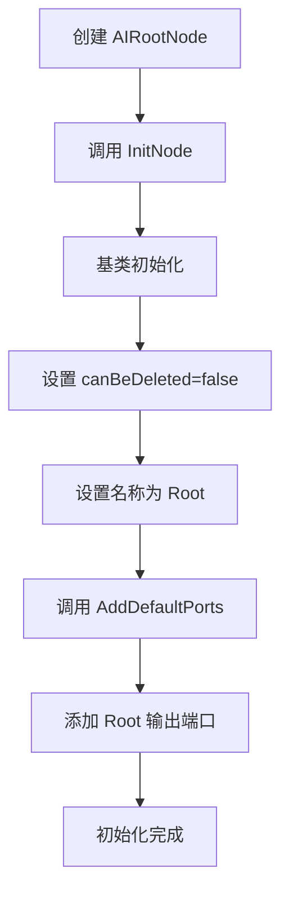
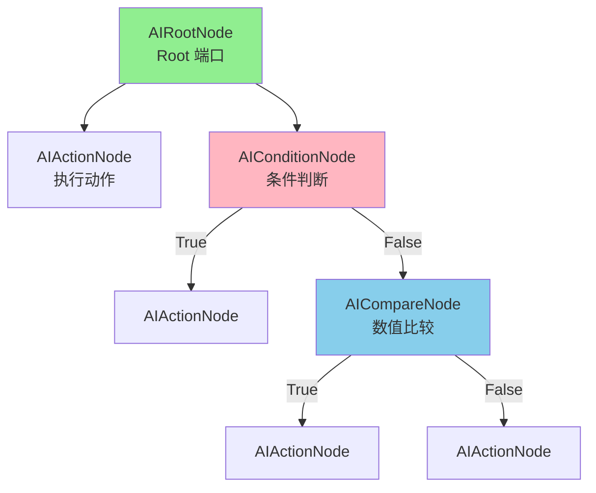

# AIRootNode.cs 注解文档

## 文件基本信息

| 属性 | 值 |
|------|-----|
| **文件名** | AIRootNode.cs |
| **路径** | Assets/Scripts/Editor/DesignEditor/GraphEditor/AIEditor/AIRootNode.cs |
| **所属模块** | Editor → DesignEditor/GraphEditor/AIEditor |
| **文件职责** | AI 决策树图编辑器根节点定义 |

---

## 类说明

### AIRootNode

| 属性 | 说明 |
|------|------|
| **职责** | AI 决策树图的根节点，作为整个 AI 行为树的入口点 |
| **类型** | `JsonNodeBase` |
| **命名空间** | `TaoTie` |
| **可见性** | `public` |

**继承关系**:
```
JsonNodeBase → NodeBase → ScriptableObject → Object
```

**设计模式**: 
- **组合模式**: 作为决策树的根节点，组合所有子节点
- **单例约束**: 每个图只能有一个根节点 (通过 `canBeDeleted = false` 保证)

---

## 字段说明

| 字段名 | 类型 | 默认值 | 说明 |
|--------|------|--------|------|
| `Type` | `string` | - | AI 类型标识，用于区分不同种类的 AI 决策树 |

**字段详情**:

### Type

- **特性**: `[LabelText("AI 类型")]` - Odin Inspector 标签，在编辑器中显示为 "AI 类型"
- **用途**: 标识该 AI 决策树的类型，运行时根据此类型加载对应的决策树配置
- **示例值**: `"MonsterAI"`, `"NPCAI"`, `"PlayerAI"`

---

## 方法说明

### InitNode

**签名**:
```csharp
public override void InitNode(Vector2 pos, string nodeName, int minInputPortsCount = 0, int minOutputPortsCount = 0)
```

**职责**: 初始化根节点

**参数**:
| 参数 | 类型 | 默认值 | 说明 |
|------|------|--------|------|
| `pos` | `Vector2` | - | 节点在编辑器中的位置 |
| `nodeName` | `string` | - | 节点名称 |
| `minInputPortsCount` | `int` | `0` | 最小输入端口数 |
| `minOutputPortsCount` | `int` | `0` | 最小输出端口数 |

**核心逻辑**:
```
1. 调用基类 InitNode 初始化
2. 设置 canBeDeleted = false (根节点不可删除)
3. 设置节点名称为 "Root"
```

**设计要点**:
- 根节点不可删除，保证决策树始终有入口点
- 强制命名为 "Root"，保持一致性

---

### AddDefaultPorts

**签名**:
```csharp
public override void AddDefaultPorts()
```

**职责**: 添加默认的端口连接

**核心逻辑**:
```
添加一个名为 "Root" 的输出端口
- 端口模式：EdgeMode.Override (覆盖模式)
- 允许连接：true
- 必填：false
```

**端口说明**:

| 端口名 | 类型 | 模式 | 说明 |
|--------|------|------|------|
| `Root` | 输出 | Override | 根节点的输出，连接到第一个决策节点 |

---

## Mermaid 流程图

### 根节点初始化流程



### 决策树结构



---

## 使用示例

### 创建 AI 决策树

**在 AIGraphWindow 编辑器中**:
```
1. 菜单：Tools → 工具 → 策划 → Graph 编辑器 → AI 编辑器
2. 自动创建根节点 AIRootNode
3. 在 Inspector 中设置 Type = "MonsterAI"
4. 右键根节点 → Create → AiActionNode/AiConditionNode/AiCompareNode
5. 连接节点构建决策树
6. 点击"导出"按钮生成运行时配置
```

### 运行时加载

```csharp
// 运行时根据 Type 加载对应的决策树配置
var config = ConfigManager.Instance.Get<ConfigAIDecisionTree>("MonsterAI");
// config.Node 包含整个决策树结构
```

---

## 相关类

| 类名 | 关系 | 说明 |
|------|------|------|
| `AIGraph` | 所属图 | AI 决策树的图容器 |
| `AIGraphWindow` | 编辑器窗口 | AI 编辑器的主窗口 |
| `AIActionNode` | 子节点 | 执行动作节点 |
| `AIConditionNode` | 子节点 | 条件判断节点 |
| `AICompareNode` | 子节点 | 数值比较节点 |
| `ConfigAIDecisionTree` | 运行时配置 | 导出的运行时决策树配置 |

---

## 注意事项

### 单例约束

- 每个 AIGraph 只能有一个 AIRootNode
- 通过 `canBeDeleted = false` 防止误删除
- 如果根节点不存在，菜单中只显示创建根节点的选项

### 导出流程

- 根节点的 `Type` 字段决定导出文件的名称
- 导出时会递归转换所有子节点为 `ConfigAIDecisionTree` 结构
- 生成 `.json` 和 `.bytes` (Nino 序列化) 两种格式

---

## 相关文档链接

- [AIGraph.cs.md](./AIGraph.cs.md) - AI 决策树图定义
- [AIGraphWindow.cs.md](./AIGraphWindow.cs.md) - AI 编辑器窗口
- [AIActionNode.cs.md](./AIActionNode.cs.md) - 动作节点
- [AIConditionNode.cs.md](./AIConditionNode.cs.md) - 条件节点
- [AICompareNode.cs.md](./AICompareNode.cs.md) - 比较节点
- [ConfigAIDecisionTree.cs.md](../../../../Code/Module/Config/DecisionTree/ConfigAIDecisionTree.cs.md) - 运行时配置

---

*文档生成时间：2026-03-03 | OpenClaw AI 助手*
