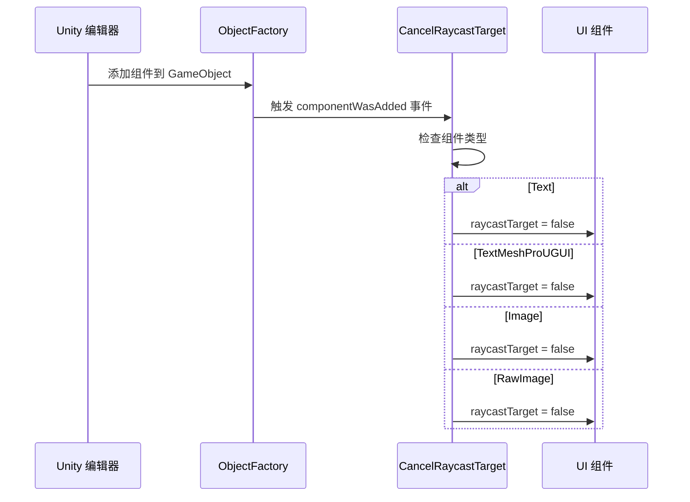

# CancelRaycastTarget.cs 注解文档

## 文件基本信息

| 属性 | 值 |
|------|-----|
| **文件名** | CancelRaycastTarget.cs |
| **路径** | Assets/Scripts/Editor/UIManager/CancelRaycastTarget.cs |
| **所属模块** | Editor → UIManager |
| **文件职责** | 自动禁用 UI 组件的射线检测目标，优化 UI 性能 |

---

## 类/结构体说明

### CancelRaycastTarget

| 属性 | 说明 |
|------|------|
| **职责** | 监听 Unity 编辑器中组件添加事件，自动禁用 Text/Image/RawImage 等 UI 组件的 raycastTarget 属性 |
| **泛型参数** | 无 |
| **继承关系** | 无继承 |
| **实现的接口** | 无 |

**设计模式**: 静态构造函数 + 事件监听

```csharp
// 编辑器加载时自动注册
[InitializeOnLoad]
public class CancelRaycastTarget
{
    static CancelRaycastTarget()
    {
        ObjectFactory.componentWasAdded += ComponentWasAdded;
    }
}
```

---

## 字段与属性

| 名称 | 类型 | 访问级别 | 说明 |
|------|------|----------|------|
| `componentWasAdded` | `Action<Component>` | `static` | Unity 对象工厂的组件添加事件 |

---

## 方法说明

### ComponentWasAdded()

**签名**:
```csharp
private static void ComponentWasAdded(Component comp)
```

**职责**: 当组件被添加到 GameObject 时，自动禁用其射线检测

**核心逻辑**:
```
1. 检查组件类型
2. 如果是 Text/TextMeshProUGUI/Image/RawImage
3. 设置 raycastTarget = false
```

**处理的组件类型**:

| 组件类型 | 处理方式 |
|----------|----------|
| `Text` | `tmp.raycastTarget = false` |
| `TextMeshProUGUI` | `tmp.raycastTarget = false` |
| `Image` | `image.raycastTarget = false` |
| `RawImage` | `image.raycastTarget = false` |

**调用者**: Unity 编辑器（当组件被添加时自动触发）

---

## 性能优化原理

### 为什么需要禁用 raycastTarget?

**问题**: 
- Unity UI 系统中，默认所有 Graphic 组件（Text、Image 等）的 `raycastTarget = true`
- 这意味着每个 UI 元素都会参与射线检测（点击、触摸等）
- 当 UI 层级复杂时，射线检测开销巨大

**解决方案**:
- 只有需要交互的 UI 元素才开启 raycastTarget
- 纯装饰性元素（背景、标签等）应关闭 raycastTarget

**性能影响**:
```
假设一个界面有 100 个 UI 元素：
- 全部开启 raycastTarget: 每次点击检测 100 次
- 仅 5 个交互元素开启：每次点击检测 5 次
- 性能提升：20 倍
```

---

## 使用场景

### 自动生效

此脚本在编辑器中自动生效，无需手动调用：

```
1. 在 Unity 编辑器中添加 Text/Image 组件
2. CancelRaycastTarget 自动拦截
3. raycastTarget 被设置为 false
4. 如需交互，手动开启 raycastTarget
```

### 手动开启射线检测

对于需要交互的 UI 元素：

```csharp
// 在代码中手动开启
button.GetComponent<Image>().raycastTarget = true;

// 或在 Inspector 中勾选 Raycast Target
```

---

## 完整流程图



---

## 使用示例

### 示例 1: 自动禁用（默认行为）

```
操作步骤:
1. 在 Hierarchy 中创建一个 Canvas
2. 添加一个 Image 组件
3. 检查 Image 组件 → raycastTarget 已自动关闭
```

### 示例 2: 需要交互时手动开启

```csharp
// 按钮背景需要接收点击
public class UIButton : MonoBehaviour
{
    void Awake()
    {
        var image = GetComponent<Image>();
        image.raycastTarget = true;  // 手动开启
    }
}
```

### 示例 3: 装饰性元素保持关闭

```csharp
// 装饰性背景，不需要交互
public class DecorativeBackground : MonoBehaviour
{
    void Awake()
    {
        var image = GetComponent<Image>();
        // raycastTarget 保持 false（默认）
        // 不参与射线检测，提升性能
    }
}
```

---

## 注意事项

### ⚠️ 仅在编辑器中生效

- 此脚本使用 `[InitializeOnLoad]` 特性
- 只在 Unity 编辑器中运行
- 构建后不会包含此逻辑

### ⚠️ 需要手动开启交互

- 按钮、输入框等交互元素需要手动开启 raycastTarget
- 忘记开启会导致点击无响应

### ⚠️ Text 组件特殊处理

代码中注释了一段禁用 Text 并替换为 TextMeshProUGUI 的逻辑：

```csharp
// 如果禁止使用 Text
// EditorApplication.CallbackFunction Update = null;
// Update = () =>
// {
//     var obj = comp.gameObject;
//     GameObject.DestroyImmediate(comp);
//     obj.AddComponent<TextMeshProUGUI>();
//     EditorApplication.update -= Update;
// };
// EditorApplication.update += Update;
```

这段代码被注释掉，表示当前项目允许使用 legacy Text 组件。

---

## 相关文档

- [UIScriptCreatorEditor.cs.md](./UIScriptCreatorEditor.cs.md) - UI 脚本生成编辑器
- [UICollectEditor.cs.md](./UICollectEditor.cs.md) - UI 节点绑定工具
- [ReferenceCollector.cs.md](../../Mono/Module/UI/ReferenceCollector.cs.md) - 引用收集器（UI 节点绑定）

---

*文档生成时间：2026-03-03 | OpenClaw AI 助手*
