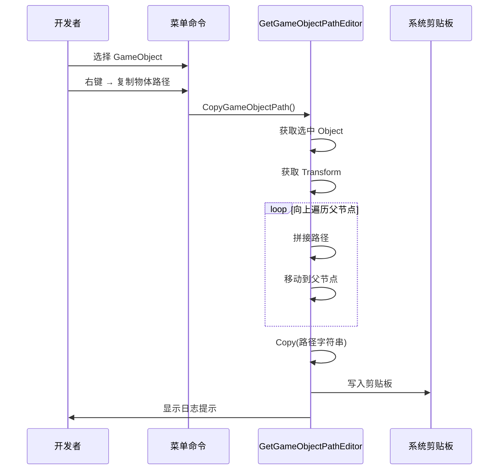

# GetGameObjectPathEditor.cs 注解文档

## 文件基本信息

| 属性 | 值 |
|------|-----|
| **文件名** | GetGameObjectPathEditor.cs |
| **路径** | Assets/Scripts/Editor/UIManager/GetGameObjectPathEditor.cs |
| **所属模块** | Editor → UIManager |
| **文件职责** | 快速复制 GameObject 在层级中的路径到剪贴板 |

---

## 类/结构体说明

### GetGameObjectPathEditor

| 属性 | 说明 |
|------|------|
| **职责** | 提供菜单命令，将选中的 GameObject 的层级路径复制到剪贴板 |
| **泛型参数** | 无 |
| **继承关系** | 无继承 |
| **实现的接口** | 无 |

**设计模式**: 工具类 + 编辑器菜单扩展

```csharp
// 菜单命令
[MenuItem("GameObject/复制物体路径", false, 24)]
static void CopyGameObjectPath()
```

---

## 字段与属性

无静态或实例字段。

---

## 方法说明

### Copy()

**签名**:
```csharp
public static void Copy(string result)
```

**职责**: 将字符串复制到系统剪贴板

**核心逻辑**:
```
1. 创建 TextEditor 实例
2. 设置 text 属性为输入字符串
3. 调用 OnFocus() 聚焦
4. 调用 Copy() 复制到剪贴板
```

**调用者**: `CopyGameObjectPath()`

**Unity API**:
```csharp
TextEditor editor = new TextEditor();
editor.text = new GUIContent(result).text;
editor.OnFocus();
editor.Copy();
```

---

### CopyGameObjectPath()

**签名**:
```csharp
[MenuItem("GameObject/复制物体路径", false, 24)]
static void CopyGameObjectPath()
```

**职责**: 获取选中 GameObject 的层级路径并复制到剪贴板

**核心逻辑**:
```
1. 获取选中的 Object
2. 获取 Transform 组件
3. 从当前节点向上遍历到根节点
4. 拼接路径字符串（子/父/祖父格式）
5. 调用 Copy() 复制到剪贴板
6. 输出日志提示
```

**路径格式**:
```
选中节点：BtnStart
父节点：Content
祖父节点：Panel
根节点：Canvas

生成的路径：Panel/Content/BtnStart
```

**遍历条件**:
```csharp
while (selectChild.parent != null && selectChild.parent.parent.parent != null)
```
- 停止条件：到达根节点或根节点的直接子节点
- 保留 3 级父节点（排除 Canvas 等顶层容器）

**调用者**: Unity 编辑器菜单

**被调用者**: `Copy()`

---

## 完整流程图



---

## 使用示例

### 示例 1: 复制单个节点路径

```
Hierarchy 结构:
└── Canvas
    └── Panel
        └── Content
            └── BtnStart

操作步骤:
1. 在 Hierarchy 中选择 "BtnStart"
2. 右键 → 复制物体路径
3. 剪贴板内容："Panel/Content/BtnStart"
4. 可直接粘贴到代码中作为路径参数
```

### 示例 2: 用于 UI 代码生成

```csharp
// 在 UIScriptCreator 中使用
// 复制路径后粘贴到代码生成工具中

// 生成的代码:
this.BtnStart = this.AddComponent<UIButton>("Panel/Content/BtnStart");
```

### 示例 3: 用于 Resources 加载

```csharp
// 复制路径后用于 Resources.Load
string path = "Panel/Content/BtnStart";
Transform btn = Resources.Load<Transform>(path);
```

---

## 注意事项

### ⚠️ 路径格式

- 路径不包含根节点名称（如 Canvas）
- 路径格式：`父节点/子节点/目标节点`
- 使用正斜杠 `/` 分隔

### ⚠️ 遍历深度

- 最多遍历到根节点的第三级子节点
- 条件：`selectChild.parent.parent.parent != null`
- 避免复制过长的完整路径

### ⚠️ 需要选中 Object

- 必须在 Hierarchy 中选中一个 GameObject
- 否则显示错误提示

---

## 相关文档

- [UIScriptCreatorEditor.cs.md](./UIScriptCreatorEditor.cs.md) - UI 脚本标记编辑器
- [UIEditorController.cs.md](./UIEditorController.cs.md) - UI 代码生成器

---

*文档生成时间：2026-03-03 | OpenClaw AI 助手*
