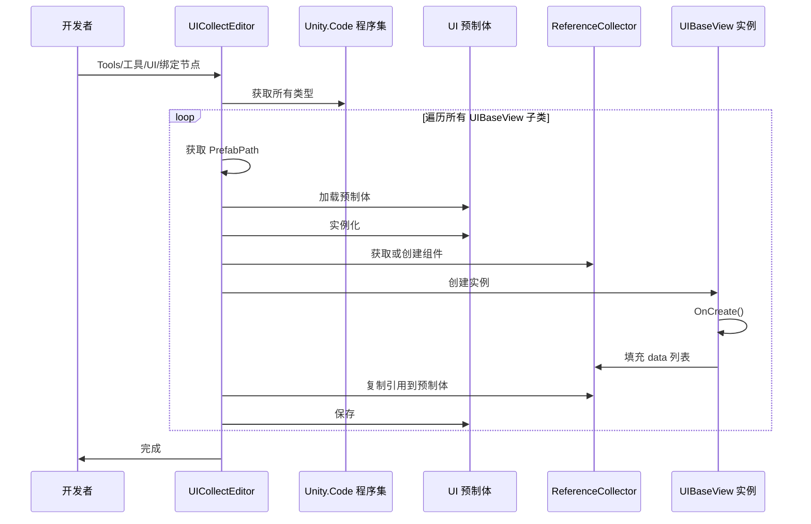

# UICollectEditor.cs 注解文档

## 文件基本信息

| 属性 | 值 |
|------|-----|
| **文件名** | UICollectEditor.cs |
| **路径** | Assets/Scripts/Editor/UIManager/UICollectEditor.cs |
| **所属模块** | Editor → UIManager |
| **文件职责** | 自动绑定 UI 预制体的节点引用到 ReferenceCollector 组件 |

---

## 类/结构体说明

### UICollectEditor

| 属性 | 说明 |
|------|------|
| **职责** | 通过菜单命令自动扫描所有 UI View 类，实例化预制体并收集节点引用到 ReferenceCollector |
| **泛型参数** | 无 |
| **继承关系** | 无继承 |
| **实现的接口** | 无 |

**设计模式**: 反射 + 自动化批处理

```csharp
// 菜单命令路径
[MenuItem("Tools/工具/UI/绑定节点", false, 23)]
public static void Generate()
```

---

## 字段与属性

| 名称 | 类型 | 访问级别 | 说明 |
|------|------|----------|------|
| `UIBaseView` | `Type` | `private` | UI 视图基类，用于筛选所有 UI 类 |

---

## 方法说明

### Generate()

**签名**:
```csharp
[MenuItem("Tools/工具/UI/绑定节点", false, 23)]
public static void Generate()
```

**职责**: 自动绑定所有 UI 预制体的节点引用

**核心逻辑**:
```
1. 获取 Unity.Code 程序集
2. 遍历所有继承自 UIBaseView 的类
3. 通过反射获取 PrefabPath（字段或属性）
4. 加载预制体并实例化
5. 获取或创建 ReferenceCollector 组件
6. 调用 OnCreate() 初始化 UI
7. 遍历收集到的节点引用
8. 将引用写入预制体的 ReferenceCollector
9. 保存预制体
```

**调用者**: Unity 编辑器菜单

**被调用者**: 
- `ReferenceCollector.Add()`
- `AssetDatabase.SaveAssetIfDirty()`
- `UIBaseView.OnCreate()`

---

## 完整流程图



---

## 使用示例

### 示例 1: 运行绑定命令

```
操作步骤:
1. 确保所有 UI View 类已定义 PrefabPath
2. 点击菜单：Tools → 工具 → UI → 绑定节点
3. 等待处理完成
4. 检查预制体的 ReferenceCollector 组件
```

### 示例 2: UI View 类定义

```csharp
public class UILobbyView : UIBaseView, IOnCreate
{
    // 静态字段或属性定义预制体路径
    public static string PrefabPath => "UIGame/UILobby/Prefabs/UILobbyView.prefab";
    
    public void OnCreate()
    {
        // 通过 AddComponent 添加节点引用
        this.BtnStart = this.AddComponent<UIButton>("BtnStart");
        this.TxtGold = this.AddComponent<UIText>("TxtGold");
    }
    
    public UIButton BtnStart;
    public UIText TxtGold;
}
```

### 示例 3: ReferenceCollector 结果

执行后，预制体上的 ReferenceCollector 组件将包含：

```
ReferenceCollector Data:
  - Key: "BtnStart", Value: Transform (BtnStart)
  - Key: "TxtGold", Value: Transform (TxtGold)
```

---

## 注意事项

### ⚠️ 需要正确的 PrefabPath

- UI View 类必须定义 `PrefabPath` 静态字段或属性
- 路径格式：`"Assets/AssetsPackage/..."`

### ⚠️ 依赖 OnCreate 方法

- UI View 类应实现 `IOnCreate` 接口
- `OnCreate()` 方法中调用 `AddComponent<T>()` 添加节点引用

### ⚠️ 程序集加载

- 需要加载 `Unity.Code` 程序集
- 确保代码已编译

---

## 相关文档

- [UIScriptCreatorEditor.cs.md](./UIScriptCreatorEditor.cs.md) - UI 脚本生成编辑器
- [ReferenceCollector.cs.md](../../Mono/Module/UI/ReferenceCollector.cs.md) - 引用收集器
- [UIBaseView.cs.md](../../Mono/Module/UI/UIBaseView.cs.md) - UI 视图基类

---

*文档生成时间：2026-03-03 | OpenClaw AI 助手*
