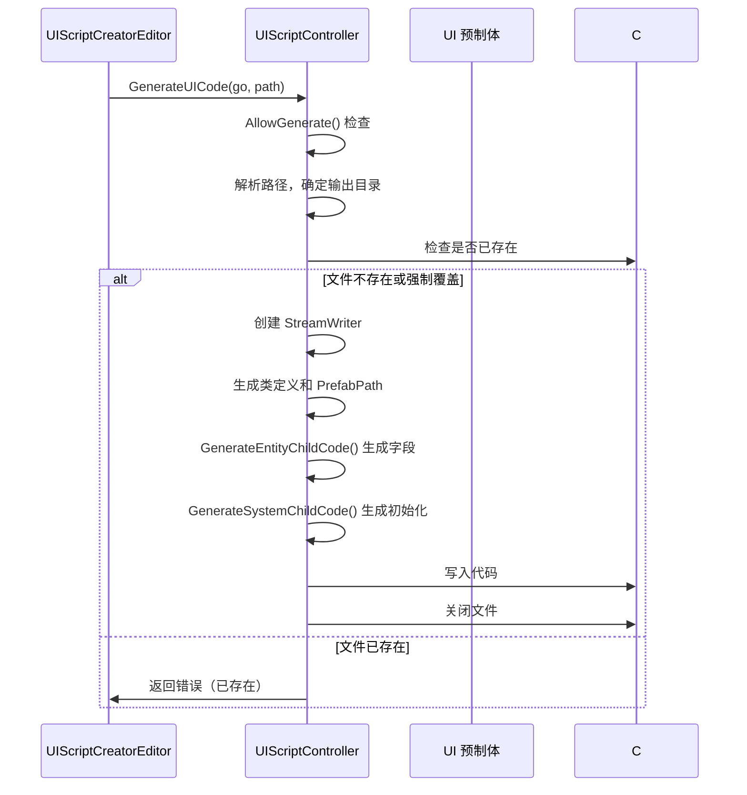

# UIEditorController.cs 注解文档

## 文件基本信息

| 属性 | 值 |
|------|-----|
| **文件名** | UIEditorController.cs |
| **路径** | Assets/Scripts/Editor/UIManager/UIEditorController.cs |
| **所属模块** | Editor → UIManager |
| **文件职责** | 根据 UI 预制体结构自动生成 UI 视图代码框架 |

---

## 类/结构体说明

### UIScriptController

| 属性 | 说明 |
|------|------|
| **职责** | 分析 UI 预制体层级结构，根据 UIScriptCreator 标记自动生成对应的 C# 视图类代码 |
| **泛型参数** | 无 |
| **继承关系** | 无继承 |
| **实现的接口** | 无 |

**设计模式**: 代码生成 + 反射

```csharp
// 核心方法
public static void GenerateUICode(GameObject go, string path)
```

---

## 字段与属性

| 名称 | 类型 | 访问级别 | 说明 |
|------|------|----------|------|
| `addressable_path` | `string` | `private static` | 资源包根路径 `"Assets/AssetsPackage/"` |
| `generate_path` | `string` | `private static` | 代码生成路径 `"Game"` |
| `forced_coverage` | `bool` | `private static` | 是否强制覆盖已存在的代码文件 |
| `WidgetInterfaceList` | `Dictionary<Type, string>` | `private static` | UI 组件类型到封装类的映射表 |

### WidgetInterfaceList 映射表

| 组件类型 | 封装类 |
|----------|--------|
| `LoopListView2` | `UILoopListView2` |
| `LoopGridView` | `UILoopGridView` |
| `CopyGameObject` | `UICopyGameObject` |
| `PointerClick` | `UIPointerClick` |
| `Button` | `UIButton` |
| `InputField` | `UIInput` |
| `Slider` | `UISlider` |
| `Dropdown` | `UIDropdown` |
| `Toggle` | `UIToggle` |
| `Image` | `UIImage` |
| `RawImage` | `UIRawImage` |
| `Text` | `UIText` |
| `TMP_Text` | `UITextmesh` |
| `TMP_InputField` | `UIInputTextmesh` |

---

## 方法说明

### AllowGenerate()

**签名**:
```csharp
public static bool AllowGenerate(GameObject go, string path)
```

**职责**: 检查 GameObject 是否符合 UI 代码生成规范

**核心逻辑**:
```
1. 检查名称是否以 "UI" 开头
2. 检查名称是否以 "View/Win/Panel/Item" 结尾
3. 检查路径是否包含 addressable_path
```

**返回条件**:
- ✅ 名称：`UI*View`, `UI*Win`, `UI*Panel`, `UI*Item`
- ✅ 路径：包含 `Assets/AssetsPackage/`

---

### GenerateUICode()

**签名**:
```csharp
public static void GenerateUICode(GameObject go, string path)
```

**职责**: 生成 UI 代码的入口方法

**核心逻辑**:
```
1. 调用 GenerateUIBaseViewCode() 生成代码
```

**调用者**: `UIScriptCreatorEditor.CreateUIModule()`

---

### GenerateUIBaseViewCode()

**签名**:
```csharp
static void GenerateUIBaseViewCode(GameObject go, string path)
```

**职责**: 生成 UI 视图类的完整代码

**核心逻辑**:
```
1. 解析预制体路径，确定代码输出目录
2. 检查代码文件是否已存在（除非强制覆盖）
3. 创建代码文件
4. 生成命名空间和类定义
5. 调用 GenerateEntityChildCode() 生成字段声明
6. 调用 GenerateSystemChildCode() 生成初始化代码和事件绑定
7. 写入文件
```

**生成的代码结构**:
```csharp
public class UIViewName : UIBaseView, IOnCreate, IOnEnable
{
    public static string PrefabPath => "UI/Path/To/Prefab";
    
    // 字段声明（由 GenerateEntityChildCode 生成）
    public UIButton BtnStart;
    public UIText TxtTitle;
    
    #region override
    public void OnCreate()
    {
        // 初始化代码（由 GenerateSystemChildCode 生成）
        this.BtnStart = this.AddComponent<UIButton>("BtnStart");
    }
    
    public void OnEnable()
    {
        // 事件绑定（由 GenerateSystemChildCode 生成）
        this.BtnStart.SetOnClick(OnClickBtnStart);
    }
    #endregion
    
    #region 事件绑定
    public void OnClickBtnStart()
    {
    }
    #endregion
}
```

**调用者**: `GenerateUICode()`

**被调用者**: `GenerateEntityChildCode()`, `GenerateSystemChildCode()`

---

### GenerateEntityChildCode()

**签名**:
```csharp
public static void GenerateEntityChildCode(Transform trans, string strPath, StringBuilder strBuilder)
```

**职责**: 递归遍历子节点，生成字段声明

**核心逻辑**:
```
1. 遍历所有子节点
2. 检查是否有 UIScriptCreator 组件且 isMarked=true
3. 根据组件类型查找 WidgetInterfaceList
4. 生成字段声明：public {封装类} {变量名};
5. 递归处理子节点
```

**生成的字段**:
```csharp
public UIButton BtnStart;
public UIText TxtTitle;
public UILoopListView2 LoopList;
public UIEmptyView Container;  // 无特殊组件时使用
```

---

### GenerateSystemChildCode()

**签名**:
```csharp
public static void GenerateSystemChildCode(Transform trans, string strPath, StringBuilder strBuilder, 
    StringBuilder tempBuilder, string name, StringBuilder addListenerBuilder)
```

**职责**: 递归遍历子节点，生成初始化代码和事件绑定方法

**核心逻辑**:
```
1. 遍历所有子节点
2. 检查是否有 UIScriptCreator 组件且 isMarked=true
3. 生成初始化代码：this.{变量名} = this.AddComponent<{类型}>("{路径}");
4. 根据组件类型生成事件绑定:
   - Button/PointerClick: 生成 OnClick 方法和 SetOnClick 调用
   - Toggle/Dropdown: 生成 OnValueChanged 方法和 SetOnValueChanged 调用
   - LoopListView2: 生成 GetItemByIndex 方法和 InitListView 调用
   - LoopGridView: 生成 GetItemByIndex 方法和 InitGridView 调用
   - CopyGameObject: 生成 GetItemByIndex 方法
5. 递归处理子节点
```

**生成的代码**:
```csharp
// 初始化
this.BtnStart = this.AddComponent<UIButton>("BtnStart");

// 事件绑定
this.BtnStart.SetOnClick(OnClickBtnStart);

// 事件方法
public void OnClickBtnStart()
{
}
```

---

## 完整流程图



---

## 使用示例

### 示例 1: 生成 UI 代码

```
操作步骤:
1. 在 Hierarchy 中选择 UI 根节点
2. 使用 UIScriptCreatorEditor 标记需要导出的节点
3. 右键 → 生成 UI 代码 → 生成代码
4. 检查生成的 C# 文件
```

### 示例 2: 生成的代码示例

假设预制体结构：
```
UIMainView
├── BtnStart (Button, 已标记)
├── TxtGold (Text, 已标记)
└── LoopList (LoopListView2, 已标记)
```

生成的代码：
```csharp
public class UIMainView : UIBaseView, IOnCreate, IOnEnable
{
    public static string PrefabPath => "UIGame/UIMain/Prefabs/UIMainView.prefab";
    
    public UIButton BtnStart;
    public UIText TxtGold;
    public UILoopListView2 LoopList;
    
    public void OnCreate()
    {
        this.BtnStart = this.AddComponent<UIButton>("BtnStart");
        this.TxtGold = this.AddComponent<UIText>("TxtGold");
        this.LoopList = this.AddComponent<UILoopListView2>("LoopList");
        this.LoopList.InitListView(0, GetLoopListItemByIndex);
    }
    
    public void OnEnable()
    {
        this.BtnStart.SetOnClick(OnClickBtnStart);
    }
    
    #region 事件绑定
    public void OnClickBtnStart()
    {
    }
    
    public LoopListViewItem2 GetLoopListItemByIndex(LoopListView2 listView, int index)
    {
        return null;
    }
    #endregion
}
```

---

## 注意事项

### ⚠️ 命名规范

- UI 预制体必须以 `UI` 开头
- 必须以 `View/Win/Panel/Item` 结尾
- 否则 `AllowGenerate()` 会返回 false

### ⚠️ 需要 UIScriptCreator 标记

- 只有添加了 `UIScriptCreator` 组件且 `isMarked=true` 的节点才会生成代码
- 使用 `开始或取消标记` 菜单在 Hierarchy 中标记节点

### ⚠️ 路径格式

- 预制体路径应为：`Assets/AssetsPackage/{UI 模块}/{UI 子模块}/Prefabs/{预制体}`
- 生成的代码路径：`Assets/Scripts/Code/{generate_path}/{UI 模块}/{UI 子模块}/`

### ⚠️ 强制覆盖

- 默认不覆盖已存在的文件
- 修改 `forced_coverage = true` 可强制覆盖

---

## 相关文档

- [UIScriptCreatorEditor.cs.md](./UIScriptCreatorEditor.cs.md) - UI 脚本标记编辑器
- [UIScriptCreator.cs.md](../../Mono/Module/UI/UIScriptCreator.cs.md) - UI 脚本标记组件
- [UIBaseView.cs.md](../../Mono/Module/UI/UIBaseView.cs.md) - UI 视图基类

---

*文档生成时间：2026-03-03 | OpenClaw AI 助手*
