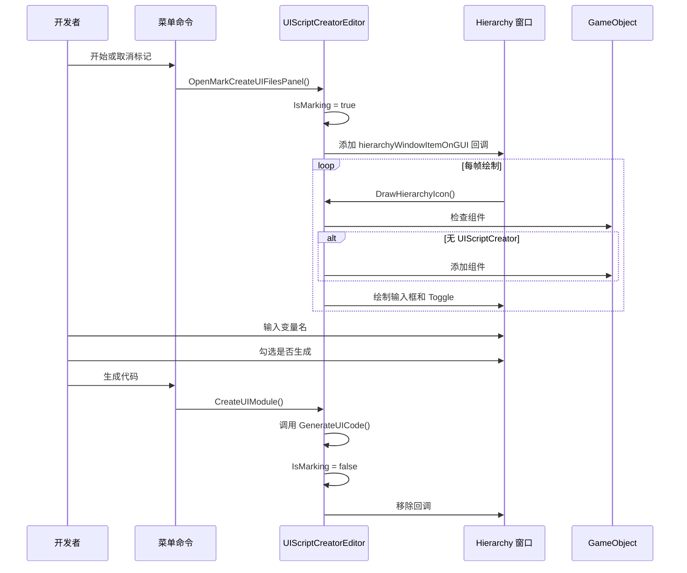
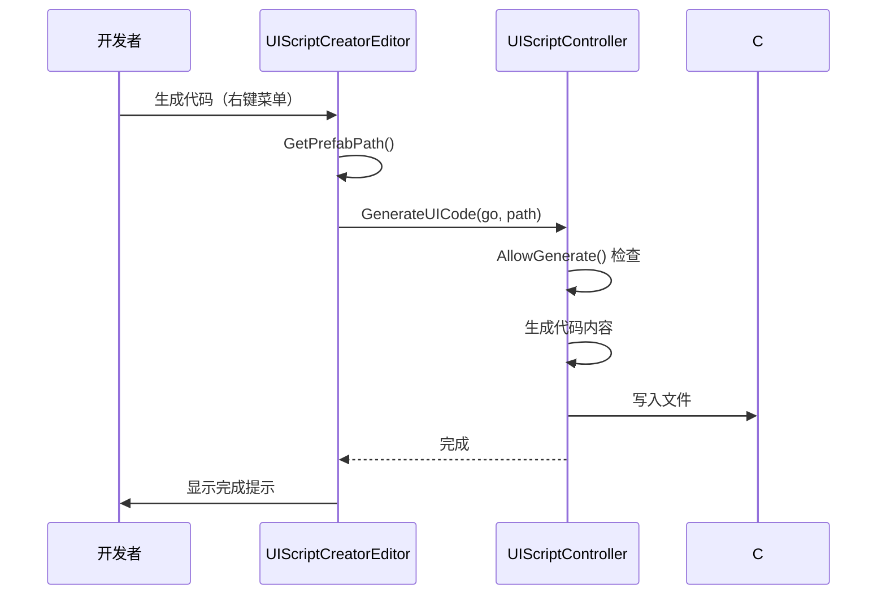

# UIScriptCreatorEditor.cs 注解文档

## 文件基本信息

| 属性 | 值 |
|------|-----|
| **文件名** | UIScriptCreatorEditor.cs |
| **路径** | Assets/Scripts/Editor/UIManager/UIScriptCreatorEditor.cs |
| **所属模块** | Editor → UIManager |
| **文件职责** | 提供 UI 代码生成的编辑器界面和交互功能 |

---

## 类/结构体说明

### UIScriptCreatorEditor

| 属性 | 说明 |
|------|------|
| **职责** | 提供 Hierarchy 窗口中的 UI 节点标记界面，以及生成 UI 代码的菜单命令 |
| **泛型参数** | 无 |
| **继承关系** | 继承自 `Editor` |
| **实现的接口** | 无 |

**设计模式**: 编辑器扩展 + Hierarchy GUI 绘制

```csharp
// 继承 Unity Editor 类
public class UIScriptCreatorEditor : Editor
```

---

## 字段与属性

| 名称 | 类型 | 访问级别 | 说明 |
|------|------|----------|------|
| `IsMarking` | `bool` | `private static` | 是否处于标记模式 |
| `rootGo` | `GameObject` | `private static` | UI 根节点引用 |

---

## 方法说明

### GetPrefabPath()

**签名**:
```csharp
static string GetPrefabPath()
```

**职责**: 获取当前 Prefab 阶段的路径

**核心逻辑**:
```
1. 获取当前 PrefabStage
2. 提取 prefabAssetPath
3. 移除 "Assets/AssetsPackage/" 前缀
4. 返回相对路径
```

**返回格式**: `"UIGame/UILobby/Prefabs/UILobbyView.prefab"`

**调用者**: `CreateUIModule()`

---

### CreateUIModule()

**签名**:
```csharp
[MenuItem("GameObject/生成 UI 代码/生成代码", false, 23)]
static void CreateUIModule()
```

**职责**: 生成 UI 代码的菜单命令

**核心逻辑**:
```
1. 检查根节点是否已标记（有 UIScriptCreator 组件）
2. 获取 Prefab 路径
3. 调用 UIScriptController.GenerateUICode()
4. 如果处于标记模式，退出标记模式
```

**调用者**: Unity 编辑器菜单

**被调用者**: `UIScriptController.GenerateUICode()`, `DrawHierarchyIcon()`

---

### OpenMarkCreateUIFilesPanel()

**签名**:
```csharp
[MenuItem("GameObject/生成 UI 代码/开始或取消标记", false, 22)]
static void OpenMarkCreateUIFilesPanel()
```

**职责**: 切换标记模式

**核心逻辑**:
```
1. 如果已在标记模式 → 退出（移除 GUI 绘制回调）
2. 如果未在标记模式 → 进入（添加 GUI 绘制回调）
```

**调用者**: Unity 编辑器菜单

---

### ClearMark()

**签名**:
```csharp
[MenuItem("GameObject/生成 UI 代码/清除标记", false, 24)]
static void ClearMark()
```

**职责**: 清除所有 UIScriptCreator 标记

**核心逻辑**:
```
1. 获取当前 PrefabStage
2. 获取选中的 GameObject
3. 遍历所有子节点
4. 销毁所有 UIScriptCreator 组件
5. 保存 Prefab
```

**调用者**: Unity 编辑器菜单

---

### Generate()

**签名**:
```csharp
[MenuItem("Assets/工具/UI/绑定节点", false, 423)]
[MenuItem("GameObject/生成 UI 代码/绑定节点", false, 25)]
static void Generate()
```

**职责**: 绑定 UI 节点到 ReferenceCollector

**核心逻辑**:
```
1. 获取选中的 GameObject 或当前 Prefab
2. 获取或创建 ReferenceCollector 组件
3. 加载 Unity.Code 程序集
4. 查找对应的 UI 类
5. 创建实例并调用 OnCreate()
6. 保存 Prefab
```

**调用者**: Unity 编辑器菜单（两个路径）

**被调用者**: `ReferenceCollector.Clear()`, `UIBaseView.OnCreate()`

---

### DrawHierarchyIcon()

**签名**:
```csharp
static void DrawHierarchyIcon(int instanceID, Rect selectionRect)
```

**职责**: 在 Hierarchy 窗口中绘制标记界面

**核心逻辑**:
```
1. 计算图标位置（右侧 120px 区域）
2. 获取 GameObject
3. 如果是根节点：
   - 显示提示文字
   - 设置 rootGo 为第一个子节点
4. 如果不是根节点：
   - 如果没有 UIScriptCreator 组件，添加一个
   - 绘制变量名输入框
   - 绘制是否生成 Toggle
5. 更新组件状态
```

**界面布局**:
```
Hierarchy 行右侧:
┌────────────────────────────────────┐
│ 生成变量名          是否生成       │
│ [ModuleName_______] [✓]           │
└────────────────────────────────────┘
```

**调用者**: `EditorApplication.hierarchyWindowItemOnGUI`（当 IsMarking=true 时）

---

## 完整流程图

### 标记模式流程



### 代码生成流程



---

## 使用示例

### 示例 1: 标记 UI 节点

```
操作步骤:
1. 打开 Prefab 编辑窗口
2. 右键根节点 → 生成 UI 代码 → 开始或取消标记
3. Hierarchy 右侧出现输入框和 Toggle
4. 选择需要导出的子节点
5. 输入变量名（如 "BtnStart"）
6. 勾选"是否生成"
7. 重复步骤 4-6 标记所有需要的节点
```

### 示例 2: 生成代码

```
操作步骤:
1. 确保根节点已标记（有 UIScriptCreator 组件）
2. 右键根节点 → 生成 UI 代码 → 生成代码
3. 检查控制台输出
4. 在 Assets/Scripts/Code/Game/... 目录查看生成的 C# 文件
```

### 示例 3: 清除标记

```
操作步骤:
1. 选择 Prefab 根节点或打开 Prefab 编辑窗口
2. 右键 → 生成 UI 代码 → 清除标记
3. 所有 UIScriptCreator 组件被移除
4. Prefab 被保存
```

### 示例 4: 绑定节点

```
操作步骤:
1. 确保已生成 UI 代码（有对应的 C# 类）
2. 选择 Prefab 或在 Prefab 编辑窗口
3. 右键 → 生成 UI 代码 → 绑定节点
4. ReferenceCollector 组件被填充
```

---

## 注意事项

### ⚠️ Prefab 编辑模式

- 必须在 Prefab 编辑窗口中操作
- 普通场景中的 GameObject 可能无法正确获取路径

### ⚠️ 标记模式性能

- 标记模式会每帧绘制 Hierarchy GUI
- 完成标记后及时退出标记模式

### ⚠️ 变量命名规范

- 变量名应使用 PascalCase（如 `BtnStart`）
- 避免使用特殊字符和空格

### ⚠️ 根节点识别

- 根节点是 Hierarchy 中第一个子节点的父节点
- 只有根节点可以执行"生成代码"命令

---

## 菜单命令总览

| 菜单路径 | 功能 | 快捷键顺序 |
|----------|------|------------|
| `GameObject/生成 UI 代码/开始或取消标记` | 切换标记模式 | 22 |
| `GameObject/生成 UI 代码/生成代码` | 生成 C# 代码 | 23 |
| `GameObject/复制物体路径` | 复制路径到剪贴板 | 24 |
| `GameObject/生成 UI 代码/清除标记` | 清除所有标记 | 24 |
| `GameObject/生成 UI 代码/绑定节点` | 绑定节点引用 | 25 |
| `Assets/工具/UI/绑定节点` | 绑定节点引用（资源窗口） | 423 |

---

## 相关文档

- [UIEditorController.cs.md](./UIEditorController.cs.md) - UI 代码生成器
- [UIScriptCreator.cs.md](../../Mono/Module/UI/UIScriptCreator.cs.md) - UI 脚本标记组件
- [ReferenceCollector.cs.md](../../Mono/Module/UI/ReferenceCollector.cs.md) - 引用收集器
- [GetGameObjectPathEditor.cs.md](./GetGameObjectPathEditor.cs.md) - 路径复制工具

---

*文档生成时间：2026-03-03 | OpenClaw AI 助手*
