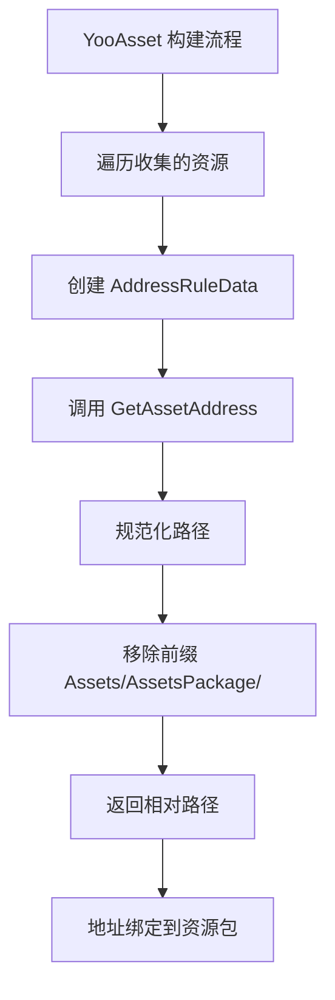
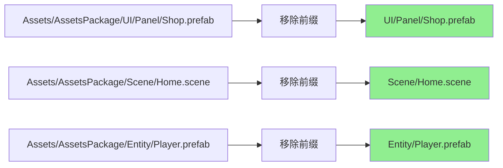

# AddressRuleExtends.cs 注解文档

## 文件基本信息

| 属性 | 值 |
|------|-----|
| **文件名** | AddressRuleExtends.cs |
| **路径** | Assets/Scripts/Editor/YooAssets/AddressRuleExtends.cs |
| **所属模块** | Editor → YooAssets |
| **文件职责** | YooAsset 资源定位地址规则扩展 |

---

## 类说明

### AddressByPathLocationServices

| 属性 | 说明 |
|------|------|
| **职责** | 根据资源相对路径生成定位地址，用于资源加载时的地址解析 |
| **类型** | `IAddressRule` |
| **命名空间** | `YooAsset` |
| **可见性** | `public` |

**实现接口**:
```
IAddressRule (YooAsset.Editor)
```

**设计模式**: 
- **策略模式**: 实现地址规则接口，可替换不同地址生成策略
- **约定优于配置**: 使用资源路径作为地址，无需额外配置

---

## 常量说明

| 名称 | 类型 | 值 | 说明 |
|------|------|-----|------|
| `addressablePath` | `string` | `"Assets/AssetsPackage/"` | 可寻址资源根路径前缀 |

**路径说明**:
- 所有资源路径都会移除此前缀
- 生成的地址是相对于 `Assets/AssetsPackage/` 的路径
- 例如：`Assets/AssetsPackage/UI/Panel/Shop.prefab` → `UI/Panel/Shop.prefab`

---

## 方法说明

### GetAssetAddress

**签名**:
```csharp
public string GetAssetAddress(AddressRuleData data)
```

**职责**: 根据资源信息生成定位地址

**参数**:
| 参数 | 类型 | 说明 |
|------|------|------|
| `data` | `AddressRuleData` | 地址规则数据，包含资源路径等信息 |

**返回**: `string` - 资源的定位地址

**核心逻辑**:
```
1. 获取资源的完整路径 (data.AssetPath)
2. 使用 EditorTools.GetRegularPath 规范化路径 (统一斜杠)
3. 移除 addressablePath 前缀 ("Assets/AssetsPackage/")
4. 返回相对路径作为地址
```

**代码实现**:
```csharp
public string GetAssetAddress(AddressRuleData data)
{
    return EditorTools.GetRegularPath(data.AssetPath).Replace(addressablePath, "");
}
```

---

## AddressRuleData 结构

`AddressRuleData` 包含以下关键信息:

| 字段 | 类型 | 说明 |
|------|------|------|
| `AssetPath` | `string` | 资源的完整路径 |
| `AssetName` | `string` | 资源名称 |
| `CollectPath` | `string` | 收集器路径 |
| `BundleName` | `string` | 所属资源包名称 |

---

## Mermaid 流程图

### 地址生成流程



### 地址示例



---

## 使用示例

### 运行时加载资源

```csharp
// 使用地址加载资源
var asset = await package.LoadAssetAsync<GameObject>("UI/Panel/Shop.prefab");

// 等价于加载原路径的资源
// Assets/AssetsPackage/UI/Panel/Shop.prefab
```

### 配置 YooAsset 地址规则

**在构建配置中使用**:
```csharp
var buildOptions = new BuildScriptOptions
{
    AddressRule = new AddressByPathLocationServices(),  // 使用相对路径地址
    // ... 其他配置
};

BuildScript.Build(buildOptions);
```

### 地址规则对比

| 规则类型 | 生成地址 | 优点 | 缺点 |
|---------|---------|------|------|
| `AddressByPathLocationServices` | `UI/Panel/Shop.prefab` | 直观，与路径一致 | 路径变更地址变更 |
| `AddressByFileName` | `Shop` | 简洁 | 可能重名 |
| 自定义规则 | 任意格式 | 灵活 | 需要额外配置 |

---

## 注意事项

### 路径规范化

- `EditorTools.GetRegularPath` 将路径统一为 `/` 斜杠
- 确保 Windows 和 Mac 路径格式一致
- 避免 `\` 和 `/` 混用导致的问题

### 前缀匹配

- `addressablePath` 必须与实际资源目录匹配
- 如果资源不在 `Assets/AssetsPackage/` 下，需要修改此常量
- 前缀必须完全匹配，包括末尾的 `/`

### 地址唯一性

- 生成的地址必须唯一，不能重复
- 相对路径方案天然保证唯一性 (只要文件路径唯一)
- 避免手动修改地址导致冲突

---

## 扩展建议

### 自定义地址规则

```csharp
[DisplayName("定位地址：自定义前缀")]
public class AddressByCustomPrefix : IAddressRule
{
    private string _prefix = "MyGame/";
    
    public string GetAssetAddress(AddressRuleData data)
    {
        string relativePath = EditorTools.GetRegularPath(data.AssetPath)
            .Replace("Assets/AssetsPackage/", "");
        return _prefix + relativePath;
    }
}
```

### 带版本号的地址

```csharp
[DisplayName("定位地址：带版本号")]
public class AddressWithVersion : IAddressRule
{
    private string _version = "v1.0.0/";
    
    public string GetAssetAddress(AddressRuleData data)
    {
        string relativePath = EditorTools.GetRegularPath(data.AssetPath)
            .Replace("Assets/AssetsPackage/", "");
        return _version + relativePath;
    }
}
```

### 按类型分组地址

```csharp
[DisplayName("定位地址：按类型分组")]
public class AddressByType : IAddressRule
{
    public string GetAssetAddress(AddressRuleData data)
    {
        string relativePath = EditorTools.GetRegularPath(data.AssetPath)
            .Replace("Assets/AssetsPackage/", "");
        
        // 根据扩展名添加类型前缀
        string ext = Path.GetExtension(data.AssetPath);
        string typePrefix = ext switch
        {
            ".prefab" => "Prefab/",
            ".scene" => "Scene/",
            ".png" => "Texture/",
            _ => "Other/"
        };
        
        return typePrefix + relativePath;
    }
}
```

---

## 相关类

| 类名 | 关系 | 说明 |
|------|------|------|
| `IAddressRule` | 接口 | YooAsset 地址规则接口 |
| `AddressRuleData` | 参数 | 地址规则数据 |
| `EditorTools` | 工具 | 编辑器工具类 |

---

## 相关文档链接

- [PackRuleExtends.cs.md](./PackRuleExtends.cs.md) - 打包规则扩展
- [FilterRuleExtends.cs.md](./FilterRuleExtends.cs.md) - 过滤规则扩展
- [BundleEncryption.cs.md](./BundleEncryption.cs.md) - 加密服务
- [DefaultActiveRule.cs.md](./DefaultActiveRule.cs.md) - 激活规则
- [YooAsset 官方文档 - 地址规则](https://www.yooasset.com/docs/address-rule)

---

*文档生成时间：2026-03-03 | OpenClaw AI 助手*
