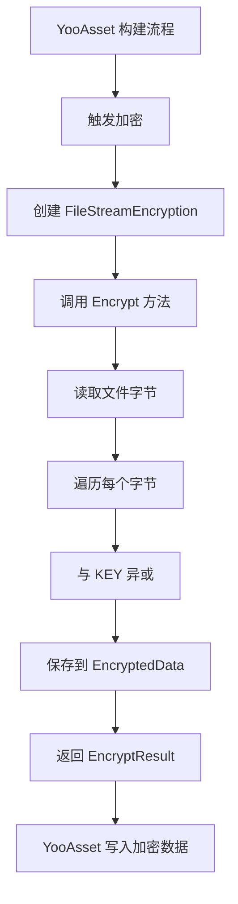
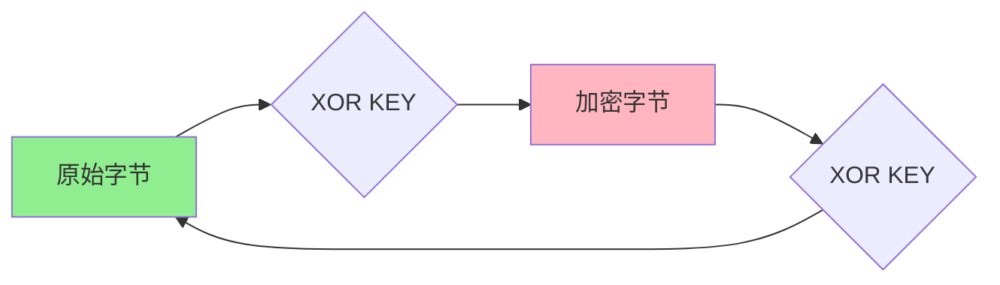

# BundleEncryption.cs 注解文档

## 文件基本信息

| 属性 | 值 |
|------|-----|
| **文件名** | BundleEncryption.cs |
| **路径** | Assets/Scripts/Editor/YooAssets/BundleEncryption.cs |
| **所属模块** | Editor → YooAssets |
| **文件职责** | YooAsset 资源包加密服务实现 |

---

## 类说明

### FileStreamEncryption

| 属性 | 说明 |
|------|------|
| **职责** | 文件流加密服务，使用 XOR 异或加密算法对资源包进行加密 |
| **类型** | `IEncryptionServices` |
| **命名空间** | `TaoTie` |
| **可见性** | `public` |

**实现接口**:
```
IEncryptionServices (YooAsset)
```

**设计模式**: 
- **策略模式**: 实现加密策略接口，可替换不同加密算法
- **简单加密**: 使用 XOR 异或加密，轻量快速

---

## 常量说明

| 名称 | 类型 | 来源 | 说明 |
|------|------|------|------|
| `KEY` | `byte` | `Define.KEY` | XOR 加密密钥，定义在 Define 类中 |

**密钥说明**:
- 密钥值在 `Define` 类中统一定义
- XOR 加密特点：加密和解密使用相同密钥
- 简单有效，适合游戏资源防篡改

---

## 方法说明

### Encrypt

**签名**:
```csharp
public EncryptResult Encrypt(EncryptFileInfo fileInfo)
```

**职责**: 加密资源文件

**参数**:
| 参数 | 类型 | 说明 |
|------|------|------|
| `fileInfo` | `EncryptFileInfo` | 加密文件信息，包含文件路径等 |

**返回**: `EncryptResult` - 加密结果，包含加密后的数据

**核心逻辑**:
```
1. 读取文件所有字节
2. 遍历每个字节，与 KEY 进行 XOR 异或运算
3. 创建 EncryptResult
4. 设置 Encrypted = true
5. 设置 EncryptedData 为加密后的数据
6. 返回结果
```

**加密算法**:
```csharp
for (int i = 0; i < fileData.Length; i++)
{
    fileData[i] ^= Define.KEY;  // XOR 异或加密
}
```

---

## Mermaid 流程图

### 加密流程



### XOR 加密原理



**XOR 特性**:
- `(A XOR K) XOR K = A` - 两次异或还原
- 加密解密使用相同密钥
- 计算速度快，适合大量数据

---

## 使用示例

### 配置 YooAsset 加密

**在构建配置中启用加密**:
```csharp
// YooAsset 构建配置
var buildOptions = new BuildScriptOptions
{
    // ... 其他配置
    EncryptionServices = new FileStreamEncryption(),  // 启用加密
};

// 执行构建
BuildScript.Build(buildOptions);
```

### 运行时解密

**YooAsset 自动处理解密**:
```csharp
// 运行时加载资源包时，YooAsset 自动使用相同的密钥解密
// 需要在初始化时配置相同的加密服务

var initializationOptions = new ResourcePackageInitializationOptions
{
    EncryptionServices = new FileStreamEncryption(),  // 配置解密服务
};

await package.InitializeAsync(initializationOptions);
```

### Define.KEY 配置

**在 Define.cs 中定义密钥**:
```csharp
public static class Define
{
    // 加密密钥 (示例值，实际项目应使用更安全的密钥管理)
    public const byte KEY = 0xAB;
}
```

---

## 注意事项

### 安全性考虑

**XOR 加密的优缺点**:

| 优点 | 缺点 |
|------|------|
| 计算速度快 | 安全性较低 |
| 实现简单 | 易被逆向分析 |
| 加密解密相同 | 单密钥风险 |
| 适合大量数据 | 不适合高安全需求 |

**建议**:
- XOR 加密适合防止普通用户篡改
- 高安全需求应使用 AES 等更强加密
- 密钥不应硬编码，建议从服务器获取或使用混淆

### 性能影响

- XOR 加密速度极快，对构建时间影响很小
- 运行时解密开销可忽略不计
- 适合所有资源包加密场景

### 兼容性

- 加密和解密必须使用相同的密钥
- 构建时和运行时必须配置相同的加密服务
- 密钥变更会导致旧资源包无法解密

---

## 扩展建议

### 更强加密算法

```csharp
public class AesEncryption : IEncryptionServices
{
    private byte[] _key;
    private byte[] _iv;
    
    public EncryptResult Encrypt(EncryptFileInfo fileInfo)
    {
        using (var aes = Aes.Create())
        {
            aes.Key = _key;
            aes.IV = _iv;
            
            var encryptor = aes.CreateEncryptor();
            var fileData = File.ReadAllBytes(fileInfo.FileLoadPath);
            var encryptedData = encryptor.TransformFinalBlock(fileData, 0, fileData.Length);
            
            return new EncryptResult
            {
                Encrypted = true,
                EncryptedData = encryptedData
            };
        }
    }
}
```

### 密钥管理

```csharp
public static class Define
{
    // 从配置文件或服务器获取密钥
    public static byte GetEncryptionKey()
    {
        // 从 PlayerPrefs 或配置文件读取
        // 或通过 API 从服务器获取
        return PlayerPrefs.GetInt("encryption_key", 0xAB);
    }
}
```

---

## 相关类

| 类名 | 关系 | 说明 |
|------|------|------|
| `IEncryptionServices` | 接口 | YooAsset 加密服务接口 |
| `EncryptFileInfo` | 参数 | 加密文件信息 |
| `EncryptResult` | 返回 | 加密结果 |
| `Define` | 依赖 | 密钥定义 |

---

## 相关文档链接

- [Define.cs.md](../../Mono/Define.cs.md) - 常量定义
- [YooAsset 官方文档 - 加密](https://www.yooasset.com/docs/encryption)
- [AddressRuleExtends.cs.md](./AddressRuleExtends.cs.md) - 地址规则扩展
- [PackRuleExtends.cs.md](./PackRuleExtends.cs.md) - 打包规则扩展
- [FilterRuleExtends.cs.md](./FilterRuleExtends.cs.md) - 过滤规则扩展

---

*文档生成时间：2026-03-03 | OpenClaw AI 助手*
