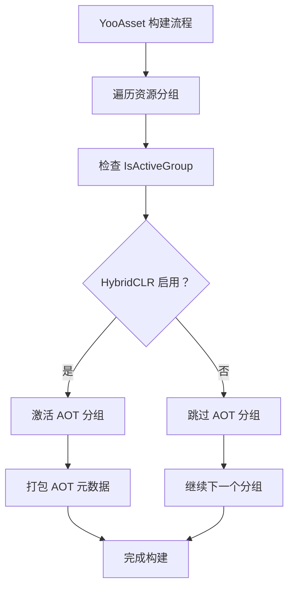
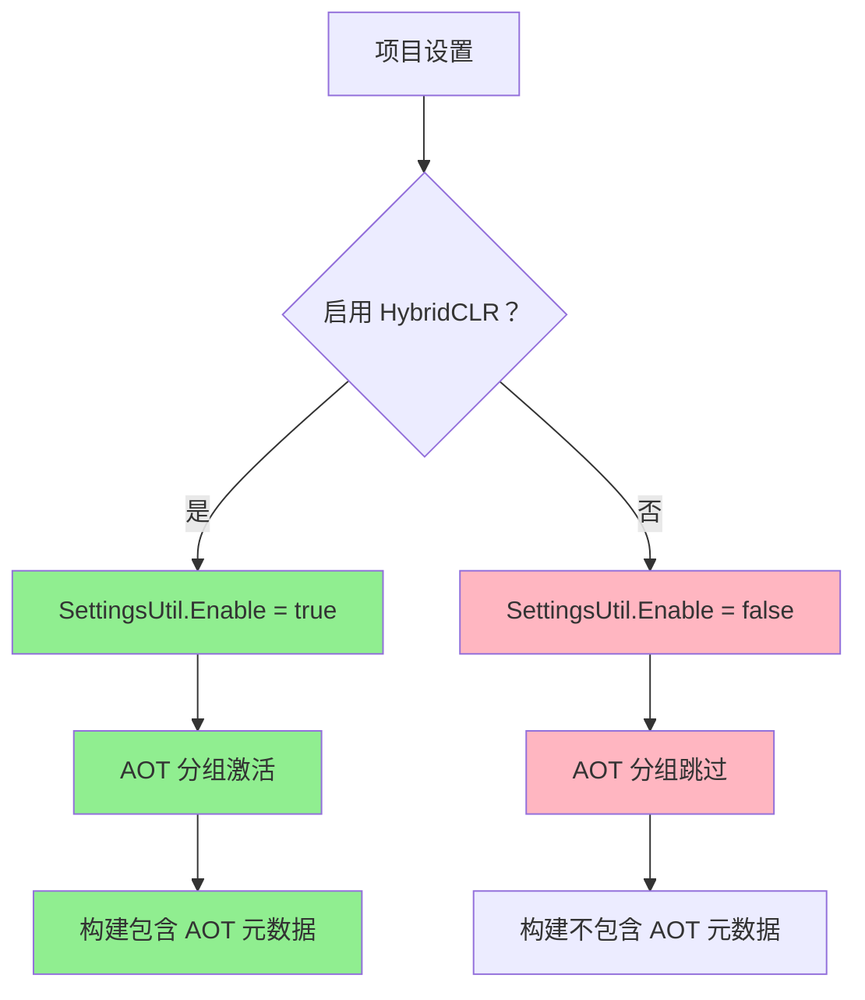

# DefaultActiveRule.cs 注解文档

## 文件基本信息

| 属性 | 值 |
|------|-----|
| **文件名** | DefaultActiveRule.cs |
| **路径** | Assets/Scripts/Editor/YooAssets/DefaultActiveRule.cs |
| **所属模块** | Editor → YooAssets |
| **文件职责** | YooAsset 资源分组激活规则 |

---

## 类说明

### AOTGroup

| 属性 | 说明 |
|------|------|
| **职责** | AOT (Ahead-Of-Time) 编译资源分组的激活规则，根据 HybridCLR 设置决定是否激活该分组 |
| **类型** | `IActiveRule` |
| **命名空间** | `YooAsset.Editor` |
| **可见性** | `public` |

**实现接口**:
```
IActiveRule (YooAsset.Editor)
```

**特性**:
- `[DisplayName("AOT 分组")]` - 在 YooAsset 编辑器中显示为 "AOT 分组"

**设计模式**: 
- **策略模式**: 实现激活规则接口，根据条件决定是否激活分组
- **条件激活**: 仅在 HybridCLR 启用时激活 AOT 资源分组

---

## 背景知识

### AOT 编译

**AOT (Ahead-Of-Time)** 编译是在游戏构建前提前编译代码，与 JIT (Just-In-Time) 运行时编译相对。

**HybridCLR** 是一个 Unity 的 Hybrid 热更方案，支持:
- AOT 编译主程序
- IL 热更代码
- 需要特定的 AOT 元数据支持

### 为什么需要 AOT 分组

- AOT 相关的元数据和桥接代码需要单独打包
- 只在启用 HybridCLR 时才需要这些资源
- 通过激活规则动态控制是否包含 AOT 资源

---

## 方法说明

### IsActiveGroup

**签名**:
```csharp
public bool IsActiveGroup(GroupData data)
```

**职责**: 判断是否激活当前资源分组

**参数**:
| 参数 | 类型 | 说明 |
|------|------|------|
| `data` | `GroupData` | 分组数据，包含分组名称、资源列表等 |

**返回**: `bool` - `true` 表示激活该分组，`false` 表示跳过

**核心逻辑**:
```
检查 HybridCLR 是否启用:
- 调用 HybridCLR.Editor.SettingsUtil.Enable
- 返回检查结果
```

**代码实现**:
```csharp
public bool IsActiveGroup(GroupData data)
{
    return HybridCLR.Editor.SettingsUtil.Enable;
}
```

---

## GroupData 结构

`GroupData` 包含以下关键信息:

| 字段 | 类型 | 说明 |
|------|------|------|
| `GroupName` | `string` | 分组名称 |
| `Assets` | `List<AssetInfo>` | 分组内的资源列表 |
| `BundleName` | `string` | 资源包名称 |

---

## Mermaid 流程图

### 激活规则流程



### HybridCLR 集成



---

## 使用示例

### 配置 HybridCLR

**在 HybridCLR 设置中启用**:
```
1. Unity 菜单：HybridCLR → Settings
2. 勾选 "Enable HybridCLR"
3. 配置 AOT 元数据设置
4. 保存设置
```

### YooAsset 构建配置

**在构建中使用激活规则**:
```csharp
var buildOptions = new BuildScriptOptions
{
    ActiveRules = new List<IActiveRule>
    {
        new AOTGroup(),  // AOT 分组激活规则
        // ... 其他规则
    },
};

BuildScript.Build(buildOptions);
```

### 构建结果对比

**启用 HybridCLR 时**:
```
构建输出:
├── GameResources.bundle      # 主资源包
├── AOTMetadata.bundle        # AOT 元数据 (包含)
└── ...
```

**未启用 HybridCLR 时**:
```
构建输出:
├── GameResources.bundle      # 主资源包
└── ...                       # AOT 元数据不包含
```

---

## 注意事项

### HybridCLR 依赖

- 需要安装 HybridCLR 包
- `HybridCLR.Editor.SettingsUtil` 来自 HybridCLR 编辑器程序集
- 未安装 HybridCLR 时编译会报错

### 版本兼容

- HybridCLR 设置 API 可能随版本变化
- 确保 HybridCLR 版本与项目兼容
- 建议锁定 HybridCLR 版本号

### 构建一致性

- 开发环境和构建服务器必须使用相同的 HybridCLR 设置
- 否则会导致 AOT 元数据不一致
- 可能引发运行时错误

---

## 扩展建议

### 多条件激活规则

```csharp
[DisplayName("条件激活：多条件")]
public class MultiConditionActiveRule : IActiveRule
{
    public bool IsActiveGroup(GroupData data)
    {
        // 多个条件组合
        bool hybridClrEnabled = HybridCLR.Editor.SettingsUtil.Enable;
        bool isReleaseBuild = EditorUserBuildSettings.activeBuildTarget != BuildTarget.StandaloneWindows;
        bool includeAOT = PlayerSettings.GetScriptingDefineSymbolForGroup(EditorUserBuildSettings.selectedBuildTargetGroup).Contains("INCLUDE_AOT");
        
        return hybridClrEnabled && isReleaseBuild && includeAOT;
    }
}
```

### 平台特定激活

```csharp
[DisplayName("激活规则：平台特定")]
public class PlatformActiveRule : IActiveRule
{
    public bool IsActiveGroup(GroupData data)
    {
        // 只在特定平台激活
        return Application.platform == RuntimePlatform.Android ||
               Application.platform == RuntimePlatform.IPhonePlayer;
    }
}
```

### 配置驱动激活

```csharp
[DisplayName("激活规则：配置文件")]
public class ConfigActiveRule : IActiveRule
{
    public bool IsActiveGroup(GroupData data)
    {
        // 从配置文件读取激活状态
        var config = BuildConfig.Load();
        return config.EnableAOTGroup;
    }
}
```

---

## 相关类

| 类名 | 关系 | 说明 |
|------|------|------|
| `IActiveRule` | 接口 | YooAsset 激活规则接口 |
| `GroupData` | 参数 | 分组数据 |
| `HybridCLR.Editor.SettingsUtil` | 依赖 | HybridCLR 设置工具 |

---

## 相关文档链接

- [AddressRuleExtends.cs.md](./AddressRuleExtends.cs.md) - 地址规则扩展
- [PackRuleExtends.cs.md](./PackRuleExtends.cs.md) - 打包规则扩展
- [FilterRuleExtends.cs.md](./FilterRuleExtends.cs.md) - 过滤规则扩展
- [BundleEncryption.cs.md](./BundleEncryption.cs.md) - 加密服务
- [HybridCLR 官方文档](https://hybridclr.doc.code-philosophy.com/)
- [YooAsset 官方文档 - 激活规则](https://www.yooasset.com/docs/active-rule)

---

*文档生成时间：2026-03-03 | OpenClaw AI 助手*
