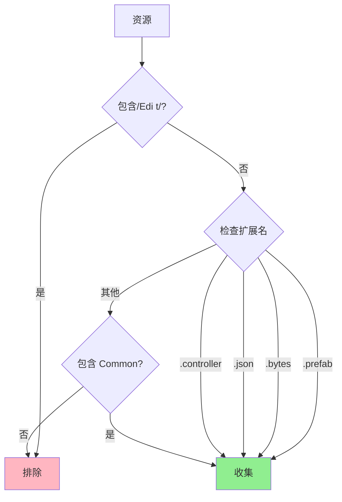
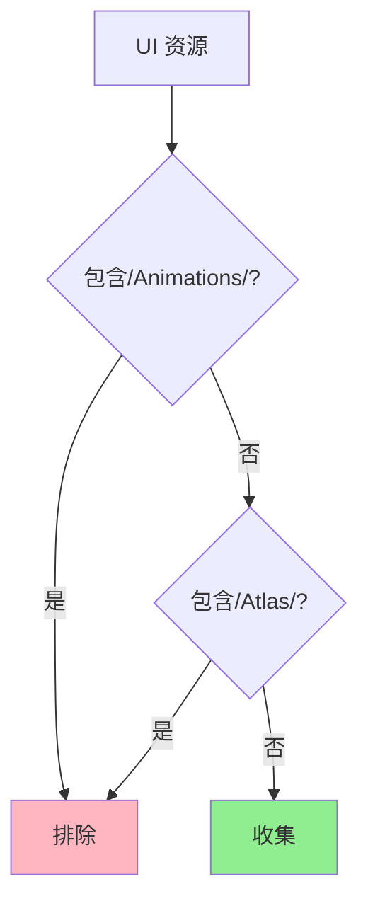
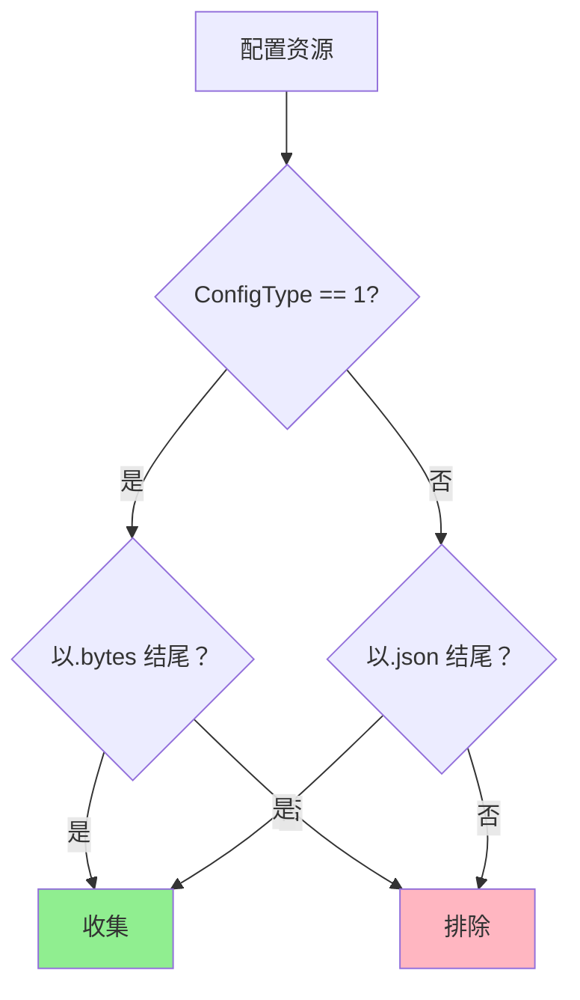

# FilterRuleExtends.cs 注解文档

## 文件基本信息

| 属性 | 值 |
|------|-----|
| **文件名** | FilterRuleExtends.cs |
| **路径** | Assets/Scripts/Editor/YooAssets/FilterRuleExtends.cs |
| **所属模块** | Editor → YooAssets |
| **文件职责** | YooAsset 资源收集过滤规则扩展 |

---

## 类说明

本文件包含 4 个资源过滤规则类，用于控制哪些资源应该被收集到资源包中:

| 类名 | 显示名称 | 职责 |
|------|---------|------|
| `CollectUnit` | 收集 Unit | 收集游戏实体相关资源 (Prefab, Bytes, JSON 等) |
| `CollectUI` | 收集 UI | 收集 UI 相关资源 (排除动画和图集) |
| `CollectAOT` | 收集 AOT | 收集 AOT 编译相关资源 |
| `CollectEditorConfig` | 收集 EditorConfig | 收集编辑器配置资源 (按 ConfigType 选择格式) |

**实现接口**:
```
IFilterRule (YooAsset.Editor)
```

**设计模式**: 
- **策略模式**: 实现过滤规则接口，定义不同的资源收集策略
- **规格模式**: 每个规则定义一个资源筛选条件

---

## 类详情

### CollectUnit

**特性**: `[DisplayName("收集 Unit")]`

**职责**: 收集游戏实体 (Unit) 相关资源

**过滤规则**:
```csharp
public bool IsCollectAsset(FilterRuleData data)
{
    // 排除 Edit 目录 (编辑器专用资源)
    if (data.AssetPath.Contains("/Edit/")) return false;
    
    // 获取文件扩展名
    var ext = Path.GetExtension(data.AssetPath);
    
    // 收集指定扩展名的文件
    return ext == ".prefab" ||      // 预制体
           ext == ".bytes" ||       // 二进制数据
           ext == ".json" ||        // JSON 配置
           ext == ".controller" ||  // 动画控制器
           data.AssetPath.Contains("Common");  // 公共资源
}
```

**收集的资源类型**:

| 类型 | 扩展名 | 说明 |
|------|--------|------|
| 预制体 | `.prefab` | 实体预制体 |
| 二进制数据 | `.bytes` | 序列化数据 |
| JSON 配置 | `.json` | 实体配置 |
| 动画控制器 | `.controller` | Animator Controller |
| 公共资源 | 包含 `Common` | 共享资源 |

**排除的资源**:
- 路径包含 `/Edit/` 的资源 (编辑器专用)

---

### CollectUI

**特性**: `[DisplayName("收集 UI")]`

**职责**: 收集 UI 相关资源

**过滤规则**:
```csharp
public bool IsCollectAsset(FilterRuleData data)
{
    // 排除动画目录
    if (data.AssetPath.Contains("/Animations/")) return false;
    
    // 排除图集目录
    if (data.AssetPath.Contains("/Atlas/")) return false;
    
    // 收集其他所有 UI 资源
    return true;
}
```

**收集的资源**:
- UI 预制体
- UI 纹理 (非图集)
- UI 材质
- UI 脚本配置

**排除的资源**:
- `/Animations/` 目录 (动画单独收集)
- `/Atlas/` 目录 (图集单独收集)

---

### CollectAOT

**特性**: `[DisplayName("收集 AOT")]`

**职责**: 收集 AOT (Ahead-Of-Time) 编译相关资源

**过滤规则**:
```csharp
public bool IsCollectAsset(FilterRuleData data)
{
    return data.AssetPath.Contains(Define.AOTDir);
}
```

**说明**:
- 收集路径包含 `Define.AOTDir` 的资源
- `AOTDir` 在 `Define` 类中定义
- 用于 HybridCLR 热更方案的 AOT 元数据

---

### CollectEditorConfig

**特性**: `[DisplayName("收集 EditorConfig")]`

**职责**: 收集编辑器配置资源，根据配置类型选择文件格式

**过滤规则**:
```csharp
public bool IsCollectAsset(FilterRuleData data)
{
    if (Define.ConfigType == 1)
        return data.AssetPath.EndsWith(".bytes");  // 二进制格式
    else
        return data.AssetPath.EndsWith(".json");   // JSON 格式
}
```

**配置类型**:

| ConfigType | 收集格式 | 说明 |
|-----------|---------|------|
| `1` | `.bytes` | 二进制格式 (Nino 序列化) |
| 其他 | `.json` | JSON 文本格式 |

**用途**:
- 开发阶段使用 JSON (可读性好)
- 发布阶段使用 Bytes (体积小，加载快)

---

## FilterRuleData 结构

`FilterRuleData` 包含以下关键信息:

| 字段 | 类型 | 说明 |
|------|------|------|
| `AssetPath` | `string` | 资源的完整路径 |
| `AssetName` | `string` | 资源名称 |
| `CollectPath` | `string` | 收集器路径 |
| `Tags` | `string[]` | 资源标签 |

---

## Mermaid 流程图

### CollectUnit 过滤流程



### CollectUI 过滤流程



### CollectEditorConfig 过滤流程



---

## 使用示例

### 配置 YooAsset 过滤规则

**在构建配置中使用**:
```csharp
var buildOptions = new BuildScriptOptions
{
    FilterRules = new List<IFilterRule>
    {
        new CollectUnit(),           // 收集实体资源
        new CollectUI(),             // 收集 UI 资源
        new CollectAOT(),            // 收集 AOT 资源
        new CollectEditorConfig(),   // 收集配置资源
    },
};

BuildScript.Build(buildOptions);
```

### 资源目录结构示例

```
Assets/AssetsPackage/
├── Entity/
│   ├── Player/
│   │   ├── Player.prefab      ✓ CollectUnit
│   │   ├── Player.bytes       ✓ CollectUnit
│   │   └── Config.json        ✓ CollectUnit
│   └── Edit/
│       └── Debug.prefab       ✗ 排除 (Edit 目录)
├── UI/
│   ├── Panel/
│   │   ├── Main.prefab        ✓ CollectUI
│   │   └── Icon.png           ✓ CollectUI
│   ├── Animations/
│   │   └── Button.anim        ✗ 排除 (Animations 目录)
│   └── Atlas/
│       └── Common.atlas       ✗ 排除 (Atlas 目录)
├── Config/
│   ├── GameConfig.bytes       ✓ CollectEditorConfig (ConfigType=1)
│   └── GameConfig.json        ✓ CollectEditorConfig (ConfigType≠1)
└── AOT/
    └── Metadata.bytes         ✓ CollectAOT
```

### 构建输出

```
收集结果:
├── Entity Bundle
│   ├── Player.prefab
│   ├── Player.bytes
│   └── Config.json
├── UI Bundle
│   ├── Main.prefab
│   └── Icon.png
├── Config Bundle
│   └── GameConfig.bytes (或.json)
└── AOT Bundle
    └── Metadata.bytes
```

---

## 注意事项

### Define 依赖

- `CollectAOT` 依赖 `Define.AOTDir`
- `CollectEditorConfig` 依赖 `Define.ConfigType`
- 确保 `Define` 类中正确定义这些常量

### 路径匹配

- 使用 `Contains` 进行路径匹配时注意大小写
- 建议使用 `/` 统一路径分隔符
- 避免部分匹配导致的误判

### 性能考虑

- 过滤规则会对每个资源调用
- 复杂规则可能影响构建速度
- 建议保持规则简单高效

---

## 扩展建议

### 组合过滤规则

```csharp
[DisplayName("组合过滤：多条件")]
public class CompositeFilterRule : IFilterRule
{
    public bool IsCollectAsset(FilterRuleData data)
    {
        // 同时满足多个条件
        bool isPrefab = Path.GetExtension(data.AssetPath) == ".prefab";
        bool notInEdit = !data.AssetPath.Contains("/Edit/");
        bool isInPackage = data.AssetPath.Contains("AssetsPackage");
        
        return isPrefab && notInEdit && isInPackage;
    }
}
```

### 基于标签过滤

```csharp
[DisplayName("过滤：基于标签")]
public class TagFilterRule : IFilterRule
{
    public bool IsCollectAsset(FilterRuleData data)
    {
        if (data.Tags == null) return false;
        
        // 收集带有特定标签的资源
        return data.Tags.Contains("Collect") || 
               data.Tags.Contains("Build");
    }
}
```

### 基于文件大小过滤

```csharp
[DisplayName("过滤：文件大小")]
public class SizeFilterRule : IFilterRule
{
    private long _maxSize = 10 * 1024 * 1024;  // 10MB
    
    public bool IsCollectAsset(FilterRuleData data)
    {
        var fileInfo = new FileInfo(data.AssetPath);
        return fileInfo.Exists && fileInfo.Length <= _maxSize;
    }
}
```

### 正则表达式过滤

```csharp
[DisplayName("过滤：正则匹配")]
public class RegexFilterRule : IFilterRule
{
    private Regex _pattern = new Regex(@".*/(UI|Entity|Config)/.*");
    
    public bool IsCollectAsset(FilterRuleData data)
    {
        return _pattern.IsMatch(data.AssetPath);
    }
}
```

---

## 相关类

| 类名 | 关系 | 说明 |
|------|------|------|
| `IFilterRule` | 接口 | YooAsset 过滤规则接口 |
| `FilterRuleData` | 参数 | 过滤规则数据 |
| `Define` | 依赖 | 常量定义 |

---

## 相关文档链接

- [AddressRuleExtends.cs.md](./AddressRuleExtends.cs.md) - 地址规则扩展
- [PackRuleExtends.cs.md](./PackRuleExtends.cs.md) - 打包规则扩展
- [BundleEncryption.cs.md](./BundleEncryption.cs.md) - 加密服务
- [DefaultActiveRule.cs.md](./DefaultActiveRule.cs.md) - 激活规则
- [Define.cs.md](../../Mono/Define.cs.md) - 常量定义
- [YooAsset 官方文档 - 过滤规则](https://www.yooasset.com/docs/filter-rule)

---

*文档生成时间：2026-03-03 | OpenClaw AI 助手*
