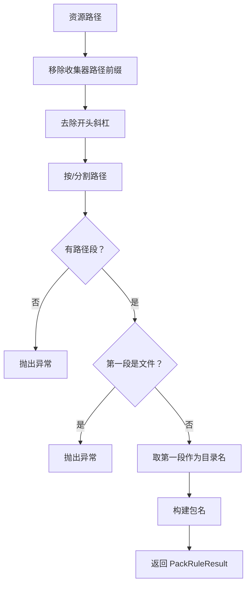
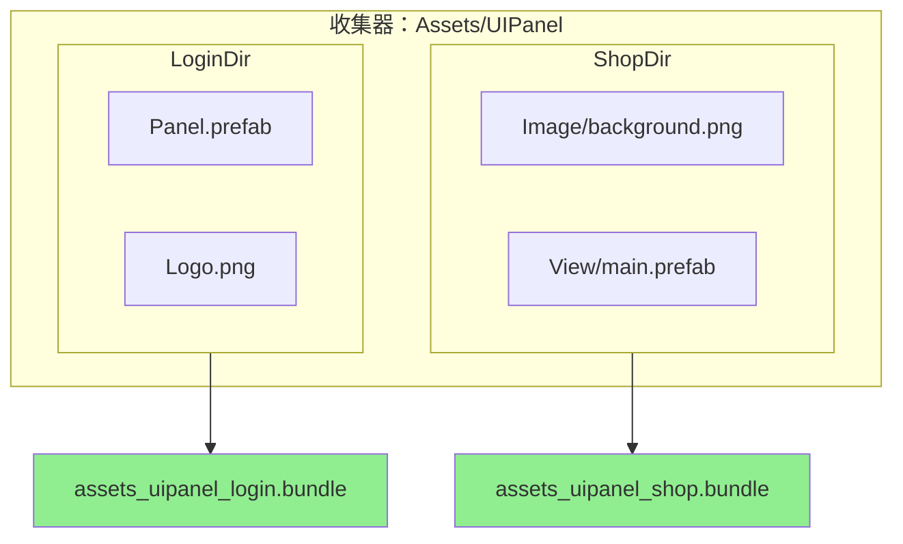

# PackRuleExtends.cs 注解文档

## 文件基本信息

| 属性 | 值 |
|------|-----|
| **文件名** | PackRuleExtends.cs |
| **路径** | Assets/Scripts/Editor/YooAssets/PackRuleExtends.cs |
| **所属模块** | Editor → YooAssets |
| **文件职责** | YooAsset 资源打包规则扩展 |

---

## 类说明

### PackSceneTopDirectory

| 属性 | 说明 |
|------|------|
| **职责** | 按收集器路径下的顶级文件夹名称打包资源，同一文件夹下的所有资源打入同一个资源包 |
| **类型** | `IPackRule` |
| **命名空间** | `YooAsset` |
| **可见性** | `public` |

**实现接口**:
```
IPackRule (YooAsset.Editor)
```

**特性**:
- `[DisplayName("资源包名：收集器下顶级文件夹路径")]` - 在 YooAsset 编辑器中显示的名称

**设计模式**: 
- **策略模式**: 实现打包规则接口，定义资源打包策略
- **约定优于配置**: 按目录结构自动分组，无需手动配置

---

## 打包规则说明

### 规则描述

以收集器路径下顶级文件夹为资源包名，同一文件夹下所有文件打进一个资源包。

### 示例

**收集器路径**: `Assets/UIPanel`

| 资源路径 | 生成的 Bundle 名 |
|---------|-----------------|
| `Assets/UIPanel/Shop/Image/background.png` | `assets_uipanel_shop.bundle` |
| `Assets/UIPanel/Shop/View/main.prefab` | `assets_uipanel_shop.bundle` |
| `Assets/UIPanel/Login/Panel.prefab` | `assets_uipanel_login.bundle` |
| `Assets/UIPanel/Login/Logo.png` | `assets_uipanel_login.bundle` |

**规则**:
- 提取收集器路径后的第一级目录名作为包名
- 同一目录下的所有资源共享同一个包
- 包名格式：`{收集器路径}_{顶级目录}.bundle`

---

## 方法说明

### GetPackRuleResult

**签名**:
```csharp
PackRuleResult IPackRule.GetPackRuleResult(PackRuleData data)
```

**职责**: 根据资源信息计算资源包名称

**参数**:
| 参数 | 类型 | 说明 |
|------|------|------|
| `data` | `PackRuleData` | 打包规则数据，包含资源路径、收集器路径等 |

**返回**: `PackRuleResult` - 包含资源包名称和扩展名

**核心逻辑**:
```
1. 从资源路径中移除收集器路径前缀
2. 去除开头的斜杠
3. 按斜杠分割路径
4. 取第一段作为顶级目录名
5. 检查是否为文件 (有扩展名)
   - 是：抛出异常 (期望是目录)
   - 否：继续
6. 构建包名：{收集器路径}/{顶级目录}/Scene
7. 返回 PackRuleResult
```

**代码实现**:
```csharp
PackRuleResult IPackRule.GetPackRuleResult(PackRuleData data)
{
    // 移除收集器路径前缀
    string assetPath = data.AssetPath.Replace(data.CollectPath, string.Empty);
    assetPath = assetPath.TrimStart('/');
    
    // 分割路径，取第一段
    string[] splits = assetPath.Split('/');
    if (splits.Length > 0)
    {
        // 检查是否为文件
        if (Path.HasExtension(splits[0]))
            throw new Exception($"Not found root directory : {assetPath}");
        
        // 构建包名
        string bundleName = $"{data.CollectPath}/{splits[0]}/Scene";
        PackRuleResult result = new PackRuleResult(bundleName, DefaultPackRule.AssetBundleFileExtension);
        return result;
    }
    else
    {
        throw new Exception($"Not found root directory : {assetPath}");
    }
}
```

---

## PackRuleData 结构

`PackRuleData` 包含以下关键信息:

| 字段 | 类型 | 说明 |
|------|------|------|
| `AssetPath` | `string` | 资源的完整路径 |
| `CollectPath` | `string` | 收集器路径 |
| `AssetName` | `string` | 资源名称 |
| `Tags` | `string[]` | 资源标签 |

---

## PackRuleResult 结构

`PackRuleResult` 包含以下字段:

| 字段 | 类型 | 说明 |
|------|------|------|
| `BundleName` | `string` | 资源包名称 |
| `Extension` | `string` | 资源包扩展名 (如 `.bundle`) |

---

## Mermaid 流程图

### 包名生成流程



### 打包示例



---

## 使用示例

### 配置 YooAsset 打包规则

**在构建配置中使用**:
```csharp
var buildOptions = new BuildScriptOptions
{
    PackRule = new PackSceneTopDirectory(),  // 使用顶级目录打包规则
    // ... 其他配置
};

BuildScript.Build(buildOptions);
```

### 资源目录结构示例

```
Assets/AssetsPackage/
├── UI/
│   ├── Lobby/
│   │   ├── Panel.prefab
│   │   ├── Background.png
│   │   └── Button.png
│   │   └── → 打包为：assets_uipackage_ui_lobby.bundle
│   ├── Battle/
│   │   ├── HUD.prefab
│   │   └── SkillIcon.png
│   │   └── → 打包为：assets_uipackage_ui_battle.bundle
├── Entity/
│   ├── Player/
│   │   ├── Model.fbx
│   │   └── Material.mat
│   │   └── → 打包为：assets_uipackage_entity_player.bundle
│   └── Enemy/
│       ├── Model.fbx
│       └── → 打包为：assets_uipackage_entity_enemy.bundle
```

### 构建输出

```
构建产物:
├── assets_uipackage_ui_lobby.bundle
├── assets_uipackage_ui_battle.bundle
├── assets_uipackage_entity_player.bundle
└── assets_uipackage_entity_enemy.bundle
```

---

## 注意事项

### 目录结构要求

- 资源必须按顶级目录组织
- 收集器路径下的直接子目录作为包名
- 不支持嵌套过深的目录结构

### 异常处理

**错误情况**:
```
资源路径：Assets/UIPanel/Shop.png
错误：Not found root directory : Shop.png
原因：顶级是文件而不是目录
```

**解决方案**:
```
正确结构:
Assets/UIPanel/Shop/Image.png  ✓
Assets/UIPanel/Shop/Prefab.prefab  ✓
```

### 包名规范

- 包名包含收集器路径和顶级目录
- 使用 `/` 分隔，YooAsset 会自动转换为合法文件名
- 建议统一使用小写字母和下划线

---

## 扩展建议

### 自定义包名格式

```csharp
[DisplayName("资源包名：自定义格式")]
public class CustomPackRule : IPackRule
{
    PackRuleResult IPackRule.GetPackRuleResult(PackRuleData data)
    {
        string assetPath = data.AssetPath.Replace(data.CollectPath, string.Empty);
        assetPath = assetPath.TrimStart('/');
        string[] splits = assetPath.Split('/');
        
        if (splits.Length > 0 && !Path.HasExtension(splits[0]))
        {
            // 自定义包名格式：collector_topdir_type
            string bundleName = $"{data.CollectPath.Replace('/', '_')}_{splits[0]}".ToLower();
            return new PackRuleResult(bundleName, DefaultPackRule.AssetBundleFileExtension);
        }
        
        throw new Exception($"Invalid path: {assetPath}");
    }
}
```

### 按文件类型分包

```csharp
[DisplayName("资源包名：按文件类型")]
public class PackByFileType : IPackRule
{
    PackRuleResult IPackRule.GetPackRuleResult(PackRuleData data)
    {
        string ext = Path.GetExtension(data.AssetPath).ToLower();
        string type = ext switch
        {
            ".prefab" => "prefab",
            ".png" or ".jpg" => "texture",
            ".fbx" => "model",
            ".mat" => "material",
            _ => "other"
        };
        
        string bundleName = $"{data.CollectPath}/{type}";
        return new PackRuleResult(bundleName, DefaultPackRule.AssetBundleFileExtension);
    }
}
```

### 按标签分包

```csharp
[DisplayName("资源包名：按标签")]
public class PackByTag : IPackRule
{
    PackRuleResult IPackRule.GetPackRuleResult(PackRuleData data)
    {
        if (data.Tags != null && data.Tags.Length > 0)
        {
            // 使用第一个标签作为包名
            string bundleName = $"{data.CollectPath}/{data.Tags[0]}";
            return new PackRuleResult(bundleName, DefaultPackRule.AssetBundleFileExtension);
        }
        
        // 默认使用顶级目录
        return new PackSceneTopDirectory().GetPackRuleResult(data);
    }
}
```

---

## 相关类

| 类名 | 关系 | 说明 |
|------|------|------|
| `IPackRule` | 接口 | YooAsset 打包规则接口 |
| `PackRuleData` | 参数 | 打包规则数据 |
| `PackRuleResult` | 返回 | 打包规则结果 |
| `DefaultPackRule` | 默认 | 默认打包规则 |

---

## 相关文档链接

- [AddressRuleExtends.cs.md](./AddressRuleExtends.cs.md) - 地址规则扩展
- [FilterRuleExtends.cs.md](./FilterRuleExtends.cs.md) - 过滤规则扩展
- [BundleEncryption.cs.md](./BundleEncryption.cs.md) - 加密服务
- [DefaultActiveRule.cs.md](./DefaultActiveRule.cs.md) - 激活规则
- [YooAsset 官方文档 - 打包规则](https://www.yooasset.com/docs/pack-rule)

---

*文档生成时间：2026-03-03 | OpenClaw AI 助手*
