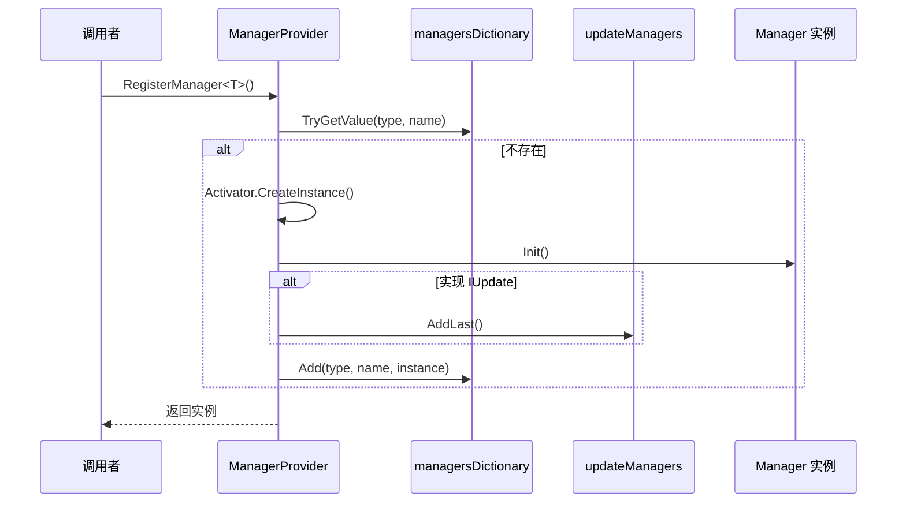
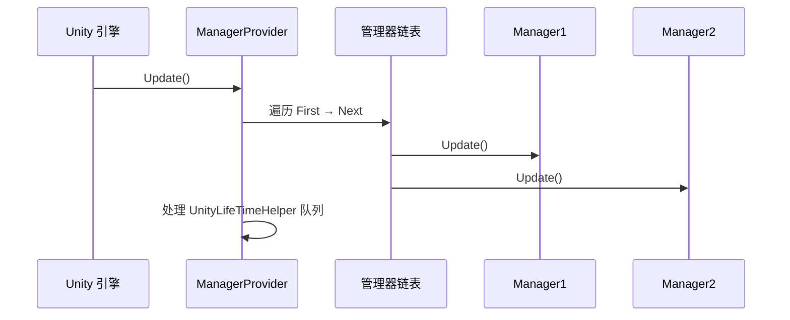

# ManagerProvider.cs 注解文档

## 文件基本信息

| 属性 | 值 |
|------|-----|
| **文件名** | ManagerProvider.cs |
| **路径** | Assets/Scripts/Mono/Core/Manager/ManagerProvider.cs |
| **所属模块** | 框架层 → Mono/Core/Manager |
| **文件职责** | 管理器注册与调度中心，负责所有 Manager 的生命周期管理和帧更新调度 |

---

## 类/结构体说明

### ManagerProvider

| 属性 | 说明 |
|------|------|
| **职责** | 管理所有 Manager 的注册、获取、移除和帧更新调度 |
| **泛型参数** | 无 |
| **继承关系** | 无继承 |
| **设计模式** | 单例模式 + 注册表模式 + 多态调度 |

```csharp
// 单例实现
static ManagerProvider Instance { get; } = new ManagerProvider();

// 私有构造函数，防止外部实例化
private ManagerProvider()
```

---

## 字段与属性（按重要程度排序）

| 名称 | 类型 | 访问级别 | 说明 |
|------|------|----------|------|
| `Instance` | `ManagerProvider` | `static` | 单例实例，全局访问点 |
| `managersDictionary` | `UnOrderDoubleKeyDictionary<Type, string, object>` | `private` | 按类型和名称索引的管理器字典 |
| `allManagers` | `LinkedList<object>` | `private` | 所有管理器的链表 |
| `updateManagers` | `LinkedList<IUpdate>` | `private` | 需要 Update 调度的管理器 |
| `lateUpdateManagers` | `LinkedList<ILateUpdate>` | `private` | 需要 LateUpdate 调度的管理器 |
| `fixedUpdateManagers` | `LinkedList<IFixedUpdate>` | `private` | 需要 FixedUpdate 调度的管理器 |

---

## 方法说明（按重要程度排序）

### RegisterManager<T>()

**签名**:
```csharp
public static T RegisterManager<T>(string name = "") where T : class, IManager
```

**职责**: 注册一个 Manager 实例

**核心逻辑**:
```
1. 检查是否已存在（按类型 + 名称）
2. 如果不存在：
   - 创建实例 Activator.CreateInstance(type)
   - 如果实现 IUpdate → 加入 updateManagers
   - 如果实现 ILateUpdate → 加入 lateUpdateManagers
   - 如果实现 IFixedUpdate → 加入 fixedUpdateManagers
   - 调用 Init() 初始化
   - 注册到 managersDictionary
   - 加入 allManagers
3. 返回实例
```

**调用者**: 任何需要注册 Manager 的代码

**使用示例**:
```csharp
// 注册 TimerManager
var timerManager = ManagerProvider.RegisterManager<TimerManager>();

// 注册带名称的 Manager
var sceneManager = ManagerProvider.RegisterManager<SceneManager>("MainScene");
```

---

### RegisterManager<T, P1>() / RegisterManager<T, P1, P2>() / RegisterManager<T, P1, P2, P3>()

**签名**:
```csharp
public static T RegisterManager<T, P1>(P1 p1, string name = "") where T : class, IManager<P1>
public static T RegisterManager<T, P1, P2>(P1 p1, P2 p2, string name = "") where T : class, IManager<P1, P2>
public static T RegisterManager<T, P1, P2, P3>(P1 p1, P2 p2, P3 p3, string name = "") where T : class, IManager<P1, P2, P3>
```

**职责**: 注册带参数的 Manager 实例

**核心逻辑**: 同 `RegisterManager<T>()`，但调用带参数的 `Init(p1, p2, p3)`

**使用示例**:
```csharp
// 注册带参数的 Manager
var manager = ManagerProvider.RegisterManager<MyManager, string, int>("param1", 42);
```

---

### GetManager<T>()

**签名**:
```csharp
public static T GetManager<T>(string name = "") where T : class, IManagerDestroy
```

**职责**: 获取已注册的 Manager 实例

**核心逻辑**:
```
1. 从 managersDictionary 查找（按类型 + 名称）
2. 返回找到的实例，未找到返回 null
```

**调用者**: 任何需要使用 Manager 的代码

**使用示例**:
```csharp
// 获取 TimerManager
var timerManager = ManagerProvider.GetManager<TimerManager>();

// 获取带名称的 Manager
var sceneManager = ManagerProvider.GetManager<SceneManager>("MainScene");
```

---

### RemoveManager<T>()

**签名**:
```csharp
public static void RemoveManager<T>(string name = "")
```

**职责**: 移除已注册的 Manager 实例

**核心逻辑**:
```
1. 从 managersDictionary 查找
2. 如果找到：
   - 从 updateManagers 移除（如果实现 IUpdate）
   - 从 lateUpdateManagers 移除（如果实现 ILateUpdate）
   - 从 fixedUpdateManagers 移除（如果实现 IFixedUpdate）
   - 从 managersDictionary 移除
   - 从 allManagers 移除
   - 调用 Destroy() 销毁
```

**调用者**: 需要移除 Manager 的代码

**使用示例**:
```csharp
// 移除 TimerManager
ManagerProvider.RemoveManager<TimerManager>();
```

---

### Update() / LateUpdate() / FixedUpdate()

**签名**:
```csharp
public static void Update()
public static void LateUpdate()
public static void FixedUpdate()
```

**职责**: 调度所有 Manager 的帧更新

**核心逻辑**:
```
1. 遍历对应的管理器链表
2. 调用每个管理器的 Update/LateUpdate/FixedUpdate
3. 处理 UnityLifeTimeHelper 的完成队列
```

**调用者**: Unity 的 MonoBehaviour Update 循环

**使用示例**:
```csharp
// 在 MonoBehaviour 中调用
void Update()
{
    ManagerProvider.Update();
}

void LateUpdate()
{
    ManagerProvider.LateUpdate();
}

void FixedUpdate()
{
    ManagerProvider.FixedUpdate();
}
```

---

### Clear()

**签名**:
```csharp
public static void Clear()
```

**职责**: 清空所有 Manager

**核心逻辑**:
```
1. 清空 managersDictionary
2. 清空 updateManagers、lateUpdateManagers、fixedUpdateManagers
3. 遍历 allManagers，调用每个的 Destroy()
4. 清空 allManagers
```

**调用者**: 程序退出或需要重置时

---

## 管理器注册与调度流程

### 注册流程



### 帧更新调度流程



---

## 管理器接口体系

### IManagerDestroy
```csharp
public interface IManagerDestroy
{
    void Destroy();
}
```

### IManager
```csharp
public interface IManager : IManagerDestroy
{
    void Init();
}
```

### IManager<P1>
```csharp
public interface IManager<P1> : IManagerDestroy
{
    void Init(P1 p1);
}
```

### IUpdate / ILateUpdate / IFixedUpdate
```csharp
public interface IUpdate
{
    void Update();
}

public interface ILateUpdate
{
    void LateUpdate();
}

public interface IFixedUpdate
{
    void FixedUpdate();
}
```

---

## 阅读指引

### 建议的阅读顺序

1. **理解 ManagerProvider 作用** - 为什么需要集中管理 Manager
2. **看字段定义** - 了解各个链表的作用
3. **重点看 RegisterManager** - 理解注册流程
4. **深入 Update 调度** - 理解帧更新机制
5. **了解接口体系** - 理解 IManager/IUpdate 等接口

### 最值得学习的技术点

1. **多态调度**: 通过接口实现不同类型 Manager 的统一调度
2. **双键字典**: 使用 `UnOrderDoubleKeyDictionary<Type, string, object>` 支持按类型 + 名称索引
3. **链表遍历**: 使用 `LinkedList` 高效遍历和移除
4. **泛型约束**: 使用 `where T : class, IManager` 确保类型安全
5. **惰性注册**: 首次获取时注册，避免预先初始化

---

## 使用示例

### 示例 1: 注册和使用 Manager

```csharp
// 定义 Manager
public class MyManager : IManager, IUpdate
{
    public static MyManager Instance { get; private set; }
    
    public void Init()
    {
        Instance = this;
    }
    
    public void Destroy()
    {
        Instance = null;
    }
    
    public void Update()
    {
        // 每帧逻辑
    }
}

// 注册
var myManager = ManagerProvider.RegisterManager<MyManager>();

// 使用
MyManager.Instance.DoSomething();

// 移除
ManagerProvider.RemoveManager<MyManager>();
```

### 示例 2: 带参数的 Manager

```csharp
public class ConfigManager : IManager<string>
{
    public static ConfigManager Instance { get; private set; }
    
    public void Init(string configPath)
    {
        Instance = this;
        // 加载配置
    }
    
    public void Destroy()
    {
        Instance = null;
    }
}

// 注册带参数
var configManager = ManagerProvider.RegisterManager<ConfigManager, string>("Assets/Config");
```

### 示例 3: 多种更新类型

```csharp
public class PhysicsManager : IManager, IUpdate, IFixedUpdate
{
    public void Init() { }
    public void Destroy() { }
    
    public void Update()
    {
        // 每帧逻辑（插值、预测等）
    }
    
    public void FixedUpdate()
    {
        // 物理更新（固定时间步长）
    }
}

// 注册后会自动加入 updateManagers 和 fixedUpdateManagers
var physicsManager = ManagerProvider.RegisterManager<PhysicsManager>();
```

### 示例 4: 在 Unity 中调度

```csharp
public class GameEntry : MonoBehaviour
{
    void Start()
    {
        // 注册所有 Manager
        ManagerProvider.RegisterManager<TimerManager>();
        ManagerProvider.RegisterManager<SceneManager>();
        ManagerProvider.RegisterManager<UIManager>();
    }
    
    void Update()
    {
        ManagerProvider.Update();
    }
    
    void LateUpdate()
    {
        ManagerProvider.LateUpdate();
    }
    
    void FixedUpdate()
    {
        ManagerProvider.FixedUpdate();
    }
    
    void OnDestroy()
    {
        ManagerProvider.Clear();
    }
}
```

---

## 相关文档

- [IManager.cs.md](./IManager.cs.md) - 管理器接口定义
- [TimerManager.cs.md](../Module/Timer/TimerManager.cs.md) - 定时器管理器（使用 ManagerProvider）
- [SceneManager.cs.md](../../Code/Module/Scene/SceneManager.cs.md) - 场景管理器（使用 ManagerProvider）
- [UnOrderDoubleKeyDictionary.cs.md](../Object/UnOrderDoubleKeyDictionary.cs.md) - 双键字典

---

*文档生成时间：2026-03-01 | OpenClaw AI 助手*
